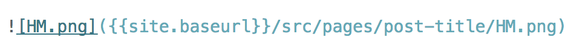
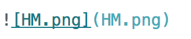

If you’re reading this, chances are you’ve heard a thing or two about Gatsby. Let me take you through a _jamstacked_ workflow that is friendly to both developers, as well as content-creators.


## Intro

As a freelance developer, the business person inside of me is constantly looking for ways to streamline the development process. At the same time, the inner developer is looking for the most modern development experience. If you add this working with non-technical content-creators, it becomes quite the balancing act.

I’m willing to assume that many readers have been here before and are currently cringing in unison. Luckily, I found a solution.

My goal here is to share a tool set helps bring order to my freelance chaos. I'll be walking through a workflow that's ideal for personal blogs and hand-off projects where some sort of a CMS is in scope.

I'll also be referencing a wonderful article written by Josh Weaver, [Gatsby + Contentful + Netlify (and Algolia)](https://www.gatsbyjs.org/blog/2017-12-06-gatsby-plus-contentful-plus-netlify/). Josh’s article spoke to my goals and frustrations perfectly and inspired me to share this alternative approach.

_**Let’s get into it.**_

<div style="width:100%;height:0;padding-bottom:55%;position:relative;"><iframe src="https://giphy.com/embed/WDtCGLCXBAgow" width="100%" height="100%" style="position:absolute" frameBorder="0" class="giphy-embed" allowFullScreen></iframe></div><p><a href="https://giphy.com/gifs/tom-cruise-top-gun-WDtCGLCXBAgow">via GIPHY</a></p>

## My Requirements

### Like Josh’s requirements, my list includes:

* **Speed** - this includes development, website performance, and deployment
* **Development Experience** - I want to use React and Webpack
* **Maintainability** - ease with which anyone can create, update and delete posts
* **Scalability** - need to make sure that performance is not hindered by a growing needs
* **Lean** - simplify the tools and services use to a bare minimum
* **Revision History** - for accountability and allowing for versioning
* **Inexpensive Hosting** - again, to maximize value and keep personal costs down
* **NO WordPress** - similarly, I don’t want to deal with updates, themes, hacks...etc
* **Continuous Deployment** - the site needs to always be up and running and current

For the sake of brevity, let's infer that speed, development experience, scalability and lack of WordPress will be handled by Gatsby and the JAMstack. If you’re unfamiliar, take a look at [http://jamstack.org/. ](http://jamstack.org/)

## CMS-Induced Headaches

From a non-technical content-creator perspective, more UI and less code is ideal. So if we want to avoid WordPress, how can we provide the experience of a simple login where a user can create, edit and publish posts?

Josh’s article provides a solution by way of using Contentful to manage content on his company’s documentation website.

### Here are some Pros (at the time of writing):

* Clean UI
* Free Tier
* User Roles (admins, editors, content authors)
* Comprehensive tutorials
* Fully-customizable front end
* Article search and filters

With such a robust set of features, it is easy to see why Contentful is a popular service. However, between a combination of having no prior experience with the platorm, and wanting to keep things simple, I ran into issues, and felt that it was _too_ robust for my project goals.

While, a fully-customizable front end may seem really flexible, _**there is NOTHING set up when you create a new project.**_ You will have to create your own content models for blog posts and use GraphQL to query for each blog post type you set up.

<div style="width:100%;height:0;padding-bottom:55%;position:relative;"><iframe src="https://giphy.com/embed/16e1J9ztaZ3na"  width="100%" height="100%" style="position:absolute" frameBorder="0" class="giphy-embed" allowFullScreen></iframe></div><p><a href="https://giphy.com/gifs/bored-kanye-west-16e1J9ztaZ3na">via GIPHY</a></p>

If you’re like me and have no previous experience with Contentful, expect a few headaches. Your first time working with the service will involve a great deal of trial and error to get content/posts into your Gatsby website. Couple this with being a GraphQL newbie (like me), and you will get frustrated..._**very quickly**_.

All I wanted to do was streamline my process and here I was adding another service into the mix and creating more work for myself. No bueno.

To spare you the details, I spent a few hours comparing my GraphQL queries to those used in the [Gatsby + Contentful example](https://github.com/gatsbyjs/gatsby/tree/master/examples/using-contentful) to find errors in my code. I eventually gave up and I thought that there had to be an easier way to manage content online. Luckily there is. It's called Prose.

## Managing Content Via Github: Enter Prose.io

Prose was originally created for editing markdown files on GitHub by the people at [Development Seed](https://developmentseed.org/).

### Here is a summary:

* Simple Content Authoring Environment
* Designed for CMS-Free Websites
* Web-based Interface for Managing Content Directly on Github
* Advanced Support for Markdown Content - Including Syntax Highlighting & Formatting Toolbar

Source: [Prose](http://prose.io/#about)

So, a service that works on top of Github where I, or anyone with a Github account can quickly create and manage posts. Sick!

#### Follow these steps:

1. Set up a repository for the website.
2. Share access to the repo with anyone on your team.
3. Log in via [Prose.io](http://prose.io/).
4. Select your website's repo from the Prose interface.
5. Done. You can edit existing posts, preview posts, and commit any changes directly within the interface.
   set up a repository for the website

<div style="width:100%;height:0;padding-bottom:55%;position:relative;"><iframe src="https://giphy.com/embed/l0HlDtKDqfGGQtwic"  width="100%" height="100%" style="position:absolute" frameBorder="0" class="giphy-embed"  allowFullScreen></iframe></div><p><a href="https://giphy.com/gifs/emmys-emmy-awards-emmys-2016-l0HlDtKDqfGGQtwic">via GIPHY</a></p>

_**Yes, there’s more.**_

Because Prose was built for Jekyll, it recognizes any headmatter you add to your .md files. This will give developers the ability to build queries and replicate familiar features from other CMS platforms. Say hello to publish states, publish date, article author and more.

I should also mention that Prose is an open source project that is available for download if you wish to self-host. Check out the [documentation on Github.](https://github.com/prose/prose)

## Get Lean and Get on Netlify

Let’s summarize where we are and why [Netlify](https://www.netlify.com/) will take care of the rest.

```[ ] Lean - simplify the tools and services use to a bare minimum
[ ] Inexpensive Hosting - again, to maximize value and keep personal costs down

[ ] Continuous Deployment - the site needs to always be up and running and current

[x] Speed - this includes development, website performance, and deployment

[x] Development Experience - I want to use React and Webpack

[x] Maintainability - ease with which anyone can create, update and delete posts

[x] Scalability - need to make sure that performance is not hindered by a growing needs

[x] Revision History - for accountability and allowing for versioning

[x] NO WordPress - similarly, I don’t want to deal with updates, themes, hacks...etc
```

When it comes to continuous deployment and inexpensive hosting, using Netlify is, as Josh mentions “ a no brainer.”  Check out [Netlify’s features here](https://www.netlify.com/features/) for a more in-depth look.

With streamlining in mind, a workflow doesn’t get any leaner than working within the confines of Github and Netlify. Think about the magic:

1. Use Gatsby to create your website.
2. Set up a GitHub repository to track changes and version history.
3. Once ready, deploy your repository to Netlify.
4. Use Prose (which accesses your GitHub), to create, edit and commit posts.
5. Netlify sees the update to the repository and re-renders the website.

With this process in place, content creators do not need to understand Markdown, React, Git or Netlify. They can simply log into Prose and start writing. All the developer has to do is share the repository.

_**It just works.**_ 🤙🏼

<div style="width:100%;height:0;padding-bottom:55%;position:relative;"><iframe src="https://giphy.com/embed/3oFzmqDNycyhUcrjTW"  width="100%" height="100%" style="position:absolute" frameBorder="0" class="giphy-embed"  allowFullScreen></iframe></div><p><a href="https://giphy.com/gifs/nba-celebrity-3oFzmqDNycyhUcrjTW">via GIPHY</a></p>

## Concluding Thoughts

With all of that said, this process has a few caveats related to working within Prose that I must address:

1. If you follow a folder structure enclosing an index.md file for your posts, you will need to add the new folder within the URL of the post
2. Inserting an image adds extra markup which you will need to remove for an image to show up within your post. Prose will upload the image within the same directory as your index.md file.

#### Default



#### After (this will work)



3. You must commit a file by hitting the save icon or else the file is not saved. Posts cannot be saved as drafts in Prose. So, you will have to build the functionality within your headmatter and query posts based upon a draft/published state (if you need it).
4. Whoever will be posting will need to manually add headmatter to each .md file. Be warned that there is no specific area to do so. But after it's added, a fourth icon appears in the right pane where you can then edit and add other post details.

I hope you try playing around with this workflow yourself with a Gatsby starter and see if this works for you. Gatsby provides incredible tools that “just work” without sacrificing an exciting development environment. If you pair it with Netlify and Prose, you will cut overhead and manage content directly from a GitHub repository. Let this approach bring some order to the chaos.

_**Thank you for reading...Now get to hacking.**_ ✌🏼
