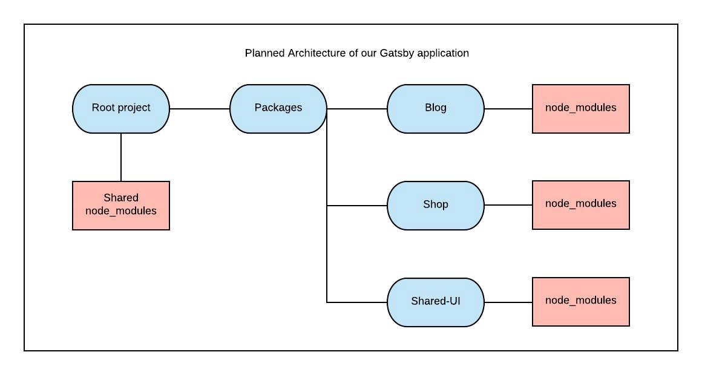

## Learn how to create a balanced lasagna instead of a tangled mess of spaghetti.

### Foreword

This tutorial will take about two hours to complete. If you're unfamiliar with Lerna, Travis or Now, you may fall into a few traps, but it's all part of the learning process! I’ve included a troubleshooting section at the end of the article for common problems, so refer to it at any time.

### Introduction

If you work alone or in a small team, you’re likely to have started working on small programs that slowly grow complex and convoluted. Shit happens and you’ll soon find that your perfectly balanced lasagna evolves into a heaped bowlful of spaghetti.

The same goes for those who have worked as part of a large company/team. Branding guidelines come in the form of css style-guides or reusable components. Separating the discrete packages from what’s shared becomes a hassle if everything’s stored together. You may even have to deal with several similar projects thrown about in different repos, which can be an headache to keep track of. These are some of the problems monorepos solve.



A monorepo is an architectural design pattern that allows us to maintain several packages within a single repo. This reduces the complexity when dealing with packages that share in-house and third-party dependencies.

Think of monorepos like a well-organised supermarket. Each aisle contains a particular kind of food, making it easy to navigate and find the item of food you want. Supermarkets also contain a variety of different foods so you don’t need to go to a series of specific shops to find your gluten-free, dairy-free banoffee pie (which is very much a [thing](https://glutenfreecuppatea.co.uk/2016/02/14/recipe-healthy-banoffee-pie-gluten-free-vegan-refined-sugar-free-dairy-free/)).

With monorepos the code is split into specific packages (aisles). Meaning you can easily navigate the project to find the component or module you want to work on. It also means not needing to maintain separate repos when making changes that affect multiple parts of your stack (the single shop).

Everything is accessible from a single place, while still being organised enough to navigate painlessly.
Enough with the theory, let’s move on to the tutorial, which is split into 2 sections: development and deployment.

*Development* — We’ll configure an existing application, built with [Gatsby](/), into a monorepo. I won’t delve too much into its implementation details because it’s beyond the scope of this article. We’ll attend the lavish party that the great Gatsby throws for us and we won’t ask why or how they did it.

Another tool we’ll use is [Lerna](https://github.com/lerna/lerna), which will manage the dependencies of our project. Lerna will also allow us to link packages together which we’ll use to share components.

*Deployment* — After we’ve converted our app into a monorepo we’ll hook our GitHub account to Travis-CI and create a CI pipeline. The CI pipeline will test, build and deploy our application.

There are a couple of caveats to address prior to beginning:

Due to the scale of our demo site, you may feel that monorepos aren’t practical. You’ll be right in thinking that because a monorepo in this instance isn’t practical. There’ll be elements of duplication and rewriting that will seem counter productive. It’ll also seem like we’re over-engineering a simple site. The real learning comes from understanding how the pieces fit together on a small scale. You’ll be able to easily integrate monorepos at production level with your understanding of the fundamental concepts and underlying technologies.

This tutorial deals with loads of small changes which make for plenty of opportunities for things to go wrong. I’ve tried making myself as clear as possible to prevent this but if you do come across issues then leave a descriptive comment. I’ll do my best to respond, edit and improve this article. You can also find the [finished repo here](https://github.com/andrico1234/lerna-monorepo-finisher). There’s no shame in copying my code if you’re stuck.

I’m also assuming fundamental web dev knowledge including experience with React, Git and the command line.

### Part One

Let’s begin! Navigate to an empty folder in the terminal and clone the repo by running the following command

`git clone git@github.com:andrico1234/lerna-monorepo-starter.git`

and navigate into the the `lerna-monorepo-starter` directory.

Go to your GitHub account and create a new repo, this’ll be the repo that you push the site to so that Travis can run the pipeline. For those who need a refresher on how to [create a new repo](https://help.github.com/articles/creating-a-new-repository/). You may have to run `git remote remove origin` so you can point the code to your newly created repo.

Run the code that GitHub outputs when creating a new repo:

```shell
git remote add origin git@github.com:<account-name>/lerna-monorepo-starter.git
git push -u origin master
```

Commit and push regularly for best results.

Navigate inside of the `lerna-monorepo-starter` directory and install the packages by running `yarn`. Once your packages have installed, run `yarn develop` to run the application on localhost:8000.

Open Chrome, and navigate to localhost:8000. You’ll find a simple application with a mock blog and a mock shop. Imagine this is a fleshed out application, we can make the assumption that the underlying logic behind the blog and the shop are different and that there are similarities with the styling and components.

Go back to your IDE and you’ll see that we’re not pulling data from an external source. The data is being served locally via a couple of json files in the `data` directory. When we run the `develop` command Gatsby pulls the data from these json files and creates pages for them. You can take a look at how this being done by peeking inside of the `gatsby-node.js` file. This is because Gatsby builds the code and outputs a static site.

So imagine our application is starting to grow, the shop and the blog start intertwining with each other. You may not notice the lack of separation until its too late and your code is tangled tighter than the ivy across the side of your grandma’s cottage.

Let’s start splitting up our application. I’ll only be touching the surface of what Lerna is capable of, so I’d recommend checking out their repo to learn more. Install Lerna with `yarn global add lerna`. We need to create a file in the root directory called `lerna.json`. Add in the following:

```json
{
  "lerna": "2.11.0",
  "packages": ["packages/*"],
  "npmClient": "yarn",
  "useWorkspaces": true,
  "version": "1.0.0"
}
```

The above specifies the version of Lerna we’re using. We also let Lerna know where to find our packages, in this case the packages will be contained within a directory inside of `packages`. We specify that we’re using Yarn, the current version of our application and that we’re using Yarn Workspaces enables Lerna’s package hoisting. To enable Yarn workspaces, add the following to your `package.json` file.

```json
{
  ...rest of file,
  "private": true,
  "workspaces": [
    "packages/*"
  ]
}
```

Once that’s been completed create a new `packages` directory in the root of the project. Create three additional directories inside of it so the structure looks like the following:

```text
packages
 | blog
 | shared-ui
 | shop
```

The next step is to move the contents from our current application into their respective folders. All the files in our `components` folder will be moved to our `shared-ui` directory since we’d like to be able to use them anywhere throughout our codebase.

For now we’ll move everything over to `shared-ui` components and import them using a relative url.

Inside of the `packages/shared-ui` directory, I’ve created a file called `index.js` which will be our entry point for importing components. This is the directory that we’re going to be moving our components folder into. Open up your terminal and navigate to the top level of your project directory and run

`mv src/components/ packages/shared-ui/components/`

This will move the components into their brand new home. Go ahead and do the same for the `theme` directory too. You’re going to need to fix the now broken import statements for each component that uses the theme object.

The Layout component behaves as the entry point of each Gatsby application, which means that each package will need one.

We’ll avoid code duplication by abstracting the parts of the layout that won’t need to change based on the page, like the use of the Header component. We’ll keep each package’s individual logic, like the `graphql` query.

In `packages/shared-ui`, create a new directory called `layouts/PrimaryLayouts`. Create an `index.js` file and move over the contents of the `src/layouts/index.js` file here. Once that’s done get rid of the `graphql` query. Move over the css file so the imports don’t break.

Back in the `src/layouts` file we can get rid of everything and replace it with this:

```jsx:title=layout/index.js
import React from "react"
import PropTypes from "prop-types"

import { PrimaryLayout } from "../../packages/shared-ui"

const Layout = ({ children, data }) => (
  <PrimaryLayout children={children} data={data} />
)

Layout.propTypes = {
  children: PropTypes.func,
}

export default Layout

export const query = graphql`
  query SiteTitleQuery {
    site {
      siteMetadata {
        title
      }
    }
  }
`
```

Once that’s done update the export statements in `the shared-ui/index.js` file to look like the following.

```jsx:title=index.js
export { default as theme } from "./theme"

export { default as Button } from "./components/Button"
export { default as Header } from "./components/Header"
export { ItemCard, ItemCardWrapper } from "./components/ItemCard"

export { default as PrimaryLayout } from "./layouts/PrimaryLayouts"
```

Your packages folder hierarchy should look like this now

```text
packages
  | blog
  | shared-ui
    | index.js
    | components
      | Button
        | index.js
      | Header
        | index.js
      | ItemCard
        | index.js
    | theme
      | index.js
    | layouts
      | PrimaryLayout
        | index.js
        | index.css
  | shop
```

It’s likely that your project won’t run because the import statements for your shared components will have broken. The way the project’s set up means that we can do a find-and-replace to find `../components/{specific-component}` and replace it with `../../packages/shared-ui`. The site will still be broken because we need to wrap the import name with curly braces, so the import statement looks like this:

`import { Header } from ‘../../packages/shared-ui’`

Just make sure the Header import for your `PrimaryLayout/index.js` is as follows `import { Header } from '../../'`. Once you’ve replaced all the outdated import statements with new ones, try running your application again. We should expect to see no errors in the console. Now’s a good time to commit and push the code.

Now we’ve got this working, we want to take it one step further and make the shared-ui behave in the same way a public package does. Create a `package.json` file inside of the `shared-ui` package and add the following:

```json:title=package.json
{
  "name": "@lerna-monorepo/shared-ui",
  "description": "Lerna monorepo starter",
  "version": "1.0.2",
  "dependencies": {
    "gatsby": "^1.9.247",
    "gatsby-link": "^1.6.40",
    "gatsby-plugin-react-helmet": "^2.0.10",
    "gatsby-plugin-react-next": "^1.0.11",
    "react": "16.4.2",
    "react-helmet": "^5.2.0",
    "styled-components": "^3.3.3"
  },
  "license": "MIT",
  "repository": {
    "type": "git",
    "url": "https://github.com/gatsbyjs/gatsby-starter-default"
  }
}
```

This will add the necessary dependencies for our `shared-ui` package.

Now we’re going to want to split up our original application into two separate packages; blog and shop. We’re going to need to mimic the current hierarchy to ensure that Gatsby keeps working. Each package will have a:

- data directory
- src directory with layouts and pages
- gatsby-config.js
- gatsby-node.js
- package.json file

Go ahead and create blank folders/files for each item in the list above inside of each package. We’ll go through each item one by one for the blog package, then I’ll leave you to implement this for the shop package. You can refer to the finished repo at anytime if you’re stuck.

Data directory — Move the `blog.json` file in the top level `data` directory. Go to your console, move to the repo’s top level directory and execute the following command `mv data/blog.json packages/blog/data/blog.json`. This moves our mock blog data into its rightful home.

Src directory with layouts and pages — In `packages/blog/src/layouts`, create an `index.js` file. Copy and paste the contents of the top level `src/layouts/index.js` file. Your IDE might start shouting at you because `../../packages/shared-ui` is no longer a valid import location. We finally get to use the brand spanking new `shared-ui` package we created earlier on. Change the old import location to `@lerna-monorepo/shared-ui`. Create two new files inside the `packages/blog/src/pages/` directory with the file name of `index.js` and `blogItem.js`. In the `index.js` file copy the contents of the `blog.js` file under the `src/pages/` directory. Update the import for the `shared-ui` package like we did for the index file. Do the same for the `blogItem.js` file. You’ll need to change the ‘back to blog’ to attribute in this file to ‘/’.

gatsby-config.js — Again, copy the contents of the top level `gatsby-config.js` file with the one in the blog package.

gatsby-node.js — We’ll only know whether everything works or if our site craps itself once we move this file and add the `package.json`. We want to copy over only the logic relating to the processing of the blog data. Copy and paste everything into the empty `gatsby-node.js` file. Remove all the lines between and including 6–33, as well as the bottom most right curly bracket, and the right parenthesis on the second to last line.

package.json- Add the following to the `package.json` file:

```json:title=package.json
{
  "name": "@lerna-monorepo/blog",
  "description": "Lerna monorepo starter",
  "version": "1.0.2",
  "dependencies": {
    "@lerna-monorepo/shared-ui": "^1.0.1",
    "gatsby": "^1.9.247",
    "gatsby-link": "^1.6.40",
    "gatsby-plugin-react-helmet": "^2.0.10",
    "gatsby-plugin-react-next": "^1.0.11",
    "gatsby-react-router-scroll": "^1.0.18",
    "gatsby-source-filesystem": "^1.5.39",
    "gatsby-transformer-json": "^1.0.20",
    "react": "^16.4.2",
    "react-helmet": "^5.2.0",
    "react-router-dom": "4.3.1",
    "serve": "^10.0.0",
    "styled-components": "^3.3.3"
  },
  "license": "MIT",
  "scripts": {
    "start": "serve public/",
    "build": "gatsby build",
    "develop": "gatsby develop"
  }
}
```

As well as the dependencies we defined in our top level `package.json` file, I’ve added a couple more that we’ll use later. You won’t need to worry about what they do for now.

Note: In your top level `package.json` change the version of React to `16.0.0`. I explain why in the troubleshooting section at the bottom of the article.

You should notice that we’ve added `"@lerna-monorepo/shared-ui": "^1.0.0"` to the list dependencies. This will treat our `shared-ui` package as a standard node module. Run `lerna clean` and `lerna bootstrap` to update your packages.

Once you’ve done this, try navigating to the `packages/blog` directory and running `yarn develop`. Hopefully everything compiles and you should be able to access the homepage. Because the shop hasn’t been implemented, trying to navigate to that part of the application will result in failure. Go ahead and do the same for the shop package.

Here’s the `package.json` file for the shop package:

```json:title=package.json
{
  "name": "@lerna-monorepo/shop",
  "description": "Lerna monorepo finisher",
  "version": "1.0.2",
  "dependencies": {
    "@lerna-monorepo/shared-ui": "^1.0.1",
    "gatsby": "^1.9.247",
    "gatsby-link": "^1.6.40",
    "gatsby-plugin-react-helmet": "^2.0.10",
    "gatsby-plugin-react-next": "^1.0.11",
    "gatsby-source-filesystem": "^1.5.39",
    "gatsby-transformer-json": "^1.0.20",
    "gatsby-react-router-scroll": "^1.0.18",
    "react": "^16.4.2",
    "react-helmet": "^5.2.0",
    "react-router-dom": "4.3.1",
    "serve": "^10.0.0",
    "styled-components": "^3.3.3"
  },
  "license": "MIT",
  "scripts": {
    "start": "serve public",
    "build": "gatsby build",
    "develop": "gatsby develop -p 8001"
  }
}
```

I’ve made a slight change in this file, so that running both packages won’t cause a port clash. If you can navigate to both packages and run `yarn develop` without the script throwing an error, then commit and push your changes.

There are two major issues we need to address:

Having to run each package manually is a pain.
Our website doesn’t recognise that we’re linking between two different packages.
We’ll resolve the first issue by creating a top level script that runs both the blog and shop in parallel. The second issue we’ll solve by adding `.env` variables that will hold the addresses for the blog/shop urls. The variables will be different for the production environment and will hold the live urls.

Add the following to the scripts block of your top level `package.json` file.

```json:title=package.json
"scripts": {
  "run:blog": "cd packages/blog && yarn develop",
  "run:shop": "cd packages/shop && yarn develop",
  "run:all": "npm-run-all --parallel run:blog run:shop"
}
```

The first two run each package’s Gatsby server individually, while the latter uses `npm-run-all` to run the scripts in parallel. Install `npm-run-all` using `lerna add npm-run-all` in the top level of your project.

Note: `npm-run-all` runs both Gatsby instances in the same terminal window. So logging for both the shop and blog outputs to the same window. You’ll need to press cmd+d twice to kill the Gatsby process.

To navigate between both our Gatsby sites on development we’re going to need to add environment variables so to use with the `Link` components. We’ll add the `dotenv` package so Gatsby knows which variables to load for a given environment.

`lerna add dotenv --scope=*{@lerna-monorepo/shop,@lerna-monorepo/blog}*`

This adds the `dotenv` module to only the blog and shop packages, this way we don’t add unnecessary dependencies to our `shared-ui` package.

Create a new file in your shop package called `.env.development` and `.env.production`. Inside the former, add the following line:

`BLOG_URL=https://localhost:8000`

Leave the production file alone for now and repeat for blog package, just change the name of the variable to `SHOP_URL` and the port to `8001`.

Now add the following code to the top of your `gatsby-config.js` file in your shop package.

```js:title=gatsby-config.js
const activeEnv = process.env.ACTIVE_ENV | "development"

require("dotenv").config({
  path: `.env.${activeEnv}`,
})
```

Add this code to the blog’s `gatsby-config.js` file too. This code snippet will give you access to these variables inside of our components. We can provide different sets of variables depending on the current environment. When we later run gatsby build to create our static site, it will use the production variables.

Once we’ve add that, we’re going to need to find all instances where we navigate from the blog site to the shop site and vice versa, you’ll need to replace the current Links to:

`<a href={process.env.SHOP_URL}>Back to Shop</a>`

Protip: they’re in `shop/src/pages/index.js`, and `blog/src/pages/index.js`.

This will allow us to transition between our two sites. Do the same for the shop package and you’ll be able to use the site as normal. If `yarn run:all` still works and you can run `yarn build` for each package then commit and push the changes. In each package run `yarn serve` go to the correct port to double-check that everything displays correctly.

Congratulations, the site now behaves in exactly the same way as when we started. This might make it seem like monorepos have little use, but you’ll find that using a monorepo is a way of keeping packages independent from each other while easily reusing assets.

You can stop the tutorial now and you’ll have a working knowedge of when, how and why to use monorepos, but the latter half of this tutorial will show us how we can take things a step further. We’ll get a CI pipeline set up for our application and deploy it on success.

### Part Two

Let’s take a second to reflect on where we are right now. We’ve managed to start with a single application with two discrete sections and split them apart in a monorepo. This allows us to _separate the concerns_ and share reusable components.

There are two parts to this section, our Continuous Integration (CI) pipeline and the site’s deployment. Our CI pipeline will be used to automate a series of checks to ensure our tests pass and our build compiles. If either of these, or any part of the pipeline, fails then our site won’t deploy. The second part is how we deal with a successful build, and that’s deployment! If everything passes, our site will deploy using Now, where it will be hosted for the world to see on the interwebs.

To use Travis we’ll first need to create an account and add the GitHub repo we’ve been pushing to. And like with every other tool we’ve used, the best way to get started with Travis is by reading [Travis’ getting started page](https://docs.travis-ci.com/user/getting-started/). The getting started page also runs through adding your GitHub repo which can be done via the main page. Click the ‘+’ and on your profile page click ‘Manage repositories in GitHub’. Choose the repo that you’ve been using and you should be set up.

Once you’ve done this we’ll create our `.travis.yml` which outlines the steps our CI pipeline will take when preparing for deployment. Travis won’t recognise any application that doesn’t have a `.travis.yml`, so we’ll create a basic one. Once we push code that contains a `.travis.yml` file, the CI pipeline will start running on every subsequent push.

In the root of your project create a file named `.travis.yml`. And please, please, pleaaase make sure you’ve spelt the file name correctly. I was racking my head for the best part of an hour wondering why my build wasn’t running, only to discover I had left out the leading period in the `.travis.yml`.

```yaml:title=.travis.yml
language: node_js
node_js:
  - "10.9.0"
```

This is the absolute least we can do for our CI pipeline, we’re telling Travis that we’re using node version 10.9.0. Note: I only chose 10.9.0 because it’s the latest stable version of Node available at the time of writing. To find out what version you’re on, type `node -v` in the command line and declare that version in your `.travis.yml` file. We don’t want any discrepancies between our development environment and our production build, so we’ll use keep the version of Node we’re using consistent.

Once you’ve done this, commit your changes and push them forward. Travis should recognise your `.travis.yml` file and starts running the pipeline.

You should be getting feedback from Travis about your builds, and that they’re failing. This is expected as by default, travis runs a `yarn test` as part of its pipeline. We have no tests so error code 1 is thrown causing the pipeline to fail. To get this passing, we’ll add a token test to our codebase. In `blog/src/pages` create a new file `blogitem.test.js` and add the following:

```jsx:title=blogItem.test.js
import React from "react"
import { shallow } from "enzyme"
import BlogItem from "./blogItem"

describe("Layout component", () => {
  const mockProps = {
    pathContext: {
      data: {
        title: "mock title",
        content: "mock content",
        href: "google.com",
      },
    },
  }

  it("should render", () => {
    const wrapper = shallow(<BlogItem {...mockProps} />)

    expect(wrapper)
  })
})
```

We’re using Enzyme, a package that lets us test React components by rendering the component in a virtual DOM. For the sake of the tutorial, we’re doing the enzyme equivalent of `expect(true).toBe(true)`. Now go into the `package.json` file for blog and add `jest test --config ../../jest-config.json` to the `test` field under `scripts`. Once you’ve done this, navigate to the blog package in the command line and run `yarn test`, your should test pass. Go ahead and do the same for shop package’s `shoppingItem` component.

Note: you’ll likely need `react-router-dom` specified as a dependency to get the tests working. I elaborate more on this in the troubleshooting section below. Also make sure you’ve get `jest` installed globally, if not then run `yarn global add jest` in your command line. Test to see that `yarn build` still works for each package, as it’s going to be the next step in our pipeline.

Before we push, we need to make a couple more changes to our pipeline. Update your `.travis.yml` file so it looks like the following:

```yaml:title=.travis.yml
language: node_js
node_js:
  - "10.9.0"

cache: yarn

install:
  - yarn global add lerna jest
  - lerna bootstrap

script:
  - yarn test
  - yarn build
```

The additions include caching Yarn, installing the global dependencies, and specifying that we want to run `yarn test` and `yarn build` as part of our pipeline.

Run `yarn test` one last time in your command line to make sure that everything still works. If it does then push your code to kick off the CI pipeline. Keep Travis-CI open in your web browser so you can watch the feedback for each CI step. If Travis throws up a bunch of red all over your screen, then it looks like something’s gone wrong. If this is the case, try running everything locally to see if it still works. A common error is using a global package locally that we haven’t explicitly specified in our `.travis.yml` file. This means that Travis won’t have access to it when running the pipeline. Travis normally gives good logging to give clues as to why your pipeline failed, so it’s worth digging through them.

There are two more sections we need to add to our `.travis.yml` file

- Handling the individual scripts for each package.
- Handling deployment when the pipeline passes.

We won’t worry about the latter for now, but let’s deal with running scripts for different repos. Because we’re not going to be deploying our `shared-ui` we can skip it from our CI pipeline. We’ll run `yarn test` and `yarn build` for both the blog and the shop.

We’ll do this by adding a `matrix` step right after the `install` step to the CI pipeline. This `matrix` step will let us specify which packages we want to run the CI pipeline on. We’ll name each matrix and set a environment variables for the package location. We’ll then change the `script` step so Travis moves into the correct directory and runs the `script` step. Delete everything after the `install` step and add the following:

```yaml:title=.travis.yml
matrix:
  include:
    - name: "Blog Pipeline"
      env: PACKAGE_LOCATION=packages/blog
    - name: "Shop Pipeline"
      env: PACKAGE_LOCATION=packages/shop
script:
  - cd $PACKAGE_LOCATION
  - yarn test
  - yarn build
```

Hopefully what I’ve said makes more sense with the code in front of us. The `script` pipeline runs for each step we’ve included in the `matrix`. We’ve also added another step to the `script` section, this is doing nothing more than moving to the directory of the current package. Push the changes again to your repo and open Travis to see your pipeline running. You should now be seeing two build jobs running simultaneously, which means our matrix is working. If everything passes, we’ll move on to deploying our application.

### Now

Now is a tool created by ZEIT that makes the process of deploying Node applications simple. Now has recently released updates to the way they deploy static websites. Fortunately our Gatsby packages build to static sites, so it’s a win for us.

If you haven’t used Now before, then go-ahead and [get started](https://zeit.co/now#features). This will install the `now-cli` and get a free account created, things we need for the tutorial. The getting started page also has a brief FAQs section that’s well worth reading.

Travis-CI isn’t permitted to deploy to your Now account by default, and requires a token. You can create a token via the Account Settings page on the Now website. Once you’re there click the tokens tab and create a new token. Copy it to your clipboard, as we’ll be adding to the list of variables that Travis uses in our pipelines. Go to your lerna-monorepo repository in Travis and from the ‘More options’ drop down, click ‘settings’. When you’re here, you’ll see a section called ‘environment variables’. Create a new variable called `NOW_TOKEN` and paste your Now public key as the value. We can now reference the key from within our `.travis.yml` file.

We’ll add the final part of our pipeline now, which deals with deployment. Make sure your `.travis.yml` file looks like the following, and we’ll run through the additions.

```yaml:title=.travis.yml
language: node_js
node_js:
  - "10.9.0"

cache: yarn

install:
  - yarn global add lerna jest now
  - lerna bootstrap

matrix:
  include:
    - name: Blog Pipeline
      env: PACKAGE_LOCATION=packages/blog PACKAGE_NAME=lerna-monorepo-blog
    - name: Shop Pipeline
      env: PACKAGE_LOCATION=packages/shop PACKAGE_NAME=lerna-monorepo-shop

script:
  - cd $PACKAGE_LOCATION
  - yarn test
  - yarn build

deploy:
  provider: script
  script: now public --token $NOW_TOKEN
  skip_cleanup: true
  app: $PACKAGE_NAME
```

Note that we’ve added some additional environment variables to our matrix so and them in there. There are huge changes we’ve made to the end of the file so let’s go through them line by line:

- deploy — specifies the step of the pipeline; the deployment step.
- provider — tells the name of the script to run for deployment, in this case it’s ‘script’
- skip_cleanup — we don’t want Travis to get rid of any files made during the build. We created the ‘public’ folder when running the build, so we don’t want Travis to get rid of it.
- app — specifies the name of the application we’re deploying,

We have to do add a little bit of configuration on our side to ensure that Now hosts our sites correctly. The config comes in the form of a `now.json` file, which outlines the options we want Now to use when deploying our site. Go into the directory for our blog packages and create a `now.json` file. We want to let Now know that we’re deploying a static site, the entry directory to the static site, and what alias we want to assign our site. Put this inside your `now.json` file.

```json:title=now.json
{
  "type": "static",
  "alias": "lerna-monorepo-blog",
  "static": {
    "public": "public"
  },
  "public": true,
  "version": 1
}
```

Note: `public: true` needs to be specified since you’ll most likely have a free Now account. Having a publicly facing site is one of the restrictions of the free tier. The entry file to our static site is also called `public` so don’t conflate the two.

Push these changes to your repo to kick off your build pipeline. If everything was successful then your build will have passed and your site will have deployed. Go to Travis, open up your blog build so you have access to the logs. Scroll right to the bottom to where it says ‘deploying application’ and uncollapse the section. This’ll be the URL that Now deployed your site to. It should look something like `https://buildsjdoe383jd.now.sh`. Copy that url and go back to your command line. Run the following command:

`now alias <your randomly generated URL> <your chosen alias>`
I chose ‘lerna-monorepo-blog’ as my alias, so that one won’t be available for you to use, so choose your own. When you’ve run the command, there will be feedback saying that the alias was successfully created. If not, then it’s likely the command was written incorrectly or the alias is already in use by someone else. Once you’ve added an alias successfully for the blog, do the same for your shop package.

Even if you push everything forward now the site’s navigation will still be broken. The very last thing we need to do is add our alias URL as an environment variables in our `.env.production` file. In your blog package’s `.env.production` go ahead and add the following:

`BLOG_URL=https://<your chosen alias>.now.sh/`

Do the same for your shop url, commit and push. Congrats!

### Thanks for reading!

You should now be able to access the site and navigate easily between your shop and your blog. Great job!

If you enjoyed the article or have any questions, please reach out to me on [Twitter](https://twitter.com/andricokaroulla?lang=en)!

You can find a variety of JavaScript related articles [here](https://medium.com/@andricokaroulla)

I'm also running a [Gatsby workshop](https://www.eventbrite.com/e/gatsbyjs-workshop-develop-and-deploy-your-own-blog-tickets-52432622385?aff=GatsbyBlog) in London, February 2019.

### Troubleshooting

I’ll be adding to this section as I get feedback or stumble across issues myself.

If you get an error that says ‘lerna: command not found’ after installing it globally, then install it locally as a project dependency and run it using `yarn lerna <command>`.

Running your application:

A lot can go wrong in the first half of the application, so make sure that your files sit in their correct place. Also check you’re importing from the `shared-ui` package correctly.

My first go to when the application doesn’t work as expected is to run `lerna clean` and `lerna bootstrap`. This clears all of your `node_modules` and reinstalls them.

You need `react` specified in the package level `package.json` file to run your application. And you’ll also need `react` and `react-router-dom` specified in the top-level `package.json` to run the tests. This left me stumped, and the only logical reason why I think this happens is because Gatsby only seems to look for React in the package level `node_modules` directory, Since the tests are run from the top level, React also needs to exist there.

My suggestion would be to have the package level react dependency the latest version of React, while the top-level react dependency as version 16.0.0.

Running the pipeline for your application:

If your CI pipeline isn’t deploying your site correctly, it can be difficult to distinguish whether or not it’s an issue with Travis or an issue with Now. If you can navigate to one of your package directory and run now, and everything's successful, then it’s likely an issue with your `.travis.yml` file or the way in which your defining your environment variables in Travis. Go over that section one more time to make sure you’ve got it all written as it should be.

Deploying your application:

If running the now command in your package throws an error, then make sure you’re logged in to now via the CLI. You can do this via now login. Make sure that your `now.json` file points to the correct output of yarn build. It may be your version of Gatsby doesn’t create a build directory called `public` but instead `dist` or `build`.

Viewing your live application:

Chances are that you might need to deploy your site more than once before everything works, lord knows I did when writing this application. One thing that tripped me up was client-side caching. Which is something that Now does out of the box. It just means that even if you’ve deployed a new version of the site, you might be viewing an older, cached version. If this is the case, open the Chrome/browser dev tools, right-click the reload symbol, and click ‘empty cache and hard reload’.
