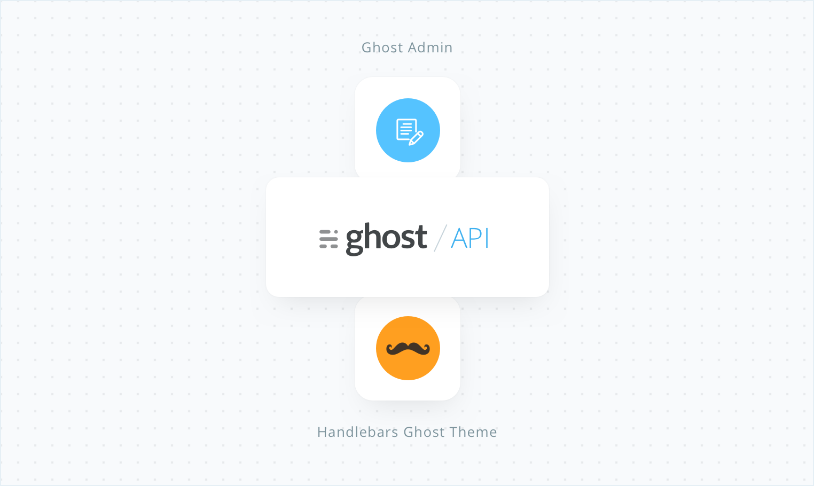
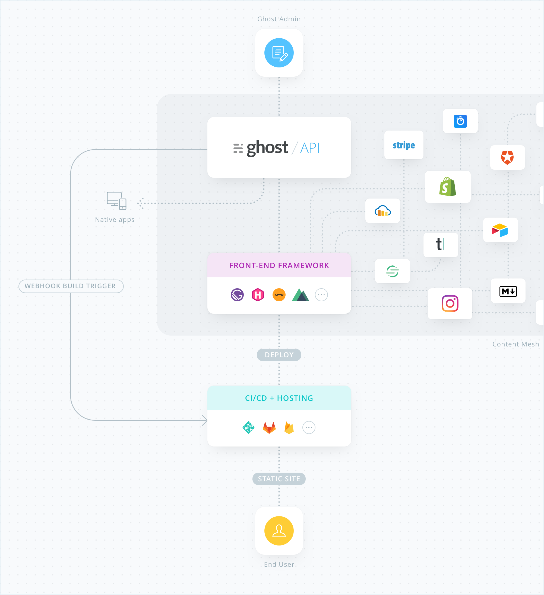

There has been a lot of progress around static site generators, frontend frameworks and API-centric infrastructure in recent years. At [Ghost](https://ghost.org/), we’ve been building open source technology for modern publishing for over 5 years and as a developer-centric team, the momentum around static sites didn’t go unnoticed.

Wildly fast websites which have no back end and can be deployed just about anywhere felt very much like the future. So I’m thrilled to share that with the recent updates to the Ghost API, it’s now possible to use Ghost as a completely decoupled headless CMS and bring your own frontend written in Gatsby.js!

## API driven publishing

Ghost has always been architected into 3 distinct areas: A core Node.js API, an Ember.js Admin client, and a speedy Handlebars.js frontend theme layer. Until now those 3 areas have been fairly tightly coupled, so it hasn't been possible to use them separately.

Our latest updates allow you to completely replace the default Handlebars theme layer in favor of a frontend framework, so you can use Gatsby to build your site statically from the Ghost API.

## Why use a headless CMS?

Many developers use static site generators alongside locally stored Markdown files, using a code editor to create content and a GIT workflow to publish. While this works great and is suitable for some sites, it quickly becomes unmanageable for publishers that need to scale, or teams that are not solely developers.

This is where a [headless CMS](/docs/headless-cms/) comes in, which provides an admin client for authoring and content management, while still bringing all of the benefits of having a static frontend. Developers can use their preferred stack, and writers have an editor, content scheduling, SEO and much more at their fingertips.

When you look at the bigger picture of the [content mesh](/blog/2018-10-04-journey-to-the-content-mesh/), it really starts to feel like an inevitable future for building publishing websites.

## Official Gatsby.js Source Plugin + Starter

We rebuilt our entire [Ghost Docs site](https://docs.ghost.org/) with Gatsby, using the Ghost API to deliver content. Truth be told, we fell in love straight away and have been building new things with Gatsby ever since. To give others a head start on building their own publications using the same stack, we’ve just shipped some new tooling:

- [gatsby-source-ghost plugin](https://github.com/tryghost/gatsby-source-ghost)

A straightforward Gatsby source plugin which wraps the Ghost API and makes it compatible with Gatsby and GraphQL, so it's quick and easy to load all your Ghost data into any Gatsby project.

- [gatsby-starter-ghost](https://github.com/tryghost/gatsby-starter-ghost)

An official [Gatsby starter repository](https://github.com/tryghost/gatsby-starter-ghost) which is pre-configured to get content from Ghost and output it in a clean, blog-style design. The fastest way to get up and running with Gatsby and Ghost is to fork this repository, and check out our [Gatsby docs.](https://docs.ghost.org/api/gatsby/)

We’ve also introduced an official [Netlify integration](https://docs.ghost.org/integrations/netlify/) to make deployment a breeze, with outgoing webhooks in Ghost to trigger a site rebuild and automate the publishing process.

## Publishing on the JAMstack

I’m really excited to see what people build with these new technologies. The concept of having just one frontend and many APIs all connected together and served as a single site or application with Gatsby opens up so much opportunity in the publishing space.

If you want to give it a try with Ghost, sign up for a free trial account at [Ghost.org](https://ghost.org/pricing/) and use our official Gatsby plugin + starter to put it through it’s paces!
