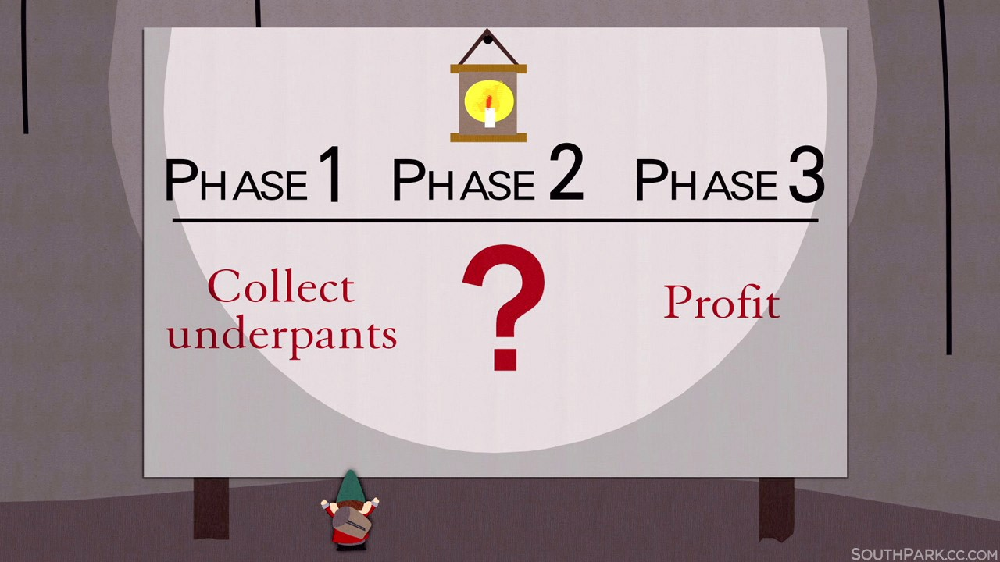
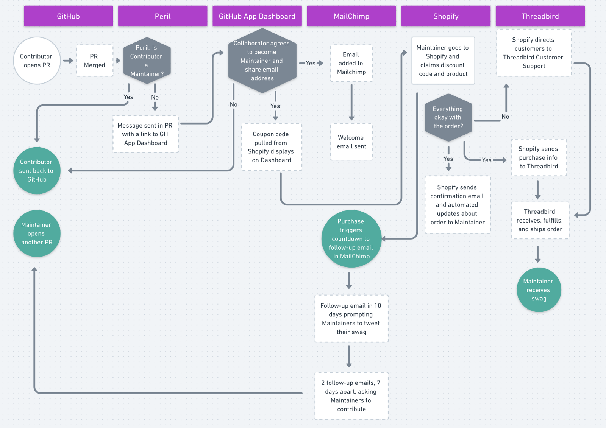

Gatsby is a React-based site generator that creates some of the fastest websites you’ve ever seen. Go ahead and blink—I dare you! It’s a framework that not only helps people create super fast websites, but it’s also a great equalizer of the web. Think about it: if you’re in an area that has 3G internet, many sites can take about 15 seconds to load, if they even load at all. Thanks to Gatsby’s performance-first architecture, the same site can be on-screen in less than 3 seconds. So Gatsby can really bring the information to everyone.

Gatsby is also open source and currently has 1000+ contributors. For all the time, energy, and help they’ve given, we wanted to find a way to thank them properly.

But how could we do this? Our contributors live all around the world—on 6 continents!

After a lot of discussion, we settled on giving people free swag! It was a great way to show our appreciation and give away something useful as well.

With that in mind, we needed to find a way to get swag into the hands of contributors quickly and reliably, with no human bottlenecks. The rest of this article is a breakdown of how we made that happen.

## Identify our Goal

Just because we knew that we wanted to send people swag didn’t mean that our goal was complete. We still had to narrow it down and decide what _type_ of swag to have.

That meant we had to do a little bit of research. We asked people what type of swag they liked to receive and also what type of swag they _wanted_ to see, even if they hadn’t found anyone who was doing it yet.

Overall, a lot of people said they liked:

- T-shirts

- Socks

- Donations to charities

We also saw that people were excited about:

- Nail wraps

- Scrunchies

- Stickers

https://twitter.com/the_becca_lee/status/1009920104019083264

Since we had so many things to choose from, we needed something lightweight as a trial run. We decided on shirts because we already had the design for those. We also got socks for people (like me) who always find off the rack shirts impossible to wear and look good. And of course we got some stickers so that we could wallpaper our laptops with Gatsby.

We also wanted the process of buying swag to be a fun and personable experience from beginning to end. People so willingly show their appreciation for Gatsby, and we wanted to be able to show our excitement and appreciation, too.

## Figuring Out Our Limitations and Our Strengths

Now that we’d decided on _what_ we were going to have, we came up against the inevitable, ever burning question, “How the hell can we make this work?”

And that question could only be answered by looking at what we had—and what we didn’t have. We had to identify our limitations and strengths.

_Here were the three biggest limitations we saw:_

- lack of time to spend creating, managing, or shipping swag

- lack of existing process to identify who qualifies for free swag

- no way for people to actually see our swag or place orders for it

_And the three biggest strengths that we could use to combat our limitations:_

- we have an amazing designer in Florian Kissling, and the development knowledge to build custom solutions

- access to a product manager (that’s me!) who specializes in identifying and designing scalable processes

- a wealth of open source and SaaS tools that make automation much more feasible

## Deciding How to Turn Limitations into Solutions

So this led us to the idea of creating an automated system that would identify, manage, and ship swag to Gatsby Maintainers.

We settled on an “automation first” solution for a few reasons

### Time was limited

We needed to limit manual touchpoints so that people on the team could focus on critical Gatsby needs.

**First, we had to identify the manual touchpoints**

We needed to figure out all of the manual touchpoints in the process to begin with. We found that we’d need to intervene in all of these instances:

- ordering swag

- packing swag

- shipping swag

- responding to contributor questions

- sending out follow-up emails about swag

- sending out follow-up emails to keep the community involved

**How we worked around them**

We looked at each of these touchpoints and decided which ones were easy to batch or automate.

We asked ourselves, “How much time would it take to do this individually?” and “Is there a way that I can set this up to be done without me?”

This involved working with development to see what tools were available to solve the problem. Asking the right questions helped us see if we should look into a tool to solve the manual touchpoint to begin with.

We noticed that we could use a few different tools to automate the majority of the process—freeing up time for the rest of the team.

**But still needed some human intervention**

Since we’re not able to automate everything, there were a few things that will require the deft hands of a human to complete. This included:

- ordering more swag

- replying to contributor emails and questions

But that was about it. The rest of the process didn’t require anybody’s help, and would run on its own!

### Scalability was key

As our community grows we want to continue to use the swag store as a way of rewarding people, so any framework we set up would need to grow with the contributors, with Gatsby, and with swag items. It needed to be scalable.

**Deciding if something will scale**

This is where we get deeper into systems and scalability. There are a set of questions that I always ask myself to decide if something is actually scalable.

_How modular is the process?_

It should be easy to identify and move pieces of the process around. If adding or removing pieces of the process makes it break down, then it’s not modular, and won’t scale appropriately.

_How well documented is the process?_

Could someone just coming in to the process find the information they needed to immediately start working on it? If the answer to that is no, then the process isn’t well documented, and won’t scale since it’s prohibitively difficult to train every single newcomer the same every time. That means that documented resources need to be available for people to find and execute.

_How dependent on the individual is the process?_

This is a bit like the “vacation principle”. If the main person who created or implemented the process were to go on vacation for a week would it be possible to move the project forward? If the answer to that is no, then we need to identify the reason why. The gaps we see there are the ones that need to be fixed before the process is actually scalable.

_When we add more people, does the process stay efficient or come to a halt?_

As you add and onboard people to the process you’re creating, you need to check in on the health of the process. What’s working and not working? If the process that’s been created gets completed more slowly, or there are constant blockers, then it’s not going to be efficient as it scales.

**Some things just don’t scale**

While we were able to scale the process for the swag store largely through automation and decentralization, some things just don’t scale.

Any process that requires high effort manual and/or daily interaction in order to keep it running—like reaching out to every customer for a short interview or building something entirely in-house just can’t scale up very well.

But starting from a non-scalable solution is a great way to get started. While you’re able to, talk to every customer. But as the company grows, there have to be ways of setting up processes that take into account the fact that there will be more customers that you can directly interact with, and there will be more people involved in moving the business forward.

More people leads to more complexity, and processes exist to improve communication, efficiency, and transparency for people in the company and the customers who use the product. If we’re creating a process that slows people down, then it’s simply got to go. All processes should be flexible enough to change and grow with the people they’re intended to help.

### The process had to be easily repeatable

We made things more repeatable by creating internal documentation, and sharing it with the rest of the team. Since tasks like ordering new swag and reordering previous items would require someone to actually make the call or send the email, we set up templates that anyone could use.

We also documented all of our swag and invoicing in [Airtable](https://airtable.com/), so that it was easy to see what had been done and anyone on the team could get a snapshot of the current and past swag orders.

By limiting the amount of tasks a person had to do and documenting those processes well, it meant that _anyone_ could read the process and complete the tasks.

We’re taking this one step further by revamping the project management workflow so that all internal processes are scalable, repeatable, and better automated!

## Creating the Process Framework

So we had our limitations, our strengths, and a rough idea of a solution that could help get us to our end goal.

But what did that process actually look like? We had our starting point — someone contributes to Gatsby and their PR gets merged. And the end point — that person receives swag as a thank you.

Basically, our process looked like this:

_The Gatsby Swag Project off to a strong start!_

So we worked with what we had — starting at the end and worked our way backwards.

We had a meeting that was solely focused on laying out each step in the process as clearly as we could.

The conversation looked a little like this:

> So the final step is that a person receives swag. What has to happen right before that step?

> Well, the swag has to be shipped.

> And what has to happen before that?

> The swag has to be ordered.

> And what happens before that?

> The person has to be on a site that allows them to order swag.

It’s a slow process, but worth it to put the work in upfront. Having this conversation helped us think through how everything would actually need to run, and identify gaps in our reasoning.

## But How Do You Set It Up?

Since we knew now **what** we were setting up, we were left to figure out **how**.

Each **how** is a step in the process that requires an integration, automation, tool, or touch point of some kind.

Since we were going with an “automation first” framework, we had a lot to consider at each touchpoint:

- Can a tool perform this action?

- What tool can perform this action well?

- How easy or difficult is it to implement, manage, and troubleshoot this tool?

- How robust is the tool, is it easily breakable?

Eventually, by working backwards from the end, we created a full process and recorded it using [Whimsical](https://whimsical.co/). You can see our flow chart [here](https://whimsical.co/HrgMvcBZxyyWxcPPAUzPXf)!

_Flow chart with the step by step swag process_

The top section lists each tool that we’re using to manage and automated the swag process.

- Each **circle** is a key action or endpoint in the flow.

- Each **square with a dashed border** is an action handled by automation

- Each **square with a solid border** is an action handled by a person

- Each **hexagon** is a question that the framework needs to ask to decide how to move forward

In this process, just like any site, we have a frontend that people see, and a backend that people don’t.

In this case, the frontend was the process that people went through to order and get their swag.

And the backend was the systems design, tools, and automation triggers that handled all the requests and process.

_So Gatsby contributors see this:_

- When they create a PR and it’s merged, they’ll automatically get a response asking them to become a Gatsby Maintainer

- If they decide to join as a Maintainer they’ll get access to a Gatsby Dashboard that gives them a discount code for a free piece of swag

- They’ll also get to sign up on a Gatsby Maintainers email list if they want

_And this is what’s happening in the background:_

- [Third party distribution](https://corp-couture.com/) so no one at Gatsby has to be responsible for packing and shipping

- Third party email monitoring and customer service if people have problems or questions about their swag

- Automated distribution list with information on how to continue contributing to Gatsby

- Automated [Peril](https://github.com/danger/peril) integration that invites new contributors to the Gatsby Maintainer group on GitHub

## Where We Ended Up

Our goals when we set out were to create a way to give back to the community, keep contributors interested, and make everyone who took the time to contribute feel really welcome.

But we needed to make sure that setting this up was sustainable, scalable, and easy to keep doing so that we’re always able to reward the community.

Setting up a mostly automated process for swag gave us the best of both worlds, so that we could keep working on Gatsby while still showing our contributors how much we appreciated them.

It also meant that we got to see pictures like this:

https://twitter.com/ryanwiemer/status/1022267081998266368

And this:

https://twitter.com/NikkitaFTW/status/1024332058125107200

Dogs and cats in Gatsby swag? Yes please. I’ll have another. Find out how you can [#buildwithgatsby](https://twitter.com/search?src=typd&q=%23buildwithgatsby) on [Twitter](https://twitter.com/gatsbyjs) or on our [site](https://www.gatsbyjs.com/)!

You can also read about how we built out the store [here](/blog/2018-08-09-swag-store/)!
