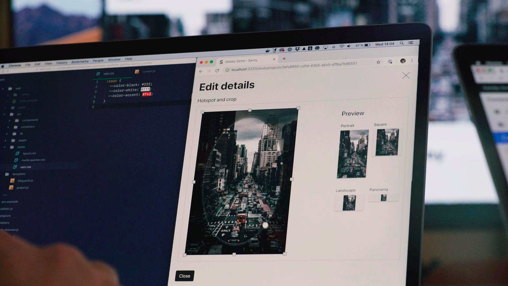

Sanity.io is a content management system with real-time at its very core. We built the React.js [editing environment](https://github.com/sanity-io/sanity) as a real-time React.js app so you can collaborate on the same documents without locking. It connects to our document store through real-time APIs. Naturally, we've been looking for frontend frameworks that can reflect changes in real-time as well. Problem was, we didn't know of a reasonable way to accomplish this for everyday needs.

Then we came across [Gatsby Preview](/blog/2018-07-17-announcing-gatsby-preview/), a general way to get real-time previews that doesn't involve custom code! When combining Sanity with Gatsby, we get the best of both worlds: A fully dynamic development experience where code and content is instantly reflected in preview.

In January 2019 we shipped our new [Sanity Gatsby Source](https://github.com/sanity-io/gatsby-source-sanity) Plugin that uses the Sanity APIs to rebuild instantly as content changes. When developing this means a group of people can freely work together on both content models, UI design and the content itself. In real-time. Without rebuilds. This feels both a bit futuristic and pretty great. In the process we also to also make the static production builds themselves as fast as possible.

<iframe width="560" height="315" src="https://www.youtube.com/embed/STtpXBvJmDA" frameborder="0" allow="accelerometer; autoplay; encrypted-media; gyroscope; picture-in-picture" allowfullscreen></iframe>

You can experience it yourself with the sample [company website](https://github.com/sanity-io/example-company-website-gatsby-sanity-combo) we built for the launch. We ship it in a monorepo along with a Sanity project that has content models for _people_, _project case studies_ and _blogging_. We made it pretty minimal to make it easier to extend.

## Get started, with minimal configuration

The Gatsby source plugin for Sanity comes with the ability to easily overlay drafts, compatibility with the [gatsby-image](/packages/gatsby-image) plugin, no mysteriously missing types/fields, and a watch mode for instant preview of edits in development. We also made sure that it requires as little configuration as possible.

Add the source plugin to your Gatsby project:

```shell
npm install --save gatsby-source-sanity
```

The source plugin gives you a comprehensive GraphQL API in Gatsby for your structured content from Sanity. We strongly recommend using the [GraphiQL explorer](/docs/running-queries-with-graphiql/) to test queries and familiarize yourself with the schema documentation. It's super useful!

Once you have installed the plugin, add this configuration to `gatsby-config.js`:

```js
module.exports = {
  plugins: [
    {
      resolve: "gatsby-source-sanity",
      options: {
        projectId: "<yourProjectId>",
        dataset: "<yourDatasetName>",
      },
    },
  ],
}
```

## Preview content changes with watch mode

The source plugin injects published content changes instantly, without reloading the pages in the browser. All patches to the content are streamed to you via a listener. This means that you won't be burning API calls as you develop the site. To enable watch mode, include it in your configuration:

```js
module.exports = {
  plugins: [
    {
      resolve: "gatsby-source-sanity",
      options: {
        projectId: "<yourProjectId>",
        dataset: "<yourDatasetName>",
        watchMode: true,
        overlayDrafts: true,
        token: process.env.SANITY_READ_TOKEN,
      },
    },
  ],
}
```

If you [add a token with read permissions](https://github.com/sanity-io/example-company-website-gatsby-sanity-combo#enable-gatsby-watch-mode-for-drafts) and set `overlayDrafts: true`, you will get _all_ editing changes live. This also makes it possible for a team to collaborate on design, code, and content at the same time, across multiple devices. It makes developing a site with Gatsby even more fun!

## Fast, frugal builds

The source plugin uses Sanity.io’s export API. It streams all your documents in one go. So it's not only _very_ fast, it's also just a single API call for all your content. Regardless of the number of documents or their size. Thanks to this you can build your website with Gatsby thousands of times a month on the free developer plan (you can also add your card to the [dev plan](https://www.sanity.io/pricing/dev-2018-08-21) for an affordable pay-as-you-go option should you blow past the generous base quotas).

You also avoid time consuming processing of images. Our image pipeline scales and crops the images for you and we have already baked in Low-Quality-Image-Placeholder (LQIP) into the image asset data structure so you don't need to extract it yourself to have it be part of your build. This while keeping compatibility with `gatsby-image`. We keep your image assets on a global edge cache and store the exact version you asked for to keep it fast.

We think some people might prefer to keep assets as part of their build and are thinking of including an option for this as well. [Let us know](https://slack.sanity.io) if you're one of them!

## No accidentally missing fields or types

Most source plugins generate the internal Gatsby GraphQL API from the content available at any given moment. In other words: types and fields can be missing depending on what content is present or not. This can be a bit hard to work with, and in the worst case scenario, it breaks your build when you remove the last document that has content for specific kind of field.

The Sanity.io source plugin automatically fetches the schema definition to make sure that all your types and fields are present if you deploy a [GraphQL API](https://www.sanity.io/help/graphql-beta) for your Sanity project (run `sanity graphql deploy` in the Sanity CLI in your project folder).

There's some excellent work being done in the Gatsby community to provide an official and better solution for this down the road. As far as we know, no other source plugin solves this problem right now.

## The Power of Portable Text


With Sanity.io, rich text content is stored as [Portable Text](https://www.portabletext.org), deeply typed and highly structured. This enables you to offer a WYSIWYG experience for yourself and your authors, but without all the markup mess. You also can get rid of `dangerouslyInsertInnerHTML` in your Gatsby templates, and replace it with custom React components at render time. In Sanity Studio you can use those same React components as inline previews for custom content types.

```jsx
{
  /*
So instead of this:
<div dangerouslySetInnerHTML={{__html: post.html}} />
You can do this:
*/
}
import React from "react"
import PortableText from "@sanity/block-content-to-react"

export default post => (
  <PortableText
    serializers={{
      types: {
        code: ({ node }) => (
          <pre data-language={node.language}>
            <code>{node.code}</code>
          </pre>
        ),
      },
    }}
    blocks={post._bodyRaw}
  />
)
```

## Full `gatsby-image` support

Sanity already comes with a capable and easy to use image pipeline on a superfast CDN with [transforms on demand](https://www.sanity.io/docs/front-ends/presenting-images), but if you want to use the same frontend components with a mix of remote or local sources or prefer the functionality of the `gatsby-image` library, we have made it easy for you to leverage that. Additionally, you'll have access to all that handy image metadata, like aspect ratios, dimensions, color palettes, the optional EXIF data and geotags via the API.



## Sanity.io + Gatsby.js = Perfect JAMstack companions

Gatsby has already set high standards for developer experience by striking a good balance between code and configuration. We have worked hard to make it as effortless as possible to use [Sanity.io](https://www.sanity.io) as a content backend with Gatsby, and we hope that you will enjoy building websites with this combo.

If you quickly want to get started with a full JAMstack combo, check out the [company website example](https://github.com/sanity-io/example-company-website-gatsby-sanity-combo) we put up. It features both a Studio configuration and a website template with projects, blog, people, and pages. With configuration files to put the website on either [Now](https://zeit.co) or [Netlify](https://netlify.com). You should be up in minutes.

We're very excited to see whatever you do with it and welcome you to come with all your questions, feedback, and ideas in [our developer community](https://slack.sanity.io).
