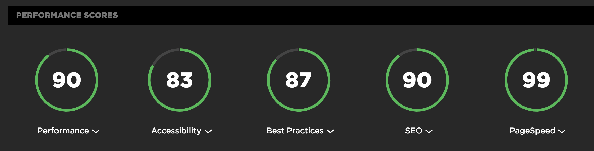

Since [Harry's](https://www.harrys.com/en/us) launch in 2013, it has lit up the e-commerce market for men's care products. After years of research, the team put their expertise and technology towards a new brand, [Flamingo](https://www.shopflamingo.com/), that makes body care and hair removal products designed specifically for women. The Flamingo site went live in October 2018 with thousands of users visiting the new website and hundreds of thousands of page views in the first week. The launch triggered the need for an optimized website with performance built-in, which was delivered seamlessly by Gatsby. It also carried a surprising internal reward – Harry’s and Flamingo developers are re-engaged about learning, charging into the future of modern website development and performance on the edge.

Here’s some of our conversation with Tim Brown, Senior Software Engineer and Johnny Lin, Engineering Manager at Harry’s.

## Performance is King

When it comes to websites, performance is king, especially for e-commerce websites. For every second it takes a page to load, the more customers (and revenue) are lost. And given the success of Harry’s and the public relations push planned for the new product launch, the development team knew they were looking at a big launch with lots of traffic and absolutely no room for failure. Having built the Harry’s site from scratch, they were looking for a fresh approach with Flamingo and **their main goals were simple**: Sell products to users; and be a positive introduction to the new Flamingo brand.

With that in mind, they also needed it to tick off some major development points, such as:

1. Performance, performance, performance! The website had to be fast, as any delay in page load times meant lost customers and revenue.
2. Improve page load times by at least 20% over the competition
3. Optimize the site for mobile - the source of the majority of traffic
4. Develop quickly with easy-to-learn tools because the timeline to launch was tight
5. Make this project a blueprint for how to build future websites

If the team didn’t find a solution to meet these needs, they’d have to build it themselves and being responsible for performance optimizations, build processes, image optimizations, and edge hosting would have taken them easily another year to build. That definitely was NOT an option as they only had a few months to build and deploy the new Flamingo site.

<Pullquote>We wanted to focus on performance at the beginning of the project, having it baked in. It’s easier than trying to make an already built website perform later.</Pullquote>

## Going Gatsby

The manual process required to make the Harry’s website perform was what they were looking to improve for the Flamingo site. And Gatsby made building a high-performing website easy because it leverages modern website tools and is built with performance already an integral part of the technology.

<Pullquote>As an e-commerce site, performance (SEO and conversion) is super important and Gatsby takes care of this for us.</Pullquote>

Since Gatsby simply serves html files that are hosted on the edge (CDN: Content Delivery Network), this dramatically improves SEO. The developers can focus on other things because Gatsby just takes care of the performance. The team was excited about the image support from Gatsby that is “out-of-the-box.” They didn’t have to write code in-house, which was game changing for a team looking to lead in mobile-optimized shopping.

The Flamingo team also wanted to shake things up with content and image design by providing the fastest, most seamless shopping experience. Gatsby’s image handling helps reduce raw image sizes and speed up page load times, and serves the right resolution image depending on different screen sizes. This gave the frontend developers the ability to go beyond JS to focus on edge hosting and optimization. With a site driven by modern development tools, Gatsby’s out-of-the-box image support is the cherry on top for Flamingo. “We don’t have to write the code ourselves!” said Johnny.

The duo also praised the ease of getting up to speed on Gatsby, which gave them the ability to hire new developers and get them going in only a day. If there was familiarity with React, onboarding was successful and reduced the management of dependencies and servers.

<Pullquote>We were able to allow newer teammates to be part of the on-call for the launch because Gatsby made it so easy to maintain.</Pullquote>

## No server. No problem.

The Flamingo launch was big, and they had a lot of press coverage lined up to support it. They had a lot of marketing investment and press coverage lined up to support it. But the first day of the launch, there was not a worry about the site going down.

<Pullquote>We didn’t have to manage a server – all the traffic was going to the CDN so there was less surface area for things to go wrong.</Pullquote>

And since the site was compiled by Gatsby ahead of time, it was all ready to go and hosted on the CDN before a web visitor even typed in the URL or did a search. “Instead of us hosting a web server, Gatsby builds the site ahead of time and stores it on the CDN. We don’t need to compute anything when the customers come to the website,” Tim explained. “We've had thousands of concurrent users on the site at once with no scaling concerns and zero performance impact.”

Imagine- no servers to manage! This was a game changer for the Flamingo development team. It let them focus on building a beautiful site rather than on optimizing the performance because Gatsby took care of that for them. And since the majority of the site is accessed through mobile devices, performance becomes that much more important. Having Gatsby build the site before it was deployed made it easier to get visibility and troubleshoot any errors that might pop up before it was mission critical. Ultimately, the team quickly realized “if the Gatsby build succeeds, then the site will work.”

## Everyone Wins!

Flamingo was able to achieve their sales and brand awareness goals with the new website because it met their goals in three key areas:

**1) Exceptional Performance:** The website had noticeably great performance when launched and even non-technical users remarked on this in early customer conversations. Fast loading enables users to purchase more reliably and gives them a positive perception of the website. The Flamingo team also saw a big improvement to the [lighthouse performance scores](https://developers.google.com/web/tools/lighthouse/) (Google’s developer tool for measuring website performance). SEO, performance, and page speed are all in the 90s without any additional work from the development team. Due to the positive results on performance from day one, a few days after implementing basic SEO data on the site, marketing noted their Google search ranking improved and they were quickly the top result for all of their branded terms with no outside consulting.

**2) High Reliability:** The team spent minimal time on site maintenance and the support team rarely hears about site issues from the users. This reliability has enabled them to focus on driving value and customer delight from the beginning instead of worrying whether an individual press event will take down the site.

**3) Seamless Integration with the CMS (Contentful):** The marketing leads and content creators are able to update most branded content (copy and images) on the site with zero developer involvement. This enables the team to work without interruption while giving their brand team the flexibility to make quick updates based on customer feedback.

## Inspiring a New Frontier of e-commerce

Harry’s had a website that was working, but the web team knew it could do better for Flamingo – it could move to the edge and head for a new frontier in e-commerce.

Reflecting on it post-launch, the team says that Gatsby allowed them to focus on what they weren’t able to in the past – building a beautiful site that was inherently fast. But there’s been a surprise added value of Gatsby - the enthusiasm it has generated for the development team to push and learn.

<Pullquote>The team has gotten excited about learning – excited about hosting at the edge and optimizing for performance, because Gatsby makes it easy.</Pullquote>

Frontend engineers are going beyond JS and tools and focusing on edge hosting, the modern web technology stack and optimizing for speed. The team is using this as a blueprint for how they’ll build websites in the future.

Gatsby delivered a performance-optimized website for Flamingo, hosted on the edge. It made it easy to onboard new developers and create engaging experiences. It improved the website visitor’s experience with speed and design and it inspired the Flamingo team in a new age of e-commerce design.
