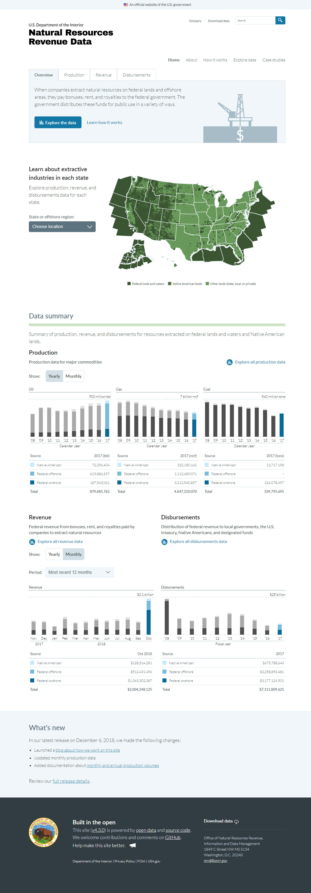
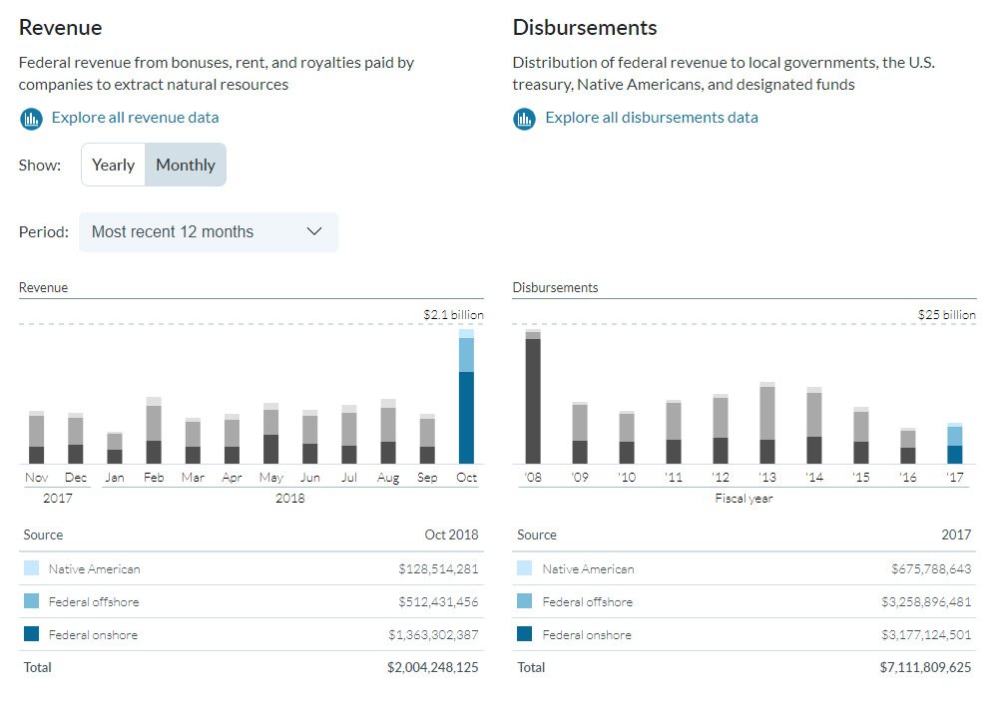

_This post was originally published at [Open data design at the U.S. Department of the Interior](https://revenuedata.doi.gov/blog/)._

A few months ago, our small team at the Office of Natural Resources Revenue (ONRR) decided we needed to refactor our [open-data website](https://revenuedata.doi.gov/). We knew we were in for a massive undertaking, as the site was originally built with the static-site generator [Jekyll](https://jekyllrb.com/), with significant custom coding to furnish bespoke features, automate data updates, and compile and deploy the site with [18F's](https://18f.gsa.gov/) fantastic static-site hosting service, [Federalist](https://federalist.18f.gov/).

As covered in our [first post in this series](https://revenuedata.doi.gov/blog/homepage-revamp/), we were simultaneously scoping a redesign of our homepage. Rebuilding the homepage would allow us to test some of our assumptions about how to address obstacles in our existing workflow.

## Transition obstacles

When our team was hired to [transition the site from 18F](https://18f.gsa.gov/2018/05/01/lessons-from-an-18f-product-transition/) in late 2017, one issue emerged as an immediate concern. Our team was issued Windows 7 laptops (thankfully, we've since received Windows 10 machines), and we had a problem: the site's codebase wasn't particularly cross-platform friendly. Jekyll is built with Ruby; the former isn't officially supported on Windows, and the latter doesn't ship with Windows (as it does with macOS). To complicate matters further, the script to perform the most routine content management on the site – update the production, revenue, and disbursements data – assumed macOS/Linux output paths (forward slashes). The script broke on Windows.

Of course, we could have refactored just the data-update script, but what we really needed was a way for multiple team members to update the data from their government-issued computers (with limited admin rights). We wanted to create a workflow that would solve some of our biggest content management problems:

- We couldn't use our government-issued computers to update the data.
- We didn't have one source of truth for the data: we had `.tsv` data files to update the site visualizations with, and we had Excel files for download, both of which had to be manually maintained.
- Updating the data required specific software dependencies (Make, SQLite3, npm), which our data specialists and subject matter experts lacked. Which meant...
- A developer had to update the data, and we have only one developer on the team.
- The codebase had a significant learning curve for new developers, due to the custom implementation of Jekyll.

At the same time, we didn't want to lose momentum on our user-centered design and development process, which we inherited from our colleagues at 18F. A refactored homepage served as an early proof of concept for fully transitioning our codebase, while allowing us to continue adding value for users.

We landed on Gatsby as our choice to refactor the site. The full scope of how and why we chose Gatsby is the subject of another post, but our work on the homepage reveals many of the reasons we decided to move to Gatsby.

## Refactoring as we go

We knew we'd have to segment our transition to Gatsby into our [Agile workflow](https://en.wikipedia.org/wiki/Agile_software_development), which meant we would have a hybrid site for the duration of the transition: part Jekyll, part Gatsby. It would result in some redundancy, with duplicative effort for some updates. But it would allow us to continue to iterate on the site, while incrementally transitioning our codebase. Our biggest goal was to maintain a seamless experience for users, in line with Agile leader [Martin Fowler's description of refactoring](https://martinfowler.com/articles/agile-aus-2018.html):

> Refactoring is lots of small changes, none of which change the observable part of the software, but all of which change its internal structure. Usually (you refactor) because you want to make some new feature, and the current internal structure doesn't fit very well for that new feature. So you change the structure to make the new feature easy to fit in, all the time refactoring and not breaking anything, and then you can put it in.

We'd transitioned some of our site already: we migrated our [explore data page](https://revenuedata.doi.gov/explore/), which was a heavy lift that proved we could support both workflows simultaneously (the page serves as the data-heavy fulcrum of the site). But in that transition, we'd left the data-update process largely the same.

The homepage presented an exciting opportunity, as the redesign would feature monthly data for the first time on the site. Up until that point, we'd published only annual data. The addition of monthly data meant we needed a way to quickly and easily update the data. It became even more important that other team members – besides just our developer – could update the data.



## Rebuilding in Gatsby

Thankfully, Gatsby is open source. Had it not been, we wouldn't have considered it. Our team [works in the open, with open data, and open source tools](https://github.com/ONRR/doi-extractives-data). We think that model is a good fit for government.

In addition to being open source, there are five main reasons we used Gatsby to refactor the site:

1. Gatsby is a cross-platform ecosystem out of the box.

2. [GraphQL](https://graphql.org/) allows us to query the data from a canonical source, instead of regenerating the data into multiple files to fit a particular context.

3. Anyone on our team can update the data. Team members need only Excel and GitHub to update the data, and we have one source of truth to maintain for each dataset.

4. Gatsby is a modern, web-component framework that allows us to design the site in a more modular way, leading to better code reuse.

5. We're better aligned with industry best practices, which supports long-term site maintenance.

We'll look at each of these in the context of our homepage redesign.

### Cross-platform ready

As mentioned above, our most significant challenge transitioning the codebase from 18F to ONRR was operating system compatibility. We were asking a lot of our IT group, who had to vet our tech stack to ensure it met security requirements. It was a time consuming process that, even when we were granted administrative privileges, still left us with dependency errors and a parallel data-update workflow using separate machines.

Gatsby combines multiple frontend tools into one, and the packages are managed with [npm](https://www.npmjs.com/) or [yarn](https://yarnpkg.com/), so the scope of our IT requests is limited to widely used package managers. From what we can tell so far, running Gatsby is nearly identical regardless of the operating system you're using. As we'll describe in the next section, we were able to build a data-update workflow that we could support using our government-issued computers.

### GraphQL

GraphQL has been a game changer for us. Our open data is largely comprised of flat Excel files, but we also access some data via API. Much of our content is formatted in Markdown. GraphQL can query it all in a schema whereby we get exactly the data and content we need for a particular context.

Where before our data-update scripts would generate multiple `.yml` files – structured for the specific context in which the data would appear – we can now query the data with GraphQL and reference it in whatever context we need. Importantly, we maintain just one canonical data file and structure our query to fetch what we need.

We use the [`gatsby-transformer-excel` plugin](/packages/gatsby-transformer-excel/) to parse our Excel data and convert it into `JSON` arrays accessible to both GraphQL and [D3.js](https://d3js.org/), our data visualization library.

Here's a sample GraphQL query from the homepage to fetch revenue data:

```graphql
    Revenues:allRevenues (
      filter:{RevenueCategory:{ne: null}}
      sort:{fields:[RevenueDate], order: DESC}
    ) {
      revenues:edges {
        data:node {
          RevenueDate
          RevenueMonth:RevenueDate(formatString: "MMMM")
          RevenueYear:RevenueDate(formatString: "YYYY")
          DisplayYear:RevenueDate(formatString: "'YY")
          DisplayMonth:RevenueDate(formatString: "MMM")
          Revenue
          RevenueCategory
        }
      }
    }
```

Every member of our team can now update the homepage data, using only Excel and GitHub on their government-issued laptops. Now that we're publishing data every month, with a team distributed across multiple time zones, that makes a _huge_ difference. GraphQL allows us to quickly correct mistakes, ship content updates, and iterate on our data visualizations.

We update the Excel file, and we get our updated charts on build.



Our three "innovation specialists" (design and development team members) are limited to four years in each of our respective positions, so one of our biggest priorities over that time is to create a sustainable workflow for content management on the site. Transforming our data-update workflow is a significant step in that direction, but one of the other advantages of Gatsby is its ability to pull in data from virtually any source, including databases and content management systems. The site will always need some level of developer support, but Gatsby's flexible architecture means we can start to look toward content management workflows that are practical for members of our extended team.

### Modularity

Perhaps React's rising popularity is due to its modularity in the form of React components. Our site features repeating instances of similar or identical patterns, so Gatsby's use of React was attractive to our team.

For example, the homepage's `KeyStatsSection` component references the `StackedBarChartLayout` component, passing it props:

```jsx
return (
  <div is="chart">
    <StackedBarChartLayout
      dataSet={this.state[dataSetId]}
      title={title}
      styleMap={CHART_STYLE_MAP}
      sortOrder={CHART_SORT_ORDER}
      legendTitle={CHART_LEGEND_TITLE}
      legendDataFormatFunc={dataFormatFunc || utils.formatToCommaInt}
      barSelectedCallback={this.dataKeySelectedHandler.bind(
        this,
        dataSetId,
        this.state[dataSetId].syncId
      )}
    />
  </div>
)
```

#### Pattern library

This component architecture also feeds our pattern library (not yet live), so when we build or change a component, our pattern library will update itself. We will then have a working inventory of our components to reference for new feature development.

#### CSS Modules

With our homepage rebuild, we also started using [CSS Modules](https://github.com/css-modules/css-modules). CSS Modules are CSS files "in which all class names and animation names are scoped locally by default," and they're a great way to avoid selector name collisions and limit the accumulation of unused styles.

Scoping and storing each component's CSS locally makes it much easier to track down and edit a component's styling.

### A modern framework

Nothing is future-proof in technology, but migrating to Gatsby gets us closer, with a flexible, modular architecture and a growing and spirited community of developers behind it. By migrating to Gatsby, we're trying to build a maintainable, future-friendly codebase for the team that comes after us.

## Challenges during rebuild

While our experience refactoring the homepage was largely positive, we have faced some challenges migrating to Gatsby. Some of those challenges are inherent in refactoring, caused by maintaining two codebases and build processes simultaneously. Others are perhaps due to the relatively new emergence of Gatsby itself, which is actively being worked on and upgraded.

Here are the main challenges we've faced.

### Long build times

The site has parallel builds right now, compiling both the Gatsby and remaining Jekyll parts of the site. Build times can reach 20 minutes, much of which time is consumed by building the GraphQL schema. This can slow down our design and development workflow, and occasionally results in build time-outs on the otherwise excellent Federalist.

We expect we can optimize our code to mitigate our long build times, and having only one build process will help. But we are asking a lot of GraphQL, and we understand the build time is associated with the complexity of our query schema.

### Redundancies

Refactoring the site over time means we often have to manage content in two places. For instance, if we update content in the Jekyll part of the site, but we also have a Gatsby version in the pipeline, we need to update that, too.

In some cases, we've delayed content updates or restyling, acknowledging it makes more sense to do so after the migration of that page or asset.

Thankfully, we have strong communication on our team, and we work in the open, which helps us avoid more extreme problems with redundancy.

### Integrating with Jekyll

Related to redundancy, providing a seamless user experience between the Gatsby and Jekyll portions of the site has been a challenge. There were three issues to resolve:

1. Page URL issue
2. Gatsby prefetch error
3. Federalist preview URL

#### Page URL issue

When Gatsby builds the site, it creates a `public` directory for all required site assets. We copied this directory to a `gatsby-public` folder for the Jekyll build to use. However, we didn't want our URLs to include `gatsby-public`, so we needed to add a permalink attribute to our pages' front matter to override the default path.

Fortunately, Gatsby provides a hook into the entire lifecycle of its build process, including an [`onPostBuild` API](/docs/node-apis/#onPostBuild). We use this hook to add the front matter to our pages and copy the `public` directory to the `gatsby-public` directory.

#### Gatsby prefetch error

Developers tout Gatsby's speed, and [prefetching](/docs/how-code-splitting-works/) page assets is integral to Gatsby's performance advantages. However, Gatsby isn't aware of our deployment structure, which results in an error when a page loads in the production environment.

Basically, the Jekyll part of the site deploys to a directory that isn't known to Gatsby at build time. Consequently, Gatsby creates a `pages.json` object that contains the wrong locations for files. To deal with this, we use another feature of Gatsby's client API, [`onClientEntry`](/docs/browser-apis/#onClientEntry). Using `gatsby-browser.js`, we override `pages.json` by passing the correct assets to Gatsby ([full code here](https://github.com/ONRR/doi-extractives-data/blob/d355ba54a08a4a36a23e4f3d4a06bbca517cee5f/gatsby-browser.js)).

```javascript
exports.onClientEntry = () => {
  // Patch the resource loader
  const loader = global.___loader
  if (!loader) return

  let path = window.location.pathname

  if (path.includes("/explore") && usStateIds.includes(statePathId)) {
    loader.addPagesArray([
      {
        componentChunkName: "component---src-templates-state-page-js",
        layout: "layout---index",
        layoutComponentChunkName: "component---src-layouts-index-js",
        jsonName: "explore-" + statePathId.toLowerCase() + ".json",
        path: path,
      },
    ])
  }
}
```

#### Federalist preview URL

As mentioned above, we use [Federalist](https://federalist.18f.gov/) to build and deploy the site. Federalist builds out every branch in our GitHub repository, so we can preview the changes before we merge them.

We encountered an issue with the Federalist preview URLs and relative links and assets. Gatsby solves this by using a `pathPrefix` variable in `gatsby-config.js` and a custom component named `Link`.

We set a `BASEURL` environment variable in `gatsby-config.js` that resolves the Federalist preview URL at build time.

```javascript
// Federalist provides the BASEURL env variable for preview builds.
// https://github.com/18F/federalist-garden-build#variables-exposed-during-builds
const BASEURL = process.env.BASEURL || ""

module.exports = {
  // This is currently the relative path in our Jekyll deployment. This path points to our Gatsby pages.
  // This prefix is prepended to load all our related images, code, and pages.
  pathPrefix: `${BASEURL}/gatsby-public`,
}
```

## The work continues

We'll continue to share our experience migrating Natural Resources Revenue Data to Gatsby. [Track us down on GitHub](https://github.com/ONRR/doi-extractives-data) if you have questions or comments about our homepage or our transition to Gatsby.
