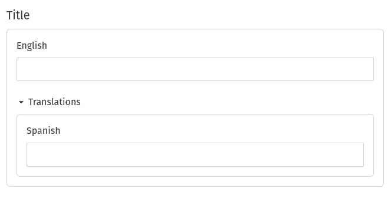

Localization is a common problem and there are _many_ solutions, each with their own benefits and trade-offs. With Gatsby and Sanity.io its possible to achieve a solution that is easy to work with and extend. If you haven't already read about why Gatsby and Sanity.io pair so well check out the blog post by [Knut Melvær](/contributors/knut-melvaer/): [Blazing fast development with Gatsby and Sanity.io](/blog/2019-01-25-blazing-fast-development-with-gatsby-and-sanity-io).

I have completed two sites with Gatsby and Sanity that required localization. The first site needed to maintain every link from the original site without redirects: each language living in its own subdomain, `es.my-web-page.com` for example. The simplest solution at the time was to use multiple builds which always bothered me. The second site I vowed to do it the _right™_ way.

The new setup would generate pages for every language in one build step giving urls like `my-home-page.com/es/...`. This makes it easier for both the content team and our developers to use.

## Setting Up Sanity to Support Translations

Sanity.io has some good documentation which has great examples to help you achieve [localized](https://www.sanity.io/docs/localization) text.

Create a new contentType schema called `localeText` to use with the schemas in your project.

```js:title=contentTypes/localeText.js
const supportedLanguages = [
  { id: "en", title: "English", isDefault: true },
  { id: "es", title: "Spanish" },
  // Add as many languages as you need to support
]

export default {
  name: "localeString",
  type: "object",
  fieldsets: [
    {
      title: "Translations",
      name: "translations",
      options: { collapsible: true },
    },
  ],
  fields: supportedLanguages.map(lang => ({
    title: lang.title,
    name: lang.id,
    type: "string",
    fieldset: lang.isDefault ? null : "translations",
  })),
}
```

This will allow you to add `localeText` as a type in your schemas and renders a nice UI for adding translations.


In your schema:

```js:title=schemas/article.js
export default {
  name: "someDataType",
  title: "Data Title",
  type: "document",
  fields: [
    {
      type: "localeString",
      name: "title",
    },
    {
      type: "localeText",
      name: "description",
    },
  ],
}
```

## Updating Gatsby Setup

Now that you have your Sanity schemas set up for adding translations you need to set up your Gatsby project to handle them. You're going to update the queries to handle the new shape of your data.

```js:title=src/pages/index.js
export const query = graphql`
  query MyPageQuery {
    sanitySomeDataType {
      title {
        _type
        en
        es
      }
    }
  }
`
```

Which gives you a data prop that looks like the following:

```js

{
  data: {
    sanitySomeDataType: {
      title: {
        _type: "localeText",
        en: "My Title",
        es: "Mi título"
      }
    }
  }
}

```

## Getting the Correct Language Text

At this point you could use the above as-is in your components with `data.sanitySomeDataType.title.en`. You could do something like:

```jsx
<Component>
  {
    data.sanitySomeDataType.title[
      props.pageContext.locale || process.env.GATSBY_LOCALE
    ]
  }
  {/*Or anything else you wanted to do*/}
</Component>
```

It is preferable to reference only the title key and get the correct text. No need to remember what locale is active.

```jsx
<Component>{data.sanitySomeDataType.title}</Component>
```

So let's make _that_ work.

Once again, you can use the example from the Sanity.io documentation for [a function to localize](https://www.sanity.io/docs/localization#code-snippet-deeply-localizing-an-entire-document) the text from a given Sanity document. I've modified the example below to always default to English. This suits my use case and it's a good starting point if your use case differs. The function walks through a given document and updates any object with `_type: 'locale<TEXT_TYPE>'` ( for example `_type: 'localeText'`, or `_type: 'localeString'` ) and returns only the correct translation text.

```js:title=src/util/index.js
export const createLocaleTextGetter = languageCode => {
  const languages = [languageCode, "en"] // last language in array is default;
  const localize = value => {
    if (Array.isArray(value)) {
      return value.map(v => localize(v, languages))
    } else if (typeof value == "object") {
      if (/^locale[A-Z]/.test(value._type)) {
        const language = languages.find(lang => value[lang])
        return value[language]
      }

      return Object.keys(value).reduce((result, key) => {
        result[key] = localize(value[key], languages)
        return result
      }, {})
    }
    return value
  }

  return localize
}
```

You could use render props for this but I decided on a higher-order component (HOC).

```jsx:title=src/components/localize.jsx
import React from "react"
import Proptypes from "prop-types"
import { createLocaleTextGetter } from "../../util" // Or wherever you stashed it

function localize(Component) {
  return class Localize extends React.Component {
    static propTypes = {
      data: Proptypes.object,
      pageContext: Proptypes.shape({
        locale: Proptypes.string,
      }),
    }
    constructor(props) {
      super(props)

      this.getLocalizedContent = createLocaleTextGetter(
        this.props.pageContext.locale
      )
    }

    render() {
      return (
        <Component
          {...this.props}
          data={this.getLocalizedContent(this.props.data)}
        />
      )
    }
  }
}

export default localize
```

## Wrap Page Components With the Localize HOC

For each page or template that needs to be localized add your HOC.

```jsx:title=src/pages/index.js
import React from "react"
import Layout from "../components/Layout"
import localize from "../components/localize"

const IndexPage = ({ data }) => (
  <Layout>
    <h1>{data.sanitySomeDataType.title}</h1>
  </Layout>
)

export default localize(IndexPage)

export const query = graphql`
  query HomeQuery {
    sanitySomeDataType {
      title {
        _type
        en
        es
      }
    }
  }
`
```

## Generating Pages with the Correct Context

In the `gatsby-node.js` file you need to add a function that generates pages for each supported language with a path prefix for each, such as 'es' for Spanish, and 'fr' for French. It needs to be called in `onCreatePage` so that every automatically generated page from your `pages` directory gets localized. It also needs to be added into the `createPages` to localize all of your dynamic content. This is needed as gatsby doesn't call `onCreatePage` for pages generated by the same plugin at the moment to avoid infinite loops.

```js:title=gatsby-node.js
// Get your list of languages from somewhere, env file, config.json, etc
// for sake of this snippet I am putting it here

const extraLanguages = ["es"] // English is currently the default so it isn't needed here.

const createLocalePage = (page, createPage) => {
  const { context, ...rest } = page

  createPage({
    ...rest,
    context: {
      ...context,
      locale: process.env.LOCALE,
    },
  })

  if (extraLanguages.length) {
    extraLanguages.forEach(code => {
      const { path, context, ...rest } = page

      createPage({
        ...rest,
        path: `/${code}${path}`,
        // every page for each language gets the language code as a prefix
        // to its path: "/es/blog/<some-slug>" for example
        context: {
          ...context,
          locale: code,
        },
      })
    })
  }
}

exports.createPages = ({ actions, graphql }) => {
  const { createPage } = actions

  // generate your dynamic content here...
  const page = {
    path: "some-page",
    component: path.resolve(`./src/templates/some-page.js`),
    context: {
      slug: "some-page-slug",
    },
  }

  createLocalePage(page, createPage)
}

exports.onCreatePage = ({ page, actions }) => {
  const { createPage, deletePage } = actions

  deletePage(page)

  createLocalePage(page, createPage)
}
```

## Sanity.io + Gatsby.js + Localization = Win

If you haven't already started using [Sanity.io](https://www.sanity.io) as your content backend I encourage you to check it out. You and your content team will love it.

For a quick start with the combo, the peeps at Sanity put up a great starting point at [Combo Example: Company Website](https://github.com/sanity-io/example-company-website-gatsby-sanity-combo)

If you have any questions or want to geek out about all things React hit me up on twitter [@cpt_silverfox](https://twitter.com/cpt_silverfox)
