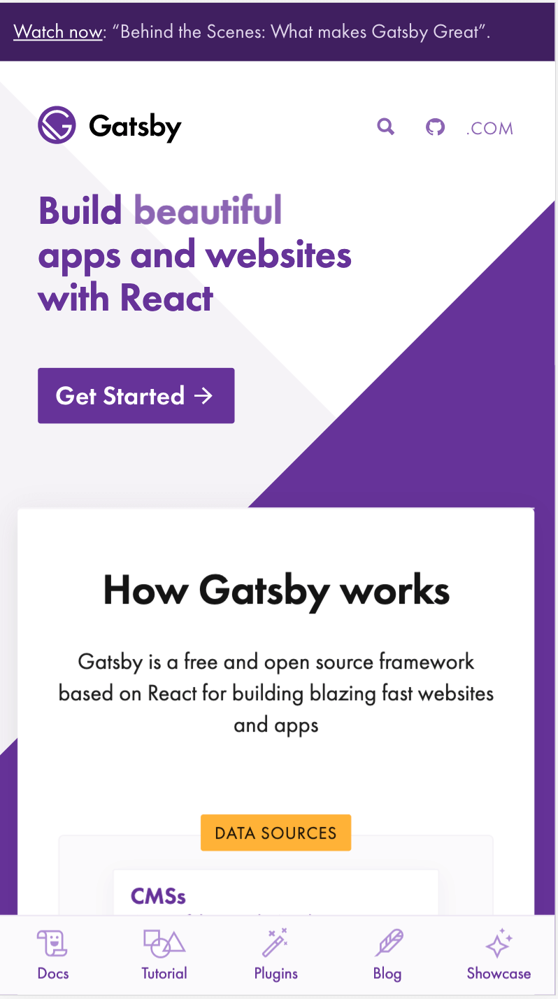
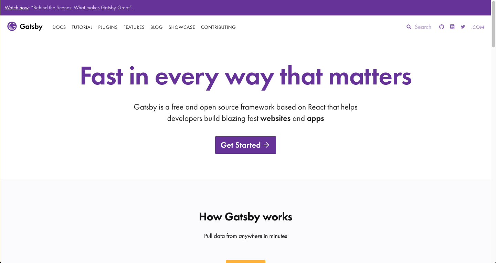

Our current [gatsbyjs.org](/) homepage is getting a bit long in the tooth -- our incredible designer @fk built it out a year and a half ago, but a lot has changed and we're getting ready to update it.

We sent out a [messaging survey](/blog/2019-03-05-dot-org-messaging-survey/) a few weeks ago to hear how the community was thinking about Gatsby. Based on the results of that survey, we put together some [lo-fi prototypes of the homepage](https://www.figma.com/proto/UH2Qb3IeF8Hvg6csIW3mcqFc/Gatsbyjs.org-mobile-homepage-prototype?node-id=22%3A329&viewport=-227%2C349%2C0.39312&scaling=scale-down).

After creating the prototypes, it was time to find people to test those prototypes, a process that's called usability testing.

## Stats on usability testers

We found some testers through [userinterviews.com](https://www.userinterviews.com/), and here are the important facts about them:

- 6 testers
- All of them know React
- 5 of them had never heard of Gatsby before

## Why did we do this usability test?

### We did another usability test in November with bummer results!

Back in November, we watched 8 people who had never heard of Gatsby before as they landed on the homepage and asked them “what is Gatsby” and “how do you decide if you want to use it?” The results were...not as accurate as we hoped!

Two problems became clear as a result:

- The first impression people have about Gatsby from above-the-fold and just below the fold on homepage is not accurate. Sources of more accurate understanding were the GitHub README file and the diagram on homepage
- We had not written down the following key facts about the .org site and therefore sometimes struggled to stay aligned in our answers to these questions:
  - Who is the audience for .org?
  - What are our value propositions for that audience?
  - What is the purpose of the homepage?
  - How do we know if we’re succeeding in that purpose?

It is important to the Gatsby community to solve these problems, because tons of new visitors come to the gatsbyjs.org homepage each month: 130,000 in January alone! We want to make sure we’re accurately representing Gatsby’s value and helping more developers experience that value by clicking the “get started” button.

## The goal of usability testing

The goal:

> How can we support first-time visitors so they experience Gatsby’s value powerfully and quickly?

Measuring that goal:

> How many people click on “Get started” and then stay on the site? Are our monthly active users increasing?

## How did we make the prototypes?

### Prototype workshop

We held a workshop that involved organizing a group of people. Each person had a role, and we planned the timing of the workshop down to the minute.

### Roles:

We gathered a couple engineers, a product manager, and a product designer and assigned a couple special roles:

1.  Timer: someone to use a timer to make sure people move through the activities below.
2.  Note taker: at the end, someone needs to take notes during the “final feedback” section.

### Review design requirements

We briefly reminded ourselves of what the current homepage looks like on mobile, and then reviewed the following information on the requirements for redesigning the homepage:

- Optimize for the purpose of the homepage: to help as many developers as possible use Gatsby
- How do we know if we’re succeeding in that purpose? Increase in number of clicks on Get Started button and monthly active users growing
- What should the homepage communicate about Gatsby? “Gatsby is a free, open-source, modern website framework based on React to create and deploy blazing fast websites or apps with ease.”
- Who is the audience? developers who build sites for clients, companies, and their own projects
- What are our value propositions for that audience? fast sites, performance out of the box, productive from the start

### Sketching

We did 3 rounds of the following pattern and saw that in round two, our sketches diverged and in round three, they converged:

- 4 minutes: Everyone draw (with pen/pencil & paper) what they think the mobile version of the .org homepage ought to look like.
- 1.5 minutes: Upload picture to this Slack channel: #p-dot-org-prototypes
- 1 minute each: The person who drew the sketch being talked about can explain it for 1 minute, focusing only on facts. No pitching your ideas or persuading people.

### Final feedback after sketching rounds (need a note taker to record this feedback):

- 2 minutes per person in which they share comments in these categories:
- Factual observations about this exercise.
- What I liked about these sketches and why.
- What I don’t like about these sketches and why.
- What I don’t understand.

## What did we conclude from the prototype workshop?

We coalesced around:
The homepage should be ordered by explaining the following:

- What is Gatsby?
- Why is it worth paying attention to?
- How do you use it?

We left the prototype workshop with a few concerns that could be validated through testing:

- Logos of companies could turn off developers because some consider logos to be cliche and therefore meaningless. Alternatively, the logos could provide social proof that world-class engineers use Gatsby. One possibility is to combine the logos with case studies so they aren’t in the classic “logos floating on white space” design that most startups use.
- We debated how to help developers know that Gatsby also has some upcoming commercial offerings. What do we call the commercial offerings so they make sense to first time visitors?

### Settled concerns:

"Install Gatsby" is a more specific call to action, so it is likely better than “Get Started”.

> Spoiler alert! The button label “Install Gatsby” did not work in the usability tests. Nearly everyone thought that when they clicked on it, they would be taken to their phone’s app store.

## What is the final lo-fi prototype?

Here is the [final lo-fi prototype](https://www.figma.com/proto/0rROnAzH4mFLYLEx9TDleN/For-Flo---Gatsbyjs.org-mobile-homepage-prototype?node-id=140%3A487&viewport=-1603%2C423%2C1&scaling=scale-down) that we’ll use to guide the next phase of visual design. Below, I list the reasons we’re moving forward with this prototype.

### What is Gatsby?

The definition was clear in the prototype and the testers could explain what Gatsby is after glancing at the prototype for only a few seconds. This was a success!

### Why use Gatsby?

We learned that Lighthouse scores weren’t as persuasive to testers as we anticipated because many people don’t know how the scores are calculated. Other ideas that could show Gatsby’s value more concretely might be case studies, sites in the site showcase, a diagram of how Gatsby works, code snippets, and more.

### What can I use Gatsby for?

This is a question that testers had and the prototype didn’t quite answer it, so we concluded that we will simply answer that question above the fold on the homepage and then include a button labelled “Learn more” that leads to a list of the kinds of sites people build with Gatsby and resources for people who want to build each kind of site.

### How do I use Gatsby?

The “Install Gatsby” button label did not work in the usability tests. Nearly everyone thought that when they clicked on it, they would be taken to their phone’s app store. For this reason, we are sticking with “Get started” as a button label (this worked in usability tests).

## What we've done with the research so far

We made two changes to fix the initial problems uncovered by usability testing. The "How it Works" diagram was moved up so some is visible above the fold, since that diagram was easier to quickly understand than the text that now is below the diagram. Also, the subheading under "How it Works" is changed to make it clear that Gatsby is open source and free, and make it clear that it's a tool for developers.

We moved the diagram above the card and changed explanatory text. [See the PR here](https://github.com/gatsbyjs/gatsby/pull/12236).

Then we refined those changes by modifying the headline and subheadline. [See the PR here](https://github.com/gatsbyjs/gatsby/pull/12298).

We are also working on getting [this RFC](https://github.com/gatsbyjs/rfcs/pull/32) merged to work more on the homepage. We hope you comment on it!

## How you can participate

1.  [Comment on the RFC](https://github.com/gatsbyjs/rfcs/pull/32) about redesigning the .org homepage
2.  [Want to test new & existing @gatsbyjs products and features such as new designs for the .org homepage? Sign up to receive a newsletter whenever there is an upcoming test](https://airtable.com/shrKDSF2E7ljCaYCd).
