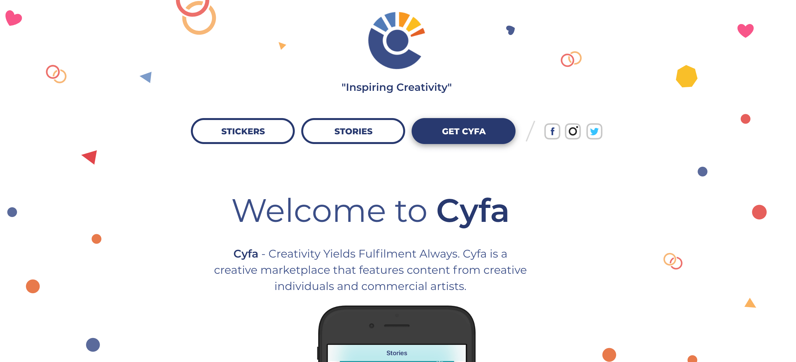

When [Design+Code](https://designcode.io/) needed to rebuild their website to focus on more robust content and meeting increased sales targets, they started with what they knew - React. As a teaching resource for building real, live apps they were already familiar with React. As experts in the courses they offer, they reached for Gatsby. This combination would provide the leading-edge experience they gained by designing with Gatsby, while customer experience was elevated from visit to sales.

Design+Code started in 2015 when Meng To began with a digital book on designing iOS apps and Sketch. With Swift, Design+Code taught how to build the real iOS app from the app itself. This would serve as the foundation for future Design+Code courses – teaching how to build real, live apps, but in a compelling and design-focused way. The Design+Code React course has become their most popular course by far, and teaches how to build a production website (designcode.io) for designers and beginners. It goes from basic React concepts all the way to adding content with Contentful, to deployment and accepting payments. There have been some beautiful sites from students who've taken the course (such as [Cyfa](https://cyfa.io/)).

#### Example of a student-built website, Cyfa

[Thomas Wang](https://twitter.com/thomaswangio "Twitter"), UI Developer at Design+Code, shared some of the important details of the rebuild, as well as the benefits their Gatsby-fueled site has provided their new offerings.

<Pullquote citation="Thomas Wang">
  We needed a new CMS to handle the amount of content we were creating and a
  more full website, transitioning from a digital book to an online learning
  platform. We also wanted to begin using more modern tooling and frameworks so
  that we could teach them in the future
</Pullquote>

### **Learn from Doing**

The Design+Code team chose Gatsby for its out-of-the-box support for page routing and its compatibility with GraphQL. Thomas also acknowledges they were well aware of Gatsby’s emerging popularity in the React ecosystem. Gatsby’s signature simplicity of starting up a new website with its variety of starter templates ticked off even more extras they were looking for.

AND, not to be overlooked, they wanted to be on the leading-side of offering Gatsby-build training.

<Pullquote citation="Thomas Wang">
  Our philosophy is to always be able to teach what we create, so having an
  easy-to-understand framework (like Gatsby) to work with was perfect for us to
  be able to teach designers and beginners.
</Pullquote>

### **Moving to a Subscription Model**

The team was looking to transition the site from focusing on downloadable, digital book content to a full, subscription-based learning platform. The volume of new courses being provided required a system that would support their anticipated content growth as well as drive the business side of subscriptions.

They achieved both with the new Gatsby-powered site and a Stripe subscription system.

### **Fired Up SEO!**

The launch was a success and landed [Design+Code at #1 on Product Hunt](https://www.producthunt.com/posts/design-code-3) the first day of the launch and #2 for the entire week.

Gatsby ignited their Search Engine Optimization (SEO) with Lighthouse scores of SEO at 100, Best Practices at 93, and Performance at 97 out of 100. The site is far out-performing its predecessor and has become the content-driven, sales machine that was anticipated.

Try out [Gatsby](/) to see how it can do the same for you.
