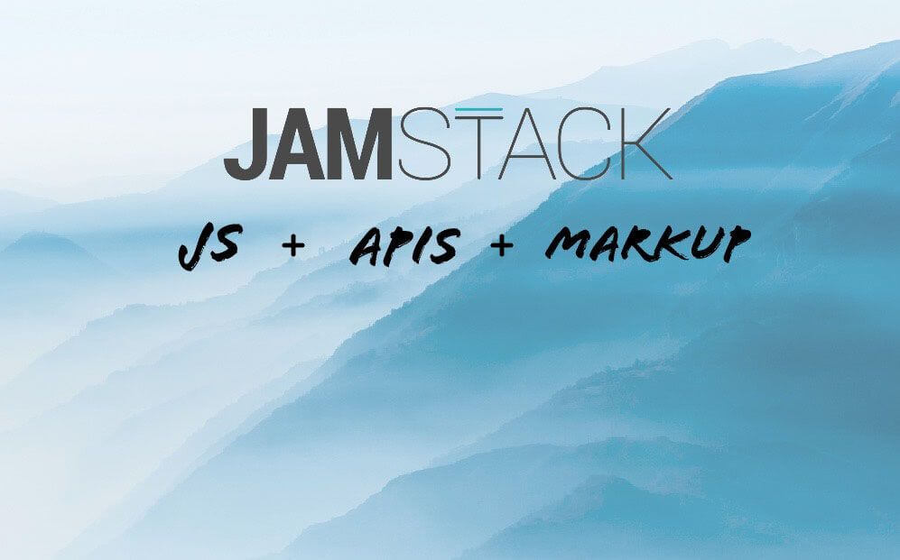
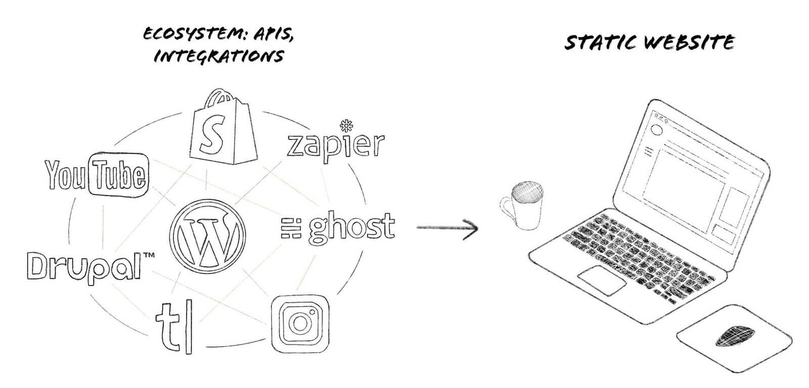
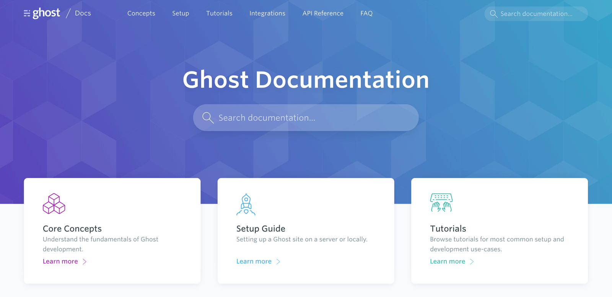
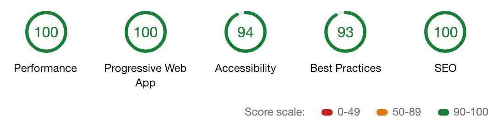
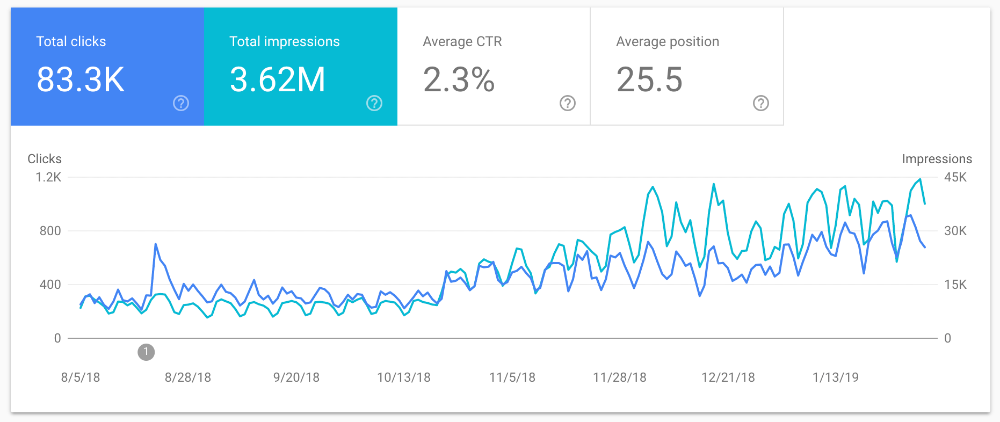
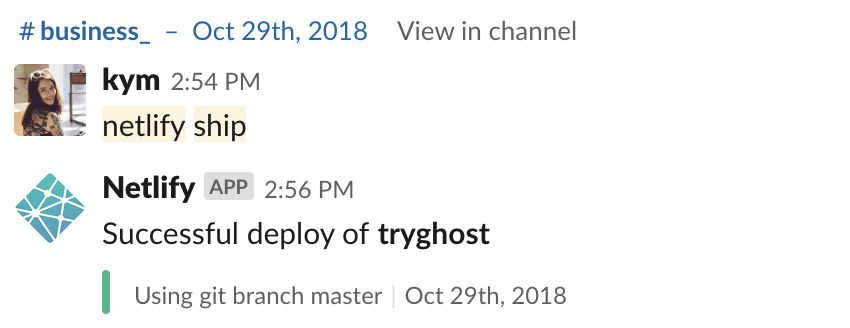

There's an emerging trend in modern web development called the JAMstack. It's largely being discussed in developer circles, but I was lucky enough to work on a site relaunch project as a marketer where I got to see the JAMstack in action.

It got me excited about the future because I've been in marketing for the best part of a decade and I've never witnessed a site that I've worked on go from zero to hero so quickly. There's often a disjoint in the decision making process when companies with resources (i.e. some money, developers and a marketing team) decide to launch or relaunch a marketing website. So in this post I'm going to summarise:

- What the JAMstack is and what it means for tech-savvy marketers
- An example of a JAMstack site that I worked on
- The pros and cons from a marketing perspective

## What is the JAMstack?

JAM stands for **J**avaScript, **A**PIs, and **M**arkup. If you're interested in learning more about the technical details you can [check out JAMStack.org](https://jamstack.org/), watch ["The Rise of the JAMStack" on Youtube](https://www.youtube.com/watch?v=uWTMEDEPw8c) and [read about the history of JAMstack](https://snipcart.com/blog/jamstack).

In terms of what this means to you as a marketer – it's essentially a modern way to build a website that is static instead of dynamic. This provides you with some very important business benefits: speed, security, stability and scalability. I didn't intend for them all to begin with the letter S, but here we are!

Put simply, a JAMstack website has an unlimited ecosystem of all of the tools and services you need in the background, but the actual site itself on the front-end is just HTML.

Building your marketing site on the JAMstack is an efficient and reliable way to combine all of your content and channels and serve it up as a lightning-fast website that your visitors will love. If you need to add ecommerce, paywalls, a podcast or some other content to your site in the future, your team won't have to figure out how to get everything to play ball with your CMS or build a new site from scratch. Instead they'll be able to connect new APIs or services to your existing site.

**The past vs the future**
Using a traditional CMS is more restrictive and opinionated than this. You're constrained to the platform you choose from the get-go and forced to accept additional "features" that you might not even need. While these platforms have provided us with an excellent way to publish websites in the past, it's changing for the future.

<Pullquote>
Thanks to progression with modern browsers, static site generators, APIs and content delivery networks, websites can be built as modular stacks that aren't tied to specific technologies.
</Pullquote>

**Going back to the benefits:** better performance, higher security, cheaper to scale & a better experience. These aren't just developer benefits, they apply directly to the marketing team too. Better performance means better site engagement and improved SEO. Higher security means less chance of not hitting your stretch goal next June because the site got hacked. Cheaper to scale means there will be less roadblocks in your way when you want to add that Shopify store or when a big campaign sends 1M visitors to the site. Better experience — who wouldn't want that?

**The rise of static sites**
Static site generators like Gatsby play a huge part in making all of this possible, and there are lots of [exciting new tools](https://www.staticgen.com/) appearing that support the future of publishing on the JAMstack. Static site generators work by pulling content from APIs and running a build task in the background to generate your site. So when your visitors arrive, they’re met with blazing-fast load times, and your security and SEO is taken care of.

## Enter the headless CMS

So you might be thinking if there's no traditional CMS and your site is pure HTML, that means you have to work on all of your content and SEO directly in code. While this is one way to do it, there is a better way for marketing teams.

Since we're building websites that are modular, it's still possible to use any CMS that has a robust API to send content to your site. Instead of storing all of your content in GitHub, you can pull it right out of a CMS of your choosing and use a static site generator to build a speedy, optimised website.

The great thing about this approach is that your developers can bring their preferred stack, while the marketing team benefit from a familiar environment to handle things like content management and SEO. Everyone wins!

## An argument for moving away from plugins

Building a marketing website with well-known platforms that offer plugins, add-ons and other easy wins for marketers seems like a great idea. Sometimes it is a great idea. But too many times have I seen it quickly escalate into a difficult scenario where site performance is seriously lagging and the only real solution is to start over and build something that is suited to your needs, without all of the extra bloat.

Hacked up themes, page builders and plugins for all of the things can wreak havoc with site performance if you have a dynamic site powered by a traditional CMS. This has a knock-on effect on the user experience, SEO and overall effectiveness of your website.

Site performance and site speed is an increasingly important ranking factor. Not only that, all of the top ranking factors these days are related to on-site engagement, which also suffers if you haven't got a site that performs.

**"But WordPress is good for SEO".** OK let's unpack that. In order to get custom meta data, structured data, canonicals, XML sitemaps or AMP you're going to need a series of plugins and possibly some ongoing manual work depending on your requirements. Is this really good enough in 2019? Are we as marketers being lazy and relying on systems which make our jobs easier, but which impede our results?

Using plugins to assist the speed at which you can launch marketing campaigns makes sense. But if the end result is hindered by poor performance and reduced page engagement – does it still make sense?

Ditching the concept of the plugin and opting for a JAMstack site which is "just HTML" doesn't actually mean you have to give up functionality, or suddenly need to know how to code like a front-end developer to manage a site and its content. You can still achieve the same results with an ecosystem of tools and services that are tailored specifically for you. Yes it takes some development up-front (let's be real, so does any website) - but the payoff is huge!

## Example: Ghost Docs site performance

The site launch that I worked on was for [Ghost Docs](https://docs.ghost.org/). Previously the documentation for Ghost was spread out over several domains, making it difficult to navigate. When it comes to SEO, the docs.ghost.org subdomain had a lot of issues with versioned duplicate content and hundreds of URLs were being excluded:

The project to rebuild this site from the ground up gave us an opportunity to completely turn this around. The smart people that I am fortunate enough to work with decided to use it as an opportunity to put [Ghost on the JAMstack](https://blog.ghost.org/jamstack/). There was also a complete design overhaul, while I worked on restructuring and rewriting lots of the content and improving the meta data across the whole site.

The end result scores incredibly positive site performance reports:

Since the SEO health of the site was so bad before, it took a few days for Google to care and start re-indexing. I checked and double checked we had all of the redirects in place and assumed we were in for a long wait, but then suddenly things turned around within a week.

In the first month after we launched, impressions in Google were up 44% and clicks were up 12%. By month two, impressions were up 73% and clicks 43%. Beyond this things started to stabilise a little on a MoM basis, but overall things are trending upward, with plenty of new search terms appearing in search console every week.

<figure>
  
  <figcaption>
    Month 3 and 4 compared to the first two months after launching the new Docs site
  </figcaption>
</figure>

<figure>
  
  <figcaption>
    Growth over the past 6 months
  </figcaption>
</figure>

As always, there is still work to do to ensure the site ranks well for the most relevant terms, but right now the work put in upfront to improve the site is paying off handsomely. From a marketers perspective it was really exciting - I've never migrated a site with such instant success before.

**Here's the stack we're using:**

- [Ghost](https://ghost.org/) delivering content via the API
- A front-end built in React with [Gatsby](https://gatsbyjs.org/) (our static site generator of choice)
- Deployed with [Netlifly](https://netlify.com/) (really nifty content delivery network)
- [Algolia](https://algolia.com/) powering the search functionality
- [Zapier](https://zapier.com/) to automate community feedback into Slack for content improvements

We have also built and contributed an [advanced sitemap plugin](/packages/gatsby-plugin-advanced-sitemap/?=sitemap) which automatically builds a sitemap for any Gatsby project.

Much of the SEO functionality is being pulled directly from Ghost via the API (which has all of the structured data, custom meta data, canonicals etc built-in). This means I can manage most of the content and meta data directly in the Ghost admin client. When I save new changes they're pushed into the static front-end via Netlify – it's a fantastic workflow!

I did also have to work directly with the codebase as some of the content lives in GitHub, which is a decision we made when building the site. I've been writing and deploying marketing content in code since I joined the team and I'm a better technical marketer for it.

## Pros & cons of working with the JAMstack for marketers

My experience of working with the JAMstack was thoroughly enjoyable. Several weeks of work went into the site, and although I wasn't responsible for any of the build, I was able to work closely with the team who was. It was fascinating to see it come together and learn more about how the components of a modern static site actually work.

I've already covered some of the benefits of opting to use JAMstack instead of a traditional CMS/dynamic site – but what about the pros and cons of working with this technology as a marketing professional?

**Overall benefits:**

- Improved technical knowledge and skills - including shipping content and working with code every day during the build. End result = easier to manage, improve and optimise the site content after it launched.
- Became well versed in how the site is structured, resulting in greater understanding and communication between teams (dev + design + marketing).
- The development cycle and the content were being worked on simultaneously and you could see the iterative improvements being made instantly. No long dev cycles followed by a mad dash to get all of the marketing content in at the last minute.

**The "downsides":**

- Even if using a headless CMS, there may still be parts of the site that exist entirely in code. So you'll need to get comfortable with editing content and meta data in more than one place.
- Shipping new marketing material might take a little longer compared to relying on well known methods (depends on your stack and your team, though).
- New tech means you might stumble upon some exciting new bugs or issues that can take a while to resolve.

To be frank, all of these downsides are things that are worth enduring to get a better end result. Being more involved in the technical side didn't slow me down once I'd got my foundational knowledge nailed, and spending a little more time upfront to have a beautiful, blazing-fast site is time well spent. The results speak for themselves.

**Tips for a successful JAMstack launch**
Since you're going to be working so closely with developers, it would be a good idea to sit down from the outset and plan out how things are going to work. Your developers are going to need to know exactly what functionality you need so that it can be built into the site. If you're using a headless CMS, you'll need to be clear about what data and content you expect to be pulled out of the CMS and into your static site.

You will likely require integrations with your favourite tools and services and tracking for analytics. Depending on what stack you decide to use, the answer to how this will be connected together might be different. So it's important to iron out these expectations from the start so nothing gets missed.

## Conclusion

As digital marketing professionals, we should be sticking our heads above the water from time to time. I've been in marketing for the best part of a decade and I've witnessed my fair share of communication disjoint between teams. This is increasingly difficult as the marketing stack becomes more complex, and when things like site performance are more critical than ever.

There's a lot to be learnt from spending more time with developers and being bold enough to try emerging technology that directly impacts the role of a digital marketer. If a company is going to ask their engineers and their marketers to work on a website, then the approach needs to be something that works for both teams. If I was tasked with relaunching any well-established marketing website in 2019 – I'd go with the JAMstack and a headless CMS to keep things sane!
