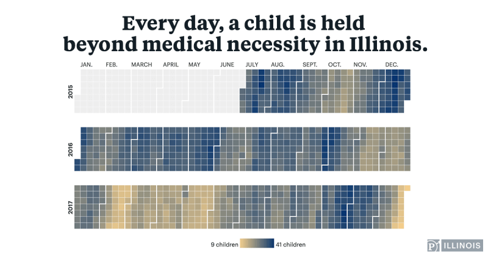
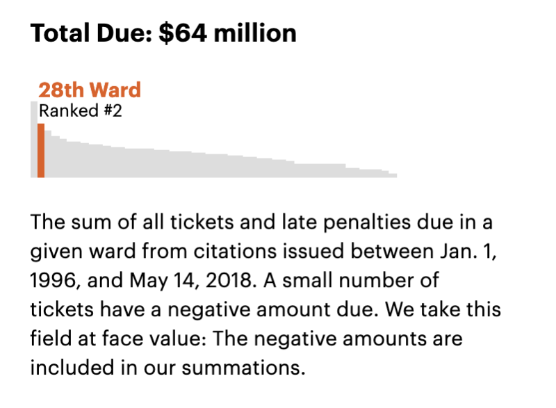
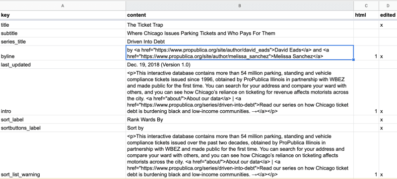
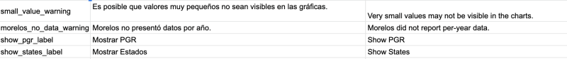

I recently sat down with David Eads, who recently wrote a [fascinating deep dive](https://www.propublica.org/nerds/the-ticket-trap-news-app-front-to-back-david-eads-propublica-illinois) about how he used Gatsby for ProPublica's Ticket Trap data visualization. David and I talked about what he's used Gatsby for and why.

### David's work with Gatsby

**Sam:** You've used Gatsby extensively to create a number of data visualization projects that are really interesting from both a technical and a journalistic perspective. Could you talk a little about what you've built with Gatsby and what you're most proud of.

**David:** Everything I've made since 2018 has been in Gatsby. https://projects.propublica.org/graphics/il/stuck-kids/ is one example, https://projects.propublica.org/chicago-tickets/ is another. I've also done embedded graphics with Gatsby, like the one seen here https://features.propublica.org/the-bad-bet/how-illinois-bet-on-video-gambling-and-lost/

<Pullquote citation="ProPublica">
  Every day, a child is held beyond medical necessity in Illinois. They've been
  cleared to leave, but there's no where for them to go. Explore the cases of
  Illinois youths stuck in psychiatric hospitals because of failures within the
  state'a Department of Children and Family Services.
</Pullquote>

<Pullquote citation="ProPublica">
  The Ticket Trap: Where Chicago Issues Parking Tickets and Who Pays... The city
  of Chicago has generated billions of dollars in revenue from parking tickets
  while sending low-income and black communities into debt. Search our
  interactive database of 54 million tickets issued since 1996 — and learn how
  your ward stacks up.
</Pullquote>

<Pullquote citation="ProPublica">
  Illinois Bet on Video Gambling — and Lost Legalizing video poker and slots was
  supposed to generate billions of dollars for the state. A decade later, that
  hasn’t happened. Now, legislators want to double down on gambling.
</Pullquote>

We've used it to simply embed responsive content in stories but also to build full-blown news applications.

### Using Gatsby in a news organization

**Sam:** Can you talk a bit about the benefit of using Gatsby specifically in a news organization?

**David:** The benefits that I've found are:

1. the general maintainability of static apps (which can be built with all kinds of tools and are critical to sustainable newsroom infrastructure),

2. the consolidated query system, which is very important for journalistic work where data can come from many sources such as Google Sheets used to keep track of small bits of text or translations, massive databases, CSV files, and practically anything else you can think of, and

3. the speed of the built sites. Getting content onto people's screens is of utmost importance in journalism, and Gatsby does a good job with that.

The dependence on React has been a barrier to wider adoption within ProPublica -- rightfully, not everyone wants to be tied to React. But ProPublica Illinois has seen a lot of benefit from it.

### Creating beautiful data visualizations

**Sam:** What visualization tools have you found helpful or useful? The graphics you've made are interactive and really just gorgeous.

**David:** For The Ticket Trap, nothing! Most of the visualization is simple HTML and responsive images that are pre-generated and then processed by Gatsby's very slick image processing system. For the Bad Bet, I relied extensively on Mapbox and Deck.gl. For other charting projects, I've used Recharts, a nice React-D3 system.

After reading a blog post by Tom MacWright, I realized that a lot of the stuff I was doing with heavy D3 code could be accomplished more directly using React; that technique shows up in Stuck Kids.

https://macwright.org/2016/10/11/d3-and-react.html
macwright.org

Mixing d3 and React. Use JSX instead of the d3 selection API and keep everything else.

This is pure HTML and CSS -- no extra libraries.

### Why maintainability is important, and how Gatsby helps

**Sam:** Could you dive deeper into the challenges of maintainability in a newsroom environment?

**David:** Maintenance debt in newsrooms is a big issue. Most editorial products aren't like software products where a company is devoted to maintaining them for years because it's the core of their business. Sometimes that happens, but more often you need to publish and then move on to something else. If you're running dynamic services, a project from many years ago can quickly cause all kinds of work and trouble today.

With static building, hosting is significantly less expensive over both the short and long term, and many of the maintenance issues go away or are fairly easily solved (e.g. when you have to go back and update analytics on an old project). Static building also means failure is often less-than-catastrophic.

When I was at NPR, our election coverage involved baking out results files that were then displayed by a static client. If the backend went down, the audience wouldn't see results as quickly as they might otherwise, but they didn't get an ugly 404 or 500 error.

Finally, you never know when something is going to go viral. It's nice to not worry about servers melting down when you get 300k concurrents as we did during election season at NPR.

That variability is a real resource allocation problem with dynamic systems, and trivial with static systems and microservices.

**Sam:** So publish it, then forget about it.

### Building with Gatsby's plugin system

**Sam:** What's been your experience with Gatsby's source plugin system? You mentioned that you've built on top of Google spreadsheets, databases, and so on.

**David:** Having a consistent query interface via Gatsby's source plugin system has been a bigger benefit than I expected it to be. I can query YAML, Google Sheets, huge datasets in Postgres all in the same place and with the same language. I don't always love GraphQL, but I do love the consistency of being able to think about all the different data inputs in precisely the same way.

For The Ticket Trap, my collaborators and I wrote all the text that goes into the app in a Google Sheet which we could then pass off to editors to edit, and then pull into the app itself.

### Using Gatsby + Google Sheets as a content workflow

**Sam:** What impact has Gatsby had in terms of data workflow collaborating with reporters?

**David:** In terms of reporter workflow, it's nice for me not to have to "reflow" text from a Word or Google Doc, but it can be a compromise because that is sometimes easier for others. We just try to strike a balance.

We use Google Sheets as a key-value store for little bits of interface text. This is also useful for translation.

For translation, pulling from Google Sheets is really powerful.

**Sam:** Ooh, that's some really slick i18n (internationalization).

**David:** This workflow isn't perfect, but it's better than the alternatives I've found. I am, however, excited to think about replacing parts of this with a full-blown headless CMS.

**Sam:** My take is actually slightly different -- I think one really cool thing about what you're doing is that you've basically turned Google Sheets into a CMS.

**David:** I used that technique quite extensively at NPR. ProPublica uses the same techniques as well as ArchieML in Google Docs, which is helpful for longer pieces of text and more complex data structures.

http://archieml.org/
ArchieML.org

Archie Markup Language (ArchieML). ArchieML is a text format optimized for human writability, with a syntax designed to be as simple as possible.

I hope to write a source plugin for Gatsby that pulls in ArchieML as structured data.

**Sam:** Neat! Spreadsheets are an incredibly powerful tool for entering and storing data -- they need basically no onboarding, which is in contrast to every other system out there.

In creating an effective content authoring and publishing workflow, a recipe I've seen succeed in a lot of different domains is to:

(1) find the best tool or format for authoring, and then
(2) write a Gatsby source plugin for that (if it doesn't already exist)

### Why web performance matters for publications

**Sam:**: So we've talked about maintenance and scalability, as well a content authoring workflows. Let's talk a bit about performance -- what's the benefit of performance in a journalistic context? Do you track it?

**David:** It varies from publication to publication, but everybody tracks it and cares about it. There's a lot of content out there vying for people's attention, so you really need to convince people to go deeper with your story and very quickly. Some folks will always bounce because the content isn't for them, but you want to give yourself the best opportunity to engage.

The faster you can deliver pixels to screen, the more people are going to see your work and the better your chances you'll have whatever impact you're hoping for.

The quicker you can load your content and grab folks' attention, the more likely a person is to finish your story, sign up for a newsletter, subscribe or donate.

**Sam:** Any last words or thoughts?

**David:** Nope. Thank you!

**Sam:** Thank you! Glad you could take the time.
