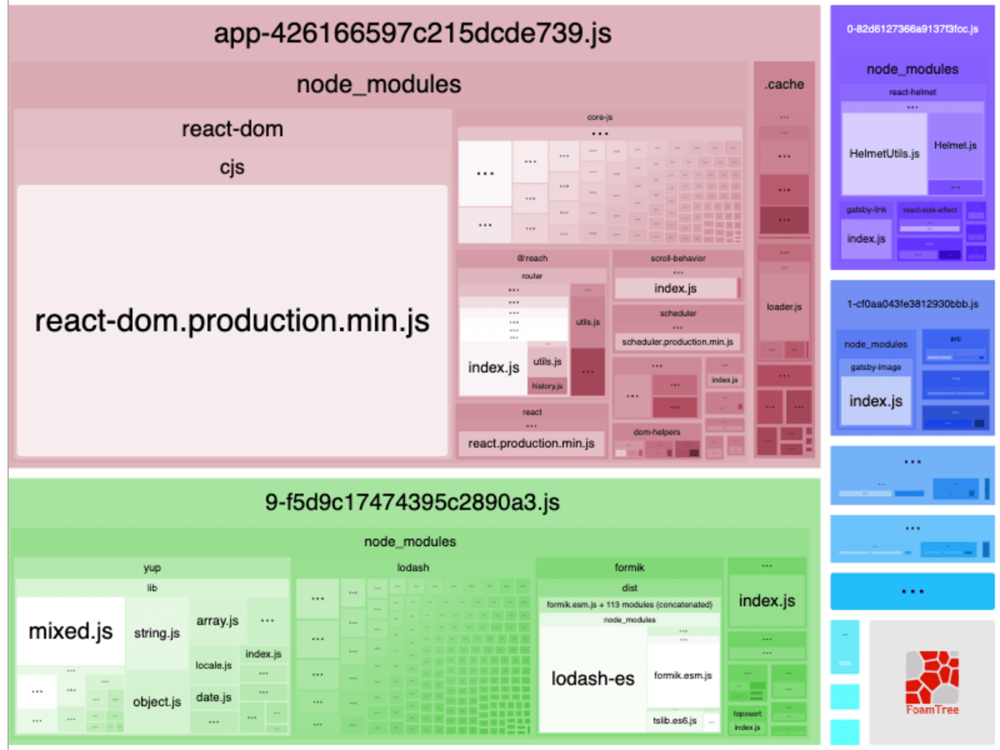
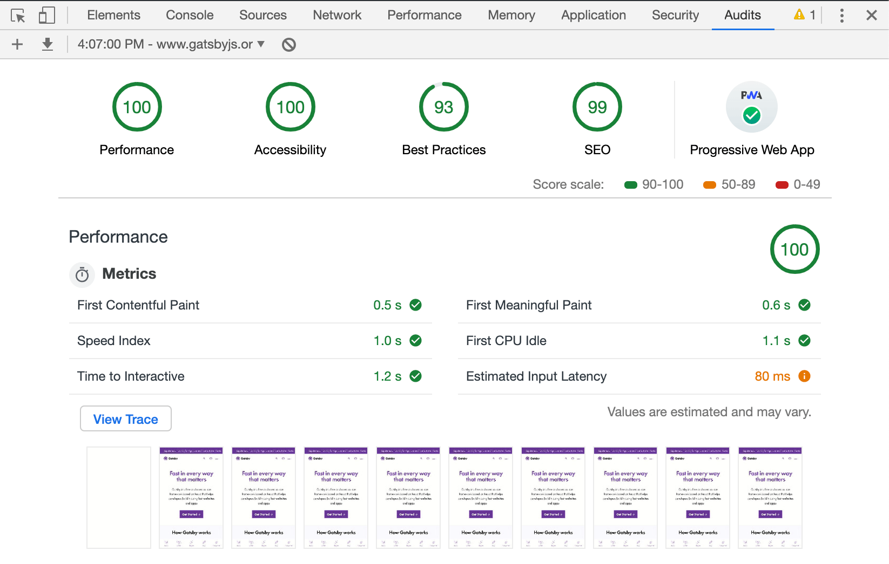
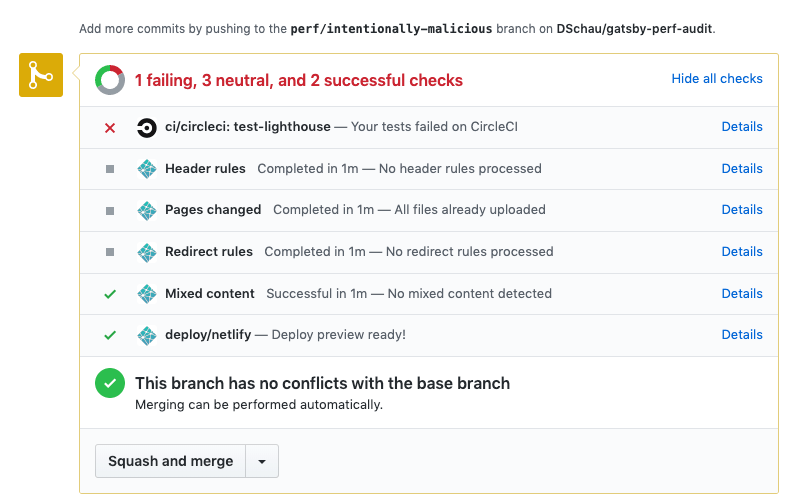

Gatsby is **great** from a multititude of perspectives. Our community is **great**. The developer experience is **great**. The performance of the resulting application is **great**. Our documentation is **great**. And so on and so forth... if I were to focus on _each_ of these areas, this post would become an overly long love letter that I'm not sure many would want to read.

As such--this post focuses on just a single element of what makes Gatsby great: performance. To prime the discussion, let's consider [this post on the `webdev` subreddit on Reddit](https://www.reddit.com/r/webdev/comments/9z5dsr/how_does_reactjs_have_such_a_fast_website/?st=jtqbllhm&sh=60148ea7).

<Pullquote citation="reddit/r/webdev">
  Genuine question, every page is loaded immediately [sic] on click. Seriously
  never seen such a quick website before. Any insight as to how they're able to
  achieve this?
</Pullquote>

Fun fact--that website in question is [reactjs.org](https://reactjs.org) which, as you may or may not know, is an application built with and powered by Gatsby 💪

In an effort to answer this initial question, this post outlines several foundational techniques that Gatsby enables _by default_ to deliver this experience. Specifically:

1. Server-side rendering (SSR) at **build time**
1. Route-based code splitting
1. Modern APIs

Finally, this post concludes with tangible, practical advice for measuring and asserting conclusively that your app is _actually_ ludicriously fast.

Let's dive deep.

## Server-side rendering (SSR) at **build time**

The mental model many hold for Gatsby is that of the static-site generator. This is accurate (with a caveat that it's excellent for [web applications, too](/blog/2018-11-07-gatsby-for-apps/)). Gatsby _excels_ at producing optimized static content (HTML, CSS, JavaScript, images, etc.) that can be deployed _anywhere_ for pennies. Gatsby produces optimized static content by invoking server-side APIs at **build time**. But, but... you say--"Gatsby is _just_ a static site generator, it's not server-side rendered!" Let's put down the pitchforks--let me explain!

Server-side rendering at build time merely means that we invoke the same server-side APIs invoked by a traditional server-side rendered application. We render a React component to optimized, pre-rendered HTML. If we first consider a React component, e.g.

```jsx:title=src/pages/index.js
import React from "react"

import { Layout } from "../components/layout"

export default function IndexPage() {
  return (
    <Layout>
      <h1>Hello World</h1>
    </Layout>
  )
}
```

this _page_ will be rendered and optimized by Gatsby's approach of invoking server-side APIs at **build time**. That process looks a little bit like:

```jsx
const path = require(`path`)
const fs = require(`fs`)
const React = require(`react`)
const { renderToStaticMarkup } = require(`react-dom/server`)

const Html = require(`../html`) // the HTML template

module.exports = function renderPage(template, pagePath, props) {
  const htmlContent = renderToStaticMarkup(
    <Html>{React.createElement(require(path.resolve(template)), props)}</Html>
  )

  fs.writeFileSync(path.join(`public`, pagePath), htmlContent, `utf8`)
}
```

_Note: want to see the actual code? [Check it](https://github.com/gatsbyjs/gatsby/blob/master/packages/gatsby/cache-dir/static-entry.js)_

This produces optimized, pre-rendered HTML for _every_ page in your application. It ends up looking something like this:

```html:title=public/index.html
<div id="___gatsby">
  <main>
    <h1>Hello World</h1>
  </main>
</div>
```

Your React components are traced, rendered, and static HTML is produced via server-side APIs. Great. Why?

### Why server-side render?

First: let's consider the scenario in which we are not server-side rendering, e.g. a traditional React application produced by something like [create-react-app](https://github.com/facebook/create-react-app). This application once deployed **requires** JavaScript to parse, render, and eventually produce HTML to the [DOM](https://developer.mozilla.org/en-US/docs/Web/API/Document_Object_Model). This _eventuality_ means that your users are waiting for JavaScript to be parsed and evaluated before your application is usable. It also--of course--_requires_ JavaScript.

Short circuiting this process and turning this _eventuality_ into a certainty is the key win of server-side rendering. This process produces static HTML that does not require JavaScript to run. Your application will load much more quickly and will be interactive more quickly. You will improve [Search Engine Optimization](https://developer.mozilla.org/en-US/docs/Glossary/SEO) because search engines can more quickly, reliably, and accurately parse your content and `meta` tags.

Your user's time isn't wasted to _eventually_ render your application. We render your application at _build time_ (as much as possible!) to maximize performance and deliver the ⚡ fast experience your users expect. Why force the work and time on your user when we can short-circuit this process and render the application _for them_ at build time?

This is the central idea of server-side rendering. Gatsby uses server-side APIs to render your application at **build time** so your users get a usable application much more quickly, even when JavaScript is disabled. Nifty. You're probably jumping ahead of me at this point. Why perform this process at build-time--this is what Gatsby does--when we could perform this work at _request_ time with traditional server-side rendering approaches?

### Zero Node.js servers required ✋

https://twitter.com/jlengstorf/status/1090659696233463808

To begin describing why build-time SSR is so appealing, let's first take a look at what a deploy and release looks like if we don't require a server. What's required for a typical set-up for deploying static content (which Gatsby produces)? It looks something like:

- Creating a [Content Delivery Network](https://developer.mozilla.org/en-US/docs/Glossary/CDN) to route your content _as close as possible_ to where your users are requesting it
  - This is often called "on the edge" and Gatsby can and should be deployed on the edge--[it reduces latency and improves page-load times](https://www.cloudflare.com/learning/cdn/glossary/edge-server/)
- Creating a bucket/location to host static content (like S3, Google Cloud Storage, etc.)
- Setting up a [Domain Name System (DNS)](https://developer.mozilla.org/en-US/docs/Learn/Common_questions/What_is_a_domain_name) to make your content reachable via a pretty URL, e.g. gatsbyjs.org
- Routing the CDN layer in front of your static content
- Set up a Continuous Integration (CI) environment so we can build and deploy code to production with minimal impact to end users

... and, that's it! We're done as far as setup goes! We can use _whatever_ stack you prefer here. Netlify? [You bet.](https://www.gatsbyjs.org/docs/deploying-to-netlify) More a fan of AWS? [Of course.](https://www.gatsbyjs.org/docs/deploying-to-aws-amplify/) Heroku? [Yup.](https://www.gatsbyjs.org/docs/deploying-to-heroku/) You get the idea. Gatsby can be deployed anywhere easily and cheaply.

We now have an infrastructure setup so that we _can_ release our web application. What's a release look like?

```shell
gatsby build
```

and then copying the result of `gatsby build` (the `public` folder) to your static content host of choice.

That's it. What if your site goes viral and receives hundreds of thousands of requests? You get charged in **terrabytes** of data with most CDNs, and that cost is quite literally [pennies](https://aws.amazon.com/cloudfront/pricing/). Deploying a new version of your app? Fire off a deploy and your users will have the new version available the instant the build process completes.

Let's contrast this approach with setting up and deploying a purely server-side rendered application.

#### Deploying a server-side rendered application

First: perform the **same** steps in setting up a static content host. Oh and we're not done yet, sweet, sweet summer child.


Next:

- Set up and provision several [virtual machines (VM)](https://en.wikipedia.org/wiki/Virtual_machine) to run instance(s) of our server-side app
  - Traditional examples are something like [EC2](https://aws.amazon.com/ec2/)
- Configure the VM to be able to run Node.js code
  - Consider using [Docker](https://www.docker.com/) to ensure you have a consistent Node.js environment
- Set up auto-scaling to ensure we can accommodate and fall-over based upon heavy load or error states
  - Consider using [Kubernetes](https://kubernetes.io/), [Rancher](https://rancher.com/), etc.

Does this sound like something that sparks joy? ✨Oh--let's talk about the deploy process, too.

Releasing a one-line fix to our SSR application requires deploying an entirely new version of our application. This means spinning down existing versions of our service, spinning up new versions of our service, and handling and remediating any errors that may arise.

The benefits of _both_ approaches are the same. Improved performance (which has other, important related benefits) by short-circuiting the process of _eventually_ producing HTML by directly producing HTML. However--deploying and hosting static content is objectively **easier**, **cheaper**, and **more reliable** than deploying a server for rendering applications.

Let's continue.

## Route-based code splitting

Gatsby--like other tools--uses the filesystem as a convention for mapping to routes for instance, given the following directory structure:

_also note we expose a [programatic API](/docs/node-apis/#createPages) for dynamic route creation_

```
├── src/
  ├── pages/
    └── about.js
    └── contact.js
    └── index.js
```

The _routes_ (e.g. the URL the user enters or navigates to in the website) `/about`, `/contact`, and `/` will be available in the resulting application. Let's take a look at one of these routes.

```jsx:title=src/pages/contact.js
import React from "react"
import { Formik } from "formik"
import * as yup from "yup"

import { Layout } from "../components/layout"

const handleSubmit = values => {
  // submit the form
}

export default function Contact() {
  return (
    <Layout>
      <Formik
        initialValues={{ email: ``, name: ``, message: `` }}
        onSubmit={handleSubmit}
        validationSchema={yup.object().shape({
          email: yup
            .string()
            .email()
            .required(),
          name: yup.string().required(),
          message: yup.string().required(),
        })}
      >
        {props => (
          <form onSubmit={props.onSubmit}>{/* the rendered form */}</form>
        )}
      </Formik>
    </Layout>
  )
}
```

Pretty vanilla looking component! We are rendering a `form` with some validation and functionality provided by the excellent libraries [`yup`](https://www.npmjs.com/package/yup) and [`Formik`](https://github.com/jaredpalmer/formik). The likelihood that these libraries are used in _all_ routes in our application is unlikely--yet this is traditionally the approach that many take with bundling their client-side JS libraries. This means that even if a particular route (e.g. `/about`) is _not using_ certain libraries that they will still likely be included in a monolithic JavaScript bundle containing all dependencies. However--Gatsby, your friendly _web app compiler_, is a little smarter!

We use code-splitting (enabled via our internalized dependency [Webpack](https://webpack.js.org)), and in particular, our approach prioritizes app-level dependencies (libraries used by the majority or all routes) coupled with route-based code splitting for dependencies that are likely only used on a particular route. To more fully understand this, let's take a look at a sample structure produced by our build process: `gatsby build`.

```title=public/
├── 404
│   └── index.html
├── 9-f5d9c17474395c2890a3.js # highlight-line
├── about
│   └── index.html
├── app-2abedacd9bf03aaca373.js # highlight-line
├── component---src-pages-404-js-295c3d4f21322761edff.js
├── component---src-pages-about-js-3997b0d76203b183f5b3.js
├── component---src-pages-contact-js-34c976efa1482a119a50.js
├── component---src-pages-index-js-764f0d722c982d3d2789.js
├── contact
│   └── index.html # highlight-line
└── index.html
```

Let's take a deeper look at some of those JavaScript files.

### `app.{unique-hash}.js`

`app-2abedacd9bf03aaca373.js` in the above example is our commons bundle. It contains the shared dependencies for all routes. This can be cached between routes, so that JavaScript libraries like:

- `react`
- `react-dom`
- `@reach/router`
- `react-helmet`

are bundled on _every_ route because they are used on _every_ route.

### `{0-9}-{unique-hash}.js`

`9-f5d9c17474395c2890a3.js` in the above example is our route-based code splitting, in action. This will contain the separate dependencies that are required by our `/contact` route, specifically `Formik`, `yup`, etc. based on the previous example. This means that each route is only downloading the necessary JavaScript to make the page functional. No more and no less.

Consider the output of [`webpack-bundle-analyzer`](https://github.com/webpack-contrib/webpack-bundle-analyzer), which makes this even clearer.



### `component---{route-name}-{unique-hash}.js`

`component---src-pages-contact-js-34c976efa1482a119a50.js` contains metadata that defines the necessary resources for a specific route. We'll come back to this--promise!

To tie it all together, the build process produces a `contact/index.html` file containing something like:

```html
<!DOCTYPE html>
<html lang="en">
  <head>
    <meta charset="utf-8" />
    <meta http-equiv="x-ua-compatible" content="ie=edge" />
    <meta
      name="viewport"
      content="width=device-width, initial-scale=1, shrink-to-fit=no"
    />
    <meta name="generator" content="Gatsby 2.2.5" />
    <title>Contact | Gatsby Code Splitting</title>
    <meta name="theme-color" content="#663399" />
    <link
      as="script"
      rel="preload"
      href="/webpack-runtime-0e11ed03533eb43aa22d.js"
    />
    <!-- highlight-next-line -->
    <link as="script" rel="preload" href="/app-426166597c215dcde739.js" />
    <!-- highlight-next-line -->
    <link as="script" rel="preload" href="/9-f5d9c17474395c2890a3.js" />
    <link
      as="script"
      rel="preload"
      href="/component---src-pages-contact-js-3e821a731407298f1654.js"
    />
    <link
      as="fetch"
      rel="preload"
      href="/static/d/686/path---contact-26-a-cd9-NZuapzHg3X9TaN1iIixfv1W23E.json"
      crossorigin="use-credentials"
    />
  </head>
  <body>
    <div id="___gatsby">
      <div style="outline:none" tabindex="-1" role="group">
        <div style="background:rebeccapurple;margin-bottom:1.45rem">
          <div style="margin:0 auto;max-width:960px;padding:1.45rem 1.0875rem">
            <h1 style="margin:0">
              <a style="color:white;text-decoration:none" href="/"
                >Gatsby Default Starter</a
              >
            </h1>
          </div>
        </div>
        <!-- highlight-start -->
        <div
          style="margin:0 auto;max-width:960px;padding:0px 1.0875rem 1.45rem;padding-top:0"
        >
          <h1>Contact Us</h1>
          <p>Use the form below to get in touch</p>
          <form>
            <label for="email" style="display:block">Email</label
            ><input
              type="text"
              id="email"
              placeholder="Enter your email"
              value=""
              class="text-input"
            />
          </form>
          <footer>
            ©
            <!-- -->2019<!-- -->, Built with<!-- -->
            <a href="https://www.gatsbyjs.org">Gatsby</a>
          </footer>
        </div>
        <!-- highlight-end -->
      </div>
    </div>
  </body>
</html>
```

This is an optimized, HTML representation of the React component at `src/pages/contact.js` containing the **minimal** resources required for the page. Our users only load the resources they need for every single route. No more, no less. 🔥

_Want to dive deeper? Much of this is encapsulated in our internal [Webpack config](https://github.com/gatsbyjs/gatsby/blob/master/packages/gatsby/src/utils/webpack.config.js)_

## Modern APIs in Gatsby

Gatsby uses modern browser APIs to both maximize performance and user experience--which oftentimes go hand in hand!--only loading assets when they are necessary and likely to be requested. Specifically, the following APIs are crucial to the end user experience in Gatsby:

1. `IntersectionObserver` - an API to conditionally perform some action when an element enters the viewport/view
1. `link rel="prefetch"` - an API to prefetch resources in the background when the browser is idle
1. `srcset` powering responsive images - a API to load the _smallest possible_ image that matches the viewport of the requesting device

Let's get to it.

### `IntersectionObserver`

If you've ever browsed a Gatsby application, you've probably noticed that links to internal routes feel like they load _instantly_. This in-app navigation is powered, in part, by an `IntersectionObserver`.

_Curious what an `IntersectionObserver` can do? Check out the following example. Emoji are used when an element is entering/leaving the viewport._

<iframe
  src="https://codesandbox.io/embed/l70jj9p58m?fontsize=14"
  title="Intersection Observer Example"
  style="width:100%; height:500px; border:0; border-radius: 4px; overflow:hidden;"
  sandbox="allow-modals allow-forms allow-popups allow-scripts allow-same-origin"
/>

#### `gatsby-link` and `link rel="prefetch"`

The `Link` component exported by `gatsby` ships with an `IntersectionObserver`. The behavior is two-fold:

1. An `IntersectionObserver` is registered for all links
   - This will register an **idle** `prefetch` for a request for that link's resources
   - [See the code for `gatsby-link`](https://github.com/gatsbyjs/gatsby/blob/e0db68141c146ec532db22b0da2d86fcc467f37e/packages/gatsby-link/src/index.js#L25-L41)
1. On `hover` a `fetch` will be used to send a **non-idle** request for that link's resources
   - This will use an `onMouseEnter` prop to make the resources available via our internal loader
   - [See the code for `gatsby-link`](https://github.com/gatsbyjs/gatsby/blob/e0db68141c146ec532db22b0da2d86fcc467f37e/packages/gatsby-link/src/index.js#L131-L135)

These two techniques, used together, create an experience that makes navigating around a Gatsby application feel seamless and incredibly fast. Gatsby's use of modern APIs (particularly `IntersectionObserver`) optimistically, idly prefetch resources. Then, when we have a reasonable assurance that the user is _likely_ to need the resource(s) (on a mouse enter), we make a **strong** request for the actual resources. More often than not--the `prefetch` has _already_ made the resources available, in the background 🤯

_Fun fact: there's work to make this even smarter, powered by [Google Analytics and GuessJS](/packages/gatsby-plugin-guess-js/). This will idly prefetch pages likely to be navigated by the user based on the current route. We're actually [testing it](https://github.com/gatsbyjs/gatsby/pull/12351) on gatsbyjs.org **right now**._

But, but... you exclaim! What about progressive enhancement? What about mobile? What about devices that are data constrained? You better believe we've got 'em all handled.

**Progressive Enhancement**

The feature seamlessly falls back to default behavior if `IntersectionObserver` is not detected. In browsers that support it ([most!](https://developer.mozilla.org/en-US/docs/Web/API/Intersection_Observer_API#Browser_compatibility)) we'll send the idle `prefetch`. In browsers that don't, we'll only use the hover interaction. As browsers continue to implement more of these modern APIs, you can rest assured that your Gatsby application will be using the best and most useful, in a way that degrades seamlessly for your end users.

**Mobile**

Most mobile browsers support `IntersectionObserver` but none (of course!) support the `onMouseEnter` event. This means that the strong, non-idle fetch will not be triggered on mobile. This is not necessarily ideal--but the beauty of the feature is that the `prefetch` generally takes care of the necessary resource(s) being available.

**Data-constrained devices**

One of the most appealing things about using a framework like Gatsby is that we can bake-in micro-optimizations and make these available in incremental updates to all of _our_ users making the performance optimizations available to all of _your_ users. In particular, later versions of Chrome support an API that grants network information like type of connection (e.g. `slow-2g`, `2g`, etc.), whether the browser has a `saveData` hint enabled, and more. With the help of [@addyosmani](https://twitter.com/addyosmani) we've baked this into our preloading logic. On devices with these hints or on slow connections, we disable the preloading to save data! It looks a little something like:

```js
// Skip prefetching if we know user is on slow or constrained connection
if (`connection` in navigator) {
  if ((navigator.connection.effectiveType || ``).includes(`2g`)) {
    return false
  }
  if (navigator.connection.saveData) {
    return false
  }
}
```

See the [code implementing this functionality here](https://github.com/gatsbyjs/gatsby/blob/be023447eb0f5bd4612a447098fc85c7afdf0cdf/packages/gatsby/cache-dir/loader.js#L227-L235).

### `srcset` powering Responsive Images

Whew. It's been quite a ride. Finally, I'd like to discuss one of my favorite Gatsby components, specifically [`gatsby-image`](/packages/gatsby-image/). This component _also_ registers an `IntersectionObserver`, and uses it in an interesting, performance-focused manner. Let's get to it.

#### `gatsby-image`

There are far, far, far too many otherwise decently performing websites that load a gargantuan 5Mb image request as a hero image. But--thankfully, this isn't you! You use `gatsby-image` and you get all of the following:

- Responsive, optimized images using a `srcset`
  - A [`picture`](https://developer.mozilla.org/en-US/docs/Web/HTML/Element/picture) element with a `source srcset` is used
  - This means that using several media queries, you load the smallest image that matches your device (e.g. mobile devices get smaller images, desktop devices get larger images, etc.)
  - We even generate 2x DPi images for beautiful images, regardless of the screen quality!
- A base64 blurred image loaded by default
  - This has two wins: 1) Larger images outside the viewport are not requested until they're needed, and 2) The blurred image is in a container with the same dimensions as the real image--therefore, no jumping when the image loads!
  - Also see: [traced SVGs for a super slick alternative](/packages/gatsby-plugin-sharp/#tracedsvg)
- An `IntersectionObserver` that swaps the base image for the larger image, when the image is in the viewport
  - See the [image IntersectionObserver code here](https://github.com/gatsbyjs/gatsby/blob/7684b4f0126724521967f7c8d31d32ec8d9b5fa6/packages/gatsby-image/src/index.js#L45-L69)

And one of the best wins of all--Gatsby's pluggable ecosystem and GraphQL data layer are both used to produce and pass the optimized images directly to this component. It looks something like:

```jsx:title=src/components/hero.js
import React from "react"
import { graphql, useStaticQuery } from "gatsby"
import Image from "gatsby-image"

export default function AnActuallyGoodAndResponsiveHeroImage() {
  const data = useStaticQuery(graphql`
    file(relativePath: { eq: "some-hero-image.jpg" }) {
      childImageSharp {
        fluid(maxWidth: 1200) {
          ...GatsbyImageSharpFluid
        }
      }
    }
  `)

  return <Image fluid={data.file.childImageSharp.fluid} alt="" />
}
```

Our static build process will create an optimized, responsive hero image as static HTML that looks something like:

```html
<div class="gatsby-image-wrapper" style="position:fixed;overflow:hidden">
  <!-- div to avoid loading jump -->
  <div style="width:100%;padding-bottom:152.45833333333334%"></div>
  </div>
  <!-- This picture element is added upon entry into the viewport with an IntersectionObserver -->
  <!-- highlight-start -->
  <picture>
    <source srcset="/static/aa813/your-great-image.jpg 200w,
      /static/d7872/your-great-image.jpg 400w,
      /static/3be68/your-great-image.jpg 800w,
      /static/55558/your-great-image.jpg 1200w,
      /static/ca53f/your-great-image.jpg 1600w,
      /static/2e134/your-great-image.jpg 2400w" sizes="(max-width: 800px) 100vw, 800px">
    
  </picture>
  <!-- highlight-end -->
  <!-- JavaScript disabled? No problem. -->
  <noscript>
    <picture>
      <source srcSet="/static/aa813/your-great-image.jpg 200w,
        /static/d7872/your-great-image.jpg 400w,
        /static/3be68/your-great-image.jpg 800w,
        /static/55558/your-great-image.jpg 1200w,
        /static/ca53f/your-great-image.jpg 1600w,
        /static/2e134/your-great-image.jpg 2400w" sizes="(max-width: 800px) 100vw, 800px" />
      
    </picture>
  </noscript>
</div>
```

For a demo of all you can do with `gatsby-image`, check out the example [Using Gatsby Image](https://using-gatsby-image.gatsbyjs.org).

The power and appeal of Gatsby is that we internalize all of these great APIs, performance techniques, and patterns. Enabling these (and improving with incremental releases of Gatsby!) allow you to focus on what matters: delivering compelling and engaging user experiences backed by your friendly, fast, and powerful web compiler: Gatsby.

It's been quite a ride 😅 By this point, we've covered the foundational techniques Gatsby uses to deliver a performance optimized application for your end users. However--to assert something is fast, you need to measure it. You need analytics, tools, and checks to assert that not only is your app fast but also just as important that it _remains_ fast.

## Techniques for measuring performance

With any application, even one with a rock-solid performance basis like Gatsby, the advice I'd give is to trust, but validate. It's _unlikely_ you'll introduce a significant performance regression with a new feature and pull request, but even the best of foundations can be torn down. "I think I'll load _six_ fonts each in weights 100-900", they said, and "Oh, and I think two feedback libraries _and_ a few analytics libraries are really going to drive conversion and put us over the edge," said someone, assuredly, at some point.

### Lighthouse

The quickest and easiest recommendation for measuring performance is to first and foremost use the tools available to you. Chrome has an excellent tool built-in, [Lighthouse](https://github.com/GoogleChrome/lighthouse) accessible via the "Audits" tab in Developer Tools (and fun fact--Gatsby's very own [Ward Peeters](https://github.com/wardpeet) and [Marcy Sutton](https://twitter.com/marcysutton) are core contributors!).

Lighthouse is accessible via the developer tools in Chrome: `F12` -> `Audits` and then `Run audit`. You'll be greeted with a result like:



Lighthouse will provide scores from 0 - 100 for a variety of meaningful categories, including performance, accessibility, and more. Actionable feedback is provided if the score is less than 100, so you can feel empowered to make improvements and maximize those 💯s!

Lighthouse is a great _first_ step to asserting whether or not your application is actually fast. If you are scoring near 100s (if you're using Gatsby--you probably are!) you can feel assured with a reasonable degree of confidence that your application is actually fast. However--Lighthouse can sometimes vary between runs and results can sometimes vary depending on which machine is used to run the test. To gain a greater degree of _certainty_ that your application is fast I recommend another, complementary tool: Webpagetest.

### Webpagetest

[Webpagetest](https://webpagetest.org) is an amazing tool built by [Patrick Meenan](https://twitter.com/patmeenan). You can tweak the device used in the tests to validate that your application works even on low-performing devices that tend to be CPU-constrained. You can use a slower network to ensure that you get an accurate representation of how your users could be interacting with your application in less-than-ideal network connections. You can even choose the location of where your test is run!

I liken the relationship between Lighthouse and Webpagetest as similar to the relationship between a unit test (Lighthouse) and an end to end test (Webpagetest). A unit test gives you a fair degree of confidence that what you're testing works like you expect. An end to end test gives you a near certainty that what you're testing works as expected, because you're testing in real-world conditions.

Both are valuable--and both have their place!

### Trust, but validate

As mentioned, performance is something that should be regularly monitored. Using tools like Webpagetest and Lighthouse are **great** techniques that should be used and help uncover performance problems (among other key concerns like accessibility improvements, SEO, etc.). However, the usage of these tools are oftentimes done in a reactionary, ad-hoc manner. Performing a Lighthouse test, discovering issues, and devoting a week or two to remediate is _all_ too common.

Why react to something (!) with manual, ad-hoc spot checking? What if we could remediate and diagnose at pull request time?

Using Continuous Integration checks is a great technique that can catch regressions before merging, therefore catching regressions before _shipping_ regressions. It looks a little something like this:



If you check out the [pull request](https://github.com/DSchau/gatsby-perf-audit/pull/4), you can see that the failing CI status check alerts us of a possible performance regression that is introduced _in_ the pull request. The check runs Lighthouse in a CI container, and will fail the check if our code in the pull request reduces the scores below their expected baselines.

In this pull request, I _intentionally_ introduce a few dependencies like Bootstrap, lodash, and... jQuery because let's at least make the performance problems clear and obvious! If you check out the [CI logs](https://circleci.com/gh/DSchau/gatsby-perf-audit/13?utm_campaign=vcs-integration-link&utm_medium=referral&utm_source=github-build-link) you can see the output from the failing CI check:

```
 ● performance audit

    expect(received).toBe(expected) // Object.is equality

    Expected: 1
    Received: 0.99

      31 |   console.log(output(scores))
      32 |
    > 33 |   expect(scores.performance).toBe(1)
         |                              ^
      34 |   expect(scores.accessibility).toBe(1)
      35 |   expect(scores['best-practices']).toBeGreaterThanOrEqual(0.93)
      36 |   expect(scores.seo).toBe(1)

      at Object.toBe (lighthouse.test.js:33:30)

  console.log lighthouse.test.js:31
    ┌────────────────┬──────┐
    │ performance    │ 0.99 │
    ├────────────────┼──────┤
    │ accessibility  │ 0.92 │
    ├────────────────┼──────┤
    │ best-practices │ 0.93 │
    ├────────────────┼──────┤
    │ seo            │ 1    │
    ├────────────────┼──────┤
    │ pwa            │ 0.65 │
    └────────────────┴──────┘
```

If we set up a performance baseline (and we're using Gatsby here, so let's shoot for scores of 💯), we can catch regressions at pull request time. Using Gatsby gives us some luxuries here in being performant _out of the box_ but a performant default does not mean that you should rest easy, unconcerned of such _trivial_ concerns as performance, accessibility, and more. Trust, but validate.

## Wrap-up

Gatsby is **great** because we provide a solid foundation, smart defaults, and use modern web APIs, each of which are pillars on which to build incredibly performant web applications. In detailing each of these foundational areas, I hope it's been made apparent the value that Gatsby has for not only developer experience but also in the very real benefit performance has on user experience. Use Gatsby. You'll thank us and your users will thank you.

We can't wait to see what you'll build 💜
