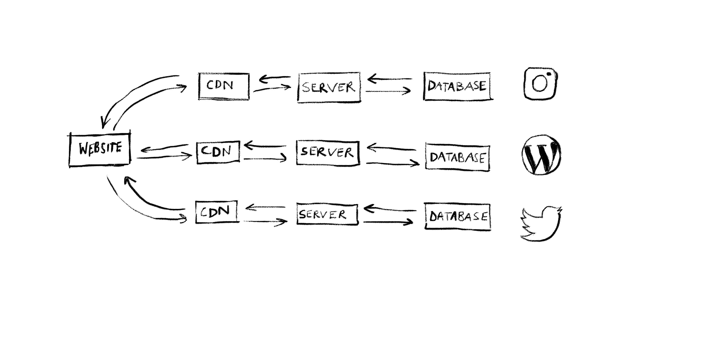
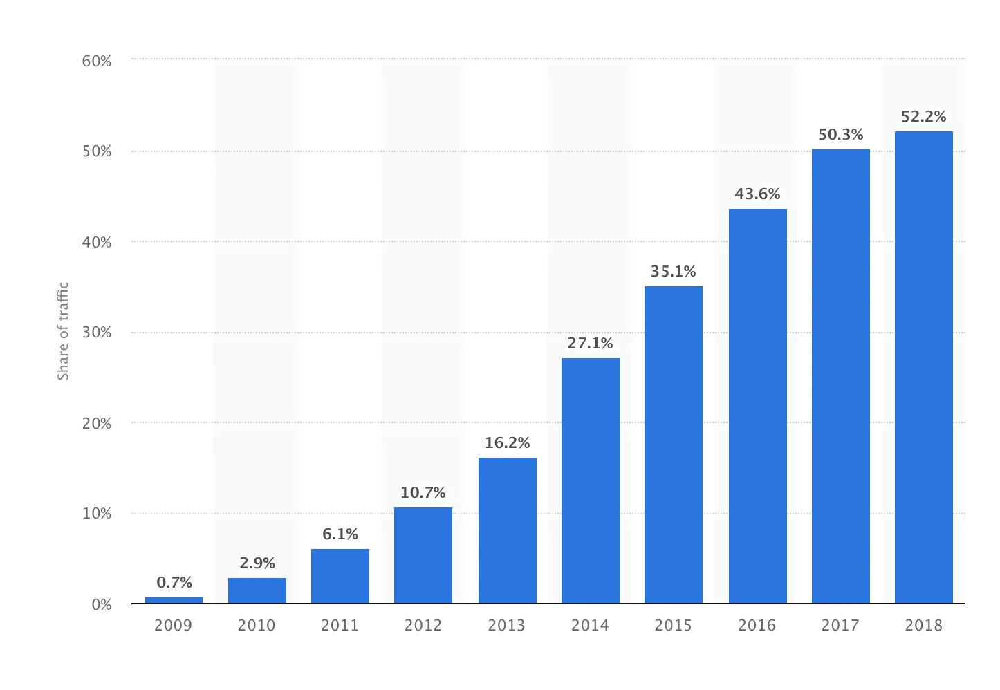
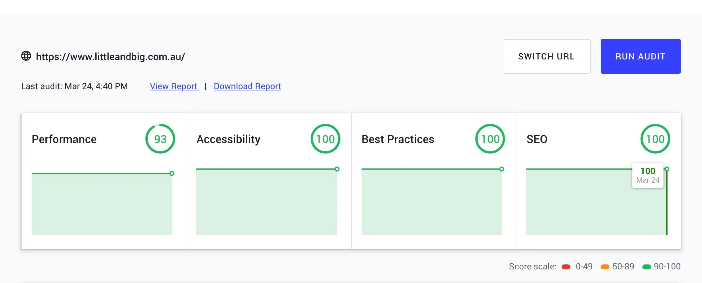

## What is Gatsby?

Gatsby is a web development technology we think you, your friends, your family and your dog (everyone) should be excited about. From web developer to business owners, technical and non-technical alike. Gatsby is making waves on the web in orders of magnitude that WordPress might have done in its hay day.

Building your website with Gatsby will most likely positively impact your website’s:

- Search Engine Optimization (SEO)
- Bounce Rates, Lead Conversion and Revenue
- Developer and User Experience

Gatsby’s calling card is blazingly fast websites. This is achieved by pre-building a web page’s content before a user hits it, as opposed to fetching content in real-time.

A handy analogy the way Gatsby delivers websites can be found in cooking shows. As the chef is about to place the prepared food in the oven, they simultaneously pull out a tray and say ‘Here’s one I prepared earlier!’

If the chef was to say “stick around and pass the next 30 minutes while we wait for these potatoes to brown!”, you’d be inclined to switch channels.

Gatsby “pre-bakes” content into your website. Instead of fetching your blog posts from WordPress, or products from Shopify in real-time as a user hits the page, it’s fetched ahead of time, built the page and distilled it down to its most optimal format.

We’ve covered the basics, stick around as we dive into the details.

## The Modern Web Needed Gatsby

### The Landscape

We’ve grown high expectations for web sites since their humble beginnings in the early 90s. Primarily, most websites are attached to diverse set data sources - a Content Management System (CMS) like WordPress or Shopify, a social feed from Instagram or Twitter, or high-resolution images hosted in a repository like Cloudinary.

This is fantastic, the CMS allows anyone to publish content to the web without having to continually hire a web developer. Pulling content from our social feeds means that we don’t have to duplicate content, and it promotes all the different mediums through which users can engage with our brand.

We can capture what this looks like in a simple diagram.

You might be unfamiliar with the concept of a Content Delivery Network (CDN), in layman’s terms this is a super fast server that stores content that doesn’t have to be updated. If servers are involved, it will route traffic to the closest one.

## The Catch

While this functionality is fantastic, the caveat is that we expose ourselves to terrible performance pitfalls - we’re only as fast as the time it takes to fetch our slowest data source.

Parallel to this evolution we’ve tended to access the web on smaller and smaller devices, shifting from the Desktop, then to the Laptop, and now to Mobile. Not only do we expect to view increasingly more impressive and functional with less, more compact devices, but also to access the web from anywhere: often over our mobile telecommunications network.

## Enter Gatsby

Using Gatsby, all our content is aggregated from the various data sources our website is connected to in a single build. The build process prefetches, compresses, and optimizes the content. When users land on the page, all the content is in one place, on the edge, ready to serve to them. This translates to blazingly fast load times and pages appear to load instantaneously.

We only need to interact with servers and databases when we want to refresh the content, or a change is made in your website’s source code.

With Gatsby, the architecture of our website simplifies a great deal.

## Let’s Talk Business Outcomes

This is the section of the post that business owners and marketing directors have been patiently waiting for. History and architecture aside, there’s a lot of hard, tangible, measurable results Gatsby can deliver to your business. Here’s some of them.

### Search Engine Optimisation (SEO)

A higher organic search ranking ensures pages on your site appear closer to the top of your audience’s search results, and increases the chances of them visiting your site and engaging with your business. It plays a big part in bringing traffic to your site.

A primary driver of SEO is the content contained on your website and the way it is presented to search engine crawlers (the automated robots that are responsible for scanning and indexing content on the web). Gatsby does an excellent job at the latter, as all content is server-rendered and can be tagged extensively with metadata.

Also, in early 2018, Google announced that a [website’s performance would also be a factor in page ranking](https://webmasters.googleblog.com/2018/01/using-page-speed-in-mobile-search.html), which took effect in July that year.

Recently Google has released a tool called [web.dev](https://web.dev/) to allow people to audit their site to see how well the site meets Google’s expectations for modern web practices. How well Gatsby sites score using this tool has been a bit of a proof in the pudding on this subject. This site (https://www.littleandbig.com.au/) has been built in Gatsby, you’re welcome to weigh up a site against it in comparison.

### Bounce Rates, Lead Conversion and Revenue

Many websites are optimized to capture leads. Alas, some less artfully than others - I’m sure you’ve experienced a website that will accost you with a painfully timed pop-up, or throw up a barrier between you and content until you have surrendered your name, email and phone number.

There is overwhelming evidence to support the fact that your website’s load time has an impact on a visitor to your site becoming a lead.

Every second counts. Mobile websites that take [more than 3 seconds to load have a 53% bounce rate](https://www.thinkwithgoogle.com/marketing-resources/data-measurement/mobile-page-speed-new-industry-benchmarks/) (53% of visitors to a particular website navigate away from the site after viewing only one page). In the E-Commerce domain, some estimates say you lose up to [1% in revenue for every 100ms delay](https://www.section.io/blog/page-load-time-bounce-rate/) in page load time.

### Developer Experience and User Experience

Simply put, Gatsby makes it very easy to make sites beautiful, snappy and satisfying for users. The performance optimizations make page transitions seem instantaneous. It also comes with out-of-the-box functionality for creating very satisfying interactive behaviours.

Gatsby has an excellent dedicated product team, supported by a booming open-source developer community. The technology is incredible, and it’s continuing to grow, with updated revisions of the core product, and with an ecosystem of code libraries that can be plugged in for quick access to impressive functionality.

One example of this is the ability to add offline support for your website using Service Workers. Should your users experience an interruption in their internet service, they’ll be able to access your page instead of being shown an error page. Another example is how Gatsby can be configured to lazy load images. An image is initially shown as a low fidelity preview until the full image is loaded, and then transitioned into the full fidelity version.

Gatsby is a sound technological investment, it’s as future-proof as web technology comes. Let’s get Nerdy 🤓

- At its core, it’s built on top of React, just about the most popular modern JavaScript language / library / framework (explaining React is probably worthy of its own blog post!), which was built and is maintained by Facebook.
- Makes use of GraphQL to wrangle all your data sources.
- Only loads the critical HTML, CSS, data, and JavaScript so your site loads as fast as possible (this is called code and data splitting).
- Follows Google's [PRPL](https://developers.google.com/web/fundamentals/performance/prpl-pattern/) (Push, Render, Pre-cache, Lazy-load) architectural pattern which aims to boost your website's performance, especially on mobile devices.

## The Limitations

<Pullquote citation="Rumpelstiltkin">All magic comes with a price</Pullquote>

In the case of Gatsby, at the moment the price of its magic is the time taken to build static versions of your web pages. In order to deploy content or source code changes to your site, the content has to be fetched, optimized, compiled and rendered into HTML. The time it takes to build your site tends to be proportional to the number of pages.

If you’re publishing articles and content where updates are required to be frequent and instantaneous, like a media outlet that posts real-time updates for a live game of sport, Gatsby might not be the best solution for you.

This being said, the time it takes to rebuild web pages is a constraint the Gatsby product team is aware of and is constantly improving. Incremental builds (having the smarts to only go through the whole shebang where it is required) is a focus of future improvements to the core product.

## Conclusion

That’s a wrap folks, thanks for reading.

In summary, next time you’re looking to embark on the sheer adventure that is a web project, Gatsby makes for an excellent technology to arm yourself with along the way.

Our key takeaways:

- Gatsby is optimized for performance, it will make your site as fast as possible. As the future of the web continues to trend to live on mobile, this is more important than ever.
- Plugs into your existing Content Management System (CMS) - be it WordPress or Shopify.
- It utilizes the greatest modern web technology has to offer in a way that it is productive for your developers to worth with.
