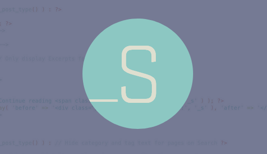

> Note: This is part one in a series of posts about Gatsby.js and WordPress. You can find [Part Two here](/blog/2019-04-30-how-to-build-a-blog-with-wordpress-and-gatsby-part-2), and [Part Three here](/blog/2019-05-02-how-to-build-a-blog-with-wordpress-and-gatsby-part-3).

Ever wondered how to use Gatsby.js with WordPress? This post will cover everything you need to know about getting WordPress ready for a Gatsby site.

In a [previous post](https://www.iamtimsmith.com/blog/using-wordpress-with-react/), I spoke about using React.js to build a frontend for a WordPress site. I talked about a simple setup to do this, but also mentioned some drawbacks to doing this.

One such drawback is the difficulties faced when trying to rank for SEO, because search engine crawlers have a hard time indexing information being loaded into React. I mentioned briefly that there are ways around this and one of these ways is [Gatsby.js](https://www.gatsbyjs.org/).

In this series of blog posts, I'll be talking about how to build a Gatsby.js site with a WordPress backend. The aim of the setup is to allow non-developer users to make changes on their website while allowing developers to use a fast, modern, and enjoyable tool to build with.

https://giphy.com/gifs/justin-g-thumbs-up-kylo-ren-approval-3o7ZeTmU77UlPyeR2w

## Why use Gatsby.js with WordPress at all?

When I made my last post about using React.js with WordPress, a few people asked why one might do such a thing?

There are a few reasons that creating a separate frontend in React.js is beneficial:

First, it really allows a lot of customization for the developer to choose tools that will a) benefit the site most and b) create an enjoyable development experience. And let's be honest, as developers aren't we all looking for better development experience?

Second, I believe that plugins are a double-edged sword. They allow some cool functionality which otherwise wouldn't exist for non-coders, but people get slap-happy with them and start putting them on unnecessarily. I've seen sites with more than 60 plugins activated at once and they wondered why their site was so slow! Having 60 different plugins could mean having a ridiculous amount of HTTP requests being sent because each plugin is loading a new library. Using a separate frontend means the developer is in control of this. It does mean that the client will have to pay to have some changes made, but at the same time it will ensure that the site is staying optimized and that a developer can make the change without adding a bunch of unnecessary junk.

https://giphy.com/gifs/random-explosions-unnecessary-CBFgxojcXwac

Third, I've seen cases where the developer and designer create an amazing site for a client and then the client decides to start poking around trying to change something minute like font-size from 12px to 14px and ends up taking the whole site down. This is an extreme example, but it definitely happens. If the frontend is a totally separate entity, then the client doesn't have the ability to do so.

Finally, WordPress powers something like one-third of the internet. What this means is that there's a lot of people who know how to figure out if a site is a WordPress site so they can hack it and steal information. They can write bots which check various pieces of information about the site and determine if it's a WordPress site. The benefit to using something like Gatsby.js is that it creates static files at build time and serves the static HTML, so users and bots will never know there's a WordPress site managing the content.

## What is Gatsby.js?

Now that you've learned about why it is beneficial to use a setup like this, let's talk about what Gatsby.js is.

According to their site, "Gatsby is a free and open source framework based on React that helps developers build blazing fast websites and apps". In other words, it allows you to develop a website using React and just about any content source you want. Then at build time, it pulls in all of the data from the specified sources and turns your site into a bunch of static HTML files that are optimized for performance.

As a matter of fact, [my portfolio site](https://www.iamtimsmith.com) is built using Gatsby and markdown files. It's a great way to build performant websites in React without having to worry about crawlers being able to index your site. In addition, it's got some pretty awesome documentation and community around it.

Now let's get down to business...

https://giphy.com/gifs/cbc-funny-reaction-xUOwGmsFStnxzIGC2s

## Setting up WordPress

This article assumes you have at least a rudimentary knowledge of WordPress. If you've never used it, you can check out [my quick guide to setting up a WordPress site](https://www.iamtimsmith.com/blog/how-to-build-website-in-less-than-10-minutes/).

## A bit about WordPress as a CMS

WordPress is a Content Management System (or CMS) built using PHP and MySQL. Typically when building a WordPress site, you would build a theme that essentially acts as a "skin" for the content. Since you're using Gatsby to build the frontend, you won't be using this functionality.

As I mentioned in my other blog post, WordPress exposes REST APIs which can be used to get data for your React application. This same principle will be used here, although you'll be adding some things to improve the REST API and make it more flexible.

I also like to use WordPress at a subdomain such as `admin.example.com` so it is totally separate from the actual site.

## The WordPress theme

Since you are not worried about how the site looks in WordPress, the theme you use doesn't necessarily matter. The only two files you really need in the theme are the `style.css` file to tell WordPress the information about your theme and the `functions.php` file so you can create menus, create custom content types, create default Advanced Custom Fields, etc. Later on, you can add more files to the theme for page templates, but that's totally optional.

When building WordPress sites I generally stick with the [Underscores](https://underscores.me/) theme, so I will use that as the starter today since it already has a lot of stuff set up out-of-the-box.

## The WordPress Plugins

I know I was on my soap box earlier about using a bunch of plugins, and generally I'm not a huge fan of them. There are a few plugins that can really make your life easier as a developer though.

### Advanced Custom Fields

The first plugin I'd like to mention is [Advanced Custom Fields](https://www.advancedcustomfields.com/), or ACF for short. This is perhaps one of my favorite plugins of all time since it allows you to create custom fields for any post type or page. You can override defaults. You can create any number of fields for the user ranging from What You See Is What You Get (or WYSIWYG) editors and date pickers (free) to galleries and repeater fields (pro). With this tool, you can truly customize the site to be exactly what your client needs.

### ACF to REST API

Another plugin that works hand-in-hand with ACF is called [ACF to REST API](https://github.com/airesvsg/acf-to-rest-api). I bet you already guessed what it does. It exposes the data from your custom fields to the REST API so you can use it in your Gatsby.js site.

### WP API Menus

One of the great functions in WordPress is the ability for users to easily create and update menus for their site. If you hardcode the menu into your Gatsby site, it removes this ability for your users. To make it flexible for them, you can install the [WP API Menus](https://github.com/unfulvio/wp-api-menus) plugin to create REST routes for the menu items. Please note: There are a few different plugins built to create APIs from menus. According to the [gatsby-source-wordpress docs](https://github.com/gatsbyjs/gatsby/tree/master/packages/gatsby-source-wordpress), it must be this particular plugin to work.

### WP Trigger Netlify Build

<figure>
  <video autoplay muted loop>
    <source src="./images/wp_netlify_build.webm" />
    <source src="./images/wp_netlify_build.mp4" />
  </video>
  <figcaption>WP Trigger Netlify Build shows Netlify status</figcaption>
</figure>

When I build a Gatsby website, I like to use Netlify to handle the deployment of the site. Netlify rebuilds whenever a new commit is pushed or merged to the master branch of the repository, but what about when someone updates their WordPress site?

Netlify has the ability to create webhooks that you can grab to say, "Hey, there's new content so you need to rebuild". I built [WP Trigger Netlify Build](https://github.com/iamtimsmith/wp-trigger-netlify-build) to make this super easy to integrate with WordPress. Simply drop in the necessary information and it will tell Netlify to rebuild when changes are made. It even shows a badge with the status of the build on the dashboard.

https://giphy.com/gifs/qyX9oq2ZmsPwk

## You have themes and plugins, now what?

Not to be too anti-climactic, but there's really not a ton more to do on the WordPress side other than create content. These plugins and theme will pretty much expose everything you need to build your Gatsby.js blog.

That being said, if you are creating custom content types for your blog you will need a way to differentiate them in ACF. Creating a custom page template will serve this purpose so you can filter on the page template to show the custom fields. You can also use the page template to filter in your Gatsby project to make sure you are receiving the desired fields for a given page.

If you have any questions, you can hit me up on Twitter at [@iam_timsmith](https://twitter.com/iam_timsmith)!

See you in [How To Build A Blog with WordPress and Gatsby.js - Part 2](/blog/2019-04-30-how-to-build-a-blog-with-wordpress-and-gatsby-part-2)!
