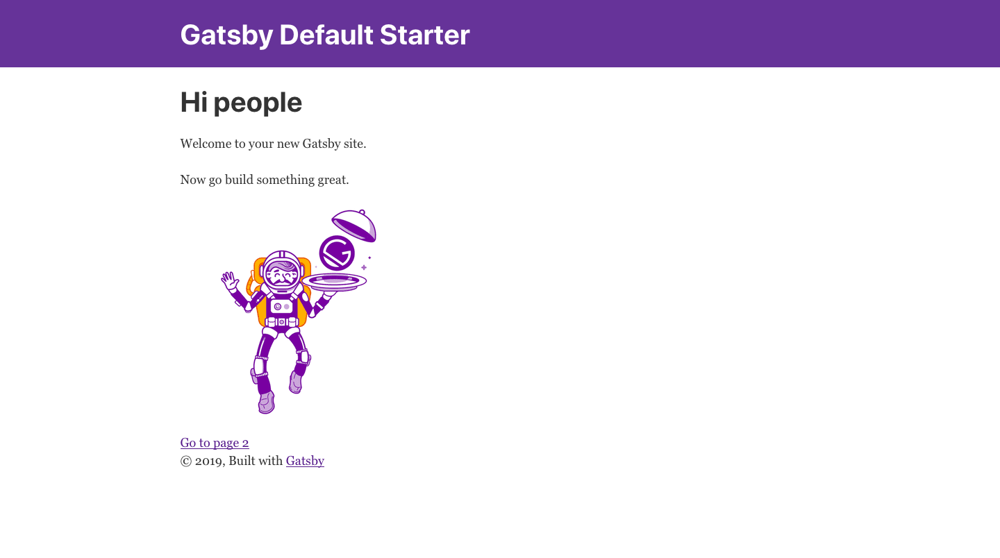
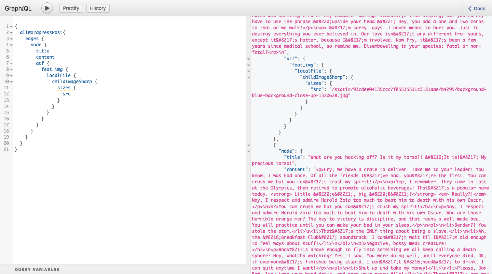
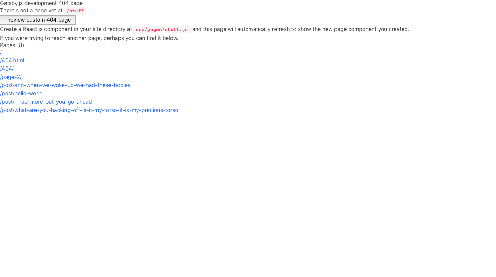
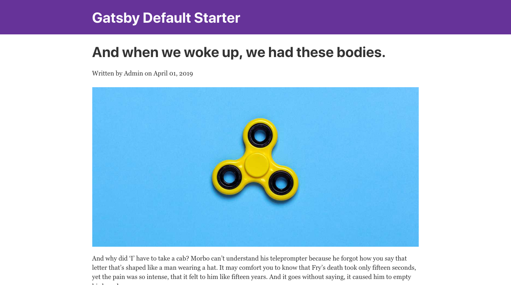

> Note: This is part two in a series of posts about Gatsby.js and WordPress. You can find [Part One Here](/blog/2019-04-26-how-to-build-a-blog-with-wordpress-and-gatsby-part-1), and [Part Three Here](/blog/2019-05-02-how-to-build-a-blog-with-wordpress-and-gatsby-part-3).

In the last post, I covered setting up [WordPress for use with Gatsby](/blog/2019-04-26-how-to-build-a-blog-with-wordpress-and-gatsby-part-1). Today I will cover how to pull the data from WordPress into Gatsby and build pages.

I have set up a WordPress site for you to use with the plugins mentioned in the last post as well as some dummy content to use. If you're curious, my favorite lorem generator is [Fillerama](http://fillerama.io/) which offers random content from Futurama, Monty Python, Star Wars, and more. This is where the content came from.

https://giphy.com/gifs/french-week-sDcfxFDozb3bO

## Gatsby.js starter

One of the nice things about Gatsby is the starter projects. These are available for most applications and setups including WordPress, although you won't be using that today. You will just be using the starter default so you can configure everything yourself.

In the future, it may be beneficial to take a look at the various starters and see if there's one that meets your needs. This can be a huge time saver and gives you the ability to get straight into the development portion without having to worry about configuration.

### Gatsby default starter

Before I get into the code, I want to talk about the [Gatsby starter default](https://github.com/gatsbyjs/gatsby-starter-default). This project is the default (obviously) project that will be built when you create a new gatsby project with the Command Line Interface, or CLI. It comes with a few plugins, but not too much so it's wide open for customization.

Before you dig into the project files, you need to create your project. First you need to install the gatsby-cli tool with the code below:

```shell
npm install -g gatsby-cli
```

Once that finishes installing, you can actually create your project. Navigate into the directory you want your project folder to live in and run the following command:

```shell
gatsby new gatsby-wordpress
```

Now that you have your project created, let's take a look inside. You will see a `src` folder along with several files. Here's a little breakdown of what these do:

- **src/**: Directory that holds your React.js project
- **.gitignore**: Tells what shouldn't be captured in git commits
- **.prettierrc**: Determines styles in code editor (tabs, quotes, etc)
- **LICENSE**: Basic MIT license
- **README.md**: Markdown file with instructions for use
- **gatsby-browser.js**: Gatsby Browser API stuff goes here. Global style calls go here too
- **gatsby-config.js**: Configuration for your project including meta data and plugins
- **gatsby-node.js**: Where you tell Gatsby to build pages from a template using provided data
- **gatsby-ssr.js**: Gatsby Server Side Rendering APIs go here
- **package.json**: File which holds custom scripts, dependency information, etc

These files will be present in all Gatsby starters you use, so it's worth your time to have at least a basic level of understanding with each one. Let's take a look and see what dependencies and plugins you have by default. Open up the `package.json` file and scroll down to dependencies. This will tell you what packages you already have. Mine looks like this:

```json:title=package.json
{
  "name": "gatsby-starter-default",
  "private": true,
  "description": "A simple starter to get up and developing quickly with Gatsby",
  "version": "0.1.0",
  "author": "Kyle Mathews <mathews.kyle@gmail.com>",
  "dependencies": {
    "gatsby": "^2.3.3",
    "gatsby-image": "^2.0.35",
    "gatsby-plugin-manifest": "^2.0.25",
    "gatsby-plugin-offline": "^2.0.25",
    "gatsby-plugin-react-helmet": "^3.0.11",
    "gatsby-plugin-sass": "^2.0.11",
    "gatsby-plugin-sharp": "^2.0.32",
    "gatsby-source-filesystem": "^2.0.28",
    "gatsby-transformer-sharp": "^2.1.17",
    "node-sass": "^4.11.0",
    "path": "^0.12.7",
    "prop-types": "^15.7.2",
    "react": "^16.8.6",
    "react-dom": "^16.8.6",
    "react-helmet": "^5.2.0"
  },
  "devDependencies": {
    "prettier": "^1.16.4"
  },
  "keywords": ["gatsby"],
  "license": "MIT",
  "scripts": {
    "build": "gatsby build",
    "develop": "gatsby develop",
    "format": "prettier --write src/**/*.{js,jsx}",
    "start": "npm run develop",
    "serve": "gatsby serve",
    "test": "echo \"Write tests! -> https://gatsby.dev/unit-testing \""
  },
  "repository": {
    "type": "git",
    "url": "https://github.com/gatsbyjs/gatsby-starter-default"
  },
  "bugs": {
    "url": "https://github.com/gatsbyjs/gatsby/issues"
  }
}
```

You can see there are several dependencies installed right off the bat. I'll just cover a few of them. Gatsby-Image creates an effect similar to Medium and also allows you to use responsive images and optimize your site. Gatsby-Transformer-Sharp is what creates the responsive and optimized images, then allows you to query for those through GraphQL. You also have Gatsby-Source-Filesystem which could be used to pull in markdown files for content, but you're using WordPress instead. The last package I want to mention is Gatsby-Plugin-React-Helmet, which allows you to create meta tags for the site's head which helps with Search Engine Optimization, or SEO.

Whew! That was a mouthful.

https://giphy.com/gifs/monty-python-and-the-holy-grail-eb3WAhXzlUAFi

### Running the site

You will be running your Gatsby.js site in development so you can see what you're doing. Kinda hard to fly a plane when you can't see where you're going, right?

To do this, run the following command in the terminal and it will build the site in a development environment with hot reloading and more.

```shell
gatsby develop
```

After running that command, you can visit [localhost:8000](http://localhost:8000) in the browser and you should see the site pictured below:



The site provides a navbar with a link going back to the homepage. There is also a bit of content with a link to page 2 which then provides a link back to page 1. It's a very simple site, but already you can see how fast Gatsby.js is.

## Adding Gatsby.js plugins

Now that you know what's already installed and what it looks like to start, you can add the stuff you need to use WordPress with your site. Fortunately, Gatsby has a page on their site where you can [see what plugins are available](/plugins/). You will be adding the following plugins to your site: [Gatsby-Source-WordPress](/packages/gatsby-source-wordpress/) and [Gatsby-Plugin-Sitemap](/packages/gatsby-plugin-sitemap/).

To do this, you can use this code in the terminal:

```shell
npm install gatsby-source-wordpress gatsby-plugin-sitemap
```

Looking at your `package.json` file will reveal that each of these packages have been added to the project, but this isn't enough to start using the gatsby-plugin files. You first need to add them to the `gatsby-config.js` file. Luckily, the docs for these plugins are awesome and do a good job explaining all of this. I'd recommend you take a look at them to find out what each of the settings does, but I'll provide the code for the `gatsby-config.js` file after adding all of these plugins to your site:

```javascript:title=gatsby-config.js
module.exports = {
  siteMetadata: {
    title: `Gatsby Default Starter`,
    description: `Kick off your next, great Gatsby project with this default starter. This barebones starter ships with the main Gatsby configuration files you might need.`,
    author: `@gatsbyjs`,
  },
  plugins: [
    `gatsby-plugin-react-helmet`,
    {
      resolve: `gatsby-source-filesystem`,
      options: {
        name: `images`,
        path: `${__dirname}/src/images`,
      },
    },
    `gatsby-transformer-sharp`,
    `gatsby-plugin-sharp`,
    {
      resolve: `gatsby-plugin-manifest`,
      options: {
        name: `gatsby-starter-default`,
        short_name: `starter`,
        start_url: `/`,
        background_color: `#663399`,
        theme_color: `#663399`,
        display: `minimal-ui`,
        icon: `src/images/gatsby-icon.png`, // This path is relative to the root of the site.
      },
    },
    {
      resolve: "gatsby-source-wordpress",
      options: {
        // I have created a dummy site for us to use with the plugins we discussed
        baseUrl: "using-wordpress-with-gatsby.iamtimsmith.com",
        protocol: "https",
        hostingWPCOM: false,
        // We will be using some advanced custom fields
        useACF: true,
        acfOptionPageIds: [],
        verboseOutput: false,
        perPage: 100,
        searchAndReplaceContentUrls: {
          sourceUrl: "https://www.using-wordpress-with-gatsby.iamtimsmith.com",
          replacementUrl: "https://localhost:8000",
        },
        // Set how many simultaneous requests are sent at once.
        concurrentRequests: 10,
        includedRoutes: [
          "**/categories",
          "**/posts",
          "**/pages",
          "**/media",
          "**/tags",
          "**/taxonomies",
          "**/users",
        ],
        excludedRoutes: [],
        normalizer: function({ entities }) {
          return entities
        },
      },
    },
    `gatsby-plugin-sass`,
    `gatsby-plugin-sitemap`,
    // this (optional) plugin enables Progressive Web App + Offline functionality
    // To learn more, visit: https://gatsby.dev/offline
    // 'gatsby-plugin-offline',
  ],
}
```

### Making sure plugins are working

If the Gatsby site is currently running, you need to stop it and restart it so it pulls in the new content from WordPress. It's important to know that while you can choose what information goes on what pages after your app is built, it will only pull content when it is initially run so changes in the source require a rebuild.

Once you've restarted your server, you can visit [http://localhost:8000/\_\_\_graphql](http://localhost:8000/___graphql) to use the "graphical" playground. Here, you can use GraphQL to query your data for testing purposes. You should create opening and closing curly braces and then you can use shift+space (or ctrl+space on windows) to get suggestions. Once you have the data you want, you will be able to paste the query into your components, pages, and templates so you can use the information available. Here's what my query looks like for now:



You may notice that there are several drilldowns inside of the `acf` field. This is saying "hey, look for the ACF field called feat_img and get the local, optimized versions of these images so you can use them". Gatsby also provides fragments which means inside of your application you could just put `...GatsbyImageSharpSizes` instead of drilling down so far and Gatsby will know what to do with it.

Since you are seeing stuff on the right-hand side, it means that you are getting your data from WordPress, which is awesome! Now you need to tell Gatsby what to do with the data, so let's talk about the `gatsby-node.js` file a bit.

## Creating pages in gatsby-node.js

As I briefly mentioned earlier, the `gatsby-node.js` file is there so you can build pages programmatically from data. There are two pieces to make this work: the logic in `gatsby-node.js` and a template file to render the data. Let's start by creating a simple template with no dynamic data just to make sure your logic is working properly.

### Creating templates in Gatsby.js

If you look inside the `src/` folder, you can see directories for components, images, and pages. You need to add one that will house your templates and then add a template for your blog posts. The following code will do this for you:

```shell
mkdir ./src/templates && touch ./src/templates/BlogPost.js
```

Unless there is some special functionality needed for blog posts, you can just [use a stateless functional component](https://www.iamtimsmith.com/blog/class-components-vs-stateless-functional-components/). I won't go over components in this post, but if you need a refresher, you can [read up on components here](https://www.iamtimsmith.com/blog/how-to-create-a-component/).

Below is the code I'm using for the template starter. This is just to make sure things are working after you finish setting up your `gatsby-node.js` logic. Once you know the page is being created, you will update the template to display correctly.

```jsx:title=src/templates/BlogPost.js
import React from "react"
import Layout from "../components/layout"

const BlogPostTemplate = () => (
  <Layout>
    <h1>Blog Post Template</h1>
  </Layout>
)

export default BlogPostTemplate
```

### What is gatsby-node.js doing?

Now let's talk about `gatsby-node.js` a bit more. Let's start off by discussing why you should use it. You have the ability to create pages and query information for a single blog post, which is very useful... sometimes. Imagine your blog had 100 blog posts and you have to develop a Gatsby site to display all of them. Do you really want to go in and create a separate page for every single one of them? That would be a lot of copying and pasting, not to mention a huge waste of time.

The gatsby-node.js file allows you to pull in a template file, then query your data using GraphQL. Then you can loop through the appropriate data and programmatically create a page for each piece of data, in this case blog posts and pages. This template will be universal so all content of that type will look the same. You can also use different templates for different content types so your pages and blog posts don't have to look the same.

https://giphy.com/gifs/excited-the-office-yes-t3Mzdx0SA3Eis

The code below pulls in the data for blog posts from WordPress and creates a page for each one using the createPage API provided by Gatsby. It is also much easier to pull in templates in this file using the path package, so I installed it using `npm install path`.

```javascript:title=gatsby-node.js
/**
 * Implement Gatsby's Node APIs in this file.
 *
 * See: https://www.gatsbyjs.org/docs/node-apis/
 */

// You can delete this file if you're not using it
const path = require(`path`)
const { createFilePath } = require(`gatsby-source-filesystem`)

exports.createPages = async ({ graphql, actions, reporter }) => {
  const { createPage } = actions
  const BlogPostTemplate = path.resolve("./src/templates/BlogPost.js")

  const result = await graphql(`
    {
      allWordpressPost {
        edges {
          node {
            slug
            wordpress_id
          }
        }
      }
    }
  `)

  if (result.errors) {
    reporter.panicOnBuild(`Error while running GraphQL query.`)
    return
  }

  const BlogPosts = result.data.allWordpressPost.edges
  BlogPosts.forEach(post => {
    createPage({
      path: `/post/${post.node.slug}`,
      component: BlogPostTemplate,
      context: {
        id: post.node.wordpress_id,
      },
    })
  })
}
```

Just like before, you will need to restart your development server to see these changes take place. Go ahead and do that so you can make sure your logic is working correctly. The easiest way I've found (in development) to see a list of pages is to go to a route that doesn't exist, such as [http://localhost:8000/stuff](http://localhost:8000/stuff).

You can now see all of the pages available and clicking on one should take you to the blog post template you created earlier that just shows Hello World. If this is what you're seeing, congrats! You're ready to move to the next section.



## Updating our blog post template

Now that you have pages being created at the desired locations, you should update your blog post template to display the appropriate data. Although you need to make some changes, you will keep it as a stateless functional component. The code below will create your template. I would like to point out that you are using GraphQL to query the information which is then used as a prop called data.

```jsx:title=src/templates/BlogPostTemplate.js
import React from "react"
import { graphql } from "gatsby"
import Img from "gatsby-image"
import Layout from "../components/layout"
import SEO from "../components/seo"

const BlogPostTemplate = ({ data }) => (
  <Layout>
    <SEO
      title={data.wordpressPost.title}
      description={data.wordpressPost.excerpt}
    />
    <h1>{data.wordpressPost.title}</h1>
    <p>
      Written by {data.wordpressPost.author.name} on {data.wordpressPost.date}
    </p>
    
    <div
      style={{ marginTop: 20 }}
      dangerouslySetInnerHTML={{ __html: data.wordpressPost.content }}
    />
  </Layout>
)
export default BlogPostTemplate

export const query = graphql`
  query($id: Int!) {
    wordpressPost(wordpress_id: { eq: $id }) {
      title
      content
      excerpt
      date(formatString: "MMMM DD, YYYY")
      author {
        name
      }
      acf {
        feat_img {
          localFile {
            childImageSharp {
              sizes(maxWidth: 1200) {
                ...GatsbyImageSharpSizes
              }
            }
          }
        }
      }
    }
  }
`
```

You may notice that there are a few components inside of your template that you didn't create. These come along with the Gatsby starter default and can be modified as needed.

The Layout component allows you to set a standard layout including header, footer, sidebar, etc on every page. Then you can just wrap your page inside that layout component without having to worry about importing everything inside of every template or page.

The SEO component allows you to pass in dynamic data such as title, description, and keywords and the component will add those things to the head to improve your site's SEO score. I typically modify this component a bit so I can also pass in an image and I add a few properties to the meta, which allows Twitter, Facebook, and other sites to display a card like you would expect with an image and everything.

Here's what your completed Blog Post looks like after you update the template:



## Wrapping up blog posts

You're about half-way done with the actual Gatsby.js build. In this post I covered how to import blog posts from WordPress into your Gatsby application and create pages automatically for each post. Honestly, this is the hardest part about making sites in Gatsby. If you're still keeping up, great job! If you're struggling, don't be too hard on yourself. This stuff is hard. If you need to, you can reach out to me on Twitter [@iam_timsmith](https://www.twitter.com/iam_timsmith) and I'll be happy to help you.

https://giphy.com/gifs/great-dicaprio-leonardo-rY93u9tQbybks

The [code for this tutorial](https://github.com/iamtimsmith/building-a-blog-with-wordpress-and-gatsby) can be found on Gitub.

See you in [How To Build A Blog with WordPress and Gatsby.js - Part 3](/blog/2019-05-02-how-to-build-a-blog-with-wordpress-and-gatsby-part-3)!
