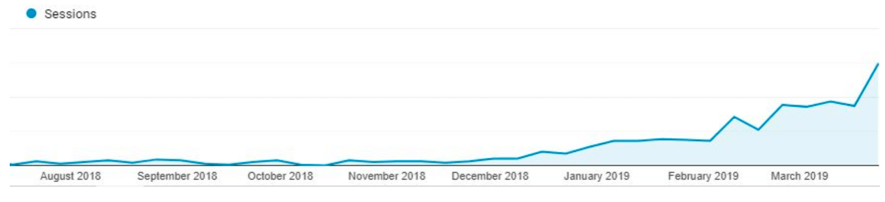
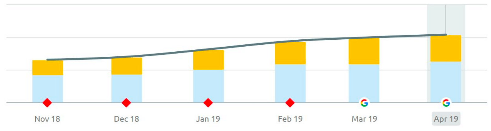
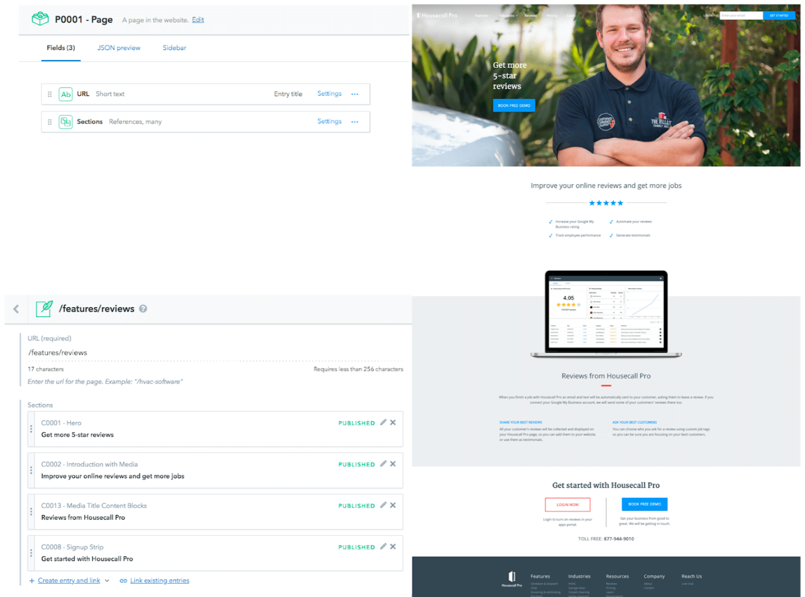
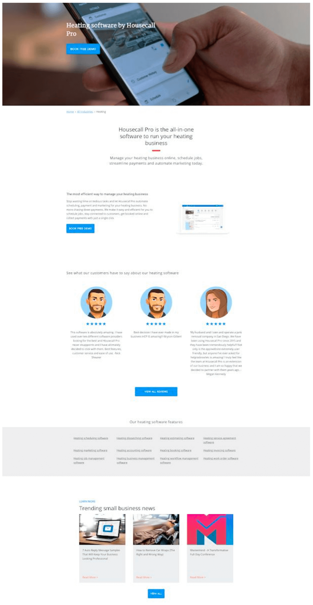

In October of 2018, we realized that our ​[marketing website](https://www.housecallpro.com/)​ needed some serious love to meet our standards for a scalable and effective digital front door. At the time, the site was being served from a legacy Ruby on Rails server hosted on AWS. The loading time for each page took several seconds on desktop, and was really hurting on mobile, where our analytics and current trends were showing an ever increasing share of use. The development process was not efficient, involving an engineer to create an HTML template in Ruby for each new page to be rendered and served by Rails. This process was not sustainable and would not aid in our goal to radically increase our useful content to capture a wider audience of potential customers.

## Our decision for Gatsby

We needed our site to be blazing fast, scalable, have top notch SEO, and most importantly, provide an ability for content creators who are not developers to publish new pages. Our commercial SaaS product was already written in React, so coalescing on the same frontend technology between teams would lower the barrier to entry. We started down the path of converting our Embedded Ruby Files into React components, and building out a serverless architecture using Terraform on AWS.

Along the way, it became clear that to get the benefits of a fast, fully crawlable site, we would need extra tools for the job. Indexability and SEO would prove challenging to improve upon when the website is being rendered in the browser via JavaScript. SEO and mobile performance are critical components for customers to be able to find your site. With that in mind, we searched for better React solutions.

We were given a recommendation for Gatsby and it did not disappoint. Since Gatsby
renders all of our pages as static HTML files, our site became instantly crawlable by search engines. From our time of implementing Gatsby in late November 2018 to April 2019, we have increased our organic blog traffic by **​973%​**. We expect that number to keep increasing from there.

Organic web traffic is not the only impressive statistic that Gatsby has helped us to achieve. Within the same time period of late November 2018 to April 2019, the number of times in which the marketing website landed on page 1 for many Google search terms increased by **​56%**​.

## Generating content rapidly

High quality, timely, and varied content delivered on a site with speed and beautiful design is a sure fire way to drive a continuing increase in prospective customers. Even though switching to a common framework that the whole team knew sped up the page creation process, it still took developer time to create pages that were similar to each other.

The dream was to give content creators the power to make these pages themselves without developer intervention. Based on ​[this blog post​](https://www.gatsbyjs.org/blog/2017-12-06-gatsby-plus-contentful-plus-netlify/) on the Gatsby site, we integrated Contentful, and deployed via Netlify. Contentful is a headless content management system (CMS) in which content can be ingested over an API. This led us down the path of a generic page builder.

Developers would make common components that content creators could piece together like lego blocks to make their own webpages. Now, an unlimited number of informational pages can be built by our content team to give the power to our potential customers to make an informed decision about our product.

You can see an example here of composable components from the viewpoint of a content creator in Contentful (left), and the final view of the page they see (right), based simply on entering a basic set of information.

Each component in Contentful lines up to a React component in the project, and with easy [previewing​](https://www.gatsbyjs.org/blog/2019-03-22-introducing-gatsby-preview-beta/) upon adding data, content creators can get instant feedback.

Housecall Pro caters to a variety of home services industries. With that in mind, we needed a way to give each industry a place on the Housecall Pro marketing site in which they could get information. Gatsby has aided in the creation of these industry pages.

With Gatsby, we can generate several hundred pages for all of the industries that we are targeting based on a single React template. This involved a simple process that boils down to the following simple steps:

- Designers create a mock-up of the page
- Developers create React components for each piece (composing as needed for re-use)
- Developers create a JSON structure that holds all of the page’s data
- Content authors fill that structure
- Gatsby loops through data structure and generates the pages

By providing data in the form of a JSON object, we can parse and iterate over each industry in which to generate a new page. Whether this JSON data comes from a file, or a CMS via an API call, or our own database, Gatsby provides the flexibility to build in any way we need.

This has dramatically decreased developer time and rocketed the speed of page creation. We went from building several pages a week using front-end developers, to building out dozens of pages a day with professional content creators.

Below is an example of one of our live industry pages (in this case Heating/Air
Conditioning). Each industry page follows the same template, and content authors can build out new industries, complete with whatever copy, icons, images, and animations they need to allow each to stand out as its own work of art.

## Developer Love

Gatsby has provided us with the tools to grow and expand Housecall Pro, all
while being a pleasure to develop with. The vibrant community, fantastic documentation, and accessibility to knowledgeable people has made it clear that Gatsby is a winning solution.

Thank you Gatsby team! Housecall Pro is always looking for engineering talent. Check out our [careers](https://www.housecallpro.com/careers/)​ page to see all of our current openings.
