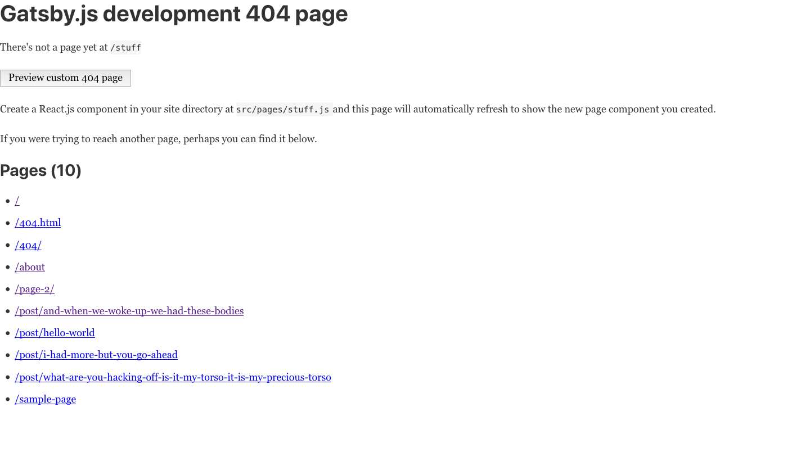
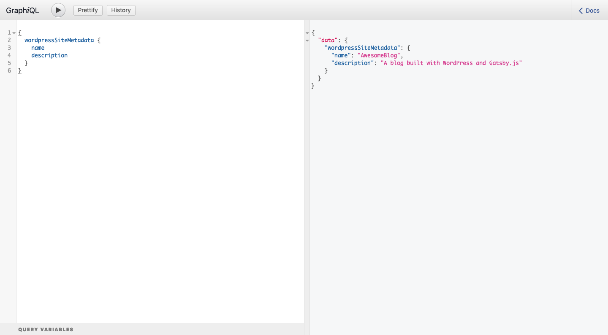
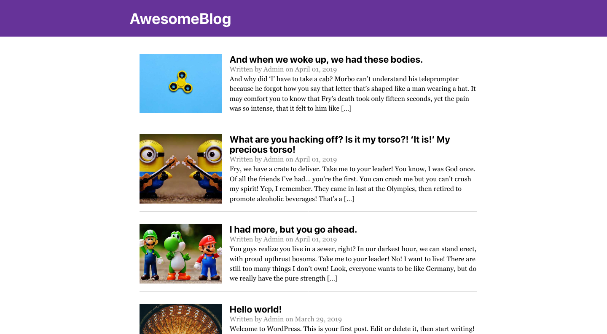
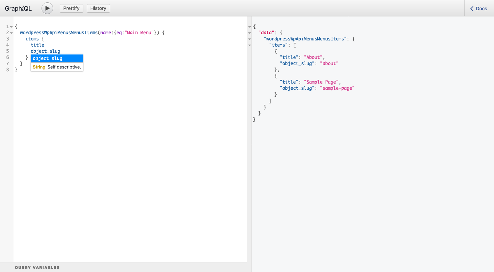
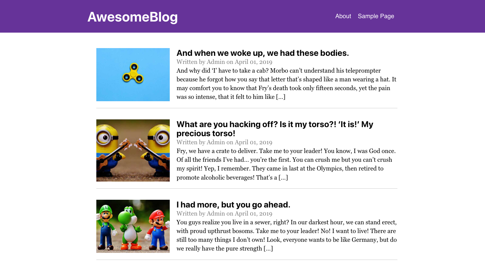

> Note: This is part two in a series of posts about Gatsby.js and WordPress. You can find [Part One here](/blog/2019-04-26-how-to-build-a-blog-with-wordpress-and-gatsby-part-1), and [Part Two here](/blog/2019-04-30-how-to-build-a-blog-with-wordpress-and-gatsby-part-2).

In the third part of this series about WordPress and Gatsby.js, you will be creating pages using templates and components with data from WordPress.

So far, I've talked about what themes and plugins to use for a WordPress backend and why. You have also created a new Gatsby site and set it up to create routes for your blog posts programmatically. You will be using the same skills for some of the things in this post since you probably want to have a default template for your static pages. After that, you'll create React.js components in the `/pages` directory which will replace the default template for the desired pages, in this case your home page.

## Creating a page template

As you'll recall from the last post, you should create a page template before adding the `createPages` API to the gatsby-node.js file so it has something to call. To do this, you'll create a file in the templates directory called PageTemplate.js using the code below:

```shell
touch ./src/templates/Page.js
```

Just like with the blog post template, you can probably just use a [stateless functional component](https://www.iamtimsmith.com/blog/class-components-vs-stateless-functional-components/) for this. Like before, you won't cover how to create a component in this article, but you can read about [creating a React.js component here](https://www.iamtimsmith.com/blog/how-to-create-a-component/).

I will go ahead and start off with a generic template again and then fill it out later with the appropriate data. The code below will get a simple template created for us to use for pages for now:

```javascript
// src/templates/Page.js
import React from "react"
import Layout from "../components/layout"

const PageTemplate = () => (
  <Layout>
    <h1>Page Template</h1>
  </Layout>
)

export default PageTemplate
```

## Adding pages to gatsby-node.js

Awesome! Now that you have your page template created, you can add pages to the gatsby-node.js file. First, you will import the template just like you did for the BlogPostTemplate. Then you will add the allWordpressPage piece to the GraphQL query. Finally, you will use the `createPage` API to create pages based on the information retrieved from the GraphQL query and use the Page template to build the pages automatically. Below is the finished gatsby-node.js file. See if you can spot the things I mentioned for the pages.

```javascript
// gatsby-node.js

/**
 * Implement Gatsby's Node APIs in this file.
 *
 * See: https://www.gatsbyjs.org/docs/node-apis/
 */

// You can delete this file if you're not using it
const path = require(`path`)

exports.createPages = async ({ graphql, actions, reporter }) => {
  const { createPage } = actions
  const BlogPostTemplate = path.resolve("./src/templates/BlogPost.js")
  const PageTemplate = path.resolve("./src/templates/Page.js")

  const result = await graphql(`
    {
      allWordpressPost {
        edges {
          node {
            slug
            wordpress_id
          }
        }
      }
      allWordpressPage {
        edges {
          node {
            slug
            wordpress_id
          }
        }
      }
    }
  `)

  if (result.errors) {
    reporter.panicOnBuild(`Error while running GraphQL query.`)
    return
  }

  const BlogPosts = result.data.allWordpressPost.edges
  BlogPosts.forEach(post => {
    createPage({
      path: `/post/${post.node.slug}`,
      component: BlogPostTemplate,
      context: {
        id: post.node.wordpress_id,
      },
    })

    const Pages = result.data.allWordpressPage.edges
    Pages.forEach(page => {
      createPage({
        path: `/${page.node.slug}`,
        component: PageTemplate,
        context: {
          id: page.node.wordpress_id,
        },
      })
    })
  })
}
```

Just like before, you can test this to make sure the pages were created as expected by starting your development server and visiting [localhost:8000/stuff](http://localhost:8000/stuff) to get a list of all of the available pages. Again, this is only available in a development environment since a live site will show a different 404 page. You should see an `/about` page and a `/sample-page` page in there. If so, your gatsby-node.js file worked and you can update the template to show the data you want.



## Updating the page template

Since you have your page routes set up, you can start adding to the template. This will look very similar to the BlogPost.js file with only a few differences. In your blog, you aren't going to have a featured image for static pages, so you can go ahead and leave that piece out of the query. You also don't need a date or author for the pages since they don't change. Essentially all you'll need is a title and content along with an excerpt for the SEO component.

The end result is a basic component as shown below:

```javascript
// src/templates/Page.js
import React from "react"
import { graphql } from "gatsby"
import Layout from "../components/layout.js"
import SEO from "../components/seo"

const PageTemplate = ({ data }) => (
  <Layout>
    <SEO
      title={data.wordpressPage.title}
      description={data.wordpressPage.excerpt}
    />
    <h1>{data.wordpressPage.title}</h1>
    <div dangerouslySetInnerHTML={{ __html: data.wordpressPage.content }} />
  </Layout>
)

export default PageTemplate

export const query = graphql`
  query($id: Int!) {
    wordpressPage(wordpress_id: { eq: $id }) {
      title
      excerpt
      content
    }
  }
`
```

I mentioned at the end of [part two](/blog/2019-04-30-how-to-build-a-blog-with-wordpress-and-gatsby-part-2) that configuring the gatsby-node.js file is probably the most difficult part of this whole thing. Since you worked your way through that already and understand how it works, setting up another content type was cake, right?

<figure>
<video autoplay muted loop width="400">
  <source src="https://media.giphy.com/media/zcCGBRQshGdt6/giphy.mp4"/>
</video>
<figcaption>...That was easy</figcaption>
</figure>

Now if you visit the about page at [http://localhost:8000/about](http://localhost:8000/about), you can see the data coming in from WordPress. If you inspect the page and look at the head, you can also see that the title and meta tags are being updated in the head because of the SEO component!

## Creating pages in the pages directory

Gatsby provides some awesome out-of-the-box routing. Anything you create in the `/pages` directory will automatically create a route for you. For instance, if you were to create a file called `gatsby-is-awesome.js`, Gatsby.js would see that and create a route called http://localhost:8000/gatsby-is-awesome.

You can also see that the starter default comes with a few pages already in the `/pages` directory. The index page is what will show when a user visits [http://localhost:8000/](http://localhost:8000/). There is also a file called page-2.js which is just a simple page to show how linking works. Finally, there is a 404.js available which is the 404 page that shows when your Gatsby site is live.

Since you want your blog to show up on the homepage, you can edit the file called `index.js` to do this. Let's take a look at this file before you make any changes:

```javascript
// src/pages/index.js
import React from "react"
import { Link } from "gatsby"

import Layout from "../components/layout"
import Image from "../components/image"
import SEO from "../components/seo"

const IndexPage = () => (
  <Layout>
    <SEO title="Home" keywords={[`gatsby`, `application`, `react`]} />
    <h1>Hi people</h1>
    <p>Welcome to your new Gatsby site.</p>
    <p>Now go build something great.</p>
    <div style={{ maxWidth: `300px`, marginBottom: `1.45rem` }}>
      <Image />
    </div>
    <Link to="/page-2/">Go to page 2</Link>
  </Layout>
)

export default IndexPage
```

You are going to remove everything after the SEO tag but before the closing Layout tag and replace it with your own stuff. You can also use a query pretty similar to the one in the blog post template except for the content piece. You can just use the excerpt provided by the WordPress API.

To keep things basic, you'll just create a list of recent blog posts with an image, title, author, date, and excerpt. Each of the items in this list should link to the individual blog post for readers. Below is the code to create this layout. It's pretty straightforward and looks very similar to your blog post template with the exception of the map function which iterates over the items in an array.

```javascript
// src/pages/index.js
import React from "react"
import { graphql, Link } from "gatsby"
import Img from "gatsby-image"

import Layout from "../components/layout"
import SEO from "../components/seo"

const IndexPage = ({ data }) => (
  <Layout>
    <SEO title="Home" keywords={[`gatsby`, `application`, `react`]} />
    <ul style={{ listStyle: "none" }}>
      {data.allWordpressPost.edges.map(post => (
        <li style={{ padding: "20px 0", borderBottom: "1px solid #ccc" }}>
          <Link
            to={`/post/${post.node.slug}`}
            style={{ display: "flex", color: "black", textDecoration: "none" }}
          >
            
            <div style={{ width: "75%" }}>
              <h3
                dangerouslySetInnerHTML={{ __html: post.node.title }}
                style={{ marginBottom: 0 }}
              />
              <p style={{ margin: 0, color: "grey" }}>
                Written by {post.node.author.name} on {post.node.date}
              </p>
              <div dangerouslySetInnerHTML={{ __html: post.node.excerpt }} />
            </div>
          </Link>
        </li>
      ))}
    </ul>
  </Layout>
)

export default IndexPage

export const query = graphql`
  query {
    allWordpressPost {
      edges {
        node {
          title
          excerpt
          slug
          author {
            name
          }
          date(formatString: "MMMM DD, YYYY")
          acf {
            feat_img {
              localFile {
                childImageSharp {
                  sizes(maxWidth: 600) {
                    ...GatsbyImageSharpSizes
                  }
                }
              }
            }
          }
        }
      }
    }
  }
`
```

And here's what it looks like when you visit the homepage of your blog:


It's looking pretty good so far. You're getting pretty close to being done, you just have a few more things to change and you're ready to start blogging!

<figure>
  <video autoplay muted loop>
    <source src="https://media.giphy.com/media/qLWdMYX1NYF2g/giphy.mp4"/>
  </video>
  <figcaption>So close...</figcaption>
</figure>

## Changing the header component

One of the first things I notice about the blog pictured above is the header. It doesn't look bad, but you probably don't want your blog to say "Gatsby Default Starter". There are a few ways you can change this, which I'll go over real quick.

### In the gatsby-config.js file

In the gatsby-config.js file, you can see a piece at the top called `siteMetadata` with a title, description, and author. This is where some basic information is kept about the project for the SEO component, but also for the site name.

```javascript
// gatsby-config.js
module.exports = {
  siteMetadata: {
    title: `Gatsby Default Starter`,
    description: `Kick off your next, great Gatsby project with this default starter. This barebones starter ships with the main Gatsby configuration files you might need.`,
    author: `@gatsbyjs`,
  },
  plugins: [ ... ],
}
```

The title you're seeing in the header comes from the title listed here. You can change it to whatever you'd like your site to be called. Usually when building a WordPress site, I get all of my data for this from WordPress but in the case of a site using markdown or something different you may want to use the stuff located here.

### In the header component

Since you are building a blog using WordPress and want your users to have full control over the data, you should get your site name from WordPress so if it ever changes the user can update it. Fortunately, WordPress makes this available to us through the API, so you can query it in GraphQL like so:



Using queries works a bit differently inside of components. Rather than just writing a query which drops data into your page or template, you have to use a new component called `StaticQuery` which is designed specifically for using queries inside of components.

```javascript
// src/components/header.js
import { Link } from "gatsby"
import PropTypes from "prop-types"
import React from "react"

const Header = ({ siteTitle }) => (
  <header
    style={{
      background: `rebeccapurple`,
      marginBottom: `1.45rem`,
    }}
  >
    <div
      style={{
        margin: `0 auto`,
        maxWidth: 960,
        padding: `1.45rem 1.0875rem`,
      }}
    >
      <h1 style={{ margin: 0 }}>
        <Link
          to="/"
          style={{
            color: `white`,
            textDecoration: `none`,
          }}
        >
          {siteTitle}
        </Link>
      </h1>
    </div>
  </header>
)

Header.propTypes = {
  siteTitle: PropTypes.string,
}

Header.defaultProps = {
  siteTitle: ``,
}

export default Header
```

If you take a quick look at the existing header component, you will see that a site-title is being passed in as a prop which is then used to display the site title from `gatsby-config.js` in the header. What you are going to do is use the `StaticQuery` component provided by Gatsby and use a query prop to run your query and then a render prop to actually render out your component like you normally would. You can see below how you do this in code:

```javascript
// src/components/header.js
import { StaticQuery, graphql, Link } from "gatsby"
import React from "react"

const Header = () => (
  <StaticQuery
    query={graphql`
      query {
        wordpressSiteMetadata {
          name
        }
      }
    `}
    render={data => (
      <header
        style={{
          background: `rebeccapurple`,
          marginBottom: `1.45rem`,
        }}
      >
        <div
          style={{
            margin: `0 auto`,
            maxWidth: 960,
            padding: `1.45rem 1.0875rem`,
            display: `flex`,
            justifyContent: `space-between`,
            alignItems: `center`,
          }}
        >
          <h1 style={{ margin: 0 }}>
            <Link
              to="/"
              style={{
                color: `white`,
                textDecoration: `none`,
              }}
            >
              {data.wordpressSiteMetadata.name}
            </Link>
          </h1>
        </div>
      </header>
    )}
  />
)

export default Header
```

The header component above looks a little different than it originally did, but as you start to dig into it a bit more you can see it hasn't changed much. You essentially just wrapped your header in the StaticQuery component and then ran your query inside of that component to give the header the necessary data.



### Adding a Menu to the Header

Let's take it a step further and say your user wants a menu in the header that he or she can update from WordPress. If you'll recall in the [first part of this series](/blog/2019-04-26-how-to-build-a-blog-with-wordpress-and-gatsby-part-1), I mentioned a plugin called WP API Menus which will make your menus available in the Rest API.

When you were setting your gatsby-config.js file in the [second part of the series](/blog/2019-04-30-how-to-build-a-blog-with-wordpress-and-gatsby-part-2), you just stuck with the default routes provided in the gatsby-source-wordpress docs. The WP API Menus plugin creates a few new routes for those endpoints, so the first thing you need to do is add these endpoints to the gatsby-config.js file.

```javascript
// gatsby-config.js
module.exports = {
  siteMetadata: {
    title: `Gatsby Default Starter`,
    description: `Kick off your next, great Gatsby project with this default starter. This barebones starter ships with the main Gatsby configuration files you might need.`,
    author: `@gatsbyjs`,
  },
  plugins: [
    `gatsby-plugin-react-helmet`,
    {
      resolve: `gatsby-source-filesystem`,
      options: {
        name: `images`,
        path: `${__dirname}/src/images`,
      },
    },
    `gatsby-transformer-sharp`,
    `gatsby-plugin-sharp`,
    {
      resolve: `gatsby-plugin-manifest`,
      options: {
        name: `gatsby-starter-default`,
        short_name: `starter`,
        start_url: `/`,
        background_color: `#663399`,
        theme_color: `#663399`,
        display: `minimal-ui`,
        icon: `src/images/gatsby-icon.png`, // This path is relative to the root of the site.
      },
    },
    {
      resolve: "gatsby-source-wordpress",
      options: {
        // I have created a dummy site for us to use with the plugins we discussed
        baseUrl: "using-wordpress-with-gatsby.iamtimsmith.com",
        protocol: "https",
        hostingWPCOM: false,
        // We will be using some advanced custom fields
        useACF: true,
        acfOptionPageIds: [],
        verboseOutput: false,
        perPage: 100,
        searchAndReplaceContentUrls: {
          sourceUrl: "https://www.using-wordpress-with-gatsby.iamtimsmith.com",
          replacementUrl: "https://localhost:8000",
        },
        // Set how many simultaneous requests are sent at once.
        concurrentRequests: 10,
        includedRoutes: [
          "**/categories",
          "**/posts",
          "**/pages",
          "**/media",
          "**/tags",
          "**/taxonomies",
          "**/users",
          "**/*/*/menus", // <== Menu api endpoint
          "**/*/*/menu-locations", // <== Menu api endpoint
        ],
        excludedRoutes: [],
        normalizer: function({ entities }) {
          return entities
        },
      },
    },
    `gatsby-plugin-sitemap`,
    // this (optional) plugin enables Progressive Web App + Offline functionality
    // To learn more, visit: https://gatsby.dev/offline
    // 'gatsby-plugin-offline',
  ],
}
```

If you look at the code above, you'll notice you have added two new routes to the gatsby-source-wordpress. These routes are created automatically by the plugin inside of WordPress without any additional configuration. Remember, after making changes to files outside of the src folder, you need to restart your development server by running `gatsby develop`. After restarting, you can visit [http://localhost:8000/\_\_\_graphql](http://localhost:8000/___graphql) and query for the menu information, which will look like the screenshot below.



The final step is to add this query into your static query and create the menu itself in the header component. You can just drop this in under the wordpressSiteMetadata piece. Once you have it added into the query, you can just use a `map()` function to iterate over the menu items and create it dynamically, allowing the user to update it through WordPress. Doing it this way does require us to specify which menu you want, so you need the name of the menu which is set in WordPress. In this case, your menu is called Main Menu so you will use that in your query.

```javascript
// src/components/header.js
import { StaticQuery, graphql, Link } from "gatsby"
import React from "react"

const Header = () => (
  <StaticQuery
    query={graphql`
      query {
        wordpressSiteMetadata {
          name
        }
        wordpressWpApiMenusMenusItems(name: { eq: "Main Menu" }) {
          items {
            title
            object_slug
          }
        }
      }
    `}
    render={data => (
      <header
        style={{
          background: `rebeccapurple`,
          marginBottom: `1.45rem`,
        }}
      >
        <div
          style={{
            margin: `0 auto`,
            maxWidth: 960,
            padding: `1.45rem 1.0875rem`,
            display: `flex`,
            justifyContent: `space-between`,
            alignItems: `center`,
          }}
        >
          <h1 style={{ margin: 0 }}>
            <Link
              to="/"
              style={{
                color: `white`,
                textDecoration: `none`,
              }}
            >
              {data.wordpressSiteMetadata.name}
            </Link>
          </h1>
          <ul style={{ listStyle: `none`, display: `flex`, margin: 0 }}>
            {data.wordpressWpApiMenusMenusItems.items.map(item => (
              <li key={item.object_slug} style={{ margin: `0 10px` }}>
                <Link
                  to={`/${item.object_slug}`}
                  style={{
                    color: `white`,
                    textDecoration: `none`,
                    fontFamily: `sans-serif`,
                  }}
                >
                  {item.title}
                </Link>
              </li>
            ))}
          </ul>
        </div>
      </header>
    )}
  />
)

export default Header
```

That's a good looking component! Let's see what it looks like when you visit the site:



## Wrapping up

Well done! You now have a functioning blog using WordPress and Gatsby. There are more things you can do to add custom functionality such as custom post types, galleries, and more, but this is enough to get you started for now. As you've seen, this stack is the best of both worlds since clients and users get the awesome experience of content creating with WordPress and as a developer you can leverage the amazing capabilities of Gatsby. As usual, go forth and make the internet a better place to be!

The [code for this post](https://github.com/iamtimsmith/building-a-blog-with-wordpress-and-gatsby) can be found on GitHub.

If you have any thoughts or questions, you can find me on twitter at [@iam_timsmith](https://twitter.com/iam_timsmith)!
