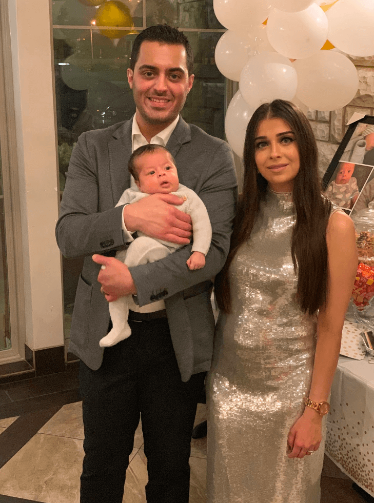

_When I met Ahmed Alahmady in March 2018 at a React Dallas meetup, I was incredibly impressed by his perseverance and dedication to programming. We caught up recently to discuss Ahmed’s progression in Gatsby, life, and career._

**Sam Bhagwat**: You started using Gatsby in late 2016. Could you talk a bit about where you were then, personally and professionally?

**Ahmed Alahmady**: I was unemployed. This was a couple months after leaving medical school. I spent a couple years in med school, but left after a couple of incidents that really shook me, including a patient at a clinic we misdiagnosed as pregnant and then had to explain to her that she actually had a tumor growth. I love the science -- I love the medicine, I love bio-chem. I knew I could do the science. But I didn't know if I could do the human part.

After leaving, personally I had no idea what I wanted to do, but I had to find something to do pretty quickly before my living situation got harder. I had never worked on anything to do with code whatsoever. I didn’t know what a MEAN/MERN/LAMP stack was. Basically zero idea about anything with code.

**Sam**: How did you get started with Gatsby?

**Ahmed**: Around that time, late Christmas of 2016, I was going to code for sure, but didn't know what I was going to go into. I learned how to use GitHub.

So I searched React, and saw repos that were getting updated frequently, and saw Gatsby. The README and description doesn’t look anything like it does now -- it was just "build a static site with React and GraphQL"

I dug a bit, and saw [Kyle’s clone of Instagram](https://gatsbygram.gatsbyjs.org/), and I was like "holy shit it's fast". At the time, it was mind-blowingly fast.

I learned a lot of basic JavaScript functionality from [reading the Gatsbygram code](https://github.com/gatsbyjs/gatsby/tree/master/examples/gatsbygram) -- map, for each, and so on. I would open up an issue when I got stuck, which in retrospect I’m shocked Kyle responded to all my questions.

My wife and I were living in a two bedroom apartment, and couldn’t really pay for it -- we were pretty close to broke. And we didn’t necessarily see eye to eye about me leaving medical school.

So I promised someone that I would make them a website for \$2K. It was a carpet store and they needed something to replace their triplicate forms.

At that time, I didn't know how forms worked, I didn’t know how events worked, and so on. I didn't know anything. But I had 60 days to do it, and that pushed me.

After a while, I finally got a two-page, multi-step form going on. I handed it off and I didn't even expect payment. I wasn't happy with how I did it.

I felt like I was just chugging my way through stuff I didn't really understand. I felt like I was just trying to replicate the [Gatsbygram code](https://github.com/gatsbyjs/gatsby/tree/master/examples/gatsbygram) without really knowing what was going on.

**Sam**: I feel like that's how it works for a lot of folks who are learning to code -- getting it working, but not exactly sure how or why it works. That was definitely the case when I was learning.

So after the carpet store, what happened next?

**Ahmed**: That was in March 2017.

Over the next few months I knew there was no way for me to learn all of coding. But I decided to just be good at what Gatsby does, which is React and GraphQL. So I started just building random sites -- my friend's friend needed a website, so I began doing that. And as I started writing that, it became more natural to me.

Then things started picking up on the job front.

I was going to lunch with a director of a company that was maintaining 100 different lawyers’ websites, on 100 different instances of WordPress. I was showing them what I'd done with Gatsby and React -- how fast it was. I got an offer from that firm, but I also applied to Match.com, and got an offer which I ended up accepting.

**Sam**: Do you think the Gatsby stack helped you getting the job?

**Ahmed**: The Gatsby stack is 100% solely responsible for where I am now.

React has changed the way the web works. Twitter, Amazon, Facebook -- every company in the world is looking for React -- and if they're not yet, they will.

And GraphQL is great -- if you know what resolvers do, it supercharges your frontend development. It lets you get your data into your frontend without jumping through 100 hoops.

The other company -- they didn't know what React was back then -- now today they're putting out 20-30 positions for React developers. I get contacted on LinkedIn multiple times a day for companies in Dallas looking for React engineers.

If you need to survive, learn React, put it on your resume, and you'll probably get an interview. React is the most looked-for skill in web development right now.

**Sam**: And if you’re looking to learn React, why Gatsby?

**Ahmed**: A lot of the hard work goes away. It's really easy to build with. And it doesn't matter where your data is.

Plus, Gatsby makes it really easy for your site to be really fast, which is great for showing other people. It really blows people’s minds. When I showed the director at the firm I ended up turning down my Gatsby sites, he called two of his friends over because he was so stunned. He was like, "how is it this fast?"

**Sam**: So July 2017, you joined Match, what did your growth look like there?

**Ahmed**: When I joined, my manager told me, we're going to stick you on bugs for a couple weeks, so you learn the codebase. And then three days later, I'm building a feature.

There were a few things I had to learn -- Git etiquette, not committing to other people's branches, not running Prettier on other people's code - being strategic and surgical.

But there's stuff you just can't learn until you work professionally -- how to be an effective team member, how to weight tickets.

A lot of times, when we're learning to code, we get caught up in "is my resume perfect?" but when I was interviewing people, we were looking for, can we find people who want to learn? Do you like playing around with cutting edge tech?

And that's why Gatsby's great.

**Sam**: What advice would you give to people learning to code looking for the right tech stack?

**Ahmed**: If there's something I tell people coming out of dev camp, is be invested in something that other people are invested in.

Don't just pick something with 2 stars on GitHub -- of course stars aren't a perfect measure, but still -- pick something with a community, with conversation, with features and bug fixes going out all the time.

With Gatsby, I was able to get rapid, direct responses whenever I had a problem or challenge -- and that's not something that's common with open source. And you have so many people building things on Gatsby -- there are a ton of examples of how to build things, how to find things, that you can go into, with all the starters.

Even if you're just learning React by itself, Gatsby is a huge help.

The biggest advantage of Gatsby is the community behind it. No matter what library you use, you're going to run into issues, but the important thing is to have thousands of people running into the same issues alongside you.

I guarantee you, if you see an error when you’re using Gatsby, you're not the first person to see it. There's documentation for what you should do.

**Sam**: What I’m hearing is that this rich ecosystem of docs, starters, and so on is really helpful.

**Ahmed**: The scariest part of learning to code is having nothing and not knowing where to start.

My mom is learning how to code. Not for a need to get a job -- just for fun. And guess what she's using: Gatsby!

If I had to do it all over again, I'd do it the exact same way.

**Sam**: How did your career change over the last two years?

**Ahmed**: I was at Match for just over a year. Early on, I was earning my stripes, but about halfway through, I got to build a GraphQL server as well as help convince the team to use Gatsby to build some microsites.

When I moved to my next job -- my current role at Hilton -- I was able to more than double my salary. And that changed a lot of things.

My wife and I have a really strong relationship -- turns out being in a good financial place helps a lot with that. And when I got this job, that's when my wife and I decided to have a kid -- our daughter was born three weeks ago. Because we had enough money that it seemed reasonable to do so.

I’ve got into TypeScript, really thinking about JavaScript performance, multithreading, deep into webpack. One of my current projects is creating a design system that is unified across 15 brands.

Now it feels like if I wanted, I could get five job offers in a week.

It's crazy for me to think where I am now versus where I was two years ago. I can't believe it.

**Sam**: That’s amazing on so many different levels. Any last thoughts?

**Ahmed**: Gatsby has a library that makes a lot of hard stuff easy. It has a stack that is the most valuable in the world -- React, Node, GraphQL.

There's no better stack in the world, and there's no better way to learn programming than just combining all of it.

**Sam**: Thanks for sitting down and chatting Ahmed!
