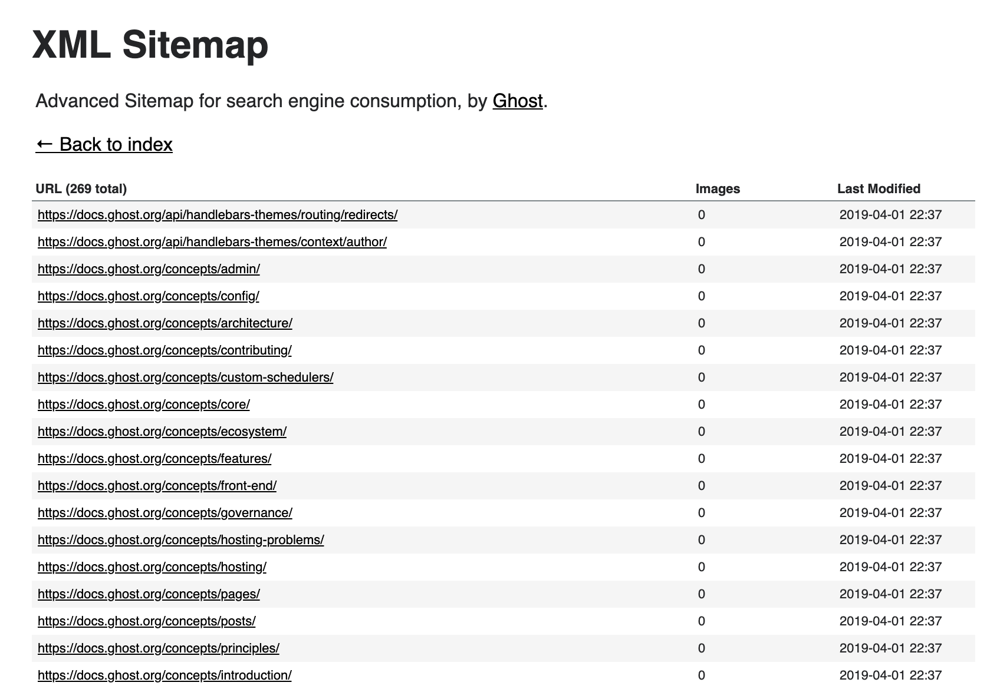
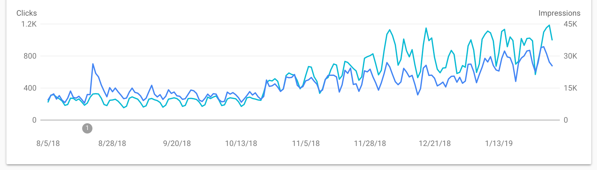

In recent months, I’ve been working on projects for [Ghost](https://ghost.org/) with a JAMstack approach and using the Gatsby framework to build websites. It’s been an exciting journey that began when we rebuilt our [docs](https://docs.ghost.org/) site from the ground up – now we’re migrating all of our sites to use the same technology.

It’s been a pleasure working with this stack and getting to grips with a modern website generator like Gatsby. At Ghost, we have a small team of engineers, designers and marketers who collaborate on projects like this to ensure the end result hits the mark.

Some of the things I worked on were implementing performance enhancements and SEO best practices to ensure our new docs site ranked well in the search engines. This included pulling in custom meta data and structured data via the Ghost API (which we are using as a Headless CMS), and implementing XML sitemaps.

I wanted to recreate the default advanced sitemap structure that we use for all Ghost publications on Gatsby, and since it’s an open source project, I was able to go ahead and build a [plugin](/packages/gatsby-plugin-advanced-sitemap/?=sitemap) which is now available for anyone to use!

### Automatic, advanced sitemaps

The plugin generates an organised sitemap that is accessible to both humans and robots and is also capable of generating single or multiple sitemaps with full XSL templates.

<figure>
  
  <figcaption>
    Demo:{" "}
    <a href="https://docs.ghost.org/sitemap.xml">
      https://docs.ghost.org/sitemap.xml
    </a>
  </figcaption>
</figure>

The plugin will work out of the box without any additional configuration, but also allows for individually organised sitemaps with a small amount of config work. Once in place, your Gatsby sitemap will be automatically updated and fully optimised for SEO performance.

### The results?

Rebuilding our docs site using Gatsby was a huge success. We saw major improvements to our SEO performance within two weeks of launching, and watched as our rankings improved and organic search visibility increased drastically over the following months:

<figure>
  
  <figcaption>
    In 6 months organic search impressions have increased by 235% & organic
    traffic is up 120%
  </figcaption>
</figure>

This success can be attributed to having improved content and meta data, a lightning-fast website powered by Gatsby and Ghost, and from submitting our new advanced sitemap to the search engines. From now on when we publish new content, the sitemap is automatically updated and content is indexed quickly by the search engines.

### Installing the plugin

Rather than making the sitemap plugin platform specific, it was built to work with any Gatsby project. You could be using Ghost as a Headless CMS, or any other software to build your site, and use the plugin for free.

<pullquote>
  Visit the{" "}
  <a href="/packages/gatsby-plugin-advanced-sitemap/?=sitemap">
    Gatsby plugin library
  </a>{" "}
  page to get started, or download directly from{" "}
  <a href="https://github.com/tryghost/gatsby-plugin-advanced-sitemap">
    GitHub
  </a>
  !
</pullquote>
