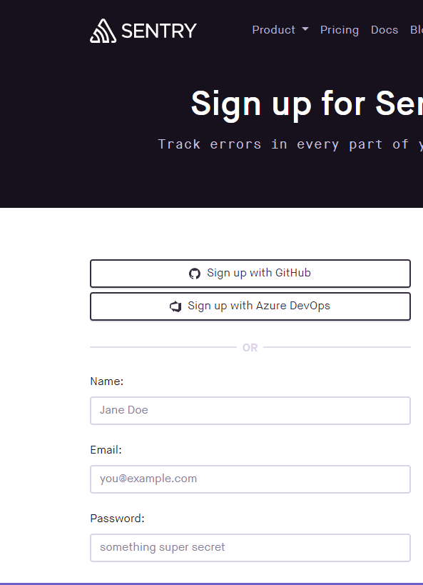
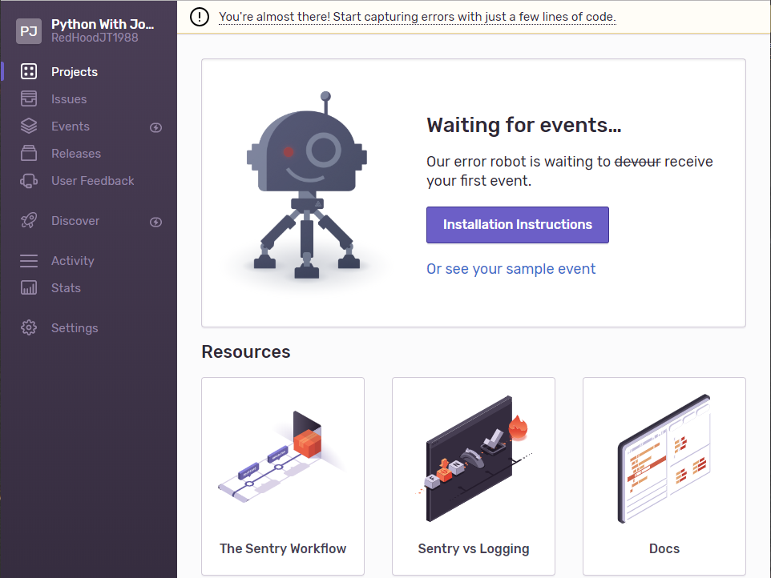
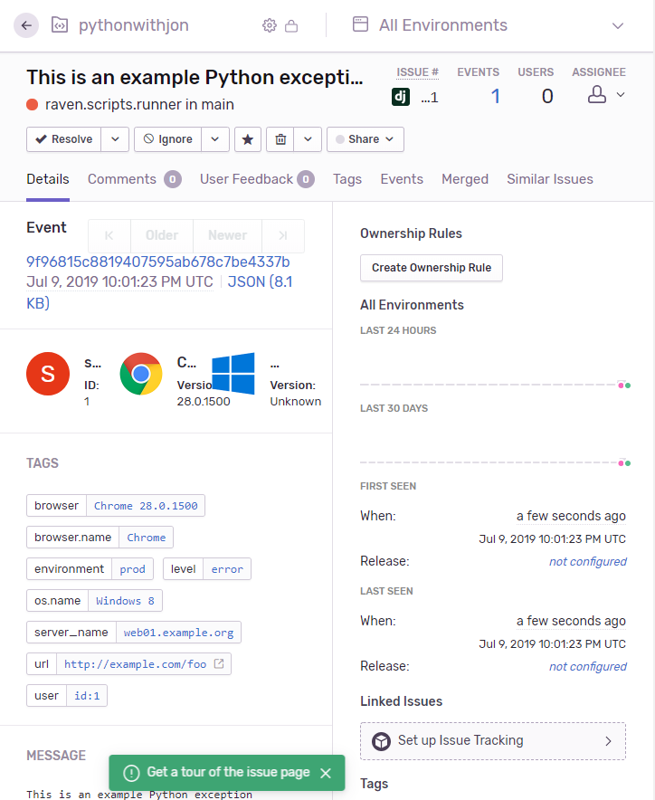
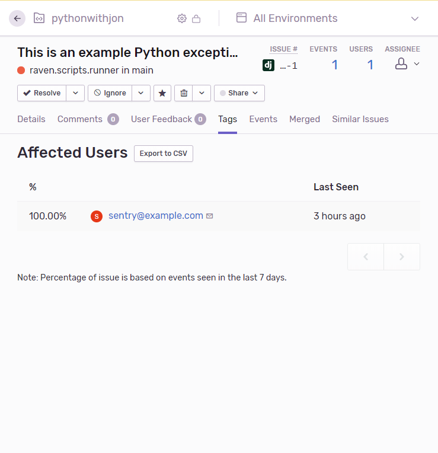
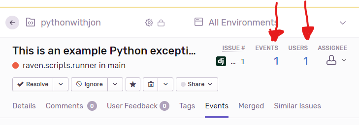

## Assuming knowledge on my part
I'm going to do something that you are told not to ever do and assume that you already have a project created and are just looking to install an error tracking software to help you fix and resolve errors before any users find it or at least before majority of your users find it and start complaining. 

## What is Sentry?

Are you tired of waiting for users to find and report errors with your application or website? Then look no further than Sentry. 

Sentry is an open-source error tracking library that helps developers monitor and fix crashes in real time. Sentry is iterating continuousy to boost efficiency and improve user experience. No begs the questions how easy is the setup? And what will it cost me? I'm going to answer the second question first, ready? Sentry has a free tier you can start for free right now. The plans are pay as you go. The free tier is most likely all you will need at first. But after your user base grows you might want to consider upgrading. They don't require you to fill out a contract, you can upgrade or downgrade at any time. Rates will be automatically adjusted at the beginning of your next billing cycle. How awesome is that?

Now on to the point of this post. How do you install the wonderful software with your Gatsby project. The next few steps are going to show you how to go about doing that. Are you ready? Great let's get started. 

## Installation and directory structure
Step 1. Head over to the Sentry website to signup for your free tier. If you have an Azure DevOps account you can use that if not I recommend just using your GitHub account. But if you would rather it be tied to say your email then by all means use that. See below image of signup page.



Step 2. Now that you are setup with an account and logged in you should be taken to a page that has a navigation on the left with projects, issues, etc. See below screenshot 




Step 3. I am going to be using React in this tutorial. We are now going to install the Sentry SDK as a dependency using yarn or npm. You will need to use @sentry/browser as well which we will setup below.

```shell
# Using yarn
$ yarn add @sentry/browser

# Using npm
$ npm install @sentry/browser
```
## React code to connect to Sentry
After installing Sentry you will be given a value which has been dubbed a DSN or Data Source Name. It looks a lot like a standard URL, but it's just a representation of the configuration required by the Sentry SDKs. It consists of several things including the protocol, public key, the server address, and the project identifier.

You should initialize the Sentry browser SDK as soon as possible during your application load up, before initializing React.

## index.js
```js
import React from 'react';
import * as Sentry from '@sentry/browser'
import App from src/App';

Sentry.init({dsn: "https://e4d7f7754b8343e2b070ccbc97d26ff7@sentry.io/1469128"});

ReactDOM.render(<App />, document.getElementById('root'));
```

## Trigger your first event from development environment

Step 4. You can actually trigger your first event from your development environment by raising an exception somewhere within your application. A great example, which is in the documentation for Sentry, is to render a button like so:
```js
return <button onClick={methodDoesNotExist}>Break the world</button>;
``` 

## Looking at your events page
Step 5. With the event in place you can now click on the issues link on the navigation bar to your left. This page will list out your events that you have in progress and also in real time. You can use the drop down menus to select how to sort the issues. 



## Seeing the List of User's affected
If you want to see the list of users that are affected by the erros then click on the blue numbers on the issues page. You will then be redirected to the list of users. The below screenshot will show the blue number and location of what I am talking about.




***Note: This also works to get a list of events. You just click the blue number under Events instead of Users.***


