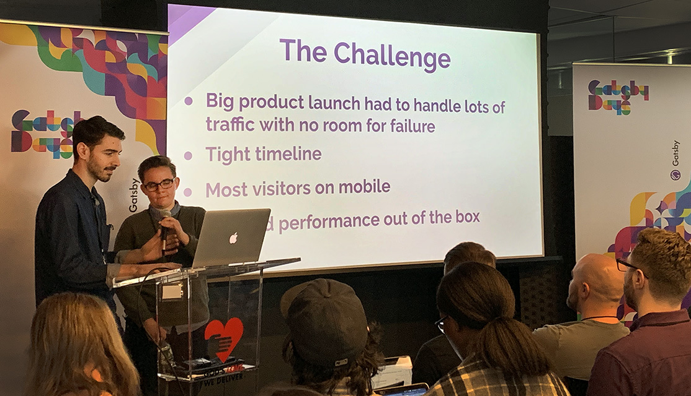
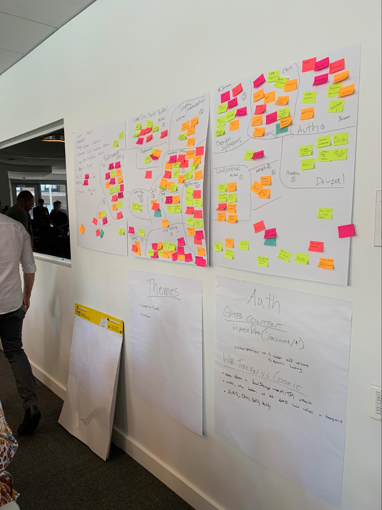
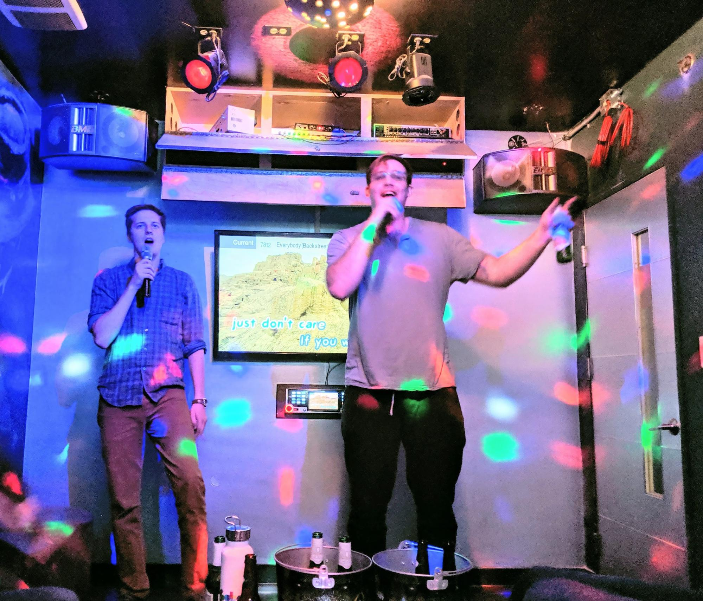
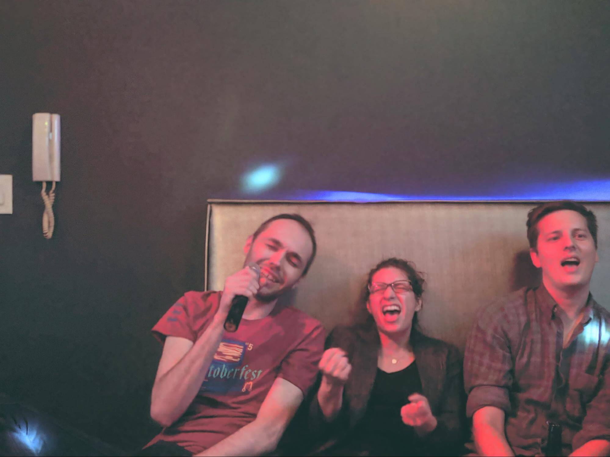
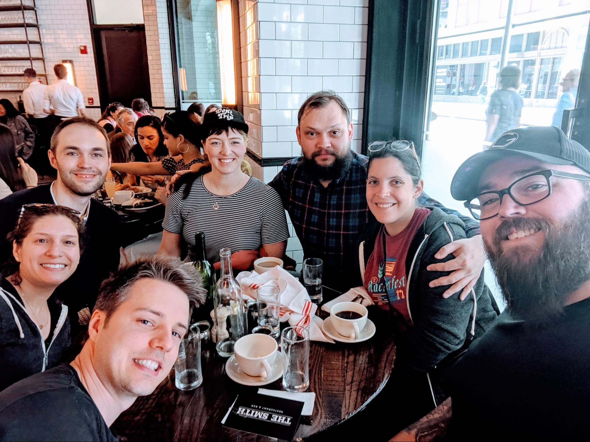
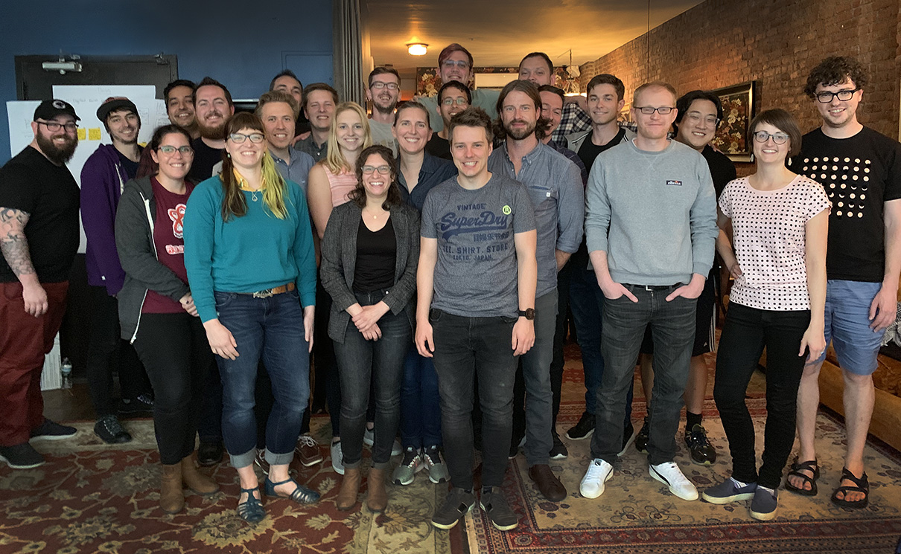

"You belong here" is a core tenet of both Gatsby, the open source project, and Gatsby, the enterprise. Involving the developer community in this adventure to the frontend far horizon has been our prime directive ever since launch. In the past four years we have worked alongside a constellation of 1,900+ contributors helping to build Gatsbyjs and created a robust library of useful plugins. All along, Gatsby’s competitive advantage has been the strength of its community and ecosystem: we came this far this fast thanks to users who rolled up their sleeves and pitched in.

Gatsby Days is one of our ways to say thank you. ([Another is tasty swag for contributors)](https://www.gatsbyjs.org/contributing/contributor-swag/). This series of single-day conferences aims to connect the Gatsby community with Gatsby’s creators, core team and most of all each other. Our first event was held in San Francisco this past December, and our second Gatsby Days gathering just took place in New York on May 6th.

Tens of thousands of developers are out there building both personal and commercial website projects on Gatsby, and gathering as many of you as we possibly can in one place is pretty incredible for the Gatsby team. We get to talk about what we are doing -- an overview of our current product roadmap and the future of modern website development -- with people who not only get it but love it as much as we do.

The NYC gathering kicked off with a quick tour of "[What is Gatsby](https://www.gatsbyjs.com/gatsby-days-NYC-jason)" by Jason Lengstorf, followed by founder Kyle Matthews’ "[The Future is the Cloud](https://www.gatsbyjs.com/gatsby-days-NYC-keynote-kyle)" keynote address, as well as [Chris Biscardi on Gatsby Themes](https://www.gatsbyjs.com/gatsby-days-NYC-themes). Attendees also heard true-life success tales from companies using Gatsby for large-scale projects. For all the Gatsby Days videos, see here.

Tim Brown, a senior software engineer for Harry’s Inc/Flamingo, was tech lead for this upscale shaving products’ new website targeted to female customers. Tim [spoke about using Gatsby](https://www.gatsbyjs.com/gatsby-days-NYC-flamingo) to build a performant, visually-appealing, and secure site with relative ease. "The architecture performs well across browsers and devices, emphasizes developer ergonomics and modern tools, and lets us continuously deploy with confidence," he said. "We think shopflamingo.com can be a model for how to architect future e-commerce sites."

Brian Webster, founder of the LA-based Delicious Simplicity web design and development agency, spoke about how [Gatsby is a gamechanger for his team](https://www.gatsbyjs.com/gatsby-days-NYC-delicious-simplicity). Brian described how his search to replace Drupal and WordPress led to standardizing on Gatsby. In fact his team came to love Gatsby’s React component approach so much that they have now refactored two dozen existing client projects into Gatsby applications!

After lunch there was a 90 minute Unconference, which allowed the attendees to create the agenda. The attendees identified several topics of interest, then everyone cast a vote for the topic that most interested them, followed by separating into smaller groups to discuss. The Unconference session helped break up the day and gave the attendees time to interact with each other and the core Gatsby team.

The afternoon wrapped up with a series of 10 minute speed presentations from Gatsby staffers on [explaining Gatsby to clients](https://www.gatsbyjs.com/gatsby-days-NYC-clients), a [deep dive on Gatsby Image](https://www.gatsbyjs.com/gatsby-days-NYC-images), and a [preview of Gatsby Preview beta](https://www.gatsbyjs.com/gatsby-days-NYC-preview).

After all that, everyone was definitely ready for happy hour. It was an enjoyable chance to get social with fellow attendees and speakers over drinks and food, and to talk over the themes from the day.

Gatsby Days was the perfect energizing kick off to the rest of the week: our spring Gatsby Gathering. Since Gatsby is a distributed team, we mostly interact with each other and community members through GitHub and Slack. With team members sprinkled all over the globe, everywhere from California to Finland to India, it’s a priority for us to convene every few months in person. Each time we get to connect, we play together -- in NYC there were outings to Broadway, a food tour of Brooklyn, and late night karaoke -- and make great strides during a week of face to face collaboration.

Fun bonus fact: we met in a swanky 1920s speakeasy-themed space called [38 Parlor](https://liquidspace.com/us/ny/new-york/38-parlor), which provided the perfect Great Gatsby vibe.

This was the first time we incorporated Gatsby Days into one of our Gatsby Gatherings, and the two were an ideal fit. Look for the next Gatsby Days event coming up on September 30th, as part of our fall Gatsby Gathering in London!
