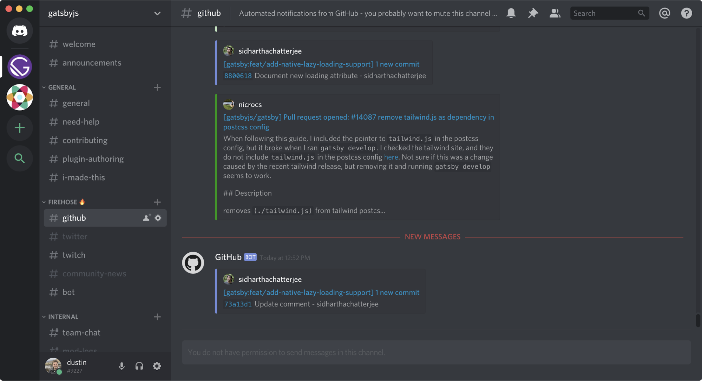

_Note: A "core maintainer" is an official member of the Gatsby team--you'll see them around GitHub day-to-day and they're accessible via the `@gatsbyjs/core` team. Gatsby Core is the open-source Gatsby you know and love, e.g. [gatsbyjs/gatsby](https://github.com/gatsbyjs/gatsby)._

The day-to-day responsibilities of a core maintainer are some of the most challenging of any in the organization. Constantly being pulled in many, seemingly infinite directions leads to a feeling that it's challenging to get productive work accomplished. Balancing community needs, internally surfaced issues and support requests, and a desire to work on substantive bug-fixes and features is a **hard problem.**

In this post, I attempt to outline a model for a productive, healthy, and balanced schedule for a core maintainer. In doing so, I also hope to illustrate the decisions, trade-offs, and general thought process for approaching the day-to-day responsibilities in a way that is as productive as possible. The ideas in this post are informed by the following guidelines:

- Time-boxing and focus/productive time
- Consider the impact of work you’re doing
- Nurture and focus on the community, when you can
- Take breaks
- Productive interruptions
- Reserve time for play
- Know when to pivot, and ignore all of the above

Important caveat: treat this as a guide--it is by no means exhaustive, nor representative of how each individual works most effectively, but it does serve as a reasonably accurate model of a productive core maintainer.

## What exactly is productive work, anyways?

Before we get started, let's take a step back and ask: what exactly is "productive work" for a core maintainer?

In general, a non-exhaustive list of productive work: is work that drives valuable outcomes for…

- the community
- Gatsby Core, or
- other teams at Gatsby.

An ideal scenario is work that intersects with all three, or that unblocks or leads to future work that can reach a wider audience.

Some examples:

- **Shipping roadmap features**. Many roadmap features are usually high-effort, but often hugely impactful in helping large numbers of Gatsby users.
- **Shipping meaningful, small bug-fixes**. Many small bug-fixes are low-effort and medium-impact. They "move the needle" and improve the day-to-day experience of using Gatsby for a non-trivial amount of users.
- **Reviewing PRs**. Giving timely, thorough, and fair reviews for pull requests from both the community and other Gatsby Core team members unblocks future work or changes required for merging, and delivers or eventually delivers meaningful fixes or improvements for the community, at large.
- **Helpful, targeted use of expertise**. Unblocking a community member or Gatsby team member, which may take just a few minutes of your time may unblock and drastically reduce the time spent on a particularly tough issue by an ally. If someone surfaces a question in Slack or Discord—if you have a few moments, help them out!
- **Pairing**. Leveraging your skill set to help another member of the team is a great way to get a meaningful feature delivered more quickly. Hop on a Zoom and build something great!
- **Writing**. Writing docs, writing a blog post, speaking at a conference or on a podcast, cultivating community members to level-up, etc. [See “Why we Write” by Sam Bhagwat](https://www.gatsbyjs.org/blog/2019-04-19-gatsby-why-we-write/).
- **Creating issues**. Create and/or edit issues, RFCs, etc. for community members to discuss or pick up. If the community is able to pick up these features, fixes, and documentation tasks, it frees us up to focus on large-scale projects which tend to be more complex and require more focused effort.

This is by no means a complete list because the day-to-day work of a maintainer can seemingly vary in infinite ways. However, it does serve as a valuable mental model to think of when considering "what is productive work?" A question to consider when considering if something is productive is as simple as:

> Could the work I am doing now lead to improvements to the Gatsby ecosystem for a non-trivial amount of users?

If **yes** -- that seems like a valuable use of your time and would qualify as productive work.

If **no** -- think hard as to whether this is something that needs to be done, or whether it's something that you _want_ to do.

## Start of Day (2-4 hours)

A Gatsby Core maintainer wakes up for the day. It could be morning, or it could be the afternoon--whenever he/she feels best about starting his/her day! The team is entirely distributed and fully remote, so unless you need to pair or work with others in a similar timezone on a particular task--always feel comfortable starting your day when you feel most productive and prepared!

Prior to starting the day, I like to head to the gym--which helps me collect my thoughts without distractions and best prepare for the day. Always feel welcome to take some time for mental health--the day can sometimes be a little exhausting, and allotting time in your day to focus on yourself only helps you feel even more prepared for whatever comes next!

### Issues and PRs - 👨‍🚒

After some time for collecting my thoughts--I feel energized, enthused, and ready to begin! I like to start my day by revisiting PRs and issues that were created or updated since I was last available/logged-in, and I do so with Discord, specifically the `#github` channel in Firehose 🔥. This lets me keep my e-mail notifications clean, while also mitigating any risk of missing too much info or PRs/issues/etc. where I may have been requested for feedback or received feedback. I may reply to a few PRs or issues, or I may even allot some time to do smaller bug fixes if they can be done in a reasonably short amount of time (e.g. 30 minutes). Starting my day this way let's me see what others are struggling with, and it's also a relatively stress-free way to get back into the swing of things without exhausting a ton of cognitive effort, win-win!

I mentioned reviewing PRs and issues, so let's talk a little about the actual process of reviewing PRs and issues, because it's by no means easy!

### Reviewing PRs

The overarching principle to follow when reviewing the work of others is to be kind. Our community is one of our biggest assets, and we have cultivated an environment where everyone belongs and anyone is welcome. Simple grammatical tweaks as a PR? Yeah -- thank you very much! Docs change? Oh hell yeah, we love those! Deep diving into something in Core? Sweet--we appreciate you! All contributors are welcome and all contributions are valid. Oftentimes this could be someone's very first PR, so we should make them feel welcomed and make it clear that we appreciate their contribution. In reviewing a few of these PRs, some of them may certainly seem like they're good to go! I'll pull them down locally to validate, and if all looks good--let's merge! We publish **early and often** so I'll go ahead and publish a patch release of the package, presuming no breaking changes.

_View PRs charitably and in the best possible light._

### Reviewing Issues

Issues are a front-line support system to help others struggling with Gatsby. These are people we absolutely want to help because they're struggling with something and we want to unblock them. They are our champions who care enough to open an issue and request our assistance in solving a problem. Excellent support turns them into fans, contributors, and friends. However, on the flip side issues can also sometimes be a little frustrating and a huge time sink. It's a lot of work to diagnose a bug, so if it feels like the requestor isn't providing helpful, actionable resources for you to best assist, kindly suggest that they [supply a reproduction](https://gatsby.dev/reproduction). This lets you maximize the amount of time you can help others who have done some up-front work and focus on the issues that can be most easily and quickly remediated.

Always help those who are struggling, but insist that they also help you help them.

Sweet! You have reviewed a few PRs, helped solve an issue or two, and possibly fixed and PR'd a small bug. A nice, enjoyable start to your day, and now you can feel like you've helped out the community while also not exhausting a ton of mental effort in doing so.

## Middle of day to end of day (4-6 hours)

Feeling pretty good! Community focused tasks make it clear that the community is, and will always be, a priority for Gatsby. However--we also want to measurably move the needle forward and make Gatsby better for everyone. This will often involve features and fixes that require a deep context and understanding of Gatsby internals. Oftentimes (perhaps most of the time) these will correspond to a roadmap item which will support eventual larger goals tying to an Objective and Key Result (OKR), Key Performance Indicator (KPI), and/or another team at Gatsby, e.g. Cloud. These are features that require deliberate focus to think about, approach, and ship with minimal outside distractions. To this end, some have found it valuable to block off chunks of time in their calendar so that meetings can't be scheduled, Slack is in do not disturb, etc. If these measures help you to truly focus and ship impactful features, by all means--do so! All at Gatsby recognize the value of focus and how it can effectively drive key results and features.

### Make moves and ship, as often as possible.

However--meaningful fixes and features are absolutely by no means the only or even always the most valuable use of focus time. You may need the mental head space to write a truly impactful blog post. You could use this time to lean on your area(s) of excellence to move an open PR to the finish line (whether it's documentation, deep Core knowledge, or something else entirely). It could be a great time to outline and jot down notes for a great conference talk, podcast, or document a current or upcoming feature (like a Request for Commentary--RFC). Whatever you work on--the overriding principle should again be an awareness and appreciation that your time is valuable, and reserving this focus time to deliver **impactful value to a significant amount of Gatsby users** is paramount to ensuring the Gatsby ecosystem remains an incredible place for everyone.

### Meaningful Outliers

The Core Maintainer outlined in this post resembles that of a rote automaton, an exemplary robot who is somehow able to focus entirely on the task at hand for continuous chunks of time. This is not a human, or at least not a human every day of the week. In fact, focusing too much on the pursuit of productive work can lead to a sense of burn out and frustration--thereby inducing a sense of sadness or depression that you tried to be productive and were unable to do so. However, this is the nature of being an engineer. It's oftentimes a creative art in every bit the same way as writing, painting, and other artistic endeavors. Coder's block can be a true struggle--don't get down: embrace it, recognize it, and find outlets where you can be helpful and re-build confidence and focus to get back to where you are the best version of yourself!

Whenever this happens, reserve the right to pivot and focus on other activities. I'd like to outline a few areas that I denote as meaningful outliers, activities that may not be done every day but are helpful in qualifying extra work that may not always lead to valuable outcomes.

### Interruption Time

When you reach a good stopping point, or you feel that you're not able to make a lot of progress on something you're working on currently--always feel comfortable to pivot and find other, valuable ways to contribute. Use your hard-earned skills to make contributions in other realms, perhaps in areas you enjoy and/or that could hone your focus after a productive "break." You may find yourself doing things like:

- **Reviewing PRs**. Getting some "quick wins" for PRs that can be merged easily or with a few, small tweaks
- **Helping out on Discord**. Seeing if there are any questions you can help answer or open PRs/issues you may have some expertise to advise
- **Internal Support**. Checking Slack, chiming into a discussion and/or perhaps helping out another team with an issue they're running into
- **Small features or fixes**. Delivering a relatively non-time consuming bug fix or feature that closes an issue, or that helps out another team at Gatsby (but that may not be prioritized or super valuable for unblocking future work)

_Reserve the right to shift priorities and work on interrupt-driven tasks, when you need to do so._

### Play

In much the same way as interruption time, play can be one of the more valuable things you can do not only for yourself, but also oftentimes for Gatsby. These are the passion projects, the truly fun exploratory work that may not necessarily result in some outcome, nor are they tied to a roadmap or other prioritized task. These are by their very nature experimental and may not always result in valuable outcomes for Gatsby or for the community. However, the lack of a measurable outcome does not invalidate the value of the work. Perhaps you will gain an insight or learn a technique that you can then apply to a future, meaningful problem. You may learn more about a feature or functionality that will help you explain it and understand it in much more depth. You may even create a functionality that will be crucial to users adopting the next version of Gatsby, or discover an insight that will be valuable to other teams within Gatsby. All are valuable outcomes, and the value of play cannot possibly be understated. Of course--play needs to be done in moderation; we can't play all day, in much the same way that children can't spend all their time at recess--however much they wish that were the case!

_Play, experiment, learn, and apply._

## Step Away

There is nary a programmer who doesn't have a story about working on a problem all day, hitting obstacle after obstacle and growing increasingly frustrated for lack of a solution. They step away for the day, revisit it the next morning, and et voila--the problem is clear and obvious and is solved in minutes. Always feel empowered to reserve the right to take some time to yourself and collect your thoughts, to do things like:

- Go for a walk or a run
- Head to a coffee shop and get a change of scenery
- Go to a movie, or watch a TV show or a video on YouTube
- Jump into a game or a task that may not require a lot of cognitive effort

In any case, oftentimes stepping away from the problem and revisiting it with a clearer head typically results in valuable outcomes and an improved understanding of the potential solution or strategy to solve the problem.

_Step away and revisit challenging and blocked problems later, as needed._

## Closing notes

Due to the infinitely varied tasks that can be worked on day-to-day, this entire post is very possibly inaccurate from the outset. It _could_ represent a typical day, but oftentimes, a core maintainer’s day-to-day will differ every day, every week, and every month. We are chameleons who adapt to changing requirements and shifting priorities to best accommodate the moving target of **making Gatsby as great as it possibly can be for as many users as possible**. Some days may be more focused on delivering a hugely valuable feature. Others could be more support work and community engagement. Others still may be a bit more play and interrupt-driven work. All are valuable outcomes, and all are examples of meaningful, productive work.

That said--this post does intend to show and explain the thought process and rationale for helping plan your day in a way that can oftentimes be most productive. It may not exactly match your most productive day (e.g. perhaps you like to start your day with working on features, perhaps you like to work on features near the end of the week, etc.), but it is my intent that it serves as a gentle guide and a helpful, living and breathing post for an exemplary Core Maintainer. We're so glad you're here, and we can't wait to see all the great things you'll continue to do!
