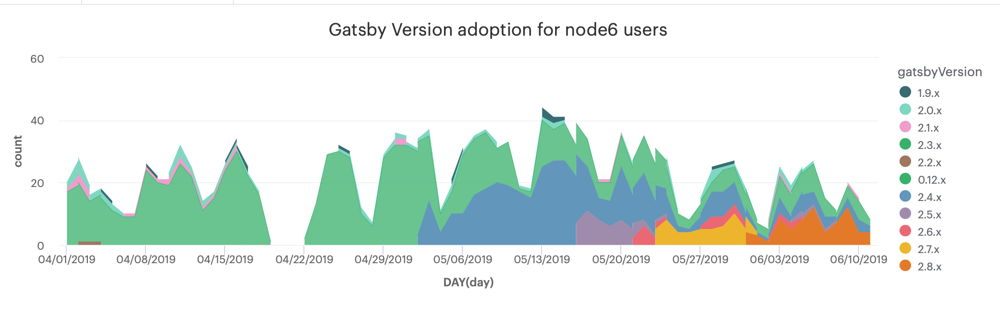

Effective in Gatsby v2.10.0, we are making a potentially breaking change and dropping support for Node 6. We don't take this decision lightly, and realize that there is _potential_ for breaking applications by not following [semantic versioning][semver] _strictly_ and releasing a new major version of Gatsby (v3.0.0).

We are making this decision because Node 6 was transitioned into end-of-life status on April 30th, 2019. As such, we're reluctantly dropping support as more and more of Gatsby's dependencies also drop support for Node 6. Making this explicit change and dropping support allows the Gatsby team to focus more efficiently on delivering fixes and features that directly improve the quality of Gatsby for _all_ users.

Interested in learning more about the _why_ of why we're making this change? Great! Read on below.

## Why

Several months ago (01/03/2019) we opened a [Request for Commentary (RFC)][rfc], outlining our strategy for dropping Node 6 and making this breaking change. We began by making documentation changes to gently guide Gatsby users towards making the change to Node 8 or greater. We did this in several ways, specifically:

1. Used `async`, `await`, and other non-supported features in Node 6 in our documentation
   - Copying code directly from the docs will manifest a runtime error in Node 6, and will gently guide towards updating to Node 8 or greater
2. [Documented that our minimum supported version is Node 8 or greater][node-8-docs]

These approaches jointly served as a gentle guide towards encouraging users to upgrade to Node 8 _prior to this breaking change._ However, up to this point, I haven't defended why we're making the breaking change. Let me do just that.

## Why a Breaking Change?

We don't take lightly the potential for breaking changes. Our ultimate goal in publishing versions of Gatsby and plugins is that we _never_ want to make a breaking change without a major version bump. In fact, our approach is to publish early and often so that we can get new features and fixes in user's hands as soon as possible. Our intent is that users will update their Gatsby dependencies regularly and often to get these new features and fixes as quickly as possible. This model crucially depends upon trust in being able to upgrade these dependencies as often as we ship them.

However, we have regularly and repeatedly found it extremely challenging to keep delivering these valuable features and fixes while still maintaining support for Node 6. Many of our dependencies (and further still, dependencies of our dependencies) have dropped support for Node 6 in newer releases, thereby preventing Gatsby from updating these dependencies to get needed features and fixes.

Further still continuing to support Node 6 is making it more challenging to publish early and often. Pull requests, particularly those implemented by the Gatsby Core team, need extra time to ensure we have the necessary checks and workarounds to maintain Node 6 support. As an example, consider the excellent PR to [rework our CLI to use Ink](https://github.com/gatsbyjs/gatsby/pull/13089). We had to introduce a [separate entry point](https://github.com/gatsbyjs/gatsby/pull/13089/files/3a61ec690eebc814084432cbd3645765f4dfa109#diff-ff3f290e45718ddc8e9f3d6bdb59e7f5) for versions of Node prior to Node 8 because our dependency Ink does not support Node 6.

```js
const semver = require(`semver`)
const { isCI } = require(`ci-info`)

if (semver.satisfies(process.version, `>=8`) && !isCI) {
  module.exports = require(`./ink`).default
} else {
  module.exports = require(`./yurnalist`)
}
```

Consider [another recent PR](https://github.com/gatsbyjs/gatsby/pull/13913/files) where a dependency didn't support Node 6, so we were forced to introduce a mechanism to skip the tests in Node 6 to pass our Continuous Integration (CI) test suite. How very [_Volkswagen_][vw-test-suite] of us 😈

```js
const testInNode8OrHigher = (title, ...args) => {
  const isNode8OrHigher = semver.satisfies(process.version, `>=8`)
  if (isNode8OrHigher) {
    it(title, ...args)
  } else {
    it.skip(`skipped on Node 7 or lower: ${title}`, ...args)
  }
}
```

This much is clear. Supporting Node 6 is making it **more challenging to ship features and fixes** in a timely fashion. Why make this _potential_ breaking change in a minor release? Glad you asked.

### Breaking in a Minor Release -- Oh, the Humanity!

There are minimally two types of breaking changes:

1. **Known breaking changes**: breaking changes that change how something is consumed, e.g. changing the name of an API method. These should _only_ happen in major versions.
2. **Potential breaking changes**: this _could_ be a breaking change, but we're not _sure_, and we need data to know whether this could be a known breaking change.

Known breaking changes should never happen in a non-major release. However, potential breaking changes are more reasonable to do in a minor release _if_ we can quantify the number of users that are using Node 6 and most importantly, the number of users using later versions of Gatsby that would contain this breaking change.

Happy to report that we have this very data which helps us make an informed decision here and judge that this is merely a potential breaking change. This change has the _potential_ to impact an extremely small percentage of Gatsby users. Specifically, less than 1% of Gatsby users are using Node 6, and fewer still from that group are using Gatsby 2.0.0 or newer. Pictures are worth lots of words, so let's take a look at a chart _showing_ this data.



Relying upon this data, we feel confident that while this is a theoretical breaking change it will impact a very small percentage of real-world users and use-cases. If you are impacted by this breaking change, we have put together a [handy upgrade guide](https://gatsby.dev/upgrading-node-js). Upgrading from Node 6 is inherently valuable _outside_ of a Gatsby context as it has reached its ["End of Life (EOL)"](https://nodejs.org/en/about/releases/) from the Node foundation and will no longer receive critical security fixes and bug fixes.

Finally, if you're interested, I'll now go into some technical detail as to _how_ we're actually making this breaking change.

## Technical Detail of the Breaking Change

The technical details of this change are actually quite simple. All of our packages rely upon a shared [Babel preset (`babel-preset-gatsby-package`)][babel-preset-gatsby-package]. Upon a publish, we use [`@babel/preset-env`][babel-preset-env] to transpile our packages for our minimum Node.js supported version, which was previously `6.0`. In the [PR introducing this breaking change][pr], we change the `target` to `8.0` which will transpile our packages to Node.js syntax supported in Node 8 and newer.

This allows us to transpile less code (e.g. `async` and `await` are natively supported in Node 8) and constitutes the _actual_ breaking change. Any package(s) released with this new preset will no longer work in Node 6. The breaking change is advantageous here because it is clear and deliberate, and we can now safely support Node 8 and above, which allows us to ship features more quickly.

To best support any users who may still be using Node 6 and these newer versions of Gatsby packages, we do log an error from the command line interface (CLI):

> Gatsby requires Node.js v8 or higher (you have "6.0.0").
> Upgrade Node to the latest stable release: https://gatsby.dev/upgrading-node-js

We are very much cognizant that this change may introduce some measure of churn and potential confusion for that very small percentage of users who may still be on Node 6 and using recent versions of Gatsby packages. However, in an effort to increase productivity and deliver features and fixes to the great **majority** of users not using Node 6, we feel confident that it's time to make this change.

[semver]: https://semver.org/
[rfc]: https://github.com/gatsbyjs/rfcs/pull/24
[node-8-docs]: /tutorial/part-zero/#install-nodejs-for-your-appropriate-operating-system
[vw-test-suite]: https://github.com/auchenberg/volkswagen
[babel-preset-gatsby-package]: https://github.com/gatsbyjs/gatsby/tree/master/packages/babel-preset-gatsby-package
[babel-preset-env]: https://babeljs.io/docs/en/babel-preset-env#targetsnode
[pr]: https://github.com/gatsbyjs/gatsby/pull/14842
