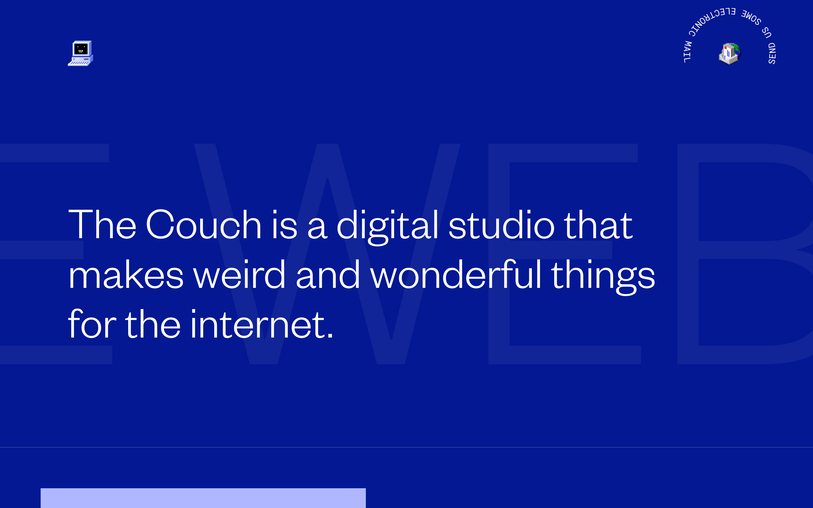
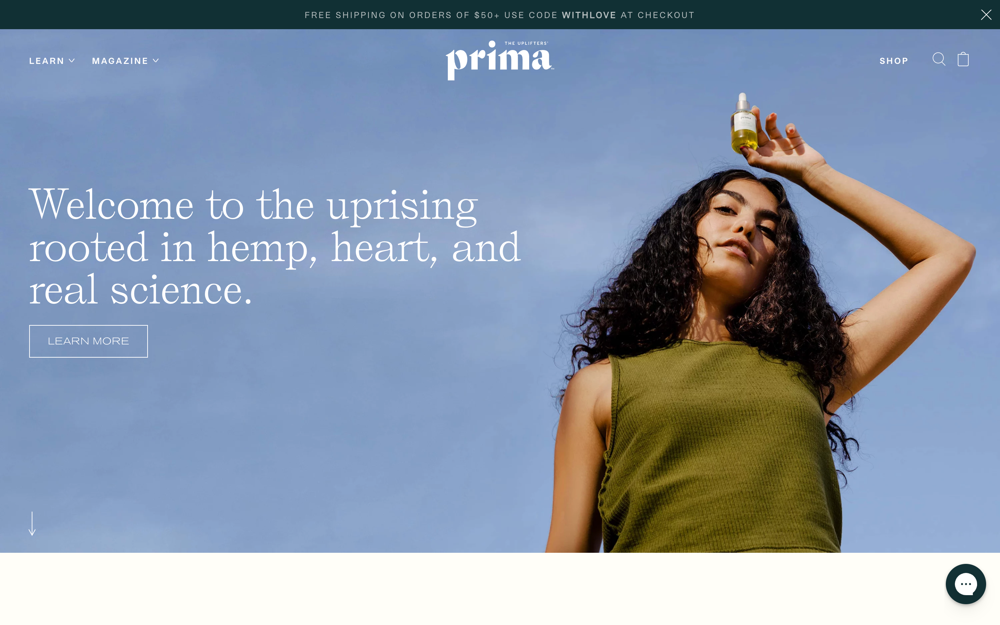

We recently spoke with Kevin Green, Co-founder and Lead Engineer at [The Couch](https://thecouch.nyc), about how Gatsby helps them speed up their workflow and offer their clients fast, feature-rich sites with extremely low hosting costs.

## About The Couch

The Couch is a team of three designers and one developer that specializes in e-commerce projects for clients like [Clare](https://www.clare.com) and [Dims](https://www.dimshome.com). Kevin, The Couch’s developer and technical co-founder, is passionate about the headless ecosystem and the way it enables him to select the perfect tools for each project. One of Kevin’s favorite tools has been [Gatsby](/) because it makes it so easy to combine data from a variety of headless services into his projects.

<Pullquote>
I like to deliver the best possible solution for a client’s needs and Gatsby is a tool that is tried-and-true for me.
</Pullquote>

## Why Gatsby is Perfect for Prima

When [Prima](https://www.prima.co), an L.A.-based Cannabidiol (CBD) oil company, chose The Couch for their new site, their focus was on providing educational materials to their customers to help them better understand CBD. In addition to e-commerce, the site would need to include extensive written content and imagery, including 40 pre-written articles, a glossary, and a recipe collection.

<Pullquote>
They came to us with a flood of content—something we’re not really that used to.
</Pullquote>

Faced with a content-heavy project, Kevin considered his options. Rather than entrusting Prima’s content to a monolithic CMS—and risk slow loading times and an unhappy development experience—Kevin’s thoughts turned to a more modern solution: “Knowing this was going to be a super content- and image-heavy site, I wanted to build it static from the get-go.” By serving Prima’s content as static HTML, Kevin knew he would dramatically reduce the site’s loading time. His positive experiences with Gatsby on three previous production sites made him confident that it was the right tool for the job: “It’s hard for me to go any other route at this point. If I can go static, I’m always going to go static, and Gatsby’s going to be one of my top choices indefinitely.”

## Cutting Developer Time in Half

After years of building projects with traditional tools like Docker and WordPress, Kevin experienced a dramatic productivity boost after switching to Gatsby and the headless ecosystem. Using Gatsby and a combination of various microservices, Kevin can now build sites with complex functionality in half the time he used to: “I built a large system with countless modules, multiple content models and search functionality that’s already prepped for e-commerce...that’s something that used to take me double the time.”

<Pullquote>
From my perspective, Gatsby is an invaluable tool.
</Pullquote>

By embracing Gatsby and headless services, Kevin can now more easily adjust his tools to each project’s needs. To manage Prima’s content, Kevin opted for [Sanity](https://www.sanity.io), a headless CMS which can be connected to a Gatsby site using the [gatsby-source-sanity](/packages/gatsby-source-sanity/) plugin. Prima’s e-commerce functionality is powered by [Shopify](https://www.shopify.com) (integrated with Gatsby using the [gatsby-source-shopify](/packages/gatsby-source-shopify/) plugin). Kevin credits the ease of pulling data from headless services like these into Gatsby with the bulk of his new development speed:

<Pullquote>
I’ve set up Contentful, Prismic and Sanity in so many ways that I can now set up the whole backend and data architecture in a day...It’s a testament to those tools and how powerful they’re becoming.
</Pullquote>

## Inexpensive Hosting

Kevin told us his clients are extremely happy with the lower hosting and CMS costs that Gatsby projects make possible. Since Gatsby sites load as static assets, they can be hosted cheaply (or for free!) by hosts like [Netlify](https://www.netlify.com) and deployed straight to a global CDN. After years of serving sites on expensive hosting, this is a major relief to Kevin and his clients: “They’re getting a ton of traffic and it’s costing them practically nothing,” Kevin told us. “To me, one of the biggest selling points is not putting a site on Heroku and having that cost thousands of dollars a month when people start going to it.”

Prima’s CMS costs are also lower than normal because Gatsby pulls all of their content from Sanity and includes it in the site’s static HTML at build time. This means that instead of having Sanity resend their content every time a user visits the site, Prima only pulls their content when the site is rebuilt. This significantly speeds up Prima’s loading time and reduces their use of the Sanity API.

<Pullquote>
Being able to work in platforms like Gatsby is a breath of fresh air and allows me to control my environment and build beautiful websites that are super fast and inexpensive to run, which obviously our clients also love.
</Pullquote>

## Fast Site, Happy Client

The Prima launch was a big success and the site is now enjoying healthy traffic and organic growth thanks to enthusiastic supporters on social media: “They were thrilled. They’ve gotten a super warm reception,” Kevin reported. In particular, users have noticed that “the site is super fast and the experience is really smooth”—no small feat for a content-heavy site like Prima’s.

After initially launching with its educational content only, Prima’s product line has been added to the site this spring, powered by Gatsby’s e-commerce integration with Shopify.

<Pullquote>
It’s less a conversation about the tools; it’s about whether they do the best job they possibly can for the client. And in the case of Gatsby, it’s continued to do that for me. The sites that we build are fast by default, rendered statically, and don’t cost our clients a lot of money; it’s hard for me to go any other route.
</Pullquote>

To discover if Gatsby is right for your next project, [learn more here](/).
