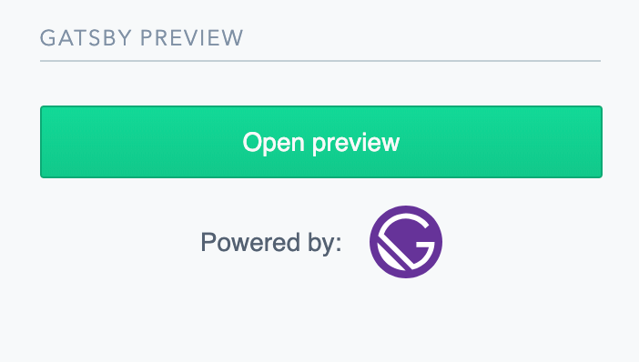
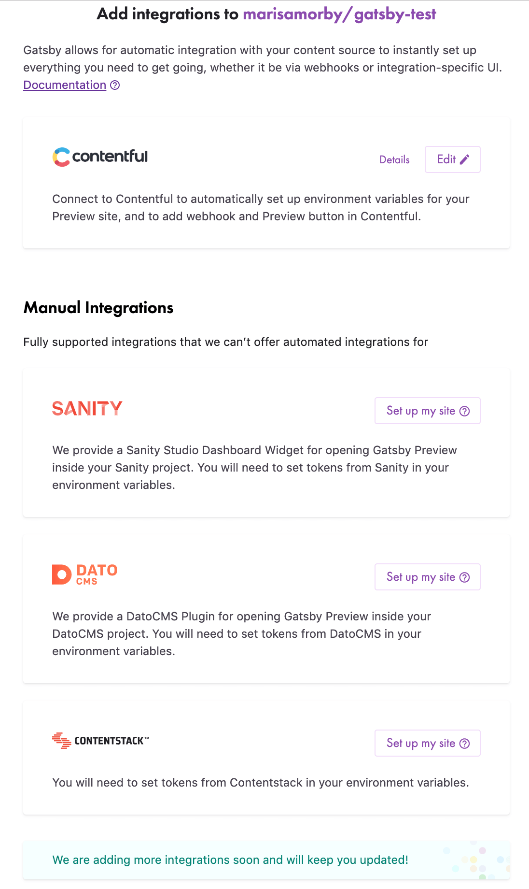
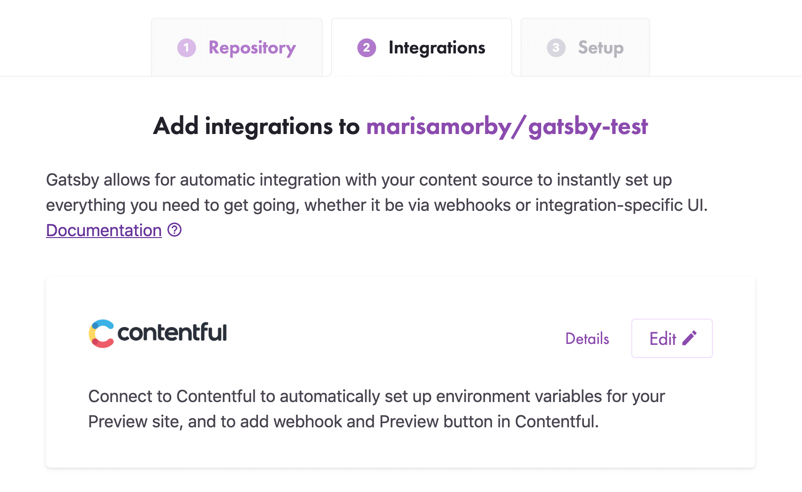

We’re excited to announce Gatsby Preview is now in open beta, and you can [try it free for 14 days!](https://www.gatsbyjs.com/preview)

In a traditional CMS setup, content creators and editors can preview their changes before they go live. Without Gatsby Preview, teams using Gatsby needed to set up their own preview infrastructure or do without. This was a problem because content teams need to see what changes they’re making as it’s happening. And assuming teams had time to create their own preview infrastructure, it was still a time-consuming process. We wanted to solve this for teams using Gatsby.

With Gatsby Preview beta, you can connect your GitHub repositories and CMS to our service, and get a staging site where content creators can see their changes in context before going live.

Want to check on your new article title, or look at the changes you made to your post? Gatsby Preview lets you see it!

To use Gatsby Preview today, you must have admin access to your GitHub repository, and currently be using Contentful, Contentstack, DatoCMS, or Sanity as your CMS.

## You asked, we listened

We’ve been having lots of conversations with folks who needed something like Gatsby Preview, but didn’t have a current solution. We heard things like:

### "Our content editors like using Gatsby Preview, but they don’t want to use a separate service to see their preview"

Contentful, DatoCMS, and Sanity now support a widget to display the Gatsby Preview button in their sidebar, so content editors can make their edits and quickly see them without ever leaving the CMS. We’ll be adding the Gatsby Preview button to as many supported CMSs as possible.

### "I want to be able to use a service like Gatsby Preview, but our team doesn’t use the CMS you support"

We know teams use different CMSs, and we’ve started expanding our support to different CMS. Right now Gatsby Preview will work with Contentful, Contentstack, DatoCMS, and Sanity. We’re actively working on adding several more CMSs, too.

### "We had some trouble getting our site connected to Gatsby Preview"

We’ve added an automated integration for Contentful, so it’s easy to set up with just a few clicks! We’ve got more seamless integrations coming soon!

## Is Gatsby Preview right for your team?

If you’re on a development team that’s constantly trying to manage edits and updates from your content team, Gatsby Preview gives the content marketers the ability to see the content and edits without having to get help from the development team.

If you’re a content editor or marketer who wants to see what your edits or changes look like before going live, Gatsby Preview will let you make changes and see those edits, all within the familiarity of your current CMS.

Check out Gatsby Preview for your current company or client project, and [try it free for 14 days](https://www.gatsbyjs.com/preview)

## What’s next

Our Cloud team is working on a new feature termed "Builds" that gives developers confidence that code changes will render properly _before_ deploying to production.
