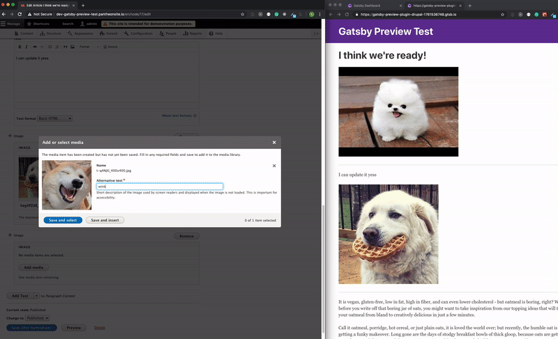

It's the dream: a CMS with rich content modelling capabilities combined with a [modern frontend](/blog/2018-10-11-rise-of-modern-web-development/) with features like declarative, reusable UIs, modern JavaScript, hot reloading, versioning and so on.

Two types of people will be excited about this article.

1. The developer who has been eyeing Gatsby but their clients are hesitant to leave an established workflow that includes previewing their work.

2. A content focused client who wants their site to be cutting edge, but doesn't want to leave their comfortable workflow that allows them to rapidly toggle between content changes and the visual impact of those changes on the website.

As Sam Bhagwat wrote [when announcing Gatsby Preview](/blog/2018-07-17-announcing-gatsby-preview/):

> Content teams are creators. And creators, as Bret Victor put it, “need an immediate connection to what they’re making.”

> When a copywriter edits a headline in their CMS, they shouldn’t have to imagine what their change looks like in context. They should see it—immediately.

At [Third and Grove](https://www.thirdandgrove.com/), we've been working on a preview module for Drupal to be used with Gatsby Cloud.

**Today, we're excited to announce that we're beta launching live preview with Drupal and Gatsby!**

With modern JavaScript, React’s component model, and Progressive Web App features built in, Gatsby + Gatsby Preview is a compelling alternative to traditional CMS site building, while still allowing content teams to use mature CMS content workflows. So far, it's been available for Contentful, Sanity, DatoCMS, and Contentstack.

Today's launch of Gatsby Preview + Drupal is a major milestone, making Gatsby Preview available for a huge, thriving open-source community.

Here's how it works:

## Getting started

<iframe width="560" height="315" src="https://www.youtube.com/embed/H72PY3wNMcI" frameBorder="0" allow="accelerometer; autoplay; encrypted-media; gyroscope; picture-in-picture" allowFullScreen title="Youtube video: Drupal Gatsby Preview setup walkthrough"></iframe>

### Step 1: Sign Up for Gatsby Preview Beta

You will need to sign up for a Gatsby Preview account, so this is a meta beta. You can sign up for a [Gatsby Preview 14 day trial here](https://www.gatsbyjs.com/preview/?_ga=2.156650491.1704520703.1561474285-32798346.1550767689) and get more information on the [Gatsby blog](/blog/2019-03-22-introducing-gatsby-preview-beta/).

### Step 2: Install Gatsby Source Drupal

The gatsby source plugin is available on [npm under the package name `gatsby-source-drupal`](https://www.npmjs.com/package/gatsby-source-drupal).

```javascript:title=gatsby-config.js
module.exports = {
  plugins: [
    {
      resolve: `gatsby-source-drupal-preview`,
      options: {
        baseUrl: `...`,
      },
    },
  ],
}
```

Once your plugin is set up the Gatsby plugin will listen for changes at a specific URL. In your Gatsby Cloud instance you'll need to copy the preview URL to your clipboard. Once you have that, the Gatsby side is set up to receive updates.

### Step 3: Enable JSON API in Drupal

Let’s make our transition in to Drupal. First things first, enable the JSON API in your Drupal instance. Then get the Gatsby Preview module at [this link on drupal.org](https://www.drupal.org/project/gatsby).

Install the module and enable it on your Drupal instance. Configuring the Drupal module is straightforward: under ‘Configuration > System’, you should now have the option for ‘Gatsby Live Preview Settings’. The URL you copied earlier from your Gatsby Cloud instance can be pasted into the ‘Gatsby Preview Server URL’ field in Drupal and saved.

Now you're all set up to use Preview! Make a change to your content, press Save, and watch as Gatsby updates before Drupal even notifies you that your changes have been saved.



You can see above how fast this feedback loop is -- and we're working on making it even faster (keystroke-by-keystroke!)

## Conclusion

As you're testing out Gatsby Preview + Drupal and using it for company or client projects, please [let the Gatsby team know](https://www.gatsbyjs.com/contact-us/) if you experience any issues.

Drupal-based agencies and companies who want to improve client outcomes, site performance, and UI/UX, while modernizing their engineering stack and increasing engineering team satisfaction have a powerful new tool in their toolkit.

We're excited to see what comes next!

Got questions? Direct them to the [Drupal Gatsby Preview Umbrella issue in GitHub](https://github.com/gatsbyjs/gatsby/issues/14933) or the [Drupal module](https://www.drupal.org/project/gatsby) for Gatsby Live Preview.
