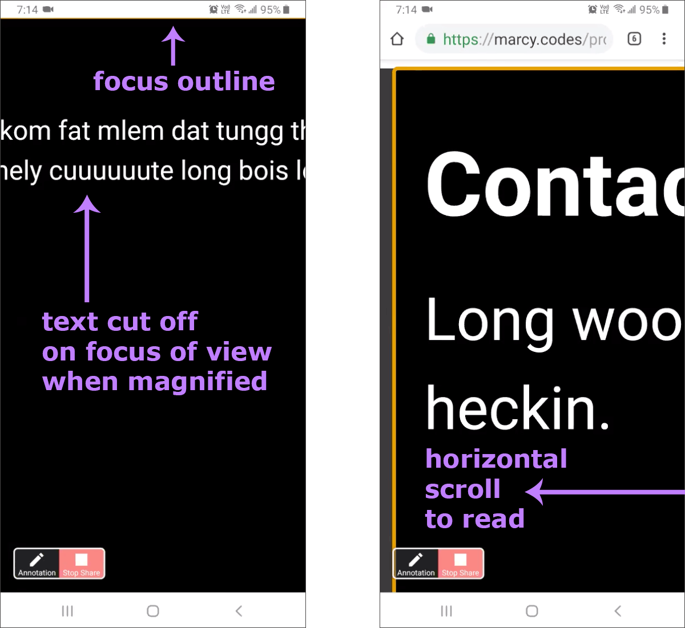

In June 2019, I conducted 5 user testing sessions for accessibility research with [Fable Tech Labs](https://www.makeitfable.com/), a Toronto-based start-up that’s “making it easier for digital teams to engage people with disabilities in product development.”

The goal of this initiative was to gather feedback from users with disabilities on a [set of prototypes](https://marcysutton.com/prototype-testing-accessible-clientside-routing/) with navigation techniques for JavaScript web apps. There are [multiple variations recommended in the industry](#prior-art) for accessible, client-rendered page changes, yet very little user research on those methods. Therefore, we wanted to find out **which techniques are the most ergonomic and intuitive to users with disabilities**, and **if any of the techniques presented barriers** detracting from their browsing experience.

With this data, we can make better recommendations for accessible client-rendered websites in general and at the JavaScript framework level. By adjusting Gatsby’s implementation of client-side routing–currently leveraging [@reach/router](https://github.com/reach/router) for React.js–to better support a range of people with disabilities, we can improve access for users and also potentially influence accessible UI patterns in other frameworks. Eventually (we hope), this work could encourage new browser APIs through web standards: “paving the accessible cowpaths” with solutions based in user research.

## What is client-side routing?

In client-rendered JavaScript applications–also referred to as _Single Page Apps_–traditional HTML page reloads don’t typically occur when a user navigates through the app. Instead, client-side JavaScript handles routing through the app by controlling the browser’s history and mapping client-rendered URLs to each page or view. To ensure these experiences are accessible, developers have to recreate some of the missing browser feedback for users by manually managing focus and making announcements in assistive technology (AT).

## Client-rendering in Gatsby

Gatsby [builds](/docs/glossary#build) [static](/docs/glossary#static) HTML pages with Node.js (a.k.a. “SSR”), which is great for both accessibility and performance: by default, pages will render without JavaScript and links will navigate through the site with traditional page refreshes like they should. With client-side JavaScript enabled, Gatsby scripts will download and [hydrate](/docs/glossary#hydration) the site into a full React.js web application that can manipulate the [DOM](/docs/glossary#dom) and provide a smooth user experience. In this context, Gatsby sites must be accessible and use the best techniques possible, hence the desire for user research data to better support people with disabilities.

## Common accessibility barriers in client-rendered web apps

These are some common accessibility barriers when it comes to client-side routing:

- Without page refreshes, screen reader users may not be informed that the page has changed.
- Without a page refresh or focus management, a user’s keyboard focus point may be kept in the same place as where they clicked, which isn’t intuitive.
  - In layouts where the page changes partially to include a deep-linked modal dialog or other view layer, a user’s focus point could be left in an entirely wrong spot on the page.
- Without visible focus outlines, sighted keyboard, switch, and voice dictation users can’t see their focus point on the screen when views change with focus management.

Some of the commonly recommended solutions include (references at the end of this post):

- Dynamically set focus to an HTML wrapper element on page change, to both move focus to the new content and make an announcement in assistive technology.
  - This pattern often uses `tabindex="-1"` on a DIV or other block-level element to allow focus to be placed on an otherwise non-interactive element.
- Dynamically set focus to a h1-h6 heading element instead of a wrapper to move focus to new content and make a shorter screen reader announcement.
  - This also typically requires `tabindex="-1"` to focus the heading with JavaScript in a cross-browser way.
- Dynamically set focus to an interactive element like a button to put keyboard users on an operable button/UI control in the correct part of the app and announce it to screen reader users.
  - The name of the button matters a lot here.
- Leave focus where it is and make an [ARIA Live Region](https://developer.mozilla.org/en-US/docs/Web/Accessibility/ARIA/ARIA_Live_Regions) announcement instead.
- Reset focus to the top of the application (i.e. a parent wrapper element) to mimic a traditional browser refresh and announce new content in assistive technology.
- Turn on focus outlines for keyboard and screen reader users while suppressing them for the mouse using [CSS :focus-visible and polyfill](https://github.com/WICG/focus-visible) or the [What Input](https://github.com/ten1seven/what-input) library.
- Any combination of the above

In Gatsby–which uses React.js for rendering–we’re currently setting focus to an element wrapping the entire application with a [custom implementation of @reach/router](/blog/2018-09-27-reach-router/). But similar to some of the [Reach demos](https://reach.tech/router), page content isn’t announced consistently in Safari and Voiceover or NVDA and Firefox–two critical combinations for users of assistive technology. We’re actively working to improve this automatic accessibility support as we explore more component- and research-driven solutions.

By user testing a few variations of known routing techniques, we gained some valuable insight into how Gatsby and React can better support people with disabilities. We also uncovered some tips for improving usability of client-rendered apps in general, which we’ll cover below.

## Working with Fable

We worked with [Fable Tech Labs](https://makeitfable.com) to conduct this research and found it to be a very productive process. I connected with Fable’s lead front end developer Perry Trinier at the CSUN accessibility conference in early 2019. Fable’s generous offer to pair with us on this initiative has been wonderful, and we’re grateful for the opportunity to see this through.

The experience of testing with people with disabilities and the results that followed felt very important, and something product teams should seek out regularly. We’d highly recommend this process for anyone working on digital experiences; particularly if you can test prototypes to adapt to the findings early and often in design & development. User testing for accessibility can provide game-changing detail that you’ll be eternally grateful to have uncovered. Addressing accessibility issues sooner than later is both a [smart business investment](https://www.w3.org/WAI/business-case/) and can make your project more [inclusive](https://www.microsoft.com/design/inclusive/) from the start!

### Testing methodology

Fable’s online platform allows you to set up Meetings or Tickets for your sessions, depending on your desired outcome. In our case, we held 30-minute Meetings with Fable community members in Zoom.

Meetings are recommended for testing demos of a product with assistive technology, to co-design user experiences and conduct research, or to solve complex problems that customers have complained about. Tickets, on the other hand, are “like engaging a diverse team of QA analysts” to test usability and compatibility on important user journeys within your site. You can get video recordings of the sessions, which may come in handy for later analysis.

In our meetings, we tested with:

- Sam using NVDA and Chrome on Windows 10
- Ka using JAWS and Firefox on Windows
- Yvone using screen magnification in Chrome on a Samsung Note 9, and ZoomText for Chrome on Mac
- Vu with Dragon NaturallySpeaking and the keyboard in Chrome
- Carolyn with switch access

In each of the sessions, we learned about the tester’s browsing method and in almost all cases was able to watch them browse through the prototypes. Asking a question to expand on a given detail provided lots of great insight (i.e. “tell me more about what makes that focus indicator confusing to you”). It helped to have the desired outcomes for the meetings defined and published ahead of time, so the testers knew what to keep in mind when testing and what questions they should try to answer.

## Testing objectives: the techniques

We wanted to know the best approach for guiding users with disabilities through JavaScript-heavy web applications, which don’t use traditional page reloads to reset the user’s focus point and announce new pages in assistive technologies.

The [prototypes for these tests](https://marcysutton.com/prototype-testing-accessible-clientside-routing/#What-are-Prototypes) covered some of the common techniques for enhancing the page loading experience for users with disabilities, each centered around the mechanics of loading new content. These techniques included:

- [Example 1](https://marcy.codes/prototypes/routing/example-1.html): No focus change, with a Live Region announcement for screen readers
- [Example 2](https://marcy.codes/prototypes/routing/example-2.html): Focus reset to application wrapper element, with a Live Region announcement for screen readers
- [Example 3](https://marcy.codes/prototypes/routing/example-3.html): Focus changed to a heading element in the newly changed content
- [Example 4](https://marcy.codes/prototypes/routing/example-4.html): Focus changed to an element wrapping the newly changed content
- [Example 5](https://marcy.codes/prototypes/routing/example-5.html): Focus changed to a wrapper element at 100% width, rather than side-by-side (added during testing session #3 on zooming/magnification)

These prototypes used [Doggo Ipsum](https://doggoipsum.com/) for placeholder text, which made for some fun testing experiences. "Cuuuuuute long bois" was my personal favorite, captured in testing screenshots. :)

## Testing results

Each tester had different needs and highlighted varied concerns, with some prototypes working well and others needing improvement. Some testers reviewed the links ahead of time and provided a few extra tips, which was generous and appreciated.

The prototypes were developed primarily for the desktop browsing experience, but through testing it became clear that responsive design plays a role in producing streamlined, barrier-free user interfaces, particularly for users of screen magnification. Horizontal scrolling, while unavoidable in a lot of cases, can be reduced through media queries and flexible layouts. These layout variations can also affect interaction design (i.e. focus moving down instead of across).

These tests were a good reminder that accessibility goes beyond support for screen readers, which make up a limited percentage of user needs. Support for screen magnification in web apps, for example, is very important to support a larger population of users with low vision. There are also [more disabilities](https://www.who.int/topics/disabilities/en/) to consider than we were able to accommodate with this series: conducting more tests with diverse users would only improve the outcome of any recommended solutions.

### Takeaways from screen reader users

A big motivation to test with screen reader users was to confirm whether the recommended focus management techniques actually worked for them. The prototypes included a few approaches specifically targeted at screen reader users, including:

- Live Region announcements on view changes to inform screen reader users of changing content;
- focus management sent to a wrapper element;
- focus management sent to the first heading element.

**Focusing on a wrapper element for new content worked okay** with our test subjects: they were informed of the new content and moved into the right place. It was **very subtle compared to focusing on a heading**, and better than resetting the page to the top (think Gmail - it would be a pain to have to start over every time you click on a link). In general, we found that **resetting focus to the top of the app would be very overwhelming**, especially in large applications.

**Focusing on a heading was found to be the best experience**, as it would save time and make it clear what happened. In NVDA, there was some duplicate reading of content and `<main>` was doing some extra announcements–seemed like an screen reader quirk more than a problem with the prototype.

**A back button would help** to use browser history (this was a limitation of the prototypes).

**Putting `aria-current` on links to indicate which one is active helps** in applications. We made a note to try using `aria-label` instead of `aria-labelledby` on section elements to minimize duplicate announcements in NVDA and JAWS (when the section is labelledby a heading).

**Add a heading to each major section of the UI**, like navigation, **even if [visually hidden](https://a11yproject.com/posts/how-to-hide-content/)**–as many screen reader users don’t navigate by landmarks but do navigate by headings.

The conclusion for these tests from one screen reader user when asked if they could recall any good examples of focus management was that “no one is doing this well.” We can do better!

### Takeaways from users relying on screen magnification

Users with low vision magnify the screen and zoom into pages to see them better: screen magnification at the OS level, screen magnifying assistive technology like [ZoomText](https://www.zoomtext.com/), browser zoom, and more. In this user test, the participant found **visible focus outlines to be helpful** for orienting oneself in the application.

For sighted magnification users, our **first couple of prototypes were quite useless as they relied on screen reader announcements**, which were inapplicable in this scenario (the same would apply to a UI pattern like the proposed [“toast”](https://github.com/jackbsteinberg/std-toast) element). Despite having developed with accessibility in mind–including visible focus outlines–the **prototypes pretty much fell apart when zoomed way in** on a Samsung Note 9 phone with the Chrome browser.

For the focus management techniques, horizontal scrolling presented an issue without a mobile viewport: if focus was sent to a wrapper or heading spanning a width much larger than the screen, **mobile Chrome would scroll to the middle of it and cut off the beginning and end of the text...making it illegible**. This was exacerbated in our prototypes until we adjusted the design to fit a single column, but still wasn’t great to have a visible focus outline covering so much of the screen. Some of this seemed limited to Samsung’s Chrome browser and weren’t reproducible elsewhere, but even with slightly better scroll/focus behavior it illustrated the **need for responsive pages that adapt to fit smaller screens** without as much horizontal scrolling.

<figure>

<figcaption>Screenshots from mobile Chrome on a Samsung Note 9 using magnification</figcaption>
</figure>

While some scrolling is unavoidable for magnification users, the zoom/focus problems with these prototypes were so stark that it was **almost better to do nothing** (no focus management or screen reader announcements). This was consistent with the first two prototypes actually being a better experience because the Live Region announcements didn’t apply. **But considering the pervasiveness of client-rendered apps** and the aforementioned **needs of blind users, doing nothing isn’t really an option**.

With this test in particular we started considering other solutions, which became more and more clear as we continued through the remaining user tests.

### Takeaways from voice navigation

The first obvious thing with **navigating by voice** was that the **visible focus indicator was helpful** to orient the user’s place on the screen; Dragon NaturallySpeaking did not provide a focus outline, at least with their configuration. In the first two prototypes relying on ARIA Live Regions to announce changes, there wasn’t much to observe for a sighted voice navigation user.

In prototypes 3, 4, and 5, **moving focus and showing a visible focus outline was helpful** as it showed an element of interest and **guided their attention** to the relevant content. **Focusing on a heading or smaller element was easier** to discern the focus outline than a wrapper element that went to the edge of the screen.

### Takeaways from keyboard-only navigation

As a bonus in user testing session #4, we had some user feedback with the keyboard only. They couldn’t get to the main region in the prototypes with the keyboard alone, which would have helped. This was striking because even though that content area is marked up with an HTML `<main>` landmark, without assistive technology that element is not reachable by keyboard. If it contained links or other interactive elements those would be reachable, but not the main region itself.

Rather than making regions focusable (which would make them reachable, but not operable)–a common misconception when developing for assistive technologies which have their own ways to navigate–**adding a button target** came up again as an idea to receive focus in an area of the page. A control like this could:

a) receive focus, both in the natural tab order and programmatically with scripting
b) be labeled to act as a focus management target
c) be small enough in dimensions to not be cut off when zoomed in, and
d) operate as a skip link back somewhere (which might make labeling for assistive technology tricky...but it can be sorted out)

At this point, we were strongly considering moving to a component-based approach instead of trying to handle this all dynamically with routing and programmatic focus alone. But we had one more test to conduct.

### Takeaways from users of switch access

The switch control test was one of the only ones we couldn’t observe, likely because the switch device’s on-screen keyboard was stripped out by Zoom. But we heard from the tester that **focus management seemed to draw their eye to new content the best**. The **visible focus indicators were useful**, though they added that focus **outlines on inoperable elements can be confusing**. Yet another plug for a focusable skip link control!

The tester also mentioned that **navigating to the bottom of a screen required tilting of the head which was hard on their neck with an [integrated headmouse](http://www.orin.com/access/headmouse/)**. Drop-down menus were another nemesis–likely the many ones that only operate with the mouse and drive us all mad when they close without reaching the items no matter what we do ( “equal opportunity inaccessibility”).

## Recommendations: finding common ground

The exact implementation(s) we integrate into Gatsby will likely evolve as we try things out and iterate on improvements. But the recommended approach coming out of these research sessions includes:

- Rendering an interactive UI control in each view that becomes visible when the user navigates through the app by keyboard.
- Making it function as a tab stop in a content region for keyboard users and providing a way to skip back to navigation so it is actually operable: a skip link is the most natural choice for this.
- Making the control small in width and height (like a link or icon button) so the focus outline and content aren’t cut off when zoomed way in.
- Putting an `aria-label` or `aria-labelledby` attribute with an indication of the nearby content (like a heading), and what action the control does. E.g. “Portfolio, skip back to navigation”. This would benefit from more user testing.
- Focusing this skip link when a user completes an action that triggers a route change and updates the client-rendered view, both managing focus and notifying users of assistive technology.

Part of the challenge with this work is what might be ideal for one user with a disability might not be for another. These recommendations are an attempt at weaving multiple perspectives into one usable pattern, with the historical knowledge of where teams run into conflicts over accessibility in design (e.g. turning off visible focus outlines on container elements).

### Updating our approach in Gatsby and React

To make this proposal a reality, Gatsby could look for an interactive skip link component with a given `className`, `id` attribute, or `ref`, and focus it when pages change through navigation as a result of user action. The automatic wrapper focus behavior that shipped with Gatsby’s implementation of `@reach/router` would act as a fallback in the absence of such a component. Another idea is for Gatsby or React to adopt an algorithm to look for the first heading in a content area and dynamically inject a skip link next to it – similar to a [permalinked header](https://www.gatsbyjs.org/packages/gatsby-remark-autolink-headers/) but providing a skip action to take the user back somewhere.

The most accessible and best performing pattern will likely be an opt-in component where the developer can specify where the control should go in the DOM and how it should be labeled. But it’s worth pointing out that if a solution can be handled automatically, it would have a wider impact amongst developers who aren't prioritizing accessibility.

We’re limited on what we can do programmatically at the framework level since users can source content from anywhere. There are cool accessibility innovations happening in React core with [Focus Scopes and Focus Managers](https://github.com/facebook/react/issues/16009), and we’re working directly with the team behind React/Reach Router for future component solutions. But if we can implement a solid UI pattern that supports these user requirements and make it extremely easy to adopt, our hunch is that client-rendered apps will become a heck of a lot more accessible.

User research data is what’s driving these improvements forward. As web professionals, we should look to users with disabilities to tell us what works for them rather than always assuming we know. It’s difficult to make something that works for absolutely everyone, but we can make more informed decisions with a bit of research.

Thanks to [Fable](https://twitter.com/FableTechLabs) and your community of testers for helping us with this initiative!

## “Prior Art”

Links on accessible routing techniques in JavaScript apps

- https://www.smashingmagazine.com/2015/05/client-rendered-accessibility/
- https://www.deque.com/blog/accessibility-tips-in-single-page-applications/
- https://www.slideshare.net/frontenders-valtech/accessible-client-side-routing-nick-colley
- https://medium.com/@robdel12/single-page-apps-routers-are-broken-255daa310cf
- http://shortdiv.com/posts/client-side-a11y/
