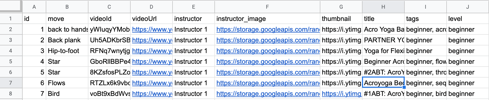
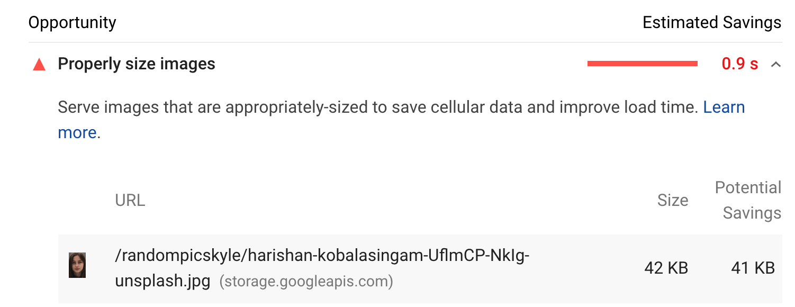
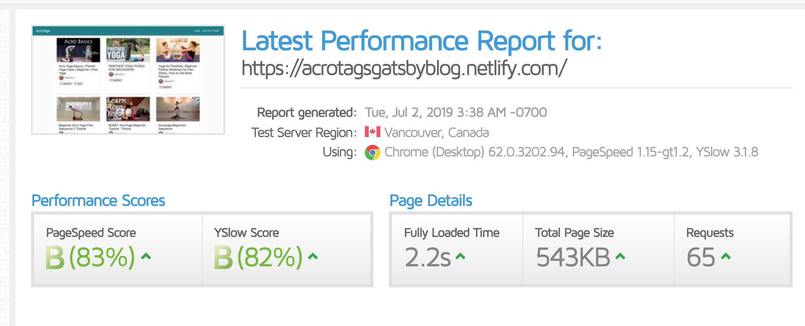
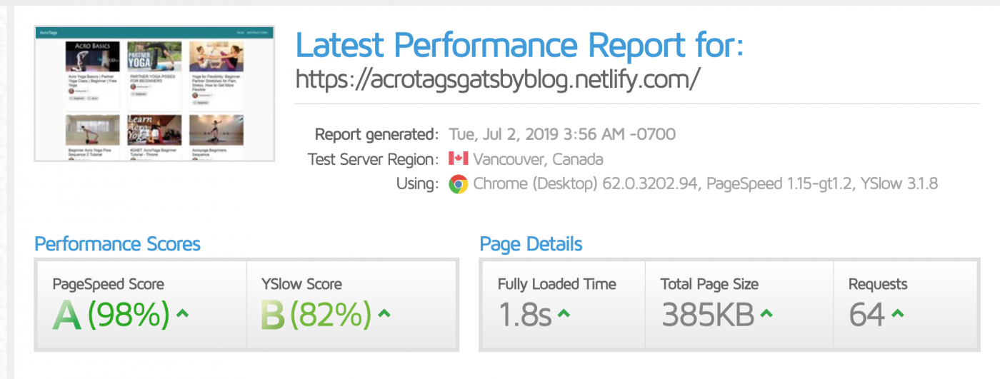

I recently prototyped an [Acroyoga](https://en.wikipedia.org/wiki/Acroyoga)-focused side project, called ['AcroTags'](https://acrotagsgatsbyblog.netlify.com), using Gatsby and the Google Sheets API. The site was as fun to build and populate with data as it is to use for discovering Acroyoga videos. This post will explore why and how I made this site and cover the specific code I used to get Gatsby and Google Sheets to work nicely together. I hope this tutorial and the code samples allow you to quickly prototype your next idea using this very simple and powerful stack.

## Background on an Acroyoga obsession and the Need for a Video Explorer Site

In the Summer of 2018, I became obsessed with the niche sport of Acroyoga. Acroyoga is the practice of doing yoga-inspired acrobatics with other people. Most people start with simple positions like 'bird', which you might have tried and called 'airplane' as a kid (holding a person up on your feet while laying down). From bird, Acroyoga progresses into hundreds of other positions and sequences of positions. Acroyoga scenes exist all over the world and the common vocabulary of positions allows strangers to meet up and easily 'jam' together.

There are thousands of 'acroyogis' on Instagram and YouTube and many of them post and share their latest creations constantly. For intermediate acroyogis like myself, I'm constantly saving, reposting, and curating from this firehose of Acroyoga content. When I'm trying something new at an Acroyoga jam, I'm often pulling my phone out to go through my favorited videos.

I've long found it challenging to find just the right video to work on. Sometimes I'm looking to learn something that is simply fun, novel, or playful. Other days, I might be looking for a challenging sequence right at the edge of my ability. It ends up taking me (and whoever I'm jamming with) too much time of hunting and pecking on our phones while sitting on a blanket in some park. I want a better Acroyoga videos site that makes it simpler to find the right video sooner.

My requirements for this Acroyoga videos site is that it be simple to add data to, load fast on mobile, and be generally intuitive to use. For this reason, I'm using Gatsby (and of course, React) and the Google Sheets API for this site. This simple stack will allow me to build a fast loading application that consumes data from a Google Sheet.

As such, this article will show how I built this site. I'll show only the code samples that are Gatsby and Google Sheets specific but you can see all of the code in this repo: [https://github.com/kpennell/acrotagsgatsbyblog](https://github.com/kpennell/acrotagsgatsbyblog). Finally, if you want to check out the demo app, that can be found here: [https://acrotagsgatsbyblog.netlify.com](https://acrotagsgatsbyblog.netlify.com/).

## Creating a Basic Gatsby Setup with Material-UI

Gatsby's docs have a wide variety of [Gatsby starters](/starters/?v=2), each with different features and advantages. I opted to use a starter I built for [another Gatsby tutorial I wrote](https://appendto.com/2019/04/build-fast-and-elegant-sites-with-gatsby-netlifycms-and-material-ui/). My starter has a simple file structure and is setup to use Material-UI (which I'll use heavily for building this interface). There are a couple ways to use Material-UI in Gatsby but I found the [gatsby-plugin-material-ui](/packages/gatsby-plugin-material-ui/) plugin route the easiest. Unless you have a very specific use case, save yourself the rabbit hole, install the plugin, and setup the theme within `gatsby-config.js` like so:

```javascript
module.exports = {
  plugins: [
    /* highlight-start */
    {
      resolve: `gatsby-plugin-material-ui`,
      options: {
        theme: {
          // material-ui theme
          palette: {
            primary: {
              main: "#BA3D3B", // or whatever colors you need
            },
          },
        },
      },
    },
    /* highlight-end */
  ],
}
```

## My Google Sheet Dataset and How to Access it

Google sheets are pretty amazing if you think about it. While they might never be able to handle the millions of rows that Excel can, you can share and collaborate on them. There's tons of add-ons, macros, and scripts you can use to extend the default functionality. Finally, you can consume the data from a Google Sheet using [a fairly well-documented API](https://developers.google.com/sheets/api/). My Acroyoga videos data can be publicly accessed [here](https://docs.google.com/spreadsheets/d/1Qyn6530gveP7wnLHswBH0a_6ndTbWE65hvMWY17313Y/edit?usp=sharing). Here's what my row headers look like and several of my rows:



This is a list of Acroyoga videos from Youtube. I tagged these videos in column I (e.g. beginner, flow). The 'thumbnail' column is the Youtube video thumbnail while instructor_image are some dummy images I saved in a Google cloud storage bucket. The instructor_image column is not [DRY](https://en.wikipedia.org/wiki/Don%27t_repeat_yourself) here and I could find a way to store this separately in another sheet. This occasional lack of 'DRYness' is one potential downside of using a spreadsheet as a web application database.

To access this data, I first must 'publish to the web' (under the file menu). This makes it available for consuming via API. Next I needed to register for an API key with Google. Finally, I can GET this data using a Google Sheets API method called [batchGet](https://developers.google.com/sheets/api/reference/rest/v4/spreadsheets.values/batchGet). My API call [outputs my spreadsheet data as JSON](https://gist.github.com/kpennell/82484a220c0e56f40f98c4bcaec87d9c), which I'll now consume in my Gatsby app.

## Making Gatsby Pages for Each Google Sheet Row

To create Gatsby pages for each row, I'll need to GET this Google Sheets JSON data within gatsby-node.js (I use Axios for this but fetch is also cool). There a couple of steps I'll need to take to make these spreadsheet rows available as Gatsby nodes.

First, I need to format the Google Sheets JSON to be a big array of row objects with the row headers as properties. Google Sheets outputs the data as an array of arrays for each row like so:

```json
{
  "values": [
    [
      "id",
      "move",
      "videoId",
      "videoUrl",
      "instructor",
      "instructor_image",
      "thumbnail",
      "title",
      "tags",
      "level"
    ],
    [
      "1",
      "back to hands",
      "yWIuqyYMobc",
      "https://www.youtube.com/watch?v=yWIuqyYMobc",
      "Instructor 1",
      "https://storage.googleapis.com/randompicskyle/dan-ROJFuWCsfmA-unsplash.jpg",
      "https://i.ytimg.com/vi/yWIuqyYMobc/mqdefault.jpg",
      "Acro Yoga Basics | Partner Yoga Class | Beginner | Free Yoga",
      "beginner, acro",
      "beginner"
    ]
  ]
}
```

With a couple of loops (see below), I can convert this array of arrays into an array of objects with properties.

```javascript
const arrayOfItems = response.data.valueRanges[0].values

let rows = []
for (var i = 1; i < arrayOfItems.length; i++) {
  var rowObject = {}
  for (var j = 0; j < arrayOfItems[i].length; j++) {
    rowObject[arrayOfItems[0][j]] = arrayOfItems[i][j]
  }
  rows.push(rowObject)
}
```

Here's my new array of objects with the properties matching the first row.

```json
[
  {
    "id": "1",
    "move": "back to hands",
    "videoId": "yWIuqyYMobc",
    "videoUrl": "https://www.youtube.com/watch?v=yWIuqyYMobc",
    "instructor": "Instructor 1",
    "instructor_image": "https://storage.googleapis.com/randompicskyle/dan-ROJFuWCsfmA-unsplash.jpg",
    "thumbnail": "https://i.ytimg.com/vi/yWIuqyYMobc/mqdefault.jpg",
    "title": "Acro Yoga Basics | Partner Yoga Class | Beginner | Free Yoga",
    "tags": "beginner, acro",
    "level": "beginner"
  },
  {
    "id": "2",
    "move": "Back plank",
    "videoId": "Uh5ADKbrSBU",
    "videoUrl": "https://www.youtube.com/watch?v=Uh5ADKbrSBU",
    "instructor": "Instructor 1",
    "instructor_image": "https://storage.googleapis.com/randompicskyle/dan-ROJFuWCsfmA-unsplash.jpg",
    "thumbnail": "https://i.ytimg.com/vi/Uh5ADKbrSBU/mqdefault.jpg",
    "title": "PARTNER YOGA POSES FOR BEGINNERS",
    "tags": "beginner",
    "level": "beginner"
  }
]
```

Next, I'd like for my comma-separated strings of tags (column I) to be arrays of tags (so I can `.map` over them in my React UI). This code allows me to do that:

```javascript
let itemsArrayWithTagsArray = rows.map(function (item) {
  item.tags = item.tags.split(",").map(item => item.trim())
  item = { ...item }
  return item
})
```

Now, I'm ready to create Gatsby nodes like so:

```javascript
itemsArrayWithTagsArray.map((item, i) => {
  const itemNode = {
    id: createNodeId(`${i}`),
    parent: `__SOURCE__`,
    internal: {
      type: `item`, // name of the graphQL query --> allItem {}
      contentDigest: createContentDigest(item),
    },
    children: [],
    move: item.move,
    videoUrl: item.videoUrl,
    thumbnail: item.thumbnail,
    title: item.title,
    tags: item.tags,
    level: item.level,
    instructor: item.instructor,
    instructor_image: item.instructor_image,
  }

  createNode(itemNode)
})
```

I then used the Gatsby `createPage` method to create pages for each of these rows ([shown here](https://github.com/kpennell/acrotagsgatsbyblog/blob/master/gatsby-node.js#L41)).

## Making Gatsby Pages for Tags and Instructors

Every tag and instructor should have its own page (with a list of matching videos). I'll now show you how I created these pages within gatsby-node.js.

If you went through the Gatsby tutorial at some point, you're probably familiar with the flow of creating nodes then creating pages with those nodes. You can also create pages with what I'd call 'derivatives of nodes'. Put more simply, you can, for example, loop over a node (like my rows node created in the previous section) and create pages with the result of your loop. This is what I did to create my tag pages, like so:

```javascript
let tags = []
items.forEach(item => {
  // items is the array of row objects
  if (item.node.tags.length > -1) {
    tags = tags.concat(item.node.tags)
  }
})

tags = _.uniq(tags) // lodash method to get only unique tags

tags.forEach(tag => {
  const tagPath = `/tag/${_.kebabCase(tag)}/`
  // kebab-case-looks-like-this-thankyou-lo-dash
  createPage({
    path: tagPath,
    component: path.resolve(`src/templates/single-tag.js`),
    context: {
      tag,
    },
  })
})
```

I did exactly the same for my instructors so I'll skip it here for brevity. As you can see, `createPage` is using single-tag.js and single-instructor.js to create these pages. I'll next show you, at a high-level, how I created these.

## Creating the UI with Material-UI

As I mentioned at the beginning, I won't show the code for each and every component here. But I will explain the general process I used to create this UI. I first created the templates, which are single-tag.js, single-item.js, and single-instructor.js. These templates are used in gatsby-node.js when the createPage methods are called.

My templates are fairly standard Gatsby templates with a React component at the top and a graphql query at the bottom. On the single-tag.js and single-instructor.js templates, I use filters in the query to get only the videos that match that tag. Here's how that query looks:

```javascript
export const tagPageQuery = graphql`
 query TagPage($tag: String) {
   site {
     siteMetadata {
       title
     }
   }
   allItem(filter: { tags: { in: [$tag] } }) {
     totalCount
     edges {
       node {
         id
         move
         videoUrl
  # the rest of the query
}
```

This query uses $tag from React context (which was created in gatsby-node.js) to do the filtering. If $tag is found in the array of tags (for that row), then it returns that row (which is a video). This is how I can create separate instructor and tag pages that only show those relevant videos (the videos with those specific tags or instructors).

At the top of my tag pages, I have a title that says “24 videos tagged with [the tag]”. To get the tag for that page, I need to pass pageContext as a prop to this template component. That allows me to access that \$tag variable within the template (instead of a graphql query). Now I can make the title with the following code:

```jsx
{itemsWithTag.length} {itemsWithTag.length > 1 ? 'videos' : 'video'} tagged with
         <Chip icon={<Label className={classes.chipLabel} />} label={pageContext.tag} key={pageContext.tag.toString()} className={classes.tagChips}/>
```

The first brackets (above) give me the length (the number of rows or videos that match the tag). Next I use the ternary expression so that if the length is more than 1, I show plural 'videos' instead of 'video'. Next, I'm using a Material-UI chip component to show the value of pageContext.tag (which is the tag). And this is what it achieves in my template:


If you'd like to dive into the single-tag or single-instructor templates more, they can be found in [the templates folder](https://github.com/kpennell/acrotagsgatsbyblog/tree/master/src/templates).

## Linking it all up

When I first learned Gatsby, I found the folder structure, node and page creation methods really byzantine and confusing. I struggled to understand why there was no App.js and familiar parent-child component tree. I dug through the files looking for the React-router setup and was at a loss when I didn't find one. But once I got the hang of the Gatsby way of doing things, I began to love how easy it was to not only create prebuilt fast-loading pages (made up of React components) but also to link these pages together.

This video explorer site allows users to easily filter videos by clicking/tapping on the tags or instructors. This links them to a new page with only the matching videos. Thanks to Gatsby's Link component, coding this functionality is very easy. Here is a card for one of the videos (ie rows in the Google Sheet).


Linking to the instructor and tags is done with this code:

```jsx
<CardContent className={classes.cardContent}>
  <Link
    key={item.node.id}
    style={{ textDecoration: "none" }}
    to={`/video/${kebabCase(item.node.title)}/`}
  >
    <Typography variant="h5" component="h3" className={classes.title}>
      {item.node.title}
    </Typography>
  </Link>
  <Link
    to={`/instructor/${kebabCase(item.node.instructor)}/`}
    style={{ textDecoration: "none" }}
  >
    <Chip
      avatar={
        <Avatar
          alt="Instructor image"
          src={item.node.optimized_instructor_image.childImageSharp.fluid.src}
        />
      }
      label={item.node.instructor}
      variant="outlined"
      clickable
      className={classes.instructorChips}
    />
  </Link>
  <div className={classes.tagArea}>
    {item.node.tags.map(tag => (
      <Link to={`/tag/${kebabCase(tag)}/`} style={{ textDecoration: "none" }}>
        <Chip
          icon={<Label className={classes.chipLabel} />}
          clickable
          label={tag}
          key={tag.toString()}
          className={classes.tagChips}
        />
      </Link>
    ))}
  </div>
</CardContent>
```

That's it. It's just `<Link to=` and the relative path, e.g. `<Link to="/some-resource/" />`. I don't need to worry about passing the right props or anything else. I know the page exists (because I built it using createPage in gatsby-node.js). I know the template will have the right data (because I setup the graphql query in that template file). I just need to Link to the right URL, and the pages will connect correctly. This creates a fast and intuitive user experience wherein the user can quickly click through the pages to find the right video.

## Creating a simple video player with React-Player

Tag and instructor filtering functionality is great but what the user ultimately wants to do is watch an Acroyoga video. I used [React-player](https://github.com/CookPete/react-player/issues) within the single-item.js (video template file) to load the Youtube video player within the app.

```jsx
<ReactPlayer
  controls={true}
  url={item.videoUrl}
  playing
  className={classes.player}
/>
```

Be it that most people are going to that video page to watch the video, I set autoplay to true (with the 'playing' prop). You can see the entire video player component template [here](https://github.com/kpennell/acrotagsgatsbyblog/blob/master/src/templates/single-item.js).

## Implementing Gatsby Image with Remote Images

After I created the necessary pages and components for my instructor, tag, and video pages, I had a pretty nice site built. A user could play videos and filter based on tag and instructor. I deployed my app to Netlify and tried it out on my phone. But something was missing.

A big reason why I (and many others) love Gatsby is its speed. After using heavy client-side rendered sites, Gatsby sites feel more modern and fast. It's nice to be able to explore content almost as fast as you can think. It's also nice not having to mess with server setup (vs. the simplicity of cloud storage).

But something about my new Acroyoga video site felt sluggish. I tried it on my older Android phone over 4g and, sure, it was ok, but not great. I next ran my demo site through [Google's PageSpeed insights](https://developers.google.com/speed/pagespeed/insights/) and [GTmetrix](https://gtmetrix.com/) tests. My fears were confirmed. The site was good but not great. PageSpeed Insights gave it to me straight, the images were hurting me:



This was such a clear and easy 'aha!' moment. I hadn't optimized my images and was missing out on one of the best parts of Gatsby: [gatsby-image](/packages/gatsby-image/). Gatsby image gives Gatsby users a whole bunch of built-in image optimizations. Images will be properly optimized (so you're not loading image sizes you don't need to) and the images will load a small blurred version first before loading the complete image. This makes for much faster page loads and a better user experience.

I dug into my normal gatsby-image workflow but I quickly hit a snag. My previous use of Gatsby-image had been for local images whilst I was now trying to use remote images (cloud storage image links). Thankfully, with just a bit more searching, I found the right plugin to solve this: [gatsby-plugin-remote-images](/packages/gatsby-plugin-remote-images/).

Gatsby-plugin-remote-images fetches image URL links (e.g. `http://super-image.png`) and prepares them in a way that gatsby-image can use them. To make my cards load faster, I'd need to optimize both the video thumbnail as well as the small instructor image. It makes no sense at all to load a 300+ pixel image of an instructor when all you really need are maybe 40 pixels max.


Here's what I had to add to my gatsby-config.js to configure the plugin:

```javascript
module.exports = {
  plugins: [
    /* highlight-start */
    {
      resolve: "gatsby-plugin-remote-images",
      options: {
        nodeType: "item",
        imagePath: "thumbnail",
        name: "optimized_thumbnail",
      },
    },
    {
      resolve: "gatsby-plugin-remote-images",
      options: {
        nodeType: "item",
        imagePath: "instructor_image",
        name: "optimized_instructor_image",
      },
    },
    /* highlight-end */
  ],
}
```

This tells the plugin that it will be the item nodes (the nodes created in `gatsby-node.js` for my videos) and to grab the instructor_image and thumbnail paths. Optimized_instructor_image and optimized_thumbnail are the aliases for the new gatsby-image friendly fields.

Next, I had to change my GraphQL queries to fit the gatsby-image way of getting images (vs. just getting an image url link string like I was doing before). Here's how `single-item.js` query now looks.

```javascript
export const ItemPageQuery = graphql\`
 query ItemDetails($itemId: String!) {
   item(id: { eq: $itemId }) {
     id
     move
     videoUrl
     optimized_thumbnail {
       childImageSharp {
         fluid(maxWidth: 400, maxHeight: 250) {
           ...GatsbyImageSharpFluid
         }
       }
     }
        title
        tags
        level
        instructor
        optimized_instructor_image {
            childImageSharp {
              fluid(maxHeight: 50) {
                ...GatsbyImageSharpFluid
            }
          }
        }
      }
    }
  }
\`
```

You probably recognize those `fluid` and `childImageSharp` fields if you've worked with gatsby-image and gatsby-plugin-sharp before. The `maxHeight: 50` part there scales the instructor images down from 267 pixels to 50. I run my site through GTmetrix again and lo and behold, I had shaved my site down from 543KB to 385KB.

### Before



### After



This change immediately noticeable on my clunky old Android mobile device. This easy change will make a big difference for future Acroyogis on their phones on a blanket in park somewhere, about to learn something new.

## Final Thoughts

Thanks the power of Gatsby, React, Material-UI, and Google Sheets, I'm now able to have a fast-loading video explorer site with intuitive linking and filtering. I can now go through and tag my Acroyoga videos collection, put it into this Google Sheet, and make it easier for me (and soon, others) to find the right video to try next. Of course, this is not the end of the road. Here's some ideas of how I could make this site even better:

- Setup a webhook so that Netlify automatically rebuilds the site once I change something in Google Sheets
- Create a way that users can save their favorites in localStorage or possibly, in something like Firebase
- On the individual videos page, link out to similar videos
- Tell more about the instructors on their video pages

Thanks for reading this tutorial. If you get stuck on something, please feel free to reach out on Twitter @kyleapennell.
