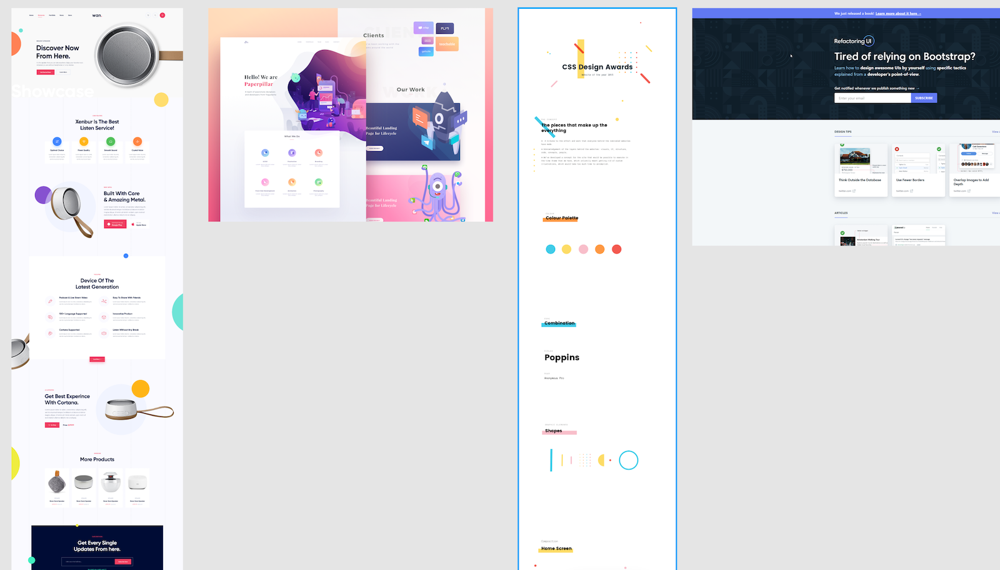
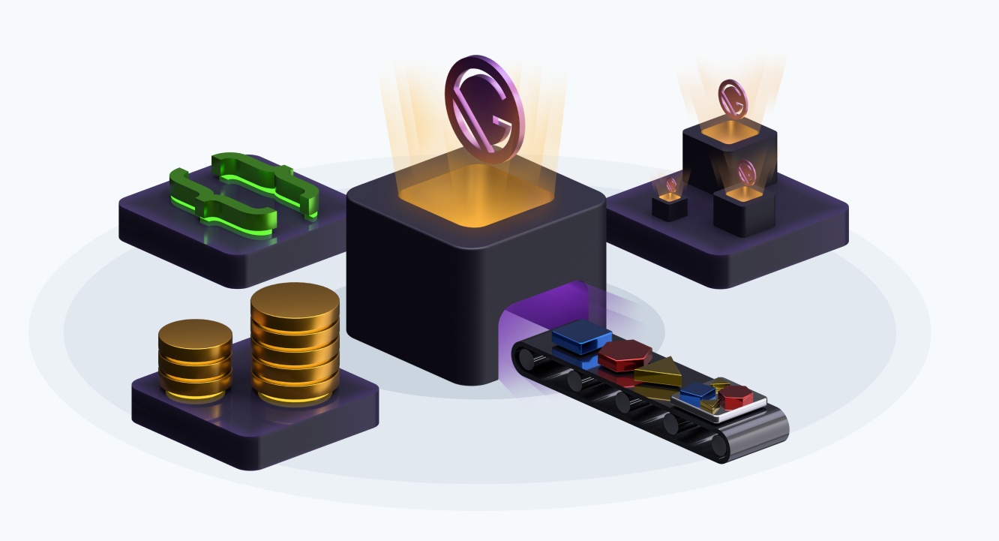

_This blog post was originally posted on [LekoArts' Blog](https://www.lekoarts.de/en/blog/how-i-used-theme-ui-to-build-my-gatsby-themes-library)_

Building [themes](https://www.gatsbyjs.org/blog/2019-07-03-announcing-stable-release-gatsby-themes/) for Gatsby is fun and a great way to share projects with the open source community. In the past I mainly created starters which I added to the [starter library](https://www.gatsbyjs.org/starters/?v=2) on Gatsbyjs.org and called it a day. While working on my first starter to theme conversion I realized that I don't have a great overview or marketing site for my starters — I wanted to change that for my upcoming themes! Hence I created [themes.lekoarts.de](https://themes.lekoarts.de). It currently shows my available themes and their respective links to GitHub and demo website. Moreover I plan to send out a newsletter every month so be sure to subscribe :)

With this blogpost I want to describe the process of creating my Gatsby themes library website with [Theme UI](https://theme-ui.com/). I won't go too deep into technical details so please don't expect this to be a tutorial.

## Design

Nearly every time before I start coding a project I start with the design in Figma. I'm still faster with prototyping with Figma than in code with React (probably due to my design background). I started looking at Dribbble and Behance to find some inspiration as I had a light website with playful elements, a **stunning** hero section and otherwise minimal design in mind.

<figure>
  
  <figcaption>Inspirational screenshots</figcaption>
</figure>

I really liked the prominent and actionable hero section of the [Refactoring UI website](https://refactoringui.com/), the shapes and colors from the other designs. Speaking of Refactoring UI, for the design (and later for coding) I used the TailwindCSS colors and styles.

The design you see live on the website now is pretty much the design I created in Figma — which speaks to the ease of use of a Figma (+ Tailwind styles) => Theme UI (+ Tailwind preset) workflow!

As mentioned I also wanted a rad hero section, nothing boring but also not something that is overused (and potentially can also slow down your website) like particles.js. Since I'm pretty proficient with Cinema4D and 3D in general I just tried to visualize "Gatsby Themes" with 3D models. I drew some inspiration from [Kyle Gill's illustrations](https://kylegill.com/blog/2019-04-22-a-simple-guide-to-gatsby-themes/index). I rendered the scene with Arnold, modified it a bit with Photoshop and et voilá: You can see the finished result on my social preview image now.

<figure>
  
  <figcaption>Cinema4D Rendering of a "Gatsby Themes factory"</figcaption>
</figure>

## Code

The website lives inside the [www](https://github.com/LekoArts/gatsby-themes/tree/master/www) folder of the monorepo and thus is already setup to be used with TypeScript. You can have a look at the source code to see how it's done (as going through the complete code would be a bit boring...).

I want to focus on [Theme UI](https://theme-ui.com/) and explain how I used it on this landing page, especially the breakpoints syntax, variants, and Tailwind preset. These are truly game changers for me!

To get started I installed the preset and put it into my shadowed theme config (see [official documentation](https://theme-ui.com/presets) on that). Then I had to override the colors e.g. the primary and secondary color. For that I took a look into my Figma design:

<figure>
  
  <figcaption>
    Using Tailwind styles in both Figma and Theme UI is the best!
  </figcaption>
</figure>

It's great to have the same design tokens in all places. I chose the color **Indigo.600** and later in Theme UI I just had to use `colors.indigo[6]`.

### Variants

In the above screenshot of Figma (on the left) and VS Code (on the right), the latter shows a snippet of button variants — variants are a Theme UI feature (see [documentation](https://theme-ui.com/guides/variants)). I used them for the buttons and gradients. Gradients are created like this:

```js:title=src/gatsby-plugin-theme-ui/index.js
gradients: {
  blue: {
    backgroundImage: t => `linear-gradient(45deg, ${t.colors.indigo[3]}, ${t.colors.indigo[5]})`,
  },
},
```

You can access theme values with a function which I did in this case to be able to use my already defined colors in the gradients. So why did I set up the gradients variants? I wanted to use a **single** property in my "Shapes" component to define the color. I didn't just pass in the value in the component itself like `` backgroundImage:t=>`linear-gradient(135deg,${t.colors[colorProp][8]},${t.colors[colorProp][6]})` `` because then every shape would have had the same angle and the same spacing (value 8 and 6 here). Some colors need other values to look right so variants was the only logical choice here. The usage looks something like this:

```jsx
const Circle = ({ color, className }) => (
  <div
    sx={{
      variant: `gradients.${color}`,
    }}
    className={className}
  />
)
```

> Little tip here: When you pass `className` down, you can style the component individually when using it.

### Breakpoints

While the shapes (circle, donut, grid) look really nice on bigger displays, for mobile and tablet views their initial size and position needs to be adjusted. I'm still a fan of "form follows function" so they shouldn't get in the way when reading things. When looking at the [source code](https://github.com/LekoArts/gatsby-themes/blob/569722297e73d05e0063e0333c284741c174cc2f/www/src/components/hero.tsx) for the hero section you'll see that it's very intuitive to define those properties:

```jsx
<Circle
  size="210px"
  color="orange"
  top="170px"
  left={[`-185px`, `-185px`, `-185px`, `-120px`]}
  sx={{ display: [`none`, `none`, `none`, `block`] }}
/>
```

I highly recommend using the breakpoint syntax and reading the [documentation](https://theme-ui.com/getting-started#responsive-styles).

So far, so normal you'd say. But I had a cool idea to solve my problem of positioning shapes around my theme entries which I collect in a `.yaml` file (see the [source file](https://github.com/LekoArts/gatsby-themes/blob/master/www/data/themes.yaml)). Just define the shapes in the respective theme entry! YAML is a great format for that as it makes it possible (together with the Gatsby transformer) to create arrays and array of objects. The shapes entry looks like this:

```yaml
shapes:
  [
    {
      type: "circle",
      color: "green",
      size: ["200px", "300px"],
      xOffset: ["-140px", "-120px"],
      yOffset: ["-70px"],
      opacity: 0.5,
    },
    {
      type: "donut",
      color: "teal",
      size: ["25px", "100px"],
      xOffset: ["50px"],
      yOffset: ["-60px"],
      opacity: 1,
    },
  ]
```

These are all the information that my shape components need to render the desired output. I didn't use _left_ and _right_ here as the shapes should always face the outside (on the inside it could overlap the text). As you can see the array / breakpoint notation for position and size was used — I think that's just cool 😎

To give you an idea how I then added this functionality to the listing here's an excerpt of the relevant file:

```jsx:title=src/components/listing.tsx
<Container sx={{ py: 4 }}>
  {themes.map((theme, index) => {
    const isEven = index % 2 === 0

    return (
      <Box>
        <div>
          {theme.shapes.map(shape => {
            switch (shape.type) {
              case `circle`:
                return (
                  <Circle
                    key={`${shape.size}-${shape.color}-${shape.xOffset}`}
                    size={shape.size}
                    color={shape.color}
                    left={isEven ? shape.xOffset : `unset`}
                    right={isEven ? `unset` : shape.xOffset}
                    top={shape.yOffset}
                    sx={{ zIndex: 0, opacity: shape.opacity }}
                  />
                )
              case `donut`:
                return (
                  <Donut
                    key={`${shape.size}-${shape.color}-${shape.xOffset}`}
                    width="20px"
                    size={shape.size}
                    color={shape.color}
                    left={isEven ? shape.xOffset : `unset`}
                    right={isEven ? `unset` : shape.xOffset}
                    top={shape.yOffset}
                    sx={{ zIndex: 0, opacity: shape.opacity }}
                  />
                )
              default:
                return null
            }
          })}
        </div>
      </Box>
    )
  })}
</Container>
```

Setting the offset values to either _left_ or _right_ is decided by _isEven_ which is also used to change the order of the items. Passing in the arrays into the props works like on the rest of the site and hence the responsive styling!

## Conclusion

All in all Theme UI helped me a lot to get this done quickly. From the design phase, to the code handoff phase (by using the same design tokens) to finally using the breakpoint syntax in the GraphQL layer of Gatsby to individually style theme entries. Of course Theme UI offers you all the things it says on its own website: "Ergonomic, Themeable, Contraint-based". And in the case of Gatsby themes: Also shadowable.

I highly recommend using Theme UI for your projects and especially for Gatsby Themes 🎉
