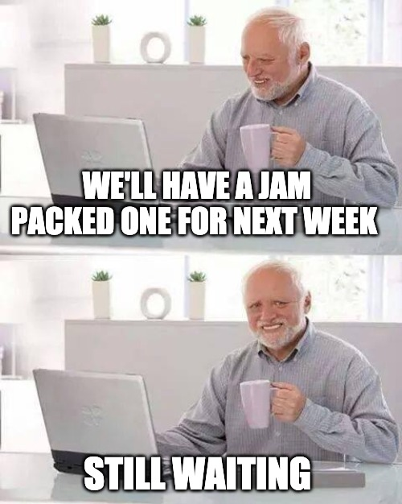

Remember when I said I'll see you folks next week with a jam packed Gazette? It's been 3 months! 😱 If it's any consolation though, this one is a jam packed edition.

Welcome to the _new_ and _improved_ Gatsby Gazette. It's been a while. We have a lot to talk about.

This edition features our work on making Gatsby more stable, the Themes Jam, Jason _Blitz_ Lengstorf, highlights from the community and the revamped Community Maintainers meeting.

## Team Highlights

### Snow Leopard Release

The past few weeks has been all about what we're calling the Snow Leopard release (kudos to [Dustin](https://twitter.com/schaudustin) for the name).

First, an aside.

[Mac OS X Snow Leopard](https://en.wikipedia.org/wiki/Mac_OS_X_Snow_Leopard) (version 10.6) was the seventh major release of Mac OS X (now named macOS). Unlike those of previous versions, the goals of Snow Leopard were improved performance, greater efficiency and the reduction of its overall memory footprint. Addition of new end-user features was not a primary consideration: its name signified its goal to be a refinement of the previous OS X version, Leopard.

Similarly, earlier last month, we felt like we needed to take some time to slow down and clean up Gatsby after some of the big features that we've shipped recently ([themes](https://www.gatsbyjs.org/blog/2019-07-03-announcing-stable-release-gatsby-themes/), [per page manifest](https://www.gatsbyjs.org/blog/2019-06-12-performance-improvements-for-large-sites/)). Our goal was to squash bugs and issues that had happened as a result of moving fast and shipping.

We called this the [Snow Leopard](https://github.com/gatsbyjs/gatsby/projects/13) release.

We think this was a good idea because besides being the best React framework there is, we also want to be the most stable one.

Looks like people think we're doing fine. 🙂

<blockquote class="twitter-tweet">
I have an opinionated starter for creating course sites built with <a href="https://twitter.com/gatsbyjs?ref_src=twsrc%5Etfw">@gatsbyjs</a> that I hadn&#39;t updated since January so I full well expected to spend a few hours fixing it after I updated all the deps.  Nope, just updated the packages and everything worked. Thanks Gatsby team!
&mdash; Brian Holt (@holtbt) <a href="https://twitter.com/holtbt/status/1158559782451609600?ref_src=twsrc%5Etfw">August 6, 2019</a></blockquote> 

### Jason _Blitz_ Lengstorf

Jason has basically been living his life on livestream since the past month. He's done some incredible streams and has many more exciting ones coming up.

My favourite of the past few ones was [Advanced GraphQL techniques in Gatsby](https://www.twitch.tv/videos/462874512) Mikhail Novikov.

### Theme Jam

To celebrate the launch of Gatsby Themes, we announced the [Gatsby Theme Jam](https://themejam.gatsbyjs.org/) last month.

The response was incredible. Seeing so many wonderful themes from all of you has been spectacular and we're afraid we might like _too_ many of them to pick one.

The team is currently hard at work judging and picking their favourites so results should be out very soon!

## Community Highlights

Firstly, thank you for all your contributions, folks! Every single contribution to Gatsby (however small or big) makes it better. Some of the community highlights from the last month include:

- [lannonbr](https://github.com/lannonbr) [built a Table of Contents component](https://github.com/gatsbyjs/gatsby/pull/15251) that is live on our documentation and is great when reading a lengthy documentation page
- [kellyvaughn](https://github.com/kellyvaughn) [added support for metafields to product nodes](https://github.com/gatsbyjs/gatsby/pull/16312) in `gatsby-source-shopify`
- [datakurre](https://github.com/datakurre) added a great [fix to ensure touchNode](https://github.com/gatsbyjs/gatsby/pull/15919) populates typeOwners
- [grantglidewell](https://github.com/grantglidewell) added [support](https://github.com/gatsbyjs/gatsby/pull/14630) for Gatsby [Preview](https://www.gatsbyjs.com/preview) for Drupal in `gatsby-source-drupal`
- [elken](https://github.com/elken) added [support for the Prism command-line](https://github.com/gatsbyjs/gatsby/pull/16170) plugin in `gatsby-remark-prismjs`
- [cephalization](https://github.com/cephalization) added a [great error check](https://github.com/gatsbyjs/gatsby/pull/16272) in Gatsby

Gatsby has always been a community effort. You make a _lot_ of contributions. In fact, we made a brand new record last month:

<blockquote class="twitter-tweet">
We&#39;ve merged in 500 PRs into <a href="https://twitter.com/gatsbyjs?ref_src=twsrc%5Etfw">@gatsbyjs</a> over the past month! 😱  Thank you for your contributions, folks! <a href="https://t.co/dsU85CzuGX">pic.twitter.com/dsU85CzuGX</a>
&mdash; Sid (@chatsidhartha) <a href="https://twitter.com/chatsidhartha/status/1156334013247737856?ref_src=twsrc%5Etfw">July 30, 2019</a></blockquote> 

## Gatsby Site and Theme of the month

Time to show off some great stuff people have been building

### Site of the Month

The Gatsby site of the month is [www.fourpost.com](https://www.fourpost.com)

We love it because:

- It's so fast
- The illustrations are so very pretty
- Uses [Gatsby Preview](https://www.gatsbyjs.com/preview)
- Pulls in content from DatoCMS & EventBrite

### Theme of the Month

The Gatsby theme of the month is [Novela (a theme by Narative)](https://github.com/narative/gatsby-theme-novela)

With minimal styling and maximum features — including multiple homepage layouts, built-in social sharing and dark mode — Novela makes it easy to start publishing beautiful articles and stories with Gatsby.

I'm a big fan of the team at Narative and think Novela shows off some of the best part of Gatsby themes.

Here is what [Dennis Brotzky](https://twitter.com/_brotzky) (Co-founder, [narative.co](https://www.narative.co/)) had to say:

> We’ve always enjoyed using Gatsby for our projects and when themes were announcement we knew it would be special. Novela is our first dive into themes and we’ve quickly grown to love it. It’s exciting to be part of the formation of a new way to build and share Gatsby sites.

## Community Maintainers Meeting

The Core Maintainers Meeting is now the **Community** Maintainers Meeting.

We've renamed the meeting to emphasise that this time is for the community. You can join the meeting whether you've contributed to Gatsby, use it regularly or just tried it out for the first time. Everyone is welcome!

We've also restructured the meeting with a new format that includes

- time for questions
- time for updates
- live pull request reviews

We think live pull request reviews are a great way to involve the community in not only contributing code but also helping us merge those contributions in. We hope these give you some insight into how we review contributions and help make [your first contribution](http://gatsby.dev/pair-programming) even easier.

In case you're not comfortable asking questions on the call (a video call with strangers can be intimidating, we understand), we have a form to submit questions/pull requests for live review. The form is at https://gatsby.dev/oss-maintainers-form.

Here's a nifty [add to calendar link](http://gatsby.dev/oss-maintainers) for the meeting.

Join us on the meeting every Wednesday at 8:30am (PDT). 🙌

## We're hiring

Like what you see and want to help us build Gatsby? We're now hiring engineers on both the Open Source and Cloud teams.

Check out the open roles at https://www.gatsbyjs.com/careers/

We can't wait to work with you. 💜
