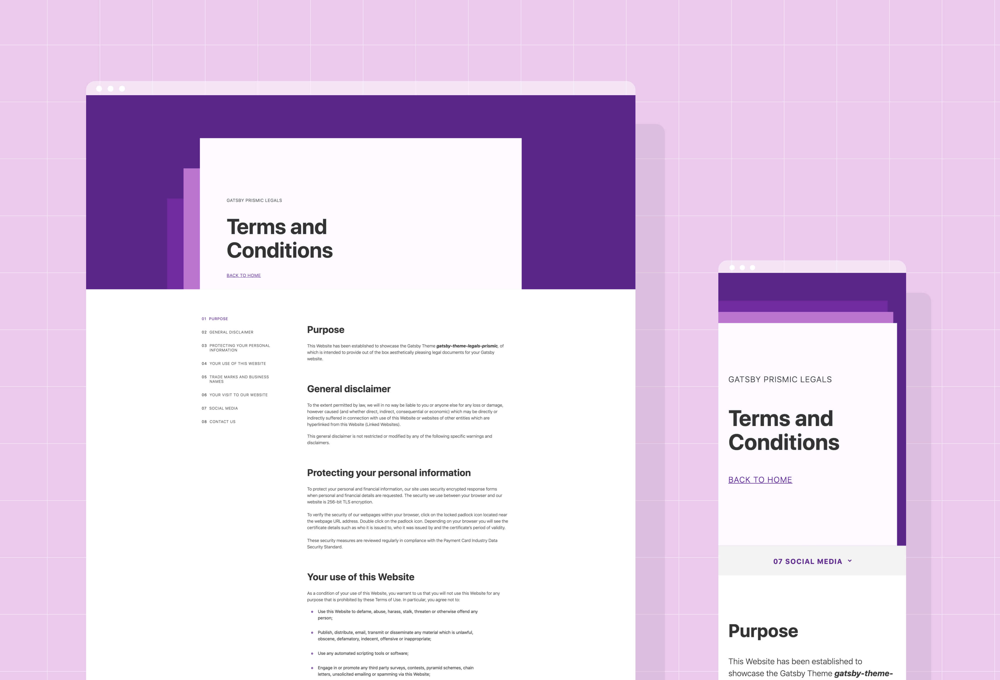

At the beginning of July, [Brent Jackson](https://twitter.com/jxnblk) joined _Learn With Jason_ to show [how to use `theme-ui`](https://youtu.be/6Z4p-qjnKCQ?list=PLz8Iz-Fnk_eTpvd49Sa77NiF8Uqq5Iykx). During the show, we announced the stable launch of [Gatsby themes](/docs/themes/) and kicked off the [Theme Jam](https://themejam.gatsbyjs.org), a celebration of our incredible community of creators.

## What is the Theme Jam?

In a nutshell, the Theme Jam was a way for Gatsby to give back to its community: everyone who published a theme and submitted it to the Theme Jam will receive exclusive swag designed by [Maggie Appleton](https://maggieappleton.com/). Two creators who published themes our team reviewed as exemplary are getting an all-expenses paid trip to [Gatsby Days](https://www.gatsbyjs.com/resources/gatsby-days/). (For more details, see the [rules](https://themejam.gatsbyjs.org/rules).)

## How were entries reviewed?

Every Theme Jam entry needed to have a demo site, a published npm package, a public repo, and a properly configured `package.json`.

Entries also needed to be incredibly performant (_something something blazing fast_) and meet accessibility standards.

On top of that, submissions were code reviewed for documentation, the ability to extend and shadow the themes, and creativity.

### Part 1: Automated Review

Several parts of the judging could be done automatically, so we set up an ugly-but-effective [automated test](https://github.com/jlengstorf/theme-jam-tester) that would:

1. Run a [webpagetest.org](https://webpagetest.org/) audit on the demo site
2. Run a [Lighthouse](https://developers.google.com/web/tools/lighthouse/) audit on the demo site
3. Check for required fields and keywords in `package.json` (shout out to [unpkg.com](https://unpkg.com) for making this easy)

To pass the automated review, a theme must:

- score at least 90 on the Lighthouse accessibility audit
- score at least 80 on the Lighthouse performance audit
- have all required fields in `package.json`

Of the 111 submissions, 52 passed the automated review.

### Part 2: Manual Review

Every theme that cleared the automated review was manually reviewed by [Jackson](https://twitter.com/jxnblk), [Amberley](https://twitter.com/amber1ey), [John](https://twitter.com/4lpine), [Kyle Gill](https://twitter.com/gill_kyle), [Chris](https://twitter.com/chrisbiscardi), [Flo](https://twitter.com/fk), and [me](https://twitter.com/jlengstorf).

Amberley did a manual accessibility audit. Nearly all of the themes we reviewed have a few accessibility issues, so we will be opening issues with feedback and suggestions to improve that.

We also looked for coding best practices, ease of [shadowing](/blog/2019-04-29-component-shadowing/)/extending the theme, documentation in the README, and overall creativity/ambitiousness of the project.

## Highlighting Exemplary Creators

We plan to feature a lot of the excellent creators and their themes that were created both as part of Theme Jam and outside of it.

For Theme Jam, we specifically wanted to call out excellence. This is really important with themes being so early; great examples lead to improving the quality of the entire ecosystem.

Two of the themes we received stood out especially. As we reviewed, we all took notes on the themes we thought were outstanding, and _every one of us_ chose these two themes as excellent examples.

**So please join us in congratulating Vojtěch Holík and Allan Pooley on their outstanding work on [`gatsby-theme-simplecast`](https://github.com/vojtaholik/gatsby-theme-simplecast) and [`gatsby-theme-legals-prismic`](https://github.com/littleplusbig/gatsby-theme-legals-prismic)!**

### Vojtěch’s Simplecast Gatsby Theme

Vojtěch combined data sourcing from [Simplecast](https://simplecast.com/)’s API, beautiful design, and an explorable UX to create this powerful theme for podcasters.

**Check out the theme: [source code](https://github.com/vojtaholik/gatsby-theme-simplecast) · [demo](https://gatsby-theme-simplecast.netlify.com/)**

### Allan’s Prismic-Powered Legal Pages Theme

Allan turned something boring (required legal pages) into something beautiful by pulling common legal pages — such as a “terms & conditions” page — from [Prismic](https://prismic.io/) and putting them into a gorgeous UI. This theme highlights theme composability: combine this theme with others to quickly add required legal pages to any Gatsby site!

**Check out the theme: [source code](https://github.com/littleplusbig/gatsby-theme-legals-prismic) · [demo](https://gatsby-theme-legals.netlify.com/)**

## Thanks to the Entire Community

We also want to say an enormous **thank you** to everyone who participated in Theme Jam. It was so much fun to watch everyone building and creating incredible things using themes, and we can’t wait to see what the future holds.

Stay tuned for additional creator spotlights — there were way too many amazing themes to try and pack them all into one post.

## Want to Get Involved?

Just because the Theme Jam is over, it doesn’t mean we’re not super excited to build more themes and see what you can come up with!

If you’d like to start building themes, here are a few resources:

- [Gatsby theme official docs](/docs/themes/)
- [Official egghead course on Gatsby themes](https://egghead.io/courses/gatsby-theme-authoring)
- [Converting part of an existing website to Gatsby themes](https://www.youtube.com/watch?v=ciGFxNamooI&list=PLz8Iz-Fnk_eTpvd49Sa77NiF8Uqq5Iykx&index=4)
