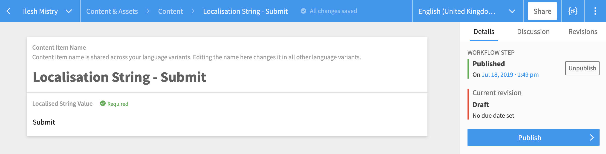
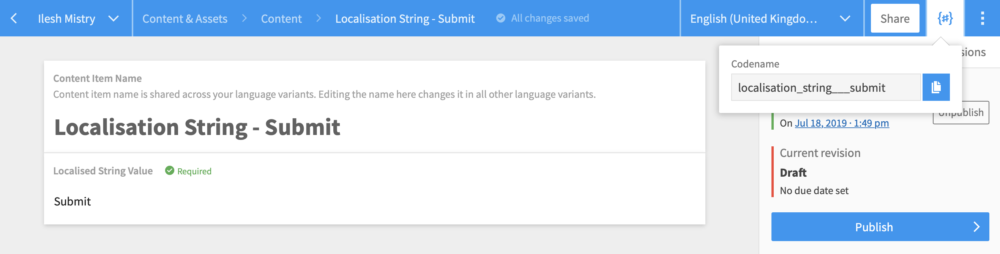
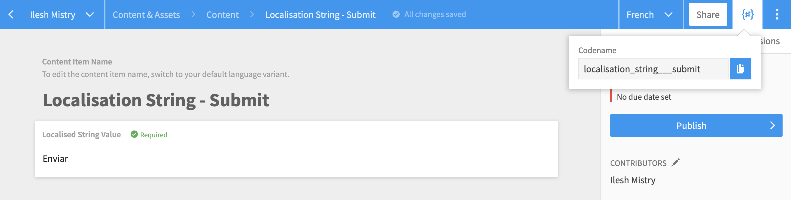
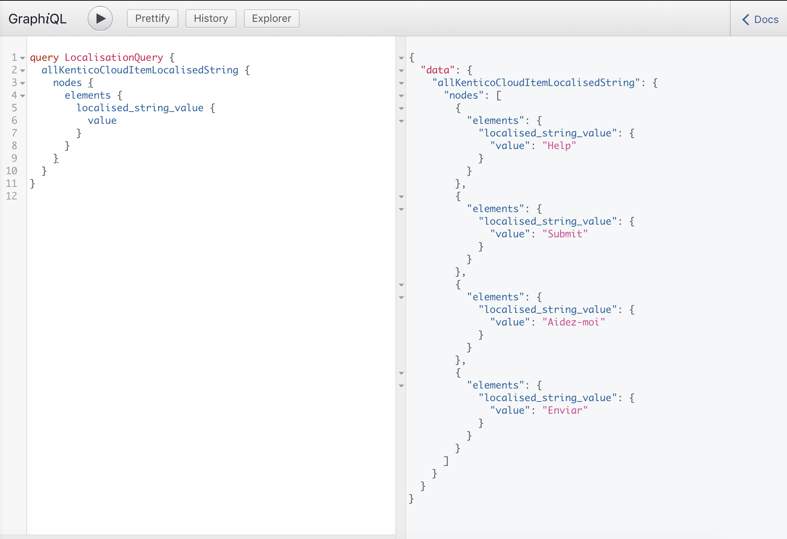
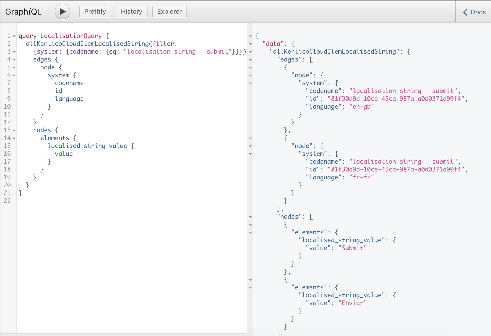
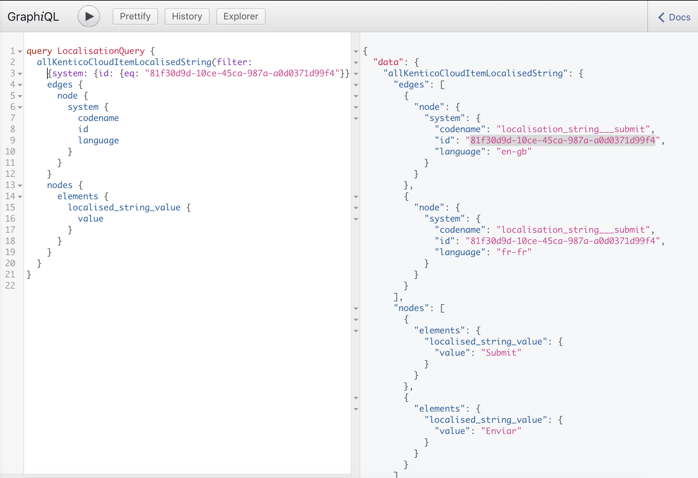

Every website or application tends to have text elements which are typically static and rarely change – think of the items in your header or footer (e.g. copyright text). For many sites, the temptation is to simply hard code this into the master template or templates. However, when you throw multilingual websites or shared templates into the mix, this swiftly becomes a bad idea. Handing the editors the ability to content manage these items becomes a necessity.

If you're familiar with content management systems like [Kentico EMS](https://www.kentico.com/), then you will have come across the term [Resource Strings or localized Strings](https://docs.kentico.com/k12sp/multilingual-websites/setting-up-a-multilingual-user-interface/working-with-resource-strings). These localized strings replace the static text across your site and are a combination of a 'key' and 'value' pairing. The CMS consumes the 'key' to retrieve the 'value' of your chosen culture or language as and when required. The use of these localized strings gives editors the additional content management control required.

Most CMS offer methods for handling these localized strings. However, with “headless”, API-first CMS, there’s no out-of-the-box feature and a best practice has to be established. I'm going to use [Kentico Cloud](https://kenticocloud.com/), a CaaS ([Content as a Service](https://en.wikipedia.org/wiki/Content_as_a_service)) platform which focuses on a content-first approach, providing you the ability to create, manage and distribute content without worrying about how and where it will be displayed. If you need to know more about Kentico Cloud and how to get started with it, you can catch up on the product through my previous post, [Getting started with Kentico Cloud](https://www.ileshmistry.com/getting-started-with-kentico-cloud/).

_Disclaimer – Languages only apply to certain Kentico Cloud plans. For the approach in this article, I’m assuming cultures have been enabled in your selected subscription plan!_

The flexibility of Kentico Cloud means there are many ways to achieve the same goal. Having been through this several times, I’m going to step you through a best practice approach to creating and retrieving localized strings.

## Identify your language

Our first step is to determine how we are going to identify cultures or languages from the frontend of the site. As Kentico Cloud is purely a content hub, there’s not the same set of localization web parts and widgets that you might get from a product like Kentico EMS. We need an alternative to pick up that culture code.

There are a few options here. You could be using a simple language switcher control on your site or application. Or, it might be as simple as deriving it from the URL e.g. _www.mysite.com/en-gb/about-us_ or _www.mysite.com/about-us?lang=en-gb_.

Whichever route you’ve taken, once you know the culture code then you can get any ‘key’ and ‘value’ pairs for the required culture.

## Setting up your content type

If you want to look at building localized strings, the first step is to head to your [Content Types](https://docs.kenticocloud.com/tutorials/set-up-projects/define-content-models/creating-and-deleting-content-types). You would create a localization String content item.

Here is a [Content Item](https://docs.kenticocloud.com/tutorials/write-and-collaborate/write-content/adding-content-items) derived from a '_localized String_' Content Type, which has a single field for the 'value'.

As I mentioned earlier, localized strings work in a pair of 'key' and 'value'. The good thing about Kentico Cloud is that the 'key' is something you could derive from the 'Code name' for the content item and it saves you creating additional fields for it.

You will most likely be utilizing the IDs for the content item, but it's useful to have the code name as well.

## Adding your content

With your content type set up, the next step is to get your content in – ensuring you add the content for all your languages (I’m assuming you’ve already set up your languages in the settings!).

_(If you need to know how to switch the content from one culture to another have a look at the [switching languages](https://docs.kenticocloud.com/tutorials/write-and-collaborate/create-multilingual-content/switching-languages) section in the Kentico Cloud documentation.)_

One thing to remember at this point is that if you want to use similar text (or simply give yourself a starting point) in the destination culture to your original culture, then you can use the [Copy from language](https://docs.kenticocloud.com/tutorials/write-and-collaborate/create-multilingual-content/translating-content-items#a-translating-a-content-item) option once you have switched over to the new culture.

## Using GatsbyJS and GraphQL to retrieve the localized content

Now we have the localized string Content Types and Content Items created in Kentico Cloud, the next step is to retrieve the content. I'm using the awesome and very popular static site generator [GatsbyJS](/) with [GraphQL](https://graphql.org/), a query language for your API.

_(Another assumption for you... We’re assuming you have GatsbyJS + GraphQL set up for your project. If not, you can find a starting point here, [GatsbyJS sourcing from Kentico Cloud](/docs/sourcing-from-kentico-kontent/).)_

With your content items in Kentico Cloud, you should be able to see them when you conduct a GraphQL query.

Here is an example of the GraphQL query you will use to retrieve the ID and CodeName for the Content Items from Kentico Cloud using GatsbyJS. Think of this as the 'key' you would need to retrieve the 'value'. You can see the 'codename' and 'id' as potential options that you could use in the below GraphQL query.

You can retrieve all localization strings using the following GraphQL query.

However, to retrieve the actual 'value', there’s a little more to do in your GraphQL query.

Here is an example of a GraphQL query where I am using the 'CodeName'.

And, here is an example of a GraphQL query where I am using the ID.

As you can see, once you know which 'key' you need, then it's pretty simple to get the 'value' and also detect the language variant you need to retrieve in GatsbyJS using this GraphQL query format.

## Separate projects

Before we go any further, it is important to take stock of your localization string content items. Creating culture versions of each item doesn’t increase your number of Content Items so you’re unlikely to be jumping up through plans. However, the number of localization string Content Items is something to keep in mind. Also, consider the number of environments/projects you have in your subscription, which could multiply the number of Content Items you have in total.

We would always advocate pragmatism when creating your content models. In addition, maybe consider creating the localization strings as a separate project that feeds into all the projects that need to utilize them. This is a solution that has worked across several of our projects and ensures that all localized strings are available to all projects and all environments, removing the overhead for updates.

## Summary - A recap of the steps involved in creating localized content in Kentico Cloud

There’s a lot to consider there so let's recap:

- Create a Content Type for localize string items.
- Add appropriate Content Items with the values for each localized string item.
- Create the relevant culture alternatives for the content items created.
- Once you know the desired culture you would then look in GraphQL nodes for the localized strings you need to show and use the filter option to help you bring specific localized strings back.
- Utilize the query within your GatsbyJS layout/React code.
- Making sure you create a new project to house all your localized strings.

Like with many things in the CaaS arena, there’s many ways to approach tasks. There are other ways of handling localization but, having been round this before, I recommend this approach.

localization is just one of the many challenges you’re going to face when working with CaaS platforms. If you’re working with Kentico Cloud and facing a particular challenge then get in touch with [Ilesh Mistry](mailto:ilesh.m@mmtdigital.co.uk) to see how I can help.
