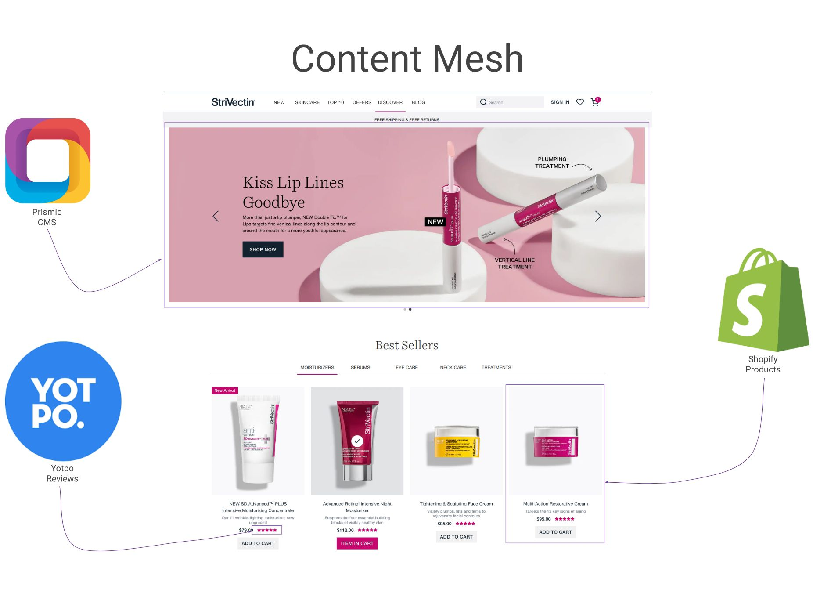

[StriVectin](https://www.strivectin.com), founded in 2002, sells lab-tested, anti-aging skincare products. They offer direct-to-consumer products online and are stocked in thousands of retailers globally. Their first site went live on Magento Enterprise in 2011. During this time, the customer base has grown more than 10x. This growth introduced technical obstacles. Site outages became a constant problem during marketing events and press releases. The site performance was sluggish—even when utilizing a CDN, browser cache, and Magento’s page cache.

The performance and stability concerns needed resolution in order for StriVectin to succeed. [Elevar](https://getelevar.com/?utm_source=gatsbyjs&utm_medium=blog&utm_campaign=casestudy&utm_content=casestudy), an e-commerce data analysis and optimization company, helped with implementation which included designing, building, and launching. Fast forward to July 2019 and a new, blazing-fast site launched using Gatsby. Day-to-day concerns with site outages, instability, or “the site is slow for me” are now a thing of the past!

## Client goals

StriVectin wanted to move to a platform that allowed them more freedom and flexibility without the worry of encountering scaling, stability, or performance issues. They wanted a site makeover and to be able to manage their content with ease. With monolithic applications like Magento, clients perform technical tasks. They are forced to edit HTML, clear cache, and generally live in fear after clicking the “save” button. Hosting, development, and maintenance are expensive.

## Elevar goals

After aligning with the client’s goals, we came up with some of our own. Speed and performance were paramount since our own data across hundreds of e-commerce stores show that speed correlates to conversion rate. We also wanted to invest in thinking through each user interaction, design choice, and an advanced analytics tracking solution for all marketing partners.

Most developers struggle with the steep learning curve associated with Magento. The codebase is roughly 20,000 files! Our team wanted to Improve DX (Developer Experience). We’ve experienced attacks first-hand in Magento, and the constant paranoia associated with security patch release cycles. We wanted to reduce this exposure.

## Tools

We assessed different tools and products, settling on the following tech stack:

- Gatsby (with hooks!)
- Storybook
- Prismic
- Shopify
- Firebase

## Gatsby

Gatsby provides us with a superior DX and a fast site. This includes:

- Server-side rendering at build time
- Hot reloading
- Code splitting
- Link preloading
- Image optimization
- The "content mesh" via GraphQL with GraphiQL
- Hooks API

### Content Mesh

Gatsby provides conveniences around data fetching. The “Content Mesh” is a mesh of different content sources stitched into a single data layer. You can query this layer using GraphQL. Our “Content Mesh” consists of Prismic, Shopify, and Yotpo. You can see how those data sources make up the Homepage below:

### Leaving the server behind

Because Gatsby provides a build payload, we can host the site directly on a Content Delivery Network (CDN). Not only does this make hosting cheaper, but also makes things more secure. This completely eliminates a large piece of the attack vector with owning a server. We didn’t have to set up and maintain a Web Application Firewall (WAF), keep OS packages up-to-date, or install software patches.

## Storybook

Storybook is a UI for developing your frontend components in many different states. It allows you to develop your components without considering the application’s state. This separation makes for:

- Clear separation between data definition and fetching
- Easier visual testing

## Shopify

Shopify is an e-commerce platform with a robust Storefront API. The Content Management System (CMS) features in Shopify are limited without using its theme engine. The theme engine only works with the online store, meaning you can't use it for a headless Shopify store.

We only needed to use Shopify for the transactional aspects of the site. This includes account management and checkout. The Storefront API supports checkout. We used the online store for account management.

## Prismic

Prismic is an API-first CMS. Users can define the shape of their content through "types". A powerful form builder allows users to describe the shape. The form fields can be rich text, options, grouped, repeatable, relations to other types, etc.

Prismic also offers a "slices" feature. Different "types" can share the slices. This enables a Product and Homepage type to share a Hero Banner slice.

The gatsby-source-prismic plugin integrates Gatsby with Prismic.

## Firebase

Google Cloud hosts our applications at Elevar. We wanted to stay in the same cloud provider, if possible. We settled on Cloud Build for CI/CD, but still needed a host. Firebase provided a solution to our problems. Firebase offers more than a static host. It offers HTTP functions for dynamic actions. This prevents you from having to think about another separate service.

## Project plan and execution

Our project plan was not traditional compared to most e-commerce projects:

1. Design.
2. Turn designs into components.
3. Showcase components in Storybook with Knobs and Viewports.
4. Use component data requirements (React Props) to create types in Prismic. Setup sample data for each type.
5. Create components using data from components using Gatsby.
6. Add integrations with Shopify and Third-parties.
7. Configure Firebase and Launch site.

After design approval, we could focus purely on the designs and component implementation. We were only in Storybook at this point. User Acceptance Testing (UAT) is simpler this way. The client can view components shared across pages in various states. Component tweaks are smoother during this phase. The component data is completely decoupled from the source. Our React components already defined the data that they needed. We only needed to define the data in the CMS (Prismic).

After defining and populating our CMS with sample data, we were onto the Gatsby phase. Keep in mind that we didn't have any templates like a typical Shopify theme. You would think that it would be slower to start from scratch, but it had the opposite effect. Implementing with Gatsby enabled us to develop faster. We weren't bound by templates like a typical Shopify theme. We were able to reuse queries and components across pages.

After completing the majority of the implementation, we moved onto integration with Shopify. The Storefront API made it easy to create checkouts. We use the online store for account management, so we had to theme it. We mirrored the Gatsby site for the account management pages.

StriVectin also offers subscription products that required a split checkout. Recharge, a third party, handles these recurring transactions. We used Firebase HTTP functions to create checkouts against their API.

We used other Firebase functions for triggering builds (webhooks), testing lighthouse scores, and notifications. Our build triggers come from webhooks, pull requests, and builds.

## Launch

Launch was effortless. We had the site living on a subdomain of strivectin.com so we were able to conduct thorough testing of cross-domain tracking, cookies, and checkout processes with Shopify and ReCharge.

Felicity Sissener, the Chief Digital Officer at StriVectin had this to say about launch:

<Pullquote>
  “This has also been the smoothest cut-over of my entire career- your team and
  work are top notch.”
</Pullquote>

We confidently ship code to production many times per day. At the time of writing this, we have not had a single site outage.

StriVectin’s hosting costs have gone from \$2,000/month to just a few dollars per day. The servers will be decommissioned very soon.

Feature development and maintenance is much simpler. The codebase was around 20,000 files on Magento and went down to around 300.

## Final Thoughts

We are still less than 30 days out from launch which means the typical e-commerce KPIs like conversion rate and revenue per visitor have not stabilized due to traffic and marketing changes during the cutover. One KPI that is not discussed much in headless/PWA discussions is the impact on organic SEO traffic. We have seen an immediate and sustained increase of 20% in organic traffic to the site.

The StriVectin team is now armed with a site that is fast, secure, can handle rapid merchandising iterations, and ready to scale for the Q4 holiday season and beyond.
