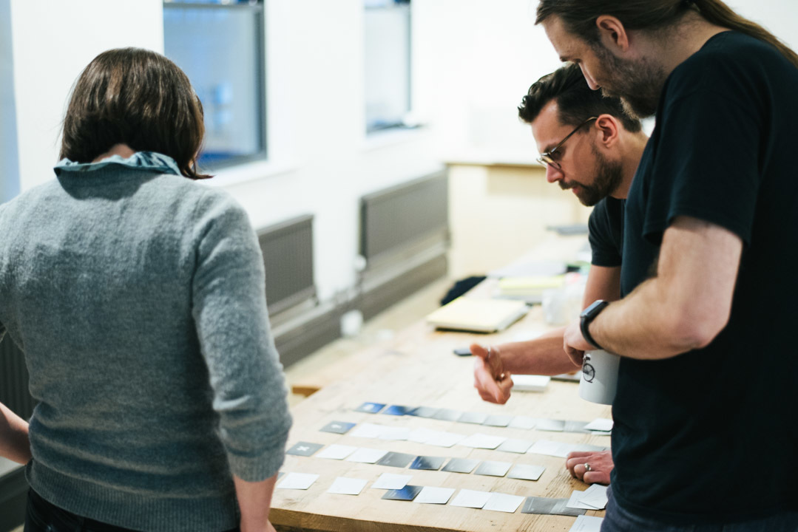
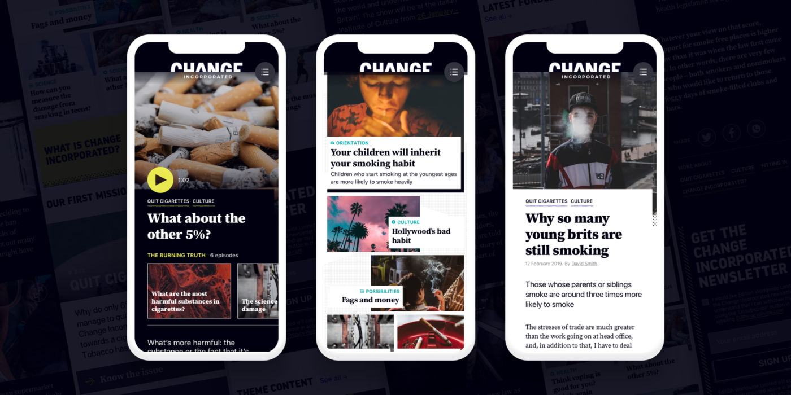
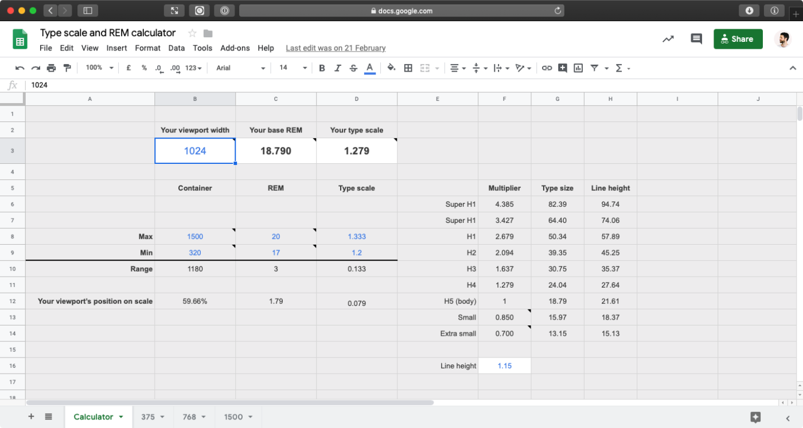
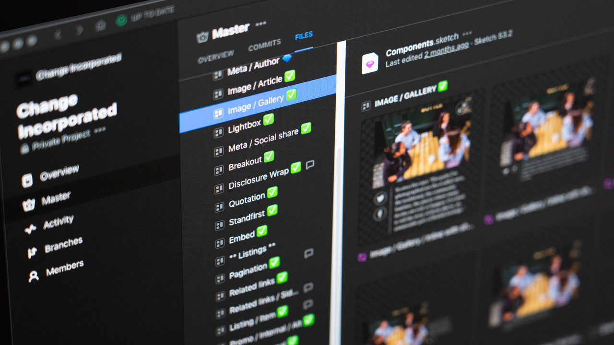

[Change Incorporated](https://uk.changeincorporated.com/) is a new, purpose-driven media company owned by [VICE](https://www.vice.com). The new channel aims to create measurable social change from the inside out for some of the biggest social issues affecting VICE's audience.

The Change Incorporated team needed a minimum viable product within a very aggressive time frame. It was a tough challenge, one that would ultimately result in a fully-functioning publishing platform and a fully articulated design vision.

## The Results

### Simply scalable

The innovative approach ensured that scalability, speed and consistency were built in. This means the platform can easily stretch along with the ambitions of the brand.

### Exceptional performance

The stack used offers faster site performance, improved security and more cost-effective, long-term hosting.

### A foundation for real change

The platform is receiving a nationwide digital and out of home (OOH) campaign to support the [Quit Cigarettes](https://uk.changeincorporated.com/quit-cigarettes) mission.

<Pullquote citation="Toby Lee, AZ, Product Owner Change Incorporated">
  “Your flexibility, professionalism, and high standards throughout have been
  very much appreciated. We started with an ambitious set of goals and a very
  tight deadline, and I was fully expecting we would have to look at compromises
  for what we were hoping to achieve. Thanks to your efforts we have a really
  solid foundation, technically, experientially, and visually, to continue
  building and iterating on what is already a great website (and dashboard!). On
  top of all that, it’s a pleasure working with you all. Great work, thank you!”
</Pullquote>

## The Full Story

### Taking a pause to improve pace

Change Incorporated had a well-defined brief including a list of their desired features. Some of this was new territory for [Clearleft](https://clearleft.com) from a technical perspective – we don’t typically do backend website builds so we enlisted a tech partner [Nearform](https://www.nearform.com/) to support us in delivering the project.

We proposed a headless Content Management System (CMS) with server-side rendering. Nearform helped validate this and proposed a static site renderer. We based the project on the JAMstack architecture: an approach based on client-side JavaScript, reusable APIs and prebuilt Markup.

Compared to more traditional approaches, we found that JAMstack offered faster site performance, improved security, more cost-effective hosting, a quicker and more focused developer experience, and more practical scalability. The key tools we used to build the site were [Contentful](https://www.contentful.com/) (as a [headless CMS](/docs/headless-cms/)) and the React-based web framework [Gatsby](/), with GraphQL to build the pages. The impressive performance benefits Gatsby brought us were immediately evident. These technologies were great to work with and fitted really well into our skillset.

From the start, this was an incredibly ambitious project. Building a publishing platform from scratch is not as common a task as you might think. We took a breath at the start of the project to ask ourselves: What effort could we make now that would save us time in the long run, but at the same time deliver something really harmonious? Given the short time frame, how could we work smarter? How could we maximise our efficiency without cutting corners?

## Building a typographic system from scratch

As a new venture, the only design inputs we had to work with were some conceptual layouts and indicative branding in some of the client’s early proposals. We spent some time reviewing a selection of news and publishing sites, looking at page layouts, information density, font combinations, and their overall reading experiences.

The Change Incorporated team had already scouted some incredible photographic and illustrative contributors, so we had great confidence in the quality of the site’s visual content. Our first challenge was to design a solid typographic system to frame this beautiful imagery.

Strong typography is especially crucial for a publishing platform. We wanted a simple, authoritative typographic system that would work well with a wide range of content on any device. We needed to introduce enough character for the brand to own and build on in the future, but keep the type restrained enough to avoid visual competition with the site’s strong imagery.

During our early exploration, our head of frontend development suggested a font budget of five files. Using a mixture of system fonts and variable fonts where appropriate, we were able to squeeze a few extra styles into this budget without loading more than five files. Working within this constraint really forced us to consider our choices. The end result is a performant site with consistent typography that feels at home on any device.

<Pullquote citation="James Gilyead, AZ, Visual Designer Clearleft">
  It was a pleasure to work alongside fellow visual designer Luke on Change
  Incorporated. Having a full-time critique partner kept the designs on track,
  and Abstract helped us to present a unified vision to the project team.
</Pullquote>

In addition to using variable fonts, building the site from scratch gave us the opportunity to work with modern CSS features like grid layout and custom properties. Early on in the project we also invested some time in designing both a fluid responsive grid and a fluid typographic system. These worked together to elegantly scale the design to look great on any device, without relying on arbitrary breakpoints to resize the type.

We designed for a minimum and a maximum viewport width, set a typographic scale at each end, and used an algorithm to calculate font sizes for any viewport width between the two ends. The result is a dynamic scale which is subtle at the smaller end, and grows to make the best use of space based on any device’s actual viewport width. We shared a Google Sheet with the project team, which became our source of truth for checking font sizes at any viewport width. This helped to avoid confusion between designers and developers, and could be easily tweaked any time we decided to change any of the values.

## Running streams concurrently

In order to meet our deadline, we kicked off all streams of work on day one. The excellent [Abstract](https://www.abstract.com/) version control tool for Sketch was our centralised design resource. With two visual designers and a handful of developers on the project at any time, this tool was invaluable for keeping everybody’s files up to date. Abstract also neatly handled commenting and some light design critique, and the change tracking proved immensely beneficial for the developers. Our systematic approach enabled us to deliver a full component library and the design language was pushed much further than we thought possible in the time available.

The tight deadlines forced us to begin development almost immediately. The challenge we faced was how to develop without specs, wireframes, or a complete information architecture. What we decided to do was start with the skeleton of a component library and a simplified app, so that we could iterate on both as the design progressed. Each iteration was focused on critical features and functionality.

Initially we focused on the component library – our experience with building component libraries and design systems meant that we knew what baseline elements and configuration we would need. We set up a system of design tokens to allow global values like brand colours to be changed quickly and easily. The moving targets of design and UX meant that we sometimes had to redo work, but overall the iterative approach was truly agile.

## Building longevity into an MVP

In order to optimise the investment, we ensured we built a system that functioned as a publishing platform, but as the needs of Change Incorporated evolve and grow, the system can grow with them. Being decoupled from any presentational aspects, using Contentful will allow them to serve any theoretical endpoint down the road, such as native apps, digital magazines, serialised content, etc.

This system means that in future, anything created within it should function as part of the system by default – inheriting the system’s responsiveness, the type hierarchy, the fonts, the fluid grid. It’s a very extensible approach; a solid modern foundation to take and grow as a publishing platform.

The information architecture is non-hierarchical and based on a complex relationship tagging system. Some tags describe the theme of the campaign, some describe the topic, and above that, there are categories to group topics together. The idea behind topics and categories is that categories will remain consistent across every campaign but the topics can be bespoke per campaign, providing flexibility but not at the expense of consistency.

<Pullquote citation="Dominique Delport, International President VICE MEDIA Global">
  VICE has always had a revolutionary spirit, so we are going to focus that
  effort into helping create the biggest measurable change that matters to our
  community. We have never shied away from taking risks to tell the tougher
  stories and uncover the facts, so while we are starting with a mission to get
  the UK to quit cigarettes, this is the start of a bigger global ambition
  through Change Incorporated where we will look at ending the use of single-use
  plastics, reducing sugar consumption and reducing our reliance on fossil
  fuels.
</Pullquote>

## Commitment to the deadline

This involved an extraordinary commitment to the deadline. We were leading a team of three developers, coordinating efforts and multiple stakeholders, while also juggling content going in while development was ongoing. We also had to train the client team on the brand new CMS alongside the other work. We successfully portioned off work-streams into a component, apps and devops backlog, and managed these different disciplines simultaneously.

This allowed us to hit the crucial MVP date for [changeincorporated.com](https://uk.changeincorporated.com/) and be up and running and ready to show key stakeholders. The feedback from investors was incredibly positive and the deliverables far surpassed the expectations considering the ambition and deadline.

---

Have questions? Feel free to ask us anything. From basic questions to complex queries about your approach to strategy, research, dev and design, Jon is ready to help you out. Call [+ 44(0) 845 838 6163](tel:+448458386163) or [get in touch](mailto:jon@clearleft.com).

This was originally posted on [Clearleft.com](https://clearleft.com/casestudies/change-incorporated).
