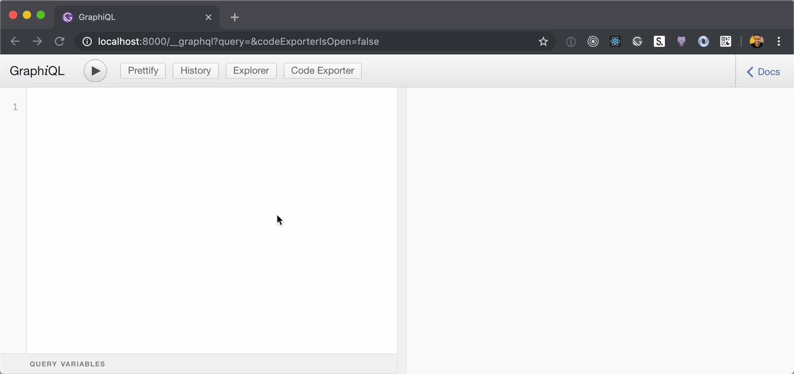
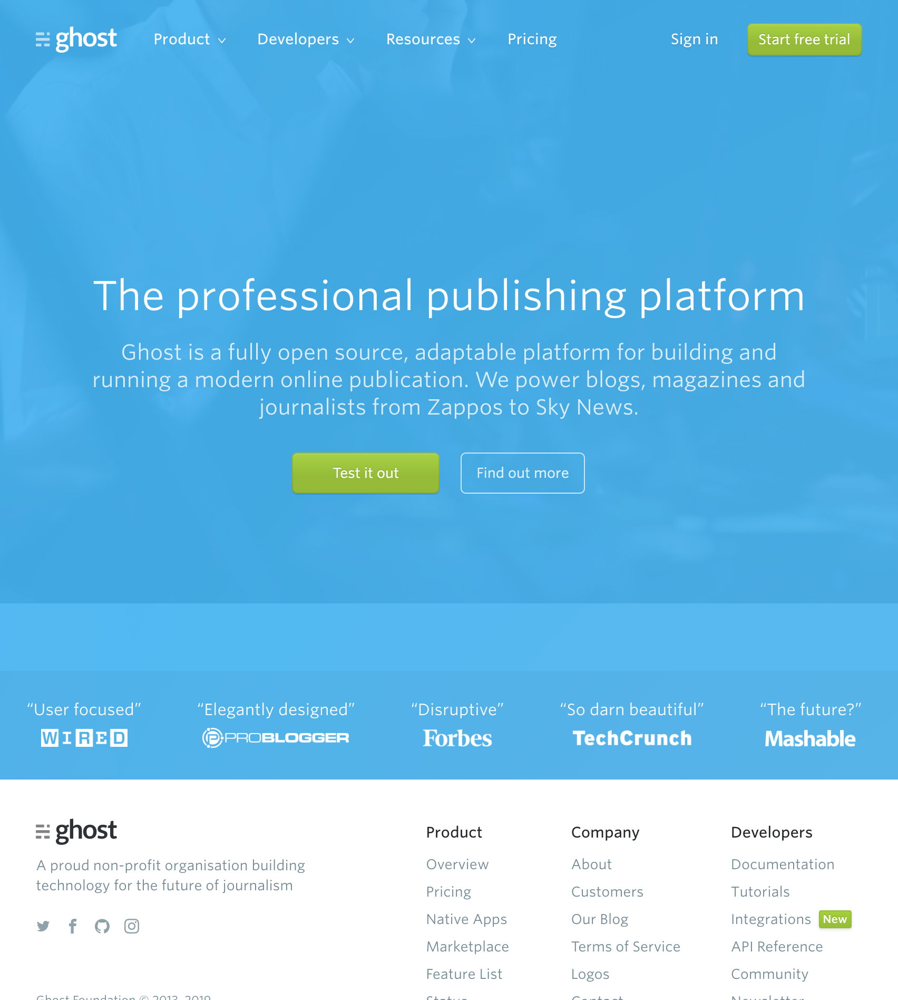

How was August for all of you? It's been rainy here in Mumbai. Like [_really_](https://qz.com/india/1703369/photos-of-mumbai-rains-and-floods-amid-indian-monsoons/) rainy. But let's not digress cause it's time for the Gatsby Gazette!

This month's Gazette features our work on materialization, a healthier Gatsby repo with improved community engagement, some accessibility wins, better webpack chunking, a better offline experience in Gatsby, a brand new theme of the month, and finally, Gatsby Days.

Let's get this party started.

## Team Highlights

The Gatsby team has had a busy month. We've made some exciting improvements.

### Accessibility

[Marcy Sutton](https://twitter.com/marcysutton) from Gatsby's Learning team has been doing some incredible work in making Gatsby more accessible by default.

A big part of making the web more accessible is teaching us how to write more accessible apps! Back in June, Marcy conducted some user testing sessions for accessibility research. She wrote about it in her post, [What we learned from user testing of accessible client-side routing techniques with Fable Tech Labs](https://www.gatsbyjs.org/blog/2019-07-11-user-testing-accessible-client-routing/) which I consider canonical and _required_ reading.

Marcy also presented a full-length workshop on [Accessibility in JavaScript Applications for Frontend Masters](https://frontendmasters.com/workshops/javascript-accessibility/), including some exclusive tidbits about building accessible Gatsby sites. In case you haven't read her post or seen her workshop already, please _do_ to learn how to make your web apps more accessible.

### GraphQL

We've made a bunch of improvements to Gatsby's GraphQL layer recently. Here is a quick summary:

- We now support abstract data interfaces. This means that you can build Gatsby sites (or themes) that support the same query for multiple data sources. [Mikhail](https://twitter.com/freiksenet) from the core team talks more about this on [Learn With Jason](https://www.youtube.com/watch?v=ALspNtrOqDk)
- Materialisation: This work included a major refactoring in Gatsby’s data layer. It restores support for a database storage backend within Gatsby, which speeds up builds for larger sites. Check it out in [#16091](https://github.com/gatsbyjs/gatsby/pull/16091).
- [Stefan](https://github.com/stefanprobst) added the ability to snapshot your Gatsby schema in [gatsby-plugin-schema-snapshot](https://www.gatsbyjs.org/packages/gatsby-plugin-schema-snapshot/). This enables you to lock-down a project’s GraphQL schema.
- GraphiQL Explorer is now available in the WPGraphiQL plugin for WordPress. Thanks to [Henrik Wirth](https://github.com/henrikwirth) for adding this feature in [#16](https://github.com/wp-graphql/wp-graphiql/pull/16).

### gatsby-plugin-offline v3

[David](https://twitter.com/davidbailey00) (who recently joined the Gatsby core team) has been working on [gatsby-plugin-offline](https://www.gatsbyjs.org/packages/gatsby-plugin-offline/) and recently released v3 of the plugin.

v3 includes an updated Workbox, the ability to append custom scripts to the generated service worker and many more smaller improvements.

### Optimized JavaScript bundle configuration

[Ward](https://twitter.com/wardpeet) from the core team recently made some improvements to Gatsby's webpack config in [#17093](https://github.com/gatsbyjs/gatsby/pull/17093). This introduces a better splitChunks config and results in a 400 KB reduction in initial bundle size and a 400 ms faster [TTI](https://developers.google.com/web/tools/lighthouse/audits/time-to-interactive) for [gatsbyjs.org](https://gatsbyjs.org).

Huge shoutout to the Next.js team since we picked this up from them!

### Renovate

We recently enabled automatic dependency updates using [Renovate](https://renovatebot.com/). As of today, dependencies in all official Gatsby packages are completely up to date (excluding major versions).

This means faster resolution of bugs caused by upstream issues and also better security.

We'd like to thank [Rhys Arkins](https://twitter.com/rarkins) for all his help on setting this up and we highly recommend Renovate!

### Localizing Gatsby Documentation

[Nat Alison](https://twitter.com/tesseralis) who helped translating the React documentation is helping us set up the Gatsby documentation for translations. She's documented a few possible approaches that have worked in her experience in the [RFC for Gatsby Docs Localization](https://github.com/gatsbyjs/rfcs/pull/42).

We'd love to hear your comments on the RFC. If you're interested in helping translate the Gatsby documentation to a language of _your_ choice, now is the time to get involved!

## Community Highlights

It's been a pretty busy month on the monorepo. We've merged in a _lot_ of your contributions and they've all been amazing. Let's go over some of the highlights!

### GraphiQL Code Exporter

Back in June, [Michal](https://twitter.com/mipiechowiak) from the Gatsby core team worked on adding [GraphiQL Explorer](https://github.com/OneGraph/graphiql-explorer) to GraphiQL in Gatsby. One of the next steps he mentioned was the addition of code snippet generation using graphiql-code-exporter.

Gatsby now includes Code Exporter in GraphiQL out of the box starting from v2.15.3, thanks to [Dan Kirkham](https://twitter.com/herecydev).

When you write a query in GraphiQL, this will automatically generate code for you! You can check out Dan's work on [the PR on GitHub](https://github.com/gatsbyjs/gatsby/pull/17120).

### Notable PRs

It's _really_ hard to pick out favourites from all the incredible contributions you folks make so apologies in advance if I missed anything (let [us](https://twitter.com/gatsbyjs) know on Twitter). Here are my favourites from the past month:

- [Jeremy Albright](https://github.com/Js-Brecht) did some really solid work and fixed an issue where Gatsby CLI would leave your terminal in an inconsistent state in [#16714](https://github.com/gatsbyjs/gatsby/pull/16714)
- [Nicolas Goutay](https://github.com/phacks) fixed a memory leak in IntersectionObservers (with help from [atomiks](https://github.com/atomiks)) in [#17056](https://github.com/gatsbyjs/gatsby/pull/17056)
- [Benedikt Franke](https://github.com/spawnia) brought order to some chaos by making root plural fields non nullable in [#15321](https://github.com/gatsbyjs/gatsby/pull/15321)
- [Mateusz Burzyński](https://github.com/Andarist) cleaned up and refactored some XState code over to v4, significantly improving the visualization in the process in [#17192](https://github.com/gatsbyjs/gatsby/pull/17192)
- [Matthew Miller](https://github.com/me4502) fixed an issue that could cause infinite loops in cyclic node trees in [#17078](https://github.com/gatsbyjs/gatsby/pull/17078)

## Gatsby Site of the month

Brand new month, brand new Gatsby site.

The site of the month is [ghost.org](https://ghost.org)

They built their brand new site in Gatsby and we love it because:

- That video in the home page background
- Nice little animations
- Blazing fast navigation thanks to Gatsby

## Theme of the Month

The Gatsby theme of the month is [Novela (a theme by Narative)](https://github.com/narative/gatsby-theme-novela)

With minimal styling and maximum features — including multiple homepage layouts, built-in social sharing and dark mode — Novela makes it easy to start publishing beautiful articles and stories with Gatsby.

I'm a big fan of the team at Narative and I think Novela is a great Gatsby theme.

Here is what [Dennis Brotzky](https://twitter.com/_brotzky) (Co-founder, [narative.co](https://www.narative.co/)) had to say:

> We’ve always enjoyed using Gatsby for our projects and when themes were announcement we knew it would be special. Novela is our first dive into themes and we’ve quickly grown to love it. It’s exciting to be part of the formation of a new way to build and share Gatsby sites.

## Gatsby Days, London

The entire Gatsby team is headed to London in a few weeks for our quarterly Gatsby gathering!

And with that, comes the next Gatsby Days. If you haven't already, [you can register here](https://www.gatsbyjs.com/resources/gatsby-days/) to watch the Gatsby team (and friends) talk about exciting new things in the Gatsby world.

We even have a special discount code just for you: **GAZETTE25**

We'd love to meet you 💜
