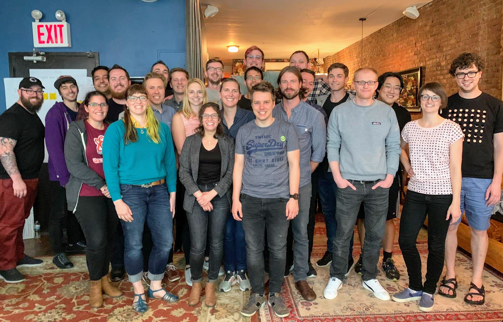

I’m incredibly excited to announce that Gatsby has raised a \$15M Series A funding round, led by [CRV](https://www.crv.com/), to drive the reinvention of website development.

Gatsby is a free and open-source web framework based on React that helps developers build blazing fast websites and apps. Hundreds of thousands of developers have adopted Gatsby since it was open sourced four years ago. Our [content mesh platform](https://www.gatsbyjs.org/blog/2018-10-04-journey-to-the-content-mesh/) is used by thousands of companies around the world, including IBM, PayPal, Harry's, and digital agencies that use Gatsby to create web properties for Fortune 500 clients.

## Why the excitement and growth?

The answer is simple. Gatsby was founded around a big idea, and that idea is starting to go mainstream. We believe that the basic architecture of websites is being reinvented. The dominant web architecture, the LAMP stack, was founded at the dawn of the web before paradigm-shifting technologies were invented, like virtual machines, AWS, smartphones, Git, Node/NPM, React, and Serverless—elements of modern engineering we now take for granted.

With Gatsby, we’re reinventing website technology so people can create sites that are lightning fast, incredibly secure, and stable. Web developers can now take advantage of the most productive and powerful modern engineering technologies and practices including Git, React, GraphQL, and continuous deployment.

Gatsby strips away much of the complexity that plagues website development. Teams tell us that they can build stunning sites 3-5x faster with Gatsby—and have a lot more fun in the process.

The web is an incredible medium. Anyone, anywhere can produce a site and ship their ideas to the world. [Individuals, teams, and organizations are turning to Gatsby to create web sites and apps that stand out](https://www.gatsbyjs.org/blog/tags/case-studies)[.](https://www.gatsbyjs.org/blog/tags/case-studies)

## From the CMS to the content mesh

In the 90s, publishing on the web was difficult. The CMS emerged as a single application to store content, build sites, and deliver them to users.

The web is now migrating to a decoupled architecture where specialized modular services are stitched together to create websites.

Instead of a monolithic CMS powering everything, Gatsby ties together specialized services with a modern development experience and optimized website delivery.

This [content mesh](https://www.gatsbyjs.org/blog/2018-10-04-journey-to-the-content-mesh) empowers developers while preserving content creators’ workflows. It gives developers access to great cloud services without the pain of manual integration.

Web developers from dozens of web CMS communities like WordPress and [Drupal](https://www.gatsbyjs.org/blog/2019-06-26-live-preview-for-drupal/) are going “headless” and using Gatsby as the presentation layer for their CMS.

We’re forming partnerships with these communities to create seamless integrations between their solutions and Gatsby.

Our work ensures that everyone collaborating on websites including developers, designers, content authors, and marketers have modern software that drives fast, pleasant, and effective workflows.

## Open Source

I’ve spent my entire career, almost 15 years, working within open source. Open source is an incredible way to build communities and software.

Over 2500 people have contributed to Gatsby including the creation of nearly 1300 open source plugins.

I’m incredibly proud of the work the community and Gatsby Inc. full-time maintainers are doing to ship great software and create a place where everyone belongs.

Great open-source tooling is what makes the web such an accessible and open space: anyone with access to a computer can learn and leverage the best development tools in the world.
_The Gatsby Team in NYC, May 2019_

With Gatsby, we’re striving to create a business model that will drive many millions of dollars of investment in open-source tools and enable people to build the next generation of web experiences.

With the latest funding, we’re now investing more than \$3 million every year in open source including on Gatsby core and official plugins and our learning materials.

## Gatsby in the cloud

We’re also investing heavily in building cloud services which complement our open source product. Modern software development work relies heavily on services from cloud vendors. Our cloud services help people quickly setup & run sites, and enable website teams, including both technical and nontechnical people, to collaborate easily together. The services will be free for personal sites and must-haves for organizations.

We’re in open beta for our initial CMS Preview service—please check it out at [https://www.gatsbyjs.com/preview](https://www.gatsbyjs.com/preview)

Lots more announcements to share in the coming weeks and months 🚀

## Growing our team

Gatsby is a distributed team with members around the world. There’s now 35 Gatsby Inkteam members, and with this new investment, we’ll be hiring more people to work on open source, write docs and tutorials, build cloud products, and create next-generation site design & building tools.

We’ll be hiring for dozens of remote positions in the coming months. Check back at [https://www.gatsbyjs.com/careers/](https://www.gatsbyjs.com/careers/) for openings (and feel free to propose your own job idea by applying to the “dream job” position).

## We’re just getting started

As much as we’ve accomplished, it feels like in many ways we’re just getting started. Soon millions of people will be using Gatsby and with the latest investment, we’re gearing up to create the technologies, products, and learning materials to help them build the best web possible.
