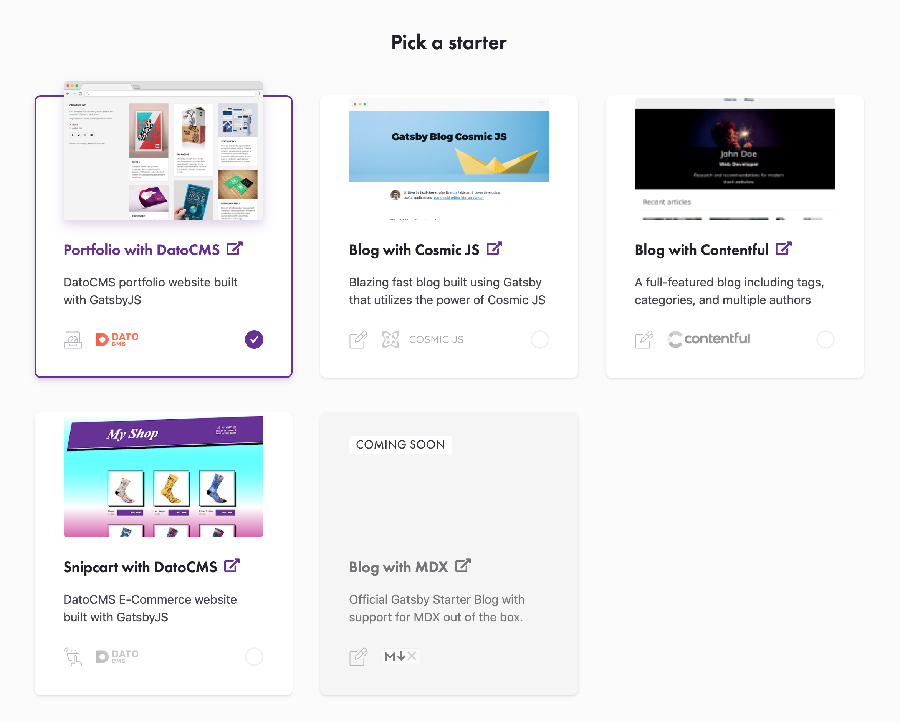

We're excited to announce the launch of [Gatsby Cloud](https://www.gatsbyjs.com/): a commercial platform of stable, trusted tools that enable web creators to build better websites.

Gatsby Cloud enhances our [content mesh platform](https://www.gatsbyjs.org/blog/2018-10-04-journey-to-the-content-mesh/) with interoperable, out-of-the-box solutions to launch websites faster, and drive business success.

This is a significant step forward for our diverse and thriving open-source community, and we're really proud of it.

## Features

Gatsby Cloud features include:

- **Cloud Quickstart** that empowers new and non-technical users to create projects in minutes with a CMS, sample content, and connected Gatsby starter.
- **Real-time Preview** to simplify content creation and collaboration. Preview offers a private playground for developers, designers, marketers, and content creators. You can view changes to your site immediately and in context.
- **CMS Integrations**—with [plugins available for 389 content management systems and APIs](https://www.gatsbyjs.org/plugins/?=gatsby-source), Gatsby offers unrivaled CMS-compatibility in the market.
- **Builds and Reports (Private Beta)**—a new CI/CD solution for Gatsby that will dramatically speed up your Gatsby builds and give you feedback on site performance—with Lighthouse—and common Gatsby errors. [Signup for the private beta](https://www.gatsbyjs.com/builds-beta/) to be one of the first to access Builds and Reports!

We want Gatsby Cloud to be used by everyone. [Our pricing structure includes a free tier](https://www.gatsbyjs.com/pricing/) designed to comfortably support personal and small sites. We're excited to see how the Gatsby community adopts and grows with our new services.

### Quotes from early customers

Jay Hostan, a senior product developer at global coffeehouse chain [Costa Coffee](https://www.costacoffee.com/), told us:

<Pullquote>
Deciding to use Gatsby Preview as a paid feature of Gatsby Cloud was a no brainer and has added a lot of value to our workflow. Before, we were building staging pipelines by hand. Preview allows our team to see content changes immediately, creating a tighter feedback loop so we can launch faster. It's enabled us to shift a lot of our focus to strategic projects and feature development.
</Pullquote>

Brian Webster, co-founder of the graphic and web design firm [Delicious Simplicity](https://www.delicious-simplicity.com/) with several clients on Gatsby Cloud said:

<Pullquote>
I love how Gatsby makes it possible to harness the power of React components, headless CMS architecture, and that it's a much more delightful workflow for developers. Now that we can use Gatsby Cloud features like Preview, our content-creator clients get an equally powerful yet simple workflow.
</Pullquote>

## Why Gatsby Cloud?

### How we build for the web is changing

Let's step back and discuss why we're building Gatsby and how our new Cloud platform fits into our vision for the project.

For most of the history of the web, the dominant web architecture has been the LAMP stack e.g., applications like WordPress. But the last decade has seen the rise of two enormous trends—cloud computing and JavaScript-rich web apps (driven by component frameworks like React). Gatsby was founded around the idea that web architectures are converging on these two ideas and will be foundational for decades to come.

Gatsby provides the building blocks for a modern web site:

- **JavaScript Component Library**. Gatsby sites are React apps, so you can create high-quality, dynamic web apps, from blogs to e-commerce sites to user dashboards.
- **Load Data From Anywhere**. Gatsby pulls in data from any data source, whether it's Markdown files, a headless CMS like Contentful or WordPress, or a REST or GraphQL API. Use source plugins to load your data, then develop using Gatsby's uniform GraphQL interface.
- **SEO**. Unlike React client-side apps, Gatsby serves HTML files and is fully crawlable by search engines and social networks.
- **Security**. Traditional CMS applications expose APIs and services—many outside of your control. All of these are at risk of attack and require continuous maintenance and patching. Gatsby sites are static files served by a CDN talking to isolated API microservices & 3rd party APIs, leaving you with a much-reduced attack surface.
- **Performance Is Baked In**. Ace your performance audits by default. Gatsby automates code-splitting, image optimization, inlining critical styles, lazy-loading, and prefetching resources, and more to ensure your site is fast—no manual tuning required.
- **Host at Scale for Pennies**. Gatsby sites don't require servers, so you can host your entire site on a CDN for a fraction of the cost of a server-rendered site. Many Gatsby sites can be hosted for free on services like GitHub Pages and Netlify.

Gatsby meets the needs of the modern web and has become wildly popular with hundreds of thousands of users.

## Gatsby Cloud solves everyday problems

In our many conversations with Gatsby users & customers over the years, there are three common problems Gatsby users bring up:

1. **Starting complex projects. **People love the flexibility of being able to bring your own backends, but choosing the right backends and configuring everything can be difficult.
2. **Consistent & reliable workflows.** Delivering great websites requires collaboration between many stakeholders. People keep telling us about friction in workflows on their Gatsby projects compared to traditional CMSs.
3. **Fast builds. **Gatsby sites have a build process to deploy new changes, and people wish incremental builds were faster. Ideally, there'd be no builds at all as they're confusing for non-technical collaborators who are used to seeing their changes go live immediately when they save with traditional CMSs.
   Today's launch of Gatsby Cloud addresses these concerns and lays the foundation for many exciting things to come.

## Cloud quickstart wizard

People love the flexibility and power of Gatsby but also wish for preconfigured starters to base projects on.

You can now head to [gatsbyjs.com](https://www.gatsbyjs.com/) and within minutes, create a new project with a CMS, sample content, and connected Gatsby starter.

We'll be adding many more of these starters in the future.

## Gatsby Real-Time Preview

Preview offers a private playground for developers, designers, marketers, and content creators. You can view changes to your site immediately and in context with instant updates triggered by a CMS or webhooks. It's basically a _shareable_, hot-reloading preview. Preview is compatible with a growing number of CMSs, including Drupal, Contentful, Contentstack, Sanity, DatoCMS, and CosmicJS, with WordPress coming soon.

Preview has been in beta since May, and we've welcomed over 1000 beta testers and are near our 100th customer. Thank you to everyone who's helped test and support Preview! We're learned a lot from our beta users and customers.

<iframe width="560" height="315" src="https://www.youtube.com/embed/AmkI2iH6c40" frameborder="0" allow="accelerometer; autoplay; encrypted-media; gyroscope; picture-in-picture" allowfullscreen></iframe>

## Gatsby Cloud Builds (in Private Beta)

We'll soon be shipping a fast build service that will dramatically speed up your Gatsby builds. It will provide feedback while you develop and deploy your code and content changes to your hosting platform.

Gatsby Cloud Builds works in similar ways to build services like Heroku, Netlify, Zeit, and others that integrate with GitHub and other services to automatically build your site when you make changes. We integrate with a number of different CDNs such as Netlify, Fastly, and Firebase as well as the major cloud providers so you can host your site wherever you'd like.

We're tackling this problem in our Gatsby Cloud Builds service through two strategies that take advantage of the special nature of cloud computing.

- Parallelizing CPU/IO/Network bound tasks across cloud functions e.g., image processing
- Heavily caching build artifacts so incremental builds are much much faster

I explicitly designed Gatsby so the build process could be decomposed and run many times faster in a cloud environment. All Gatsby site & plugin code will run the exact same way in Cloud Builds as they run locally—just now heavily parallelized and cached.

We will have lots more to say about our distributed cloud build service as we approach its launch. We've been working towards this goal for years, and we're very excited to share it with you.

In the meantime, we invite you to [sign up for the beta to get early access](https://gatsbyjs.com/builds-beta/) and help us test and refine the service!

## Try out Gatsby Cloud today!

Go to [gatsbyjs.com](https://www.gatsbyjs.com/) to start using Gatsby Cloud today!
