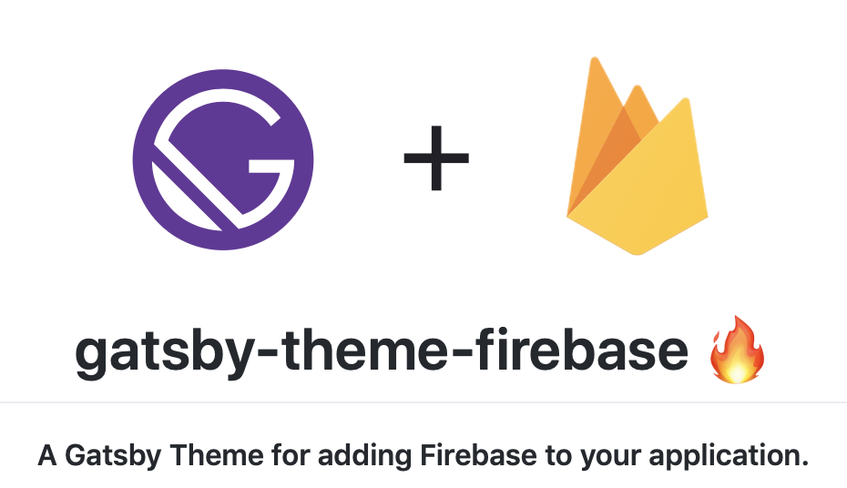

October means halloween! For your spooky reading pleasure, the blog now has a dark mode. So dim the lights, pull up a comfy chair and let's begin.

In September we posted our [Series A funding announcement](https://www.gatsbyjs.org/blog/2019-09-26-announcing-gatsby-15m-series-a-funding-round/), then headed to the UK for Gatsby Days, London. Fear not, if you missed all the action you can [catch up by watching the videos](https://www.youtube.com/watch?v=UvO7h_KwgpE&list=PLCU2qJekvcN2f9rgS50xy7-4QBpgwid4G).

Follow that YouTube playlist to find a plethora of goodies including a keynote from Kyle Mathews, info on building and selling Gatsby themes by [Horacio Herrera](https://twitter.com/hhg2288) and advice on writing accessible components from [Marcy Sutton](https://twitter.com/marcysutton).

## Team Highlights

On with some features and updates from the team.

### Structured Logging

First up is something we're calling _structured logging_. We've done some behind the scenes re-working of Gatsby's logging code. Gatsby now keeps an internal list of messages and activities, and can output those messages in different formats. As an example, run `gatsby build --json` to see the your build logs output as JSON instead of the usual log messages.

In the future, this will enable things like a Gatsby desktop app. Have a nose at [the PR](https://github.com/gatsbyjs/gatsby/pull/14973) to see what went into this release. There have also been a few fixes and enhancements to the standard CLI output as a result of this work.

### Is gatsbyjs.org translated yet?

Following on from [an RFC](https://github.com/gatsbyjs/rfcs/pull/42) in September, there are now 10 in-progress translations for Gatsby's documentation. Want to get involved? Check out [the new Gatsby Docs Translation Guide](https://www.gatsbyjs.org/contributing/gatsby-docs-translation-guide/). Thanks to [Nat Alison](https://twitter.com/tesseralis) for driving this project!

### The Gatsby Build Process

Have you ever wondered what Gatsby _does_ when you run a build? There's now a new docs page that walks through the details. [Overview of the Gatsby Build Process](https://www.gatsbyjs.org/docs/overview-of-the-gatsby-build-process/) is the place to go. I particularly like [the diagram that explains the different layers of Gatsby](https://www.gatsbyjs.org/docs/overview-of-the-gatsby-build-process/#what-happens-when-you-run-gatsby-build).

### Schema Customization Examples

We're gradually moving our official plugins over to use the Schema Customization APIs we added earlier this year. See [the changes to `gatsby-transformer-sharp` for an example](https://github.com/gatsbyjs/gatsby/pull/18871). If you're interested in helping out with this, there's now a little known plugin that will write out the inferred schema to disk. See [gatsby-plugin-schema-snapshot](https://www.gatsbyjs.org/packages/gatsby-plugin-schema-snapshot/).

### gatsby-plugin-offline

[gatsby-plugin-offline](https://www.gatsbyjs.org/packages/gatsby-plugin-offline) has been updated to [handle more edge cases](https://github.com/gatsbyjs/gatsby/pull/17590). The plugin will now revert back to the network if a visitor disables JavaScript after the site has already been cached.

Thanks to [David Bailey](https://twitter.com/davidbailey) for working on this!

### Dark Mode

Have you tried out the superbly stylish dark mode for gatsbyjs.org?

Hit the "Activate Dark Mode" button in the site header to see it in action. You can see the [main PR for this](https://github.com/gatsbyjs/gatsby/pull/18348), along with a series of [follow up PRs to iron out kinks](https://github.com/gatsbyjs/gatsby/pulls?q=is%3Apr+dark+mode+is%3Aclosed) to learn more.

### Grab Bag

There are a few more bits and bobs that are also worth mentioning.

Have you been working with Gatsby themes? Under the hood, a theme and a plugin are pretty similar. Until recently, creating a local theme in your `plugins` directory would have caused an error. A recent update fixes this, making the `plugins` directory work for local themes. Maybe you could use this for prototyping or one-off themes. See PR [#15856](https://github.com/gatsbyjs/gatsby/pull/15856) for the full lowdown.

A persistent bug that was first reported back in 2017 [has _finally_ been squashed](https://github.com/gatsbyjs/gatsby/pull/19009). Good riddance! 🙂

And finally... [no-mouse-days](https://www.npmjs.com/package/no-mouse-days.). I can't improve on the description so I'm going to copy and paste it right here:

> Ever wanted a package that disables the mouse cursor one day a week so you can test keyboard accessibility as a team? No? Well here you go anyway.

Grab it from https://www.npmjs.com/package/no-mouse-days.

## Community Highlights

Hacktoberfest Hacktoberfest Hacktoberfest. Yes, October means Hacktoberfest. A huge welcome to all our new and returning contributors!

### Your Pull Requests

There are way too many contributions to mention individually, but let's try to take a rocket powered tour through some highlights.

- Wide improvements to all of Gatsby's documentation. Bringing docs in-line with the style guide proved to be a popular (and _very_ valuable) activity last month.
- Improvements to how [gatsby-plugin-offline handles custom link tags](https://github.com/gatsbyjs/gatsby/pull/16691) with the `rel=preconnect` attribute, thanks to [Espen Hovlandsdal](https://github.com/rexxars)
- A [fix for the `wrapPageElement` API while running `gatsby develop`](https://github.com/gatsbyjs/gatsby/pull/17111), courtesy of [Valeriy](https://github.com/ValeraS)
- [Performance improvements to querying](https://github.com/gatsbyjs/gatsby/pull/17682), adding a nice speed boost when building larger sites, thanks to [Matthew Miller](https://github.com/me4502)
- Thanks again to Matthew, [this PR improved Gatsby's type inference](https://github.com/gatsbyjs/gatsby/pull/18008), making it faster and less memory intensive
- A [fix for `gatsby-plugin-manifest`](https://github.com/gatsbyjs/gatsby/pull/17426) that ensures manifest links are updated after page navigation, thanks to [DK the Human](https://github.com/dkthehuman)
- An issue that happened when [creating a resolver using the `context.nodeModel` API was fixed](https://github.com/gatsbyjs/gatsby/pull/18650) by [Nicky Fahey](https://github.com/nickyfahey)
- [This PR](https://github.com/gatsbyjs/gatsby/pull/16686) reduces the number of files that are changed with each build. This should result in faster deploys on services like Netlify, particularly for larger sites. Huge thanks to [Alex Fenton](https://github.com/afenton90)!
- [Bailey Swartz](https://github.com/sever1an) fixed ordering when using matchpaths in [#18478](https://github.com/gatsbyjs/gatsby/pull/18478)

## Site of the Month

The site of the month for October is [IBM's Carbon Design System](https://www.carbondesignsystem.com/). What's it all about?

> Carbon is IBM’s open-source design system for products and experiences. With the IBM Design Language as its foundation, the system consists of working code, design tools and resources, human interface guidelines, and a vibrant community of contributors.

Seems like everyone is building design systems these days, and for good reason. There's a lot to like in here. It's based on guidelines to be _open_, _inclusive_, _modular_, and _consistent_. Components are available for React, Angular, Vue and Vanilla JS.

Why is it our site of the month?

- Design system with lots of well thought out components and clear guidelines
- Open source
- Used at scale at IBM

## Theme of the Month

[`gatsby-theme-firebase`](https://github.com/epilande/gatsby-theme-firebase) might be the quickest way to add full featured Auth to your site, and it's our theme of the month for October!

Add the theme, add your Firebase credentials and off you go. Want to change anything? Use [component shadowing](https://www.gatsbyjs.org/blog/2019-04-29-component-shadowing/) to override whatever you like.

## Gatsby Cloud

Last but _certainly_ not the least, we launched [Gatsby Cloud](https://www.gatsbyjs.com/cloud/) last week! 💃

Here's an excerpt from [Kyle's announcement post](https://www.gatsbyjs.org/blog/2019-11-14-announcing-gatsby-cloud/):

> We’re excited to announce the launch of Gatsby Cloud: a commercial platform of stable, trusted tools that enable web creators to build better websites. Gatsby Cloud enhances our content mesh platform with interoperable, out-of-the-box solutions to launch websites faster and drive business success. This is a significant step forward for our diverse and thriving open-source community, and we’re really proud of it.

Gatsby Cloud features include a quickstart to create a CMS-powered site in seconds, real-time preview for your Gatsby sites, Lighthouse reports and superpowered Builds.

Visit [gatsbyjs.com](https://www.gatsbyjs.com/) to start using Gatsby Cloud today! We can't wait to hear what you think.

## Thank You and Good Night

That's all, folks.

As usual, if you have questions about any of this, feel free to tweet to us at [@gatsbyjs](twitter.com/gatsbyjs) or come hang out at our [Discord](https://discordapp.com/invite/br9rbUE).

See you soon again! ❤️
