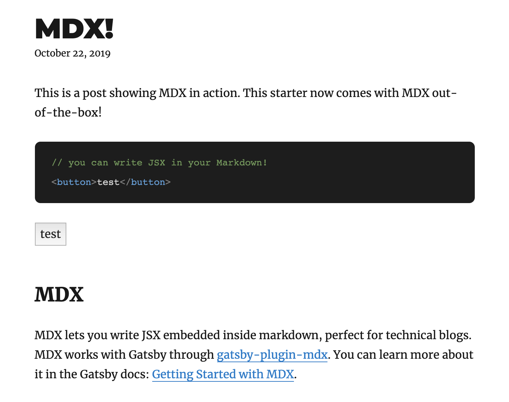

## What is MDX?

MDX is a file format that lets you add JSX to Markdown files via a `.mdx` file! It was started by and is maintained by Gatsby's [John Otander](https://github.com/johno) and the [open source community on GitHub](https://github.com/mdx-js/mdx).

With MDX, you can import React components and declare them alongside regular markdown syntax with JSX. This is useful to display specific component examples alongside the actual code, complex interactive components like charts, reusable components across multiple pages like sign-up forms, and more!

## Adding MDX to Gatsby Starter Blog

It can be a big tricky to add MDX to an existing blog. The following 5 steps will cover how to install and configure MDX to work with [Gatsby's blog starter](https://github.com/gatsbyjs/gatsby-starter-blog/tree/master), which as of [today's version](https://github.com/gatsbyjs/gatsby-starter-blog/tree/8852c1e51651b902f19706ff2ca9f60dabc25709), does not have MDX pre-installed.

You can also see the [full changes in PR #19580](https://github.com/gatsbyjs/gatsby/pull/19580/files) for an overview of the changes you have to make to get MDX working. As stated above, this introduces changes to [Gatsby's blog starter](https://github.com/gatsbyjs/gatsby-starter-blog/tree/master), which you can install with Gatsby CLI.

```bash
gatsby new my-blog-starter https://github.com/gatsbyjs/gatsby-starter-blog
```

### Step 1

Install [gatsby-plugin-mdx](/packages/gatsby-plugin-mdx/), the official plugin for using MDX with Gatsby. Also install `gatsby-plugin-feed-mdx` for our RSS feeds. Finally, install `@mdx-js/mdx` and `@mdx-js/react`.

```bash
npm install --save gatsby-plugin-mdx gatsby-plugin-feed-mdx @mdx-js/mdx @mdx-js/react
```

### Step 2

In `gatsby-config.js`, replace `gatsby-transformer-remark` with `gatsby-plugin-mdx`, along with the following changes:

```diff:title=gatsby-config.js
  {
-  resolve: `gatsby-transformer-remark`,
+  resolve: `gatsby-plugin-mdx`,
   options: {
+    extensions: [`.mdx`, `.md`],
-    plugins: [
+    gatsbyRemarkPlugins: [
       {
         resolve: `gatsby-remark-images`,
         options: {
           maxWidth: 590,
         },
       },
       {
         resolve: `gatsby-remark-responsive-iframe`,
         options: {
           wrapperStyle: `margin-bottom: 1.0725rem`,
         },
       },
       `gatsby-remark-prismjs`,
       `gatsby-remark-copy-linked-files`,
       `gatsby-remark-smartypants`,
     ],
   },
  },
```

For reference, here's the full configuration for `gatsby-plugin-mdx`.

```js:title=gatsby-config.js
{
  resolve: `gatsby-plugin-mdx`,
  options: {
    extensions: [".mdx", ".md"],
    gatsbyRemarkPlugins: [
      {
        resolve: `gatsby-remark-images`,
        options: {
          maxWidth: 590,
        },
      },
      {
        resolve: `gatsby-remark-responsive-iframe`,
        options: {
          wrapperStyle: `margin-bottom: 1.0725rem`,
        },
      },
      `gatsby-remark-prismjs`,
      `gatsby-remark-copy-linked-files`,
      `gatsby-remark-smartypants`,
    ],
  },
},
```

Then, replace `gatsby-plugin-feed` with `gatsby-plugin-feed-mdx`. This will allow the the RSS feed of the site to parse MDX.

```diff:title=gatsby-config.js
- `gatsby-plugin-feed`,
+ `gatsby-plugin-feed-mdx`
```

Now, since we're no longer using `gatsby-transformer-remark` and `gatsby-plugin-feed`, you can uninstall them.

```bash
npm uninstall --save gatsby-transformer-remark gatsby-plugin-feed
```

### Step 3

In `gatsby-node.js`, replace `allMarkdownRemark` with `allMdx`.

```diff:title=gatsby-node.js
# line 11
- allMarkdownRemark(
+ allMdx(
```

```diff:title=gatsby-node.js
# line 35
- const posts = result.data.allMarkdownRemark.edges
+ const posts = result.data.allMdx.edges
```

Next, replace `MarkdownRemark` with `Mdx`.

```diff:title=gatsby-node.js
# line 56
- if (node.internal.type === `MarkdownRemark`) {
+ if (node.internal.type === `Mdx`) {
```

### Step 4

In `src/pages/index.js`, replace `allMarkdownRemark` with `allMdx` in the `render()` method.

```diff:title=src/pages/index.js
# line 13
- const posts = data.allMarkdownRemark.edges
+ const posts = data.allMdx.edges
```

Also replace `allMarkdownRemark` with `allMdx` in the GraphQL query.

```diff:title=src/pages/index.js
# line 59
- allMarkdownRemark(sort: { fields: [frontmatter___date], order: DESC }) {
+ allMdx(sort: { fields: [frontmatter___date], order: DESC }) {
```

### Step 5

In `src/templates/blog-post.js`, replace `markdownRemark` with `mdx` in the `render()` method.

```diff:title=src/templates/blog-post.js
# line 11
- const post = this.props.data.markdownRemark
+ const post = this.props.data.mdx
```

Also replace `markdownRemark` with `mdx` in the GraphQL query.

```diff:title=src/templates/blog-post.js
# line 93
- markdownRemark(fields: { slug: { eq: $slug } }) {
+ mdx(fields: { slug: { eq: $slug } }) {
```

Add an import statement for `MDXRenderer` from `gatsby-plugin-mdx`.

```diff:title=src/templates/blog-post.js
# line 3
+ import { MDXRenderer } from "gatsby-plugin-mdx"
```

We'll be using `body` instead of `html` in our GraphQL query.

```diff:title=src/templates/blog-post.js
# line 96
- html
+ body
```

Now we can replace the `<section>` element with the `dangerouslySetInnerHTML` attribute and instead use `<MDXRenderer>` with `post.body`.

```diff:title=src/templates/blog-post.js
# line 41
- <section dangerouslySetInnerHTML={{ __html: post.html }} />
+ <MDXRenderer>{post.body}</MDXRenderer>
```

And... that's it! After these changes, a Gatsby blog should be able to use MDX files to render JSX alongside markdown. To test that everything works, add a `.mdx` file to `[your-blog]/content/blog/` and write some JSX. Then, run `gatsby develop` and check `localhost:8000/blog/` for your new post. The JSX should rendered as an element on the new post page.

For example, the following code should render a test button. Navigate to `localhost:8000/blog/example/` and you should see a clickable button in your blog post!

````mdx:title=content/blog/example.mdx
---
title: MDX!
date: "2019-10-22"
description: "A post showing MDX in action"
---

This is a post showing MDX in action. This starter now comes with MDX out-of-the-box!

```js
// you can write JSX in your Markdown!
<button>test</button>
```

<button>test</button>

## MDX

MDX lets you write JSX embedded inside markdown, perfect for technical blogs. MDX works with Gatsby through [gatsby-plugin-mdx](https://www.gatsbyjs.org/packages/gatsby-plugin-mdx/). You can learn more about it in the Gatsby docs: [Getting Started with MDX](https://www.gatsbyjs.org/docs/mdx/getting-started/).
````



If you're interested in spinning up a new personal blog with MDX, I've prepared [Gatsby personal blog starter](https://github.com/thomaswangio/gatsby-personal-starter-blog) for your usage!

## Further Reading

1. [Gatsby Reference Guide on MDX](/docs/mdx/)
2. [MDX Gatsby Documentation](https://mdxjs.com/getting-started/gatsby)
