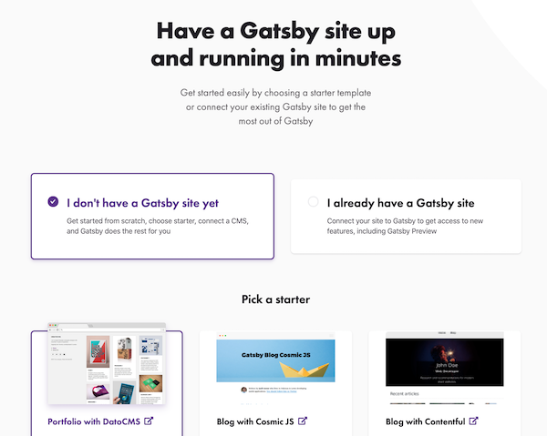
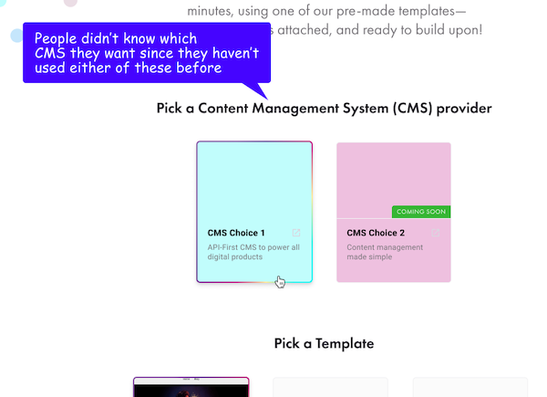
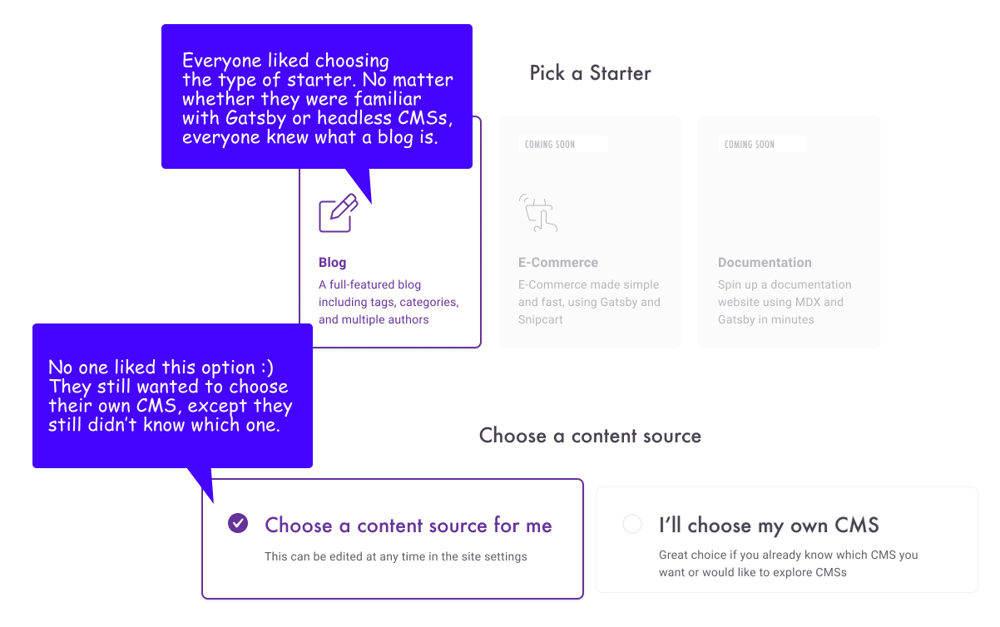
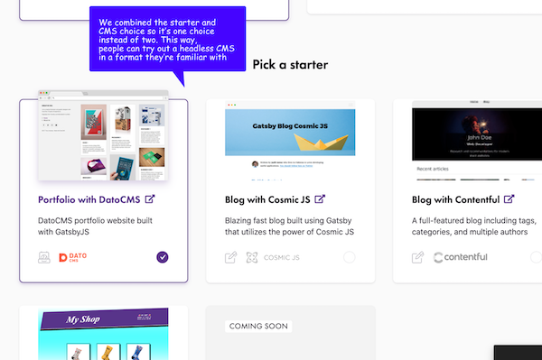

When you go to [our Quickstart page](https://www.gatsbyjs.com/get-started/) to try Gatsby Cloud, you’ll probably find yourself in one of two situations.

Situation 1: you already have a Gatsby project
Situation 2: you don’t have a Gatsby project yet

Either way, Gatsby Cloud will work for you! Through the [Cloud Quickstart page](https://www.gatsbyjs.com/get-started/), you can integrate your site with its data source(s) to drive Preview and automate builds. And it’s no commitment and no credit card required. All you need is a Github account.

Here’s the reason I’m writing this blogpost. We are making the [Cloud Quickstart page](https://www.gatsbyjs.com/get-started/) better and want to show you how it’s evolved over time and what the next steps are.

## How are we making Gatsby Cloud better over time?

### We’re learning about users

We watched 8 React developers who had never heard of Gatsby before create an account on Gatsby Cloud. We took careful notes, implemented new designs, and ran the usability tests _again_.

Here’s a few screenshots from earlier designs with some notes summarizing major feedback from users.

### Earliest version

Here's the earliest version we shipped.

### Next phase

Here's a screenshot of a Figma prototype we tested based on feedback on the first version.

### We’re prioritizing what we build according to user needs

From this process of testing prototypes, implementing changes, and testing again, we answered these questions:

- What blocks people from onboarding onto Gatsby Cloud?
- What creates friction for people onboarding onto Gatsby Cloud?
- What creates value for people onboarding onto Gatsby Cloud?

## What blocks people from onboarding onto Gatsby Cloud?

Connecting with a GitHub organization is the most confusing step, for several reasons. First of all, it’s not obvious in the product that we only offer GitHub integrations at this time (GitLab and Bitbucket will come eventually), so many users click around, looking for a way to connect to GitLab and/or Bitbucket.

We’re currently shipping some more improvements to the GitHub integration that I’ll blog about in a separate post soon!

## What created friction for people onboarding onto Gatsby Cloud?

Choosing a CMS was confusing for four of the eight testers. None of them had an opinion on which CMS to choose. Rather than force developers to integrate a CMS they aren't already using, we realized we should offer an alternative. We're creating an alternative starter where all content lives in the repository, alongside their code. We've opted for MDX, a powerful combination of Markdown and JSX.

## What creates value for people onboarding onto Gatsby Cloud?

Users found value in some aspects of our early onboarding designs and we wanted those good things to persist and grow, if possible.

For example, choosing a starter was fun, and 3 of the users wanted more details about the starters. On starter cards, we added a link to their github repos or /starters/ page on .org

### Product, design, and engineering are doing something about the feedback

We’re tracking all feedback in GitHub and shipping improvements according to a prioritization system that relies on three metrics, thanks to [Step 3 of Barron Caster’s 3x Conversion Playbook](https://medium.com/hackernoon/the-3x-conversion-playbook-3a9b954b937d).

- How confident are we that this problem is real?
- How much of an impact would fixing this problem have on major user workflows?
- How quickly can we fix this problem?

Product, the design team and the Cloud engineering team are collaboratively designing solutions. And then...yep, you guessed. Shipping and testing again.

## Current onboarding

Here is a screenshot of the current onboarding experience and a brief overview of some planned improvements.

## Planned improvements to Gatsby Cloud

We’ve shipped a ton of improvements already, and have a few more that are in progress as we speak!

- Adding an MDX starter
- Clarifying the step in which users add a GitHub organization because using a starter vs using an existing Gatsby site require different flows
- Prioritizing the status of production builds in the product interface to make sure people can debug their most important branch

## Feedback

Hearing your feedback helps us make Gatsby better. Sign up to tell me about your experience with Gatsby Cloud by [booking time on my calendar!](https://calendly.com/shannon-soper/gatsby-cloud-usability)

It’d also be valuable to hear which CMSs and/or other data sources you’d like to see integrations and starters for! [Take this survey to let us know](https://twitter.com/shannonb_ux/status/1199077543694893056).
