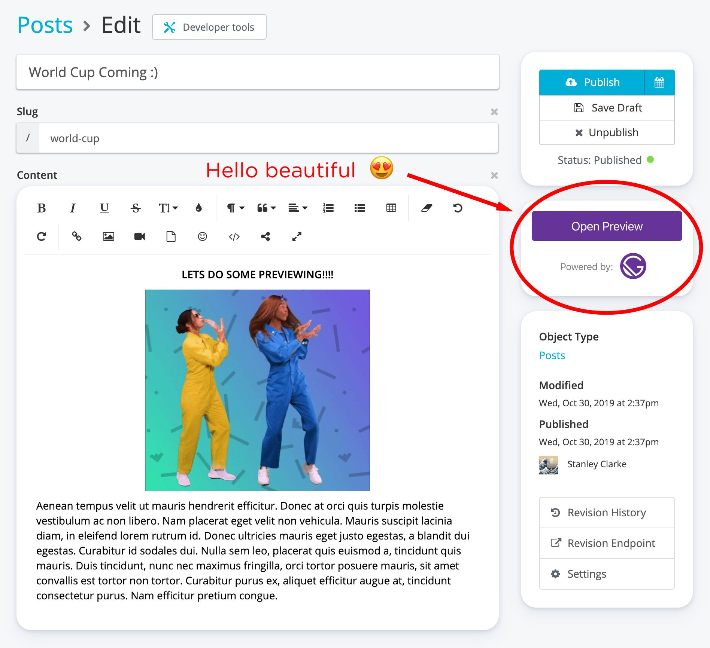

We’re excited to announce the official release of Gatsby Preview for [Cosmic JS](https://www.cosmicjs.com). This new integration enables you to add powerful content preview functionality to your Cosmic JS Gatsby website.

## Getting Started

1. First go to the [Gatsby Getting Started Page](https://www.gatsbyjs.com/get-started/) and follow the links for Cosmic JS.
2. Select the [Cosmic JS-powered Gatsby Blog](https://www.cosmicjs.com/apps/gatsby-blog)
3. You will then be asked for your GitHub and Cosmic JS authentication, so make sure you have both accounts set up ([sign up for Cosmic JS here](https://app.cosmicjs.com/signup)).
4. After onboarding, go to any Post in your Cosmic JS Bucket and find the big, beautiful, purple button to preview your content.
   

#### What happens?

After clicking the “Open Preview” button, a new tab will open to instantly show you what the content looks like for this specific version on your Gatsby website. This simple one-click preview will greatly enhance your content team’s content-creation workflow.

#### How did this integration happen?

The Cosmic JS / Gatsby Preview integration is the result of close collaboration between both teams to make the integration as easy as possible. Both sides had to refactor a bit of existing functionality to make it seamless. And the feedback that came from the collaboration effort actually helped to improve both products. We’re happy to say this powerful feature can be integrated in just a few clicks.

#### Why is this a big deal?

Both Gatsby and Cosmic JS believe deeply in providing developers the best development experience possible. But it’s not just about developers. Content creation team members are crucial to building great web products. And one of the most requested features for content creators is preview, but this has been a challenge for developer teams pushing for highly-optimized JAMStack websites built on Gatsby.

Gatsby Preview solves this problem by providing a simple button for content creators to experience an instant preview of content directly in the CMS dashboard. Gatsby preview with the [Cosmic JS headless CMS](https://www.cosmicjs.com/headless-cms), is a further extension to empower content creators to preview content quickly and easily, giving teams faster content marketing velocity.

#### What’s next?

We’re excited to continue to work closely with the Gatsby team to help create more value-added integrations between both services. It’s our goal to continue to provide the full spectrum of team members the best tools to be successful.

Our users have been very helpful with letting us know ways to improve the Cosmic JS + Gatsby stack combo. So if you have any suggestions on ways we can improve, please let us know in the [Cosmic JS Slack channel](https://cosmicslack.herokuapp.com/) or on [our Twitter](https://twitter.com/cosmic_js).

Happy building!

— Tony and the Cosmic Team
