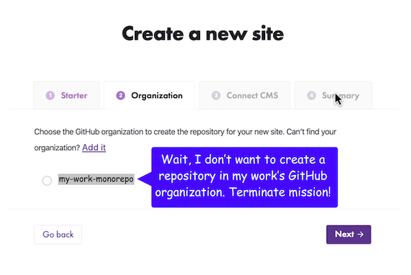
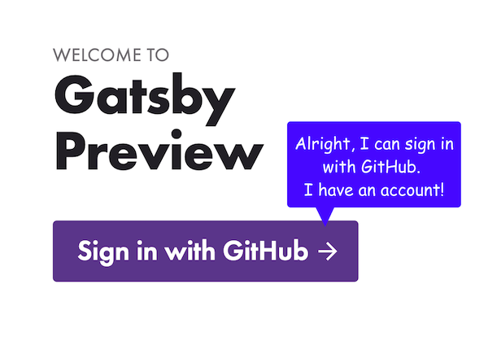

In my last blogpost, I introduced how we’re [making it easier to start with Gatsby Cloud for 
free](https://www.gatsbyjs.org/blog/2019-11-25-getting-started-with-gatsby-cloud/) with starters. This blogpost introduces the next set of changes that we shipped to help users get started faster. How did we do it? Inferring from history to reduce unnecessary user interaction. Quite a mouthful and needs some explanation.

## The problem
So what problem did we learn about?

When watching folks onboard onto Gatsby Cloud, there was a clear point of confusion. This screenshot depicts step one of Gatsby Cloud onboarding, during which users select an organization and a repository from GitHub. I drew speech bubbles on top of the screenshot pointing out that users are confused by this screen. One speech bubble says: “I don’t even know what organization this is referring to!” while the other says “If I’m just trying out Gatsby for personal use, I don’t want to save my Gatsby project in my work’s GitHub organization.”

## What was the real problem?
We knew users were confused, yet we didn’t know why. Here are some principles that helped us figure out why they were confused.

## Interaction is negative

I know, I know, this is a bit of a purposefully inflammatory and misleading statement. Interaction design is something I care about and do full-time along with many of you, so why would we do it if it’s negative? Well, the real phrase ought to read “_unnecessary_ interaction is negative.” So anything the software can do to [*reduce* the amount of unnecessary interaction](http://worrydream.com/MagicInk/#p145) it takes to reach a goal is good.

So how do you reduce interaction?

## Reduce interaction by inferring from history and the environment
To reduce interaction, you can infer “as much as possible from history and the environment.” See this full quote below:

>  If the software properly infers as much as possible from history and the environment, it should be able to produce at least a reasonable starting point for the context model. Most of the user’s interaction will then consist of correcting (or confirming) the software’s predictions. This is generally less stressful than constructing the entire context from scratch. - Brett Victor, [“Magic Ink”](http://worrydream.com/MagicInk/#p173)

The principle is to make the best guess we can of what the user wants and then let them *correct* our best guess if it’s wrong. If we infer from history and the environment, the guess will be right most of the time.

So what could we infer from “history” and the “environment” to solve the problem we had in Gatsby Cloud, where everyone was confused and frustrated at needing to choose a GitHub organization?

### Inferring from history
The first step is simply to look at history, at what happened before the point of confusion. I’ll take you on a tour of what happened just moments before users hit their point of major confusion.

In this first screenshot, the user selects a starter.

Then, they log into GitHub and give Gatsby Cloud permission to connect with their personal GitHub account. 

Then, this screen asks them to “add new organization.” This is where the software failed to learn from recent history. The user just gave the system access to their personal GitHub account, so that the last value they gave the system and we ought to stick with that value.

By the time the user adds an organization (and they don’t know why they have to add it), and sees this next screen below, of course they are confused about why they added an organization. They didn’t need to!

To reduce interaction by inferring from history, we decided to guess that the user wants to save their first site in their GitHub personal account, the last value they provided us with. They can *correct* this assumption if it’s wrong.

This GIF depicts the new solution, a screen in which the user simply names their site and clicks “Next” and does not need to decide where to save the site. The screen just tells them “we’ll create the repo under your personal GitHub account. Want to host it on a GitHub organization instead? Add it here!”

As this GIF shows, the personal account is the most defaulty of default choices, embedded in the flow. The user does *not have to interact with the software to tell us where to save their site*, though they *can correct the default if it’s wrong*.

And, if they’re a returning user and have already connected their personal account, it will be the first item in a list, and the first item will always be pre-selected so that, again, they *do not have to interact with the software* except to correct it if it’s wrong. This GIF depicts the screen in which the user names their site and their personal account is at the top of a list of GitHub organizations and is pre-selected as the destination for the site.

## What else are we working on to make Gatsby Cloud more comfortable and powerful? 
We have already:
- Added a free pricing tier, which lets you use Gatsby Cloud for free for blogs, portfolios, etc.
- Made it easy to connect existing sites to Cloud
- Previews
- Customized assessments of your builds, including lighthouse scores 

What we’re working on:
- Adding more starters, including MDX, to do some of the work for you
- Adding more integrations to do some work for you
- Easy-to-read error messages that help you debug
- Speeding up builds
- More customized assessments of your builds, including performance budgets, structured logging, etc.

