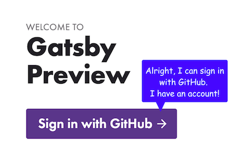
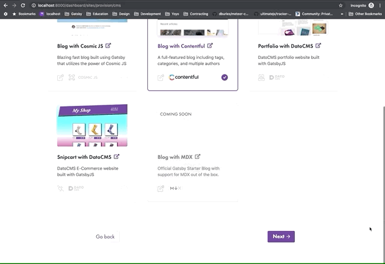

In my last blogpost, I introduced how we’re [making it easier to start with Gatsby Cloud for 
free](https://www.gatsbyjs.org/blog/2019-11-25-getting-started-with-gatsby-cloud/) with starters. This blogpost introduces the next set of changes that we shipped to help users get started faster. How did we do it? Inferring from history to reduce unnecessary user interaction. Quite a mouthful and needs some explanation.

## The problem
So what problem did we learn about?

When watching folks onboard onto Gatsby Cloud, there was a clear point of confusion. Please see the screenshot below and read the thought bubble which depicts *approximately* what users said during usability tests.
 

## What was the real problem?
We knew users were confused, yet we didn’t know how to solve it quite yet. Here are some principles that helped us figure out the reason for the confusion and how to resolve it.

## Interaction is negative

I know, I know, this is a bit of a purposefully inflammatory and misleading statement. Interaction design is something I care about and do full-time along with many of you, so why would I say it’s negative? Well, the real phrase ought to read “_unnecessary_ interaction is negative.” So anything software can do to [*reduce* the amount of unnecessary interaction](http://worrydream.com/MagicInk/#p145) it takes to reach a goal is good.

So how do you reduce unnecessary interaction?

## Reduce interaction by inferring from history and the environment
To reduce interaction, you can infer “as much as possible from history and the environment.” See this full quote below:

<Pullquote>If the software properly infers as much as possible from history and the environment, it should be able to produce at least a reasonable starting point for the context model. Most of the user’s interaction will then consist of correcting (or confirming) the software’s predictions. This is generally less stressful than constructing the entire context from scratch.</Pullquote>

_Quote from Brett Victor, [“Magic Ink”](http://worrydream.com/MagicInk/#p173)_

The principle is to make the best guess we can of what the user wants and then let them *correct* our best guess if it’s wrong. And the guess will be right most of the time, if we infer from history and the environment.

So what could we infer from “history” and the “environment” to solve the problem we had in Gatsby Cloud, where everyone was confused and frustrated at needing to choose a GitHub organization?

## Inferring from history
The first step is simply to look at history; I’ll take you on a tour of what happened before users hit their point of confusion.

### User selects starter
In this first screenshot, the user selects a starter.

### User logs into GitHub and into Gatsby Cloud
Next, the user logs into GitHub and give Gatsby Cloud permission to connect with their personal GitHub account.

### Unecessary interaction: user adds new GitHub organization
Then, this screen asks them to “add new organization.” This is where the software failed to learn from recent history. The user just gave the system access to their personal GitHub account, so that the last value they gave the system and we ought to stick with that value.

By the time the user adds an organization (and they don’t know why they have to add it), and sees this next screen below, of course they are confused about why they added an organization. They didn’t need to!
 

## Reducing interaction
To reduce interaction by inferring from history, we assume the user wants to save their first site in their GitHub personal account, the last value they provided us with when they logged in. They can *correct* this assumption if it’s wrong.

### First-time visitor
The assumption that user wants to save their first site in their personal GitHub account is reflected in the following GIF that shows the user does *not have to interact with the software to tell us where to save their site*, though they *can correct the default (their personal GitHub account) if it’s wrong*.

### Returning user
If there is a returning user that has already connected their personal account plus at least one more organization, their personal account will be the first item in a list and will always be pre-selected. This makes sure that, again, they *do not have to interact with the software* except to correct it, if it’s wrong. 

## What's next?
Stay tuned for more blogposts about why we:
- Added a free pricing tier, which lets you use Gatsby Cloud for free for blogs, portfolios, etc.
- Made it easy to connect existing sites to Cloud
- Shipped Gatsby Preview
- Offer customized assessments of your builds, including Lighthouse scores 

As a design team, we'll also keep blogging about what we’re working on. This includes:
- Transferring the principle of inferring from history so users choosing "I already have an existing Gatsby site" get the benefits of that principle as well
- Adding more starters, including MDX, to do some of the work for you
- Adding more integrations to do some work for you
- Easy-to-read error messages that help you debug
- More customized assessments of your builds, including performance budgets, structured logging, etc.

