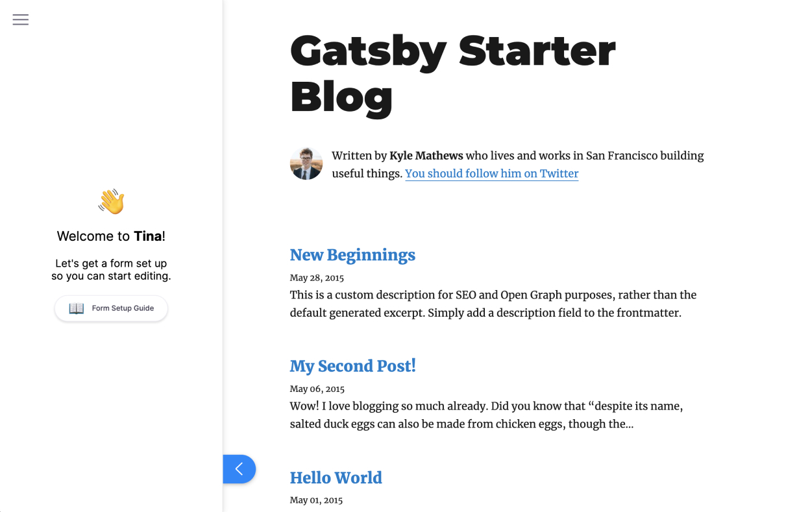
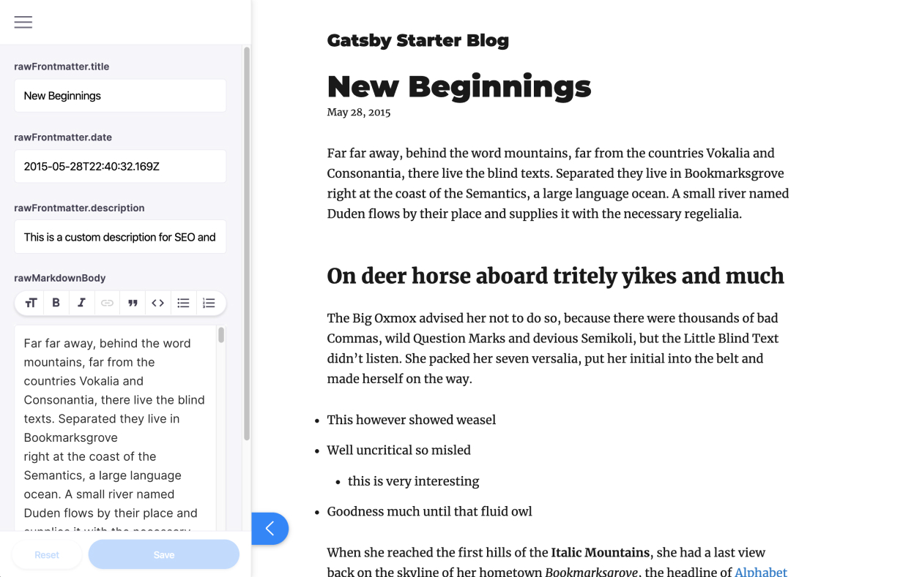
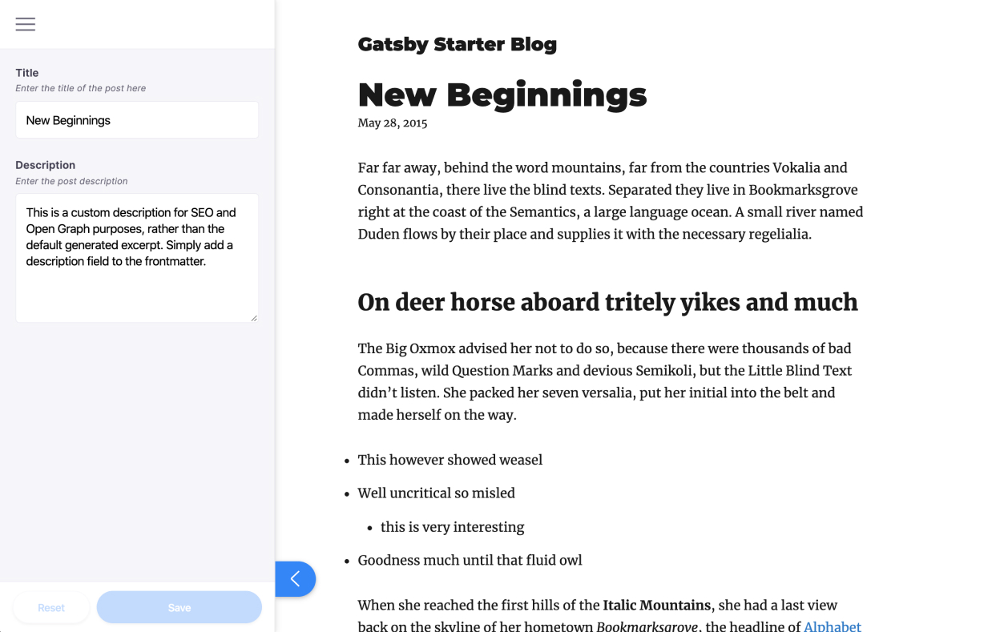
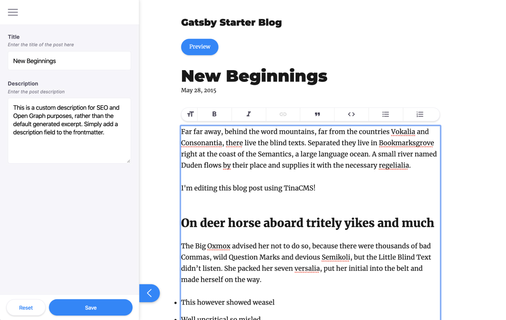
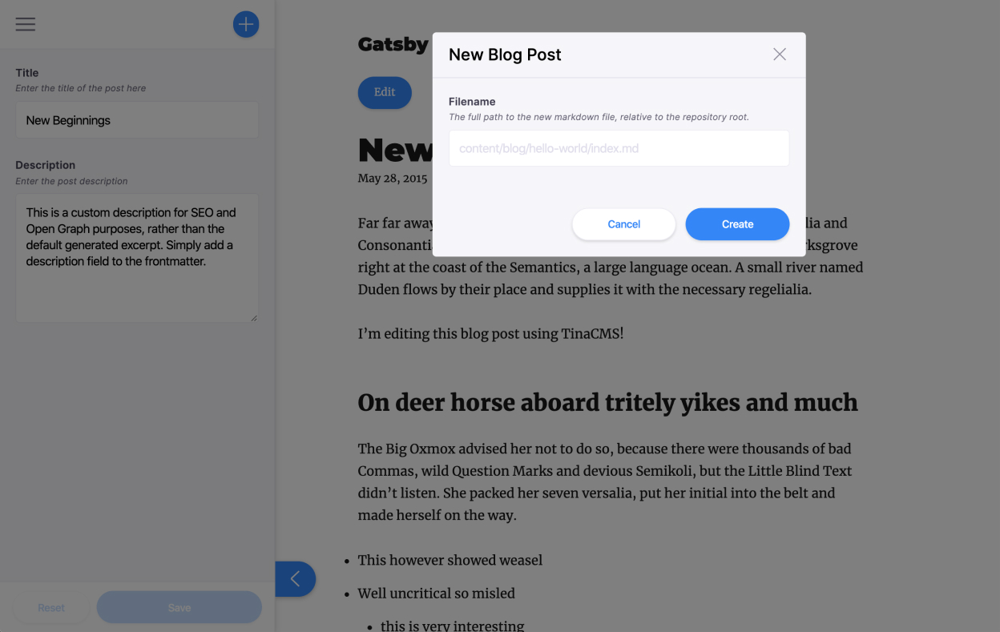

[TinaCMS](https://tinacms.org/) is a toolkit of JavaScript components. You can use these components to build content editing functionality into your site.

Right now, Tina uses a Git backend to track content changes. When detected, changes are immediately written back to source files. Saving pushes those changes to your repo. While Git backed for now, the Tina Team has built inherent flexibility into the CMS. Adding support for alternate backends, such as posting to a database, is on the [Tina roadmap](https://github.com/tinacms/tinacms/blob/master/ROADMAP.md).

In this article, we will walk through how to add TinaCMS to an existing Gatsby website. We will cover installing and configuring the Tina [sidebar](https://tinacms.org/docs/concepts/sidebar). Learn how to create a content editing [form](https://tinacms.org/docs/concepts/forms) for markdown. Touch on customizing the form with Tina [field](https://tinacms.org/docs/concepts/fields) components. Set-up [inline (aka on-page) editing](https://tinacms.org/docs/gatsby/inline-editing). And then we'll configure a [`content-creator`](https://tinacms.org/docs/gatsby/creating-new-files) plugin that will allow us to add new files to the site. Let's use the classic [Gatsby’s Starter Blog 💜](https://github.com/gatsbyjs/gatsby-starter-blog) as our example.

> Follow along by referencing [a fork of the Gatsby starter blog](https://github.com/tinacms/gatsby-tinacms-blog-post-reference) that makes the same changes outlined in this post.

Want to see a more advanced example of TinaCMS integrated with a Gatsby website? Checkout [Tina Grande](https://github.com/tinacms/tina-starter-grande), a gatsby starter with first-class TinaCMS integration.

## Prerequisites

- A Gatsby project that sources local `markdown` content. Use Gatsby's [Starter Blog](https://github.com/gatsbyjs/gatsby-starter-blog) if you don't have an existing website.
- [Gatsby Development Environment](/tutorial/part-zero/)

## Setup

First we need to get a local development environment set up for the site. Please reference the Gatsby Starter Blog [README](https://github.com/gatsbyjs/gatsby-starter-blog/#readme) for extra notes on this.

```bash
gatsby new tina-tutorial https://github.com/gatsbyjs/gatsby-starter-blog
cd tina-tutorial
```

## Install and Configure Tina

As usual when setting up a new tool, we need to install a few packages. We will install `gatsby-plugin-tinacms`, which sets up the core Tina functionality. Along with that, we'll need the peer-dependency, `styled-components`, to keep the sidebar pretty. Since this site uses markdown, we'll install `gatsby-tinacms-remark`. And `gatsby-tinacms-git` will setup our Git API.

```bash
yarn add gatsby-plugin-tinacms gatsby-tinacms-remark gatsby-tinacms-git styled-components
```

After installing those packages, add `gatsby-plugin-tinacms` to the list of plugins in `gatsby-config.js`. We'll also pass options to tell Tina what plugins to use and when to hide the sidebar:

```javascript
module.exports = {
  // ...
  plugins: [
    {
      resolve: "gatsby-plugin-tinacms",
      options: {
        sidebar: {
          hidden: process.env.NODE_ENV === "production",
          position: "displace",
        },
        plugins: ["gatsby-tinacms-git", "gatsby-tinacms-remark"],
      },
    },
    // ...
  ],
}
```

Now we're all set to start setting up content editing with Tina. If you want to test it out, run `gatsby develop` and take a look. You should see an edit icon in the lower left-hand corner, open it to find an empty Tina sidebar. This [sidebar](https://tinacms.org/docs/concepts/sidebar) is the main interface for using Tina to edit and manage content.



## Add a Form

To make content editable, we need to register a [form](https://tinacms.org/docs/concepts/forms) with Tina. Forms live in the sidebar, displaying fields where you can edit content.

You can add a form to the sidebar from any component. When that component is rendered, the form displays in the sidebar. To add a form for the individual blog post, we’ll need to make three changes to `templates/blog-post.js`:

1. Import `remarkForm`

   ```javascript
   import { remarkForm } from "gatsby-tinacms-remark"
   ```

2. Wrap the default export with `remarkForm`. This is a [higher-order component](https://reactjs.org/docs/higher-order-components.html) that modifies the data to be editable by Tina as it’s passed to the component. In production, the unaltered component renders as normal.

   ```javascript
   export default remarkForm(BlogPostTemplate)
   ```

3. Add `...TinaRemark` to the GraphQL query inside the `markdownRemark` node. This is a GraphQL fragment that adds additional fields used by `gatsby-tinacms-remark`.

   ```javascript
   export const pageQuery = graphql`
     query BlogPostBySlug($slug: String!) {
       site {
         siteMetadata {
           title
         }
       }
       markdownRemark(fields: { slug: { eq: $slug } }) {
         id
         excerpt(pruneLength: 160)
         html
         frontmatter {
           title
           date(formatString: "MMMM DD, YYYY")
           description
         }

         ...TinaRemark
       }
     }
   `
   ```

Now spin up the development server (`gatsby develop`) and see what the default form looks like.



We should have access to all the fields passed into the component via GraphQL. Without specifying how the form should display, default labels and values are rendered.

Try editing the content and see what happens; you should see your changes updating live on the site 🥳. Look at the source file for this particular post, you’ll notice the edits you made are also reflected there. Tina is writing to disk as you are editing content in the sidebar. Gatsby picks this up and rebuilds the site to reflect the changes in "real time."

## Customize The Editing Form

We can customize the form by defining a form options object. This provides control over the form fields and their functionality. Check out all the [fields](https://tinacms.org/docs/concepts/fields) provided by Tina, or read more on creating your own [custom fields here](https://tinacms.org/docs/fields/custom-fields).

1. Define the form options. Here's a simple form that exposes the `Title` and `Description`:

   ```javascript
   const BlogPostForm = {
     fields: [
       {
         label: "Title",
         name: "frontmatter.title",
         description: "Enter the title of the post here",
         component: "text",
       },
       {
         label: "Description",
         name: "frontmatter.description",
         description: "Enter the post description",
         component: "textarea",
       },
     ],
   }
   ```

2. Pass the form options to `remarkForm`:

   ```javascript
   export default remarkForm(BlogPostTemplate, BlogPostForm)
   ```

Now instead of the default form, open up the sidebar to see the custom `BlogPostForm`.



## Add In-Page Editing

Editing in the sidebar works fine for many types of content. Yet, long-form content is easier to edit right on the page. We can build this ‘inline-editing’ functionality into our site with Tina.

1. Import `liveRemarkForm` instead of `remarkForm`, and add three new imports:

   ```javascript
   import { liveRemarkForm } from "gatsby-tinacms-remark"
   import { Wysiwyg } from "@tinacms/fields"
   import { TinaField } from "tinacms"
   import { Button as TinaButton } from "@tinacms/styles"
   ```

2. Replace `remarkForm` with `liveRemarkForm` in the export:

   ```javascript
   export default liveRemarkForm(BlogPostTemplate, BlogPostForm)
   ```

3. Wrap `TinaField` around the element rendering content you want to edit inline. Pass in the `Wysiwyg` component to `TinaField`:

   ```jsx
   <TinaField name="rawMarkdownBody" Component={Wysiwyg}>
     <section dangerouslySetInnerHTML={{ __html: post.html }} />
   </TinaField>
   ```

4. Add a button anywhere on your page to toggle ‘edit’ mode. This button also serves as a flag to signal inline content editing. You'll only want this to display in production, so here you can see one way of rendering it conditionally.

   ```jsx
   const { isEditing, setIsEditing } = this.props

   {
     process.env.NODE_ENV != "production" && (
       <TinaButton primary onClick={() => setIsEditing(p => !p)}>
         {isEditing ? "Preview" : "Edit"}
       </TinaButton>
     )
   }
   ```

The `liveRemarkForm` HOC is similar to `remarkForm`, they both return components where Tina can edit the data that they render. With `RemarkForm`, this data is edited in the sidebar. With `liveRemarkForm`, the data is edited on the page. The difference is, `liveRemarkForm` returns a component wrapped in a `TinaForm`. In 'edit-mode', the form displays on the page itself.

Within the template component, we can wrap child elements in a `TinaField` component. `TinaField` allows us to render a field on the page, such as a wysiwyg editor. The `Component` prop tells Tina which field component to render in edit-mode. In non-edit-mode (_and in production_), `TinaField` will pass the child elements that it wraps.

To trigger edit-mode, `liveRemarkForm` provides a state variable and hook: `isEditing` and `setIsEditing`. These are passed as props to the template component. In the example above, `TinaButton` toggles this state. You could create your own button to handle this. Or, you can import the same `Button` (as `TinaButton`) used in the sidebar.



## Add Create Post Button

So now we have a nice little editor set up for the blog. One thing we'll definitely want, is the ability to create new posts. We can do this with a `content-creator` plugin. When creating new markdown files, we'll use `RemarkCreatorPlugin` for this.

We will register the `content-creator` plugin in a component on the site. When that component is actively rendered, we’ll have the ability to add new content. If editors should always be able to create new posts, we'll want to register the plugin on a component that is always rendered. Some common components used for this are `Layout`, `Index`, or `Root`.

> If you add the plugin in `src/components/layout.js`, it will be rendered on every page.

1. Import `withPlugin` and `RemarkCreatorPlugin`.

   ```javascript
   import { withPlugin } from "tinacms"
   import { RemarkCreatorPlugin } from "gatsby-tinacms-remark"
   ```

2. Instantiate `RemarkCreatorPlugin`.

   - Provide a label for the button
   - Provide a filename that will calculate the path to the new file. _You can reference data submitted by the form._
   - Define the fields that will render in the 'creator' modal form.

   ```javascript
   const CreateBlogPlugin = new RemarkCreatorPlugin({
     label: "New Blog Post",
     filename: form => {
       return form.filename
     },
     fields: [
       {
         name: "filename",
         component: "text",
         label: "Filename",
         placeholder: "content/blog/hello-world/index.md",
         description:
           "The full path to the new markdown file, relative to the repository root.",
       },
     ],
   })
   ```

3. Export the component and plugin using `withPlugin()`.

   ```javascript
   export default withPlugin(Layout, CreateBlogPlugin)
   ```

The 'create-content' button shows up in the top right-hand corner of the sidebar menu. It looks like a plus ➕ icon. Click it and add a new blog post to the site!

We now have a way to add new posts from the Tina sidebar. The location of the new files will be based on the return value from the `filename` property. There's lots of ways to configure this return value, please reference the [documentation](https://tinacms.org/docs/gatsby/creating-new-files#4-formatting-the-filename--path) for more info.



## Access Tina In The Cloud

Since Tina makes edits using the Gatsby development server, we need to create an environment for the development server to run in the cloud. This way non-technical editors can visit that cloud-hosted environment to manage content. We'll set it up with [Gatsby Cloud](https://www.gatsbyjs.com/cloud/), which is a hosted service for building and maintaining Gatsby websites.

When it's time to allow your editors to edit a site with Tina on a hosted server, you will need to be extra careful around safeguarding against run-time errors. Does your site blow up if an array is empty? or if an image isn't defined? You'll want to account for these edge cases which your editors may run into while editing.

To get Tina working in Gatsby Cloud, you'll need to configure the following environment variables in your `Site Settings`:

```
GIT_AUTHOR_EMAIL
GIT_AUTHOR_NAME
SSH_KEY
```

The `SSH_KEY` is a private key that allows write access to your git repo. You'll need to add the public key to your repo under `Deploy Keys` in `Settings` and enable `write access`. The `SSH_KEY` needs to be Base64 encoded before adding to Gatsby Cloud; you can encode this locally by running `cat ./.ssh/id_rsa | base64`.

Since these values will be set at the environment level, all edits made using Tina will use these values when pushing changes to git.

Getting a development server running in the cloud solves the issue of accessing Tina from anywhere, but there are a number of other challenges that require attention. The team behind TinaCMS is currently nearing the initial beta release of [**Tina Teams**](https://tinacms.org/teams), a custom live editing environment for you and your team. Tina Teams handles user authentication with individual user commits to provide the best possible editing experience for your team. Stay tuned!

## Summary

These are just some simple steps to get up and running with Tina, the possibilities don't end here. Make sure to check out [Tina Starter Grande](https://github.com/tinacms/tina-starter-grande) to see a more advanced implementation of Tina on a Gatsby website.

Hopefully you've found this introduction to TinaCMS useful. Feel free to tweet at [Tina 🦙](https://twitter.com/tina_cms) with feedback or questions. If you want to learn more, checkout the [documentation](https://tinacms.org/docs/getting-started/introduction). TinaCMS is open source; feel free to dig into the [source code](https://github.com/tinacms/tinacms). If you're interested in getting involved with the project, join our [community slack](https://join.slack.com/t/tinacms/shared_invite/enQtNzgxNDY1OTA3ODI3LTNkNWEwYjQyYTA2ZDZjZGQ2YmI5Y2ZlOWVmMjlkYmYxMzVmNjM0YTk2MWM2MTIzMmMxMDg3NWIxN2EzOWQ0NDM). If you get stuck, don't hesitate to ask questions on the [Tina Forum](https://community.tinacms.org/).
