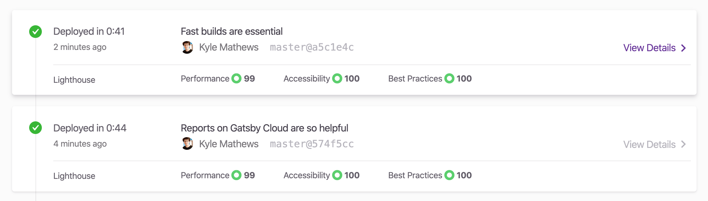

I'm excited to announce the public release of **Gatsby Builds**: the fastest Continuous Deployment solution for Gatsby applications.

Gatsby Builds expands the [Gatsby Cloud](https://www.gatsbyjs.com/) service, bringing sophisticated caching and distributed computing features to the Gatsby build process. The result is **build times up to 60x faster** than other popular Continuous Deployment solutions.

We're also launching **Reports**: a 24/7 website health and performance service that monitors key pages for speed, accessibility, SEO, and other best practices using the [Google Chrome Lighthouse](https://developers.google.com/web/tools/lighthouse) tool.

Eager for the details? **[Jump to the FAQ](#faqs)**.

### Try out Gatsby Builds & Reports today

If you’re an existing Gatsby Cloud user you’ll find Builds and Reports already enabled in your account. New users can [sign up for a Gatsby Cloud account](https://www.gatsbyjs.com/get-started) to access these features alongside our [previously launched real-time content Preview feature](/blog/2019-11-14-announcing-gatsby-cloud/).

## Builds: making deploys as fast as our websites

Gatsby users love the great development experience, built-in security, lightning-fast client-side performance, and simplicity of deploying prebuilt sites to a CDN. However, deploying site updates using 3rd-party Continuous Deployment solutions can be a frustratingly slow process that blocks important updates from making it to your website.

Gatsby Builds solves this problem by making our deployment process as fast as our websites. By incorporating Builds into the Gatsby Cloud platform we've created the best Continuous Deployment solution for Gatsby users. Here are some promising early results:

- [Third and Grove](https://www.thirdandgrove.com/) saw _60x_ build-time reductions from **60 minutes to 1 minute** for their large 15,000 page, image-heavy Gatsby/Drupal site.
- [Gatsbyjs.org](https://gatsbyjs.org) saw _9x_ reduced build times from **45 minutes to 5 minutes**.
- Our [image processing benchmark site](https://github.com/KyleAMathews/gatsby-image-processing-test) saw *5x *reduced build times from **200 seconds to 40 seconds.**

**All sites should see at least a 2-3x improvement in build speeds.**

We will continue to make rapid improvements to the speed, scalability, and reliability of Builds. Our ultimate goal is that sites of any size (up to 10s of millions of pages and beyond) will build in under 10 seconds.

### CDN Support

Gatsby Builds currently supports deploying to:

- AWS S3
- Google Cloud Storage
- Netlify
- Firebase
- Fastly

With more deployment options coming soon.

### Keep your CMS, ditch your production CMS hosting

Prebuilt (or “static”) sites have a reputation of being well suited to small websites and apps with content that rarely changes.

But what if it were as fast and easy to update a prebuilt site as it is to update a traditional CMS-based website?

This is what we're achieving with Gatsby and Gatsby Cloud. You get all the advantages of authoring content with a great CMS plus the speed, security, and simplicity of deploying static assets to CDNs. We’re making content and performance amazing for _all_ sites.

## Reports: 24/7 performance and accessibility monitoring

Gatsby was created to make amazing websites a possibility for _everyone_.

The default Gatsby install comes with accessibility, SEO, and a blazing fast user experience out of the box. We’ve pioneered performance enhancements like [image lazy-loading](https://www.gatsbyjs.org/docs/using-gatsby-image/) and [link prefetching](https://www.gatsbyjs.org/docs/routing/#performance-and-prefetching) to deliver zero-delay client route changes. Many people say that Gatsby sites are the fastest sites they've ever seen.

But good defaults are only one part of making a website the best it can be. Performance, SEO, and accessibility can suffer over time, often by accident. An update or feature that improves one area can often lead to slowdowns on other critical pages. Staying on top of the side effects of code changes can be a real challenge without a built-in monitoring system.

We’ve solved this problem with **Reports**: a persistent auditing service that uses Chrome’s Lighthouse tool to catch problems with performance, accessibility, SEO, and other best practices.

We'll be adding more auditing tools in the future to ensure that you’re always shipping the best possible applications.
In addition, we’re building a **Site Budgets** feature which will let you set speed and accessibility thresholds for key pages on your site. If a PR leads to changes that exceed your budget limits it will be blocked. This helps you and your team iterate and ship with confidence.

## How do we make builds so fast?

Gatsby was open sourced nearly five years ago, and since then hundreds of thousands of people have used it to build for the web. In that time we've learned a lot about making builds fast, and are now applying that knowledge on Gatsby Cloud.
There are three ways to make builds faster:

### 1. Optimize individual operations

Build systems do many things. **Reducing individual operation times will lead to faster builds**.
We've spent years improving Gatsby's complex build system to optimize it from beginning to end. This includes many contributions to upstream open source projects that benefit the broader web community.

### 2. Distribute more work

Even if individual operations are very fast, the overall build can be made even faster by **distributing individual operations across many machines**.

Many parts of the Gatsby build are "[embarrassingly parallel](https://en.wikipedia.org/wiki/Embarrassingly_parallel)", making them perfect for distribution across many machines. Work that takes minutes on a conventional single process build will take seconds on Gatsby Cloud as it's split across hundreds of parallel cloud functions.

### 3. Intelligent Caching

By tracking dependencies between operations and their outputs **Gatsby Builds intelligently avoids re-executing redundant parts of the build**.

Gatsby ships with a sophisticated caching and dependency tracking system we've spent years perfecting. Our Cloud Build system fully leverages the cache to dramatically reduce rework.

On many sites like Third & Grove, we're seeing **cache use of up to 98% across builds**. This is how their site build times dropped from 60 minutes to one. We have work in beta that will free up many sites to reuse 99.9%+ of their cache across builds.

**Repeatedly applying these three techniques will enable us to hit our target of sub 10 second median build times for all sites across the platform**.

### A walk through of Gatsby build time improvements

Here's an example of how applying these three techniques reduces build times with Gatsby Cloud.

Imagine a typical Gatsby site. It has 100 pages built from Markdown, 50 source images which get converted into 300 different sized thumbnails, and 5 React page templates.

In order to build this site, Gatsby needs to:

- Convert the Markdown to HTML
- Transform every image into multiple thumbnails
- Optimize JavaScript and CSS for production
- Render the HTML for every page

Let's assume all this adds up to 600 unique operations, and that each operation takes one second of CPU & IO time.
Because Node.js is a single-process system each operation is blocking. This makes the total processing time 600 seconds, or 10 minutes.

Now let's say a clever engineer finds a way to optimize one of the operations by 10% reducing the total time to 570 seconds.

Then we learn how to distribute building the HTML. What once took 60 seconds gets reduced down to 10 by splitting the work across multiple processes.

Then we add caching. Instead of processing the images on every build, we only process the images that changed, reducing the build time by another 5 minutes.

Our 10 minute build now takes just 3 minutes through optimizing operations, distributing work, and caching outputs. Each additional step of distributing & caching work drops build times until even the most complex sites can be rebuilt in seconds.

We're investing heavily to make the Gatsby build process faster no matter who you build with. But **you won’t find a CD service faster than Gatsby Cloud due to the many Gatsby-specific optimizations we include which are not available elsewhere**.

In the coming months we'll be shipping many improvements to deliver even faster builds. We'll also release more updates related to how we’ll track our improvements, and continue to work with our community and CMS partners to reduce build times across all data integrations.

## Why we built a new Continuous Deployment system

At Gatsby, we believe developing for the web can become dramatically better. The question we constantly ask ourselves is: _How should people build for the web in 2020?_

In a world of mature cloud computing, serverless functions, and a rapidly growing collection of managed website services, companies large and small are grappling for answers.

**There's no going back to the old world of monolithic CMSs but what's next?**

We believe the way forward is to _embrace [the content mesh](https://www.gatsbyjs.org/blog/2018-10-04-journey-to-the-content-mesh/)_. Embrace the abundance of available CMSs, design tooling, and new JavaScript frameworks. At Gatsby, we're building the control and data planes that developers and organizations need to thrive within the content mesh both now, and in the future.

Gatsby Builds is an incredibly important part of our efforts to make the content mesh accessible to everyone. It will:

- Make your deployments fast and reliable.
- Drive key workflows for developers, designers, marketers, and content experts.
- Combine content and data from legacy and modern sources in a consistent, coherent fashion.
- Facilitate the publication and reuse of content and services across many websites.

There are many implications and possibilities when it comes to embracing the content mesh. [We'd love to chat about these with you](https://www.gatsbyjs.com/contact-us/) and help you and your organization survive the leap and thrive.

[Sign up to Gatsby Cloud today](https://www.gatsbyjs.com/get-started) today to benefit from Builds, Reports, and real-time Content Preview.

## FAQs

### How do I start using Builds & Reports?

You need to be a Gatsby Cloud user in order to access the features of Builds & Reports.
If you’re already a user you’ll find Builds and Reports enabled in your account. If you’re not a user and want to access these features alongside [real-time Preview](https://www.gatsbyjs.org/blog/2019-11-14-announcing-gatsby-cloud/)just [sign up for a Gatsby Cloud account](https://www.gatsbyjs.com/get-started) today.

### How much faster is Gatsby Builds compared to other CD platforms?

Gatsby Builds is **at least 2.5x faster** than other Continuous Deployment solutions. For image-heavy sites, we've seen up to 60x improvement in build times.

### Why is Gatsby Builds faster than other CD platforms?

Gatsby Builds is faster than other platforms for two reasons:

1. We extensively cache build artifacts to make subsequent builds dramatically faster as it avoids most of the work.
2. We distribute intensive work to (potentially) 1000s of Cloud functions. The same work that can take dozens of minutes on a single Node.js process can finish in seconds when split across 1000s of functions.

### Can I see a Deploy Preview of my pull request?

Yes. We set a status check on GitHub for every pull request with a link to a Deploy Preview of your site.

### Does Gatsby Builds offer production hosting and a CDN?

Not currently. We do create and host a Deploy Preview for every commit on every pull request, but we recommend using a supported Hosting Integration for production hosting of your Gatsby application.

### What Hosting Integrations do you support?

You can currently deploy to:

- AWS S3
- Google Cloud Storage
- Netlify
- Firebase
- Fastly

### What is a Deploy Preview?

A Deploy Preview is a snapshot version of your Gatsby application that we build for each commit of each Git branch. We send this the Deploy Preview’s URL to the status check on your Github pull request when the build successfully completes.

### When does a Deploy Preview expire?

We will keep them available forever (or until you delete the site).

### How am I charged for builds?

Gatsby Cloud has a [usage-based pricing model](https://www.gatsbyjs.com/pricing) based on real-time edits. Our products help you move quicker by enabling you to experiment, and see the effects of your experiment in real-time.

Each successful build is counted as only one real-time edit—regardless of how long it takes. We don't track or restrict build time.

We have three pricing tiers:

- **Free. **Designed for teams working on smaller sites. Includes 25 daily real-time edits (e.g. 25 builds).
- **Professional**. \$99/month and includes 125 real-time daily edits
- **Business**. \$249/month and includes 300 daily edits.

See [our pricing page](https://www.gatsbyjs.com/pricing/) for more details, or [contact sales](https://www.gatsbyjs.com/contact-us) to discuss custom plans.

### What is a real-time edit?

A real-time edit is:

1. A content or code change publish which triggers a build
2. A content or code draft update viewed by a content editor on the real-time Preview version of the site. Real-time Preview RTEs are throttled to one RTE per minute, per user of Gatsby Preview so making many rapid changes don’t count as multiple RTEs.

### Are Builds the same thing as Incremental Builds?

“Incremental builds” is normally defined as only rebuilding the portion of HTML files that require changes. In other words: cache the previously built HTML files to avoid rework.

We don’t offer this _yet_. However, we have prototyped it and the reductions in deploy time is dramatic for larger sites.
Incremental builds are key to us reaching our goal of sub 10 second build times, so stay tuned ;-)

### When can I expect Incremental Builds?

We plan to have the next version of Builds available in Private Beta by mid to late February. If you’re interested in beta testing, please [sign up for our ](https://www.gatsbyjs.com/incremental-builds-beta/)[Incremental Builds Beta](https://www.gatsbyjs.com/incremental-builds-beta/).
