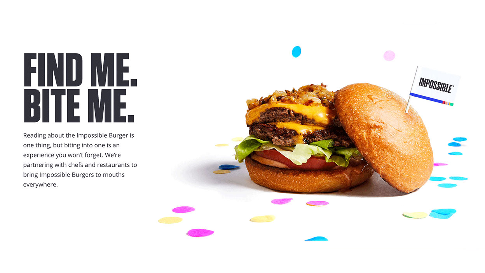
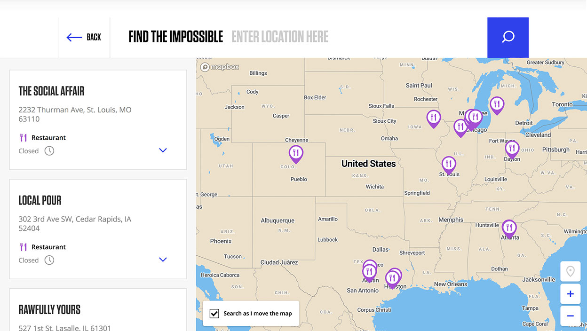
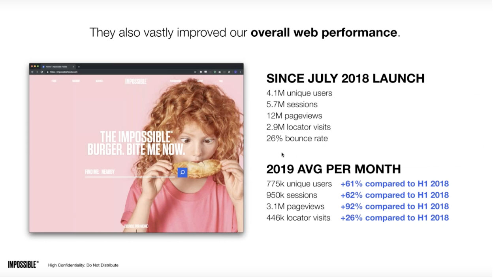

In 2018, one of the most promising options in alternative meat, Impossible Foods, was scaling exponentially, but its website was not keeping up. They turned to Gatsby to give their users a beautiful store locator map that helped them solve their most pressing problem i.e., finding an Impossible Burger at a location near them.

## The old website: Failing to help users find an Impossible Burger

[Impossible Foods](https://impossiblefoods.com/) was founded in 2011 by Pat Brown, a Professor Emeritus of Biochemistry at Stanford. Brown created the company not just as an ethical way to eat, but also as a way to combat global warming by reducing emissions due to farm animals. He and the company invented the Impossible Burger, an alternative to meat-based protein.

The first few years of the company were spent mainly in research and iteration, but in 2018 the company was ready to scale. Impossible Foods sold its products through partner restaurants that used Impossible meat-alternative products in their dishes. In 2018, they planned to increase the number of partner restaurants **from 100 to over 5,000** in just one year.

During this time, they found that their website was failing to help excited prospective customers find an Impossible Burger at a location near them. They showed users a static list of all Impossible Food locations, grouped by state.

While this worked at some level, it was difficult for users to find store locations nearby them because they had to scan a long and growing list of locations, sorted alphabetically rather geographically, and then use other tools like Google Maps to figure out their closest location. Many users simply gave up rather than going through this complicated process, causing Impossible Foods to lose excited potential customers.

<Pullquote>
“Our product would be in certain places, and people wouldn't know. It wouldn’t be in other places, and people would guess that it was there” -- Ashley Geo, Head of Brand Marketing Communications, Impossible Foods.
</Pullquote>

Geo had been thinking about a website redesign for a while anyway. The team only had one person to oversee the website, who was handling requests from all over the company — recruiting, sales, other parts of marketing — to add new information to the website. Their old website had significant turnaround time for making any sort of updates (design, copy, or code) because they had to reach out to a contractor to make changes, so updates often accumulated in a backlog.

The store locator problem was the final straw. As a result, they decided to create a new website -- ImpossibleFoods.com 2.0 -- that would be easy to update, scale to the needs of the company, and provide users with the one key experience they really needed, i.e., finding an Impossible Burger at a location near them.

## A New Store Locator: The Discovery Phase

Impossible Foods worked with **Matter Supply**, a Portland-based agency, to re-launch their website with Gatsby. There were several motivations, including performance and the ability of teams to make changes quickly.

However, the prime reason was to create a new, rich map experience, that is not only up-to-date but also stays immersive to reflect the originality of the Impossible Burger.

As David Fonnegra, an engineering leader at Matter Supply who leads the Impossible Foods redesign, points out, map locators are one of the most common complicated experiences right now on the web.

<Pullquote>
"It's really difficult to make a cartography experience that appeals to everybody."
</Pullquote>

Fonnegra lists a whole host of usability challenges when building a store locator experience:

<Pullquote>
"How do you navigate usually? Do you search for addresses? For places? For zipcodes? For cities? For locations? What does the map pin stands for? Where are you? How do you identify the place you want to go? Is the distance useful for you? Does seeing the actual path help? Or is it the distance that's helping you? Is a list of places more useful for you than the actual map?"
</Pullquote>

<Pullquote>
 “We had a lot of questions to start with,” Fonnegra said, “but zero answers."
</Pullquote>

## Iterating Towards the Right Answer

For Fonnegra and Impossible Foods, the way out was through: "The only great way to start answering those questions was releasing a nice experience for the people."

That meant building a rich application, with a whole host of technologies, i.e., **React** and **Gatsby** on the front-end, plus **Mapbox** for visualization; **Airtable** to enter store location data, **Elastic** for natural language search and geolocation filtering.

## A New Content Workflow

The content management strategy which Impossible Foods adopted through Airtable is particularly interesting as it's a great demonstration of the content mesh. While the rest of Impossible Foods’ content is stored in **Contentful**, Impossible Foods made the decision to store location data in Airtable to simplify the workflows of Impossible customer service representatives (CSRs) maintaining the locator app.

"Content-wise, a store locator is very simple,” says CMS guru Deane Barker, the author of the O’Reilly guide to content management. “It's tabular data, which means it can be easily managed via a spreadsheet through rows and columns. To manage the store locator, you often have a different group of people than the marketing editorial team. So, it needs to be a simple interface. You don't want to train them on a larger CMS. They just have to maintain the store locator."

The store locator is a use-case, Barker concludes, that calls for more _"simple and direct content management."_

That squares with Fonnegra and Impossible's experience. The Impossible Foods’ customer service representatives use Airtable for a wide variety of operational tasks, including tracking new launches of the Impossible Burger and, relevantly, for the store locator, tracking information for all restaurants selling Impossible products, as well as new launches of the Impossible Burger. Airtable is the center of the CSRs workflow, and the [native Gatsby integration](https://www.gatsbyjs.org/packages/gatsby-source-airtable/?=gatsby-source) allows them to work in the system they're used to.

At the end of the day, this helps not only the content creators’, the CSRs experience, but it also provides end-users with data that is always up to date and relevant.

## An Improved User Experience

But it’s not just up-to-date data that the new site provided; it offers a dynamic, interactive experience for users as well.

The new store locator combines natural language searches, geolocation filtering, and an interactive map to help the end-user find the closest location where they can get the Impossible Burger.

The new interactive map application reduced the number of steps for an end-user to find their Impossible Burger from five or six, including tedious scanning and off-site searching on Google Maps to one or two by simply entering in their location.

And because their website was on Gatsby, the user experience was always blazing fast.

## Business Results

The results weren’t just great for users and content creators; they were incredible from the business’s standpoint too.

The six months after launch saw not only a spike in overall usage driven by increased company brand awareness but a quantitatively improved experience for the users who did visit.

The new site had bounce rate reductions of **30-40%** on both the store locator and the overall site. And that’s not all, Geo and the digital marketing team saw an increase in agility, letting them better serve the needs of a rapidly growing company.

2019 saw a flurry of launches:

- A **food service hub** to support restaurants serving the product
- Improvements to the help center managed by the customer service team
- A new **Careers** page
- An incredibly fast **turnaround for campaign pages** around Impossible Food’s partnerships with Burger King and Little Caesars.
- Partnerships that were widely covered by media and rocketed Impossible Foods’ brand outreach into millions of households across the US.

## Conclusion

When Impossible Foods moved their website from a static single-page to a dynamic setup involving Gatsby sourcing data from Airtable, Contentful, and Mapbox, with a beautiful, interactive store locator map, it wasn’t just the technology that changed. It was the future of Impossible Foods and the marketing team’s ability to create a digital experience matching the scale and ambition of their company.

Ultimately, Geo credits Impossible Foods' choice of technologies as key in enabling the company’s growth.

<Pullquote>"We are changing and scaling quickly.,” Geo says. “That's why our current tech stack is awesome."</Pullquote>

_Ashley Geo and David Fonnegra highlighted the Impossible Foods / Matter Supply partnership in [ImpossibleFoods.com: Combining Gatsby + Contentful for Speed, Scale, and Flexibility](https://www.gatsbyjs.com/impossible-foods-webinar/). Deane Barker highlighted the store locator use-case [in a March 2019 podcast](https://www.ingeniux.com/company/podcast/content-matters-podcast-headless-content-management-with-deane-barker)._
