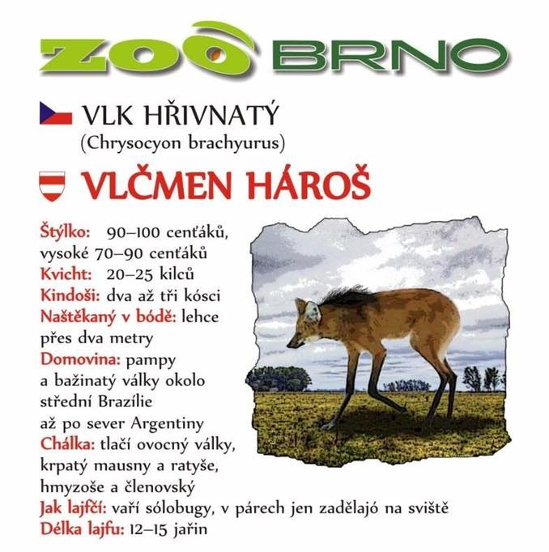
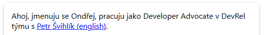
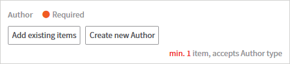
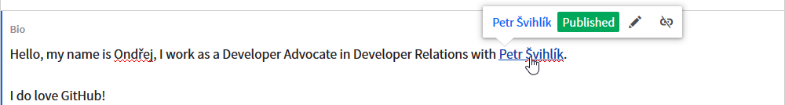
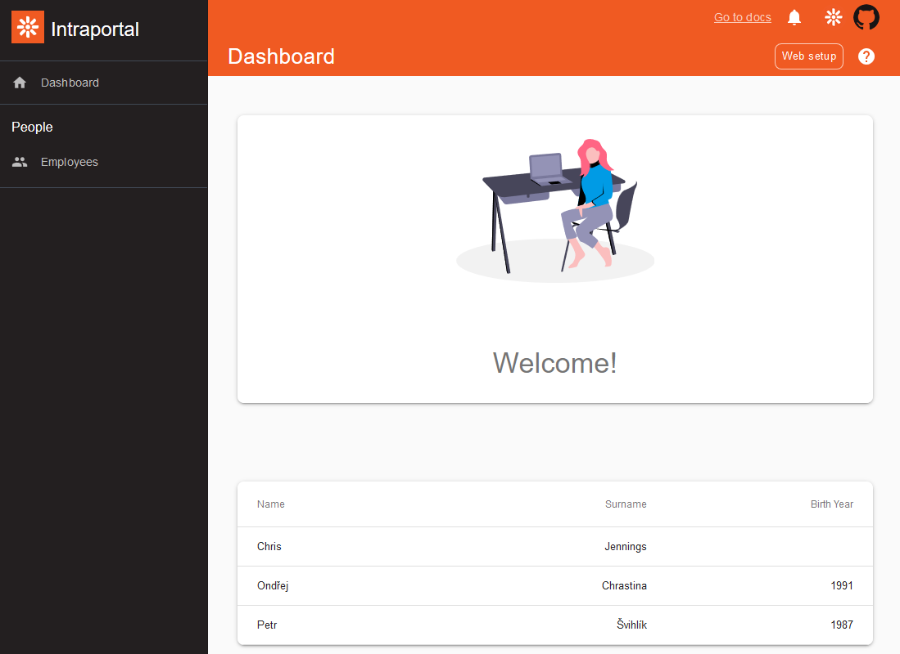

Multilingual websites are never easy. Soon after you start adding languages, you discover things like language fallbacks, ISO codes, language-sensitive restrictions for editors - you encounter all these obstacles before you even implement a thing. What should you know upfront to avoid running into a trap?

In this article, I will shed some light on the essential topics around multilingual sites, present some of the key questions you should ask before you start implementing multilingual support, and touch a bit on the Gatsby implementation as well.

The first part of the article will be CMS agnostic. For the basics, it doesn't matter whether you use Contentful, Kontent, Prismic, or any other CMS. It's more about the expectations of your customers. In the second part, I will talk about Kontent source plugin specifics and how to handle language fallbacks.

## ISO Codes or Codenames

When you work with multiple languages, each content piece needs to be flagged with a language. Languages like English and German make this straightforward, you can use their ISO codes as flags. But sometimes you need to distinguish between countries that speak the same language, such as Portugal and Brazil. We also have ISO codes for countries, and together with their language they form a language code (en-US, cs-CZ, and so on). Many CMSs use that to identify content for that specific part of the world. It's important to be able to extend this list, though.

Why?

Let me tell you a story about a Zoo in Brno, my hometown. It's not a particularly special one. It's normal in size, there is not really anything that would attract visitors from long distances. So they try to get creative with marketing. You can always find signs near enclosures presenting the displayed animal including some facts about its life. They translated those signs into a local dialect and even though no one really speaks that dialect anymore, a lot of people understand it and consider it funny.



This led to a very positive reaction from their visitors. Of course, I don't know if that caused better conversions regarding ticket sales, but I'm trying to focus on the lingual part here. There is no language code for the local dialect they used. So if they decided to put the translations online, they'd have to store them under _something_. A codename.

## Language Fallbacks

Let's say you implemented a website with one language for a friend, we'll call him Matt. After some time, he comes back to you saying he'd like to add a Czech translation as he receives some traffic from central Europe. OK, no problem, we add a new language, Matt handles content translations and the job is done.

It takes one week for him to find out that keeping content in both languages is quite a time-demanding task. So he decides that if he adds some content in English only, it should be also displayed on the Czech site as it's better to have the untranslated content there than a blank page. So far, so good.

In another half a year, he wants to add Slovak. And you start getting the feeling this will never stop and you should not have agreed to build his website in exchange for three beers. The thing is, Slovak is very similar to Czech and therefore it's likely that more people from Slovakia will understand Czech rather than English. That's why Slovak will fallback to Czech and Czech will fallback to English.

This is still configurable in a headless CMS. But you need to think about how your website will render such content. Most content items contain links to other content or include it directly. Do you want to let your visitors know that linked content is available in a different language only, mix the content, or not display it at all?



And what if the linked content is available only in a language different from the default one (in this case, English)? A typical example of this is a blog post and its author. When the blog post is in English and the author's bio only in Czech, what will you display?



You see, fallbacks are not just about content and its presentation online. It's also about content creation and applied restrictions. Some fields need to be filled, some fields require editors to link an item or two. You need to define what content is allowed and what content is invalid based on the requirements of your client.



## Implementation

The more time you invest in gathering requirements, the less time you will need to spend on implementation. So what do we need to implement?

- Localize URLs
- Identify user locale
- Generate language-specific dynamic pages
- Generate language-specific static pages
- Update components

To illustrate these steps, I used a sample intranet app that was built on Gatsby and Kentico Kontent and used only a single language - English. You can [find it on GitHub](https://github.com/Simply007/kontent-sample-app-gatsby-intranet).



The app contains a list of employees and a profile page for every one of them.

Before we jump into code, it's essential to mention plugins. They greatly help with handling multilingual websites in Gatsby, so it would be a waste of time to try and reinvent the wheel here. For the full list, see [Gatsby docs](/docs/localization-i18n/). I chose the [gatsby-plugin-i18n](https://github.com/angeloocana/gatsby-plugin-i18n) as it is capable of automatic locale identification, handles language-specific static pages, and lets me configure the basics.

```js:title=gatsby-config.js
{
     resolve: `gatsby-plugin-i18n`,
     options: {
         langKeyDefault: 'en',
         langKeyForNull: 'en',
         prefixDefault: false,
         useLangKeyLayout: false,
     },
 },
```

This configuration (in `gatsby-config.js`) tells the plugin to use 'en' as the default language code (`langKeyDefault`, `langKeyForNull`) and no prefix (`prefixDefault`). The last option (`useLangKeyLayout`) specifies that the used layout is language invariant.

### Localize URLs

Right at the beginning, we need to think about URLs. Do you want the language code in the URL all the time? Should the default language be accessible without language code?

```js
╔════════════════════════════════════════════════════╗
║       All languages use language code in URL       ║
╠════════════════════════════════════════════════════╣
║ /en-US/home                                        ║
║ /cs-CZ/home                                        ║
║ /sk-SK/home                                        ║
╚════════════════════════════════════════════════════╝
╔════════════════════════════════════════════════════╗
║ Default language does not use language code in URL ║
╠════════════════════════════════════════════════════╣
║ /home                                              ║
║ /cs-CZ/home                                        ║
║ /sk-SK/home                                        ║
╚════════════════════════════════════════════════════╝
╔════════════════════════════════════════════════════╗
║          Only simple language code in URL          ║
╠════════════════════════════════════════════════════╣
║ /en/home                                           ║
║ /cs/home                                           ║
║ /sk/home                                           ║
╚════════════════════════════════════════════════════╝
```

I chose the variant with default language having no prefix in the URL.

### Identify User Locale

If your website is not Google Maps, people most likely won't share their location with you. Therefore, when identifying where a visitor is geographically, we rely on the information browsers send in the first request. That can be obtained via `window.navigator.language`, but we typically don't implement this part ourselves. In my case, it's a job that is handled by the aforementioned `gatsby-plugin-i18n`.

### Generate Language-specific Dynamic Pages

As I mentioned already, the intranet app contains profile pages for all employees. They are generated dynamically because, well, the list of employees is also dynamic. This code piece that sits in `gatsby-node.js`'s `createPages` generates pages in the original implementation:

```js
query peoplePortalList {
    allKontentItemPerson() {
         nodes {
             elements {
                 urlslug {
                     value
                 }
             }
         }
     }
 }
 ...
 for (const person of nodes) {
     createPage({
         path: `employees/${person.elements.urlslug.value}`,
         component: path.resolve(`./src/templates/person.js`),
         context: {
             slug: person.elements.urlslug.value,
         },
     });
 }
```

We will need to adjust both the GraphQL query and the code that generates pages.

During the build time, the [Kontent source plugin](/docs/sourcing-from-kentico-kontent/) generates one Gatsby node per each content item - language combination. To distinguish these nodes, they always contain two fields:

- **preferred_language**
  This field is mainly used for filtering and describes the language the item is intended for. For example, if you want Czech content, you want to filter for `preferred_language='cs'` provided you use the codename `'cs'` for Czech.

- **system.language**
  This is the actual content item language. If you filter items based on `preferred_language='cs'`, you will get `system.language='cs'` if the item is translated. Otherwise, the item content will be in English, and `system.language` will be 'default' (here, it's English).

In my case, I am happy with language fallbacks for items that are not translated. That means I can use `preferred_language` and treat all items as if they were translated.

```js
query PeoplePortalList {
    allKontentItemPerson() {
        nodes {
            elements {
                urlslug {
                    value
                }
            },
            preferred_language
        }
    }
}
```

If you don't want to display items that fallback to parent language, just compare `preferred_language` and `system.language`. If they are not the same, it's a fallback.

Let's define here a new variable `lang` that will hold the language code for the current item's `preferred_language`. I will use it in the `createPage` method call to place the newly generated page on the right URL.

```js
let lang = `${person.preferred_language}/`
if (person.preferred_language === "default") {
  lang = "/"
}
createPage({
  path: `${lang}employees/${person.elements.urlslug.value}`,
  component: path.resolve(`./src/templates/person.js`),
  context: {
    slug: person.elements.urlslug.value,
    lang: person.preferred_language,
  },
})
```

### Generate Language-specific Static Pages

Apart from dynamic pages, there are always some static pages. They include `index.js` and `employees.js` that handle the homepage and employees page respectively. The `gatsby-plugin-i18n` will place them on the right language-specific URLs if you follow the defined language convention-the filename suffix needs to contain the language code.

- index.js -> index.en.js, index.cs.js
- employees.js -> employees.en.js, employees.cs.js

It's also necessary to adjust the content of each of the new files to reflect its new language. That includes component properties. Take a look at this part of my index.js:

```js:title=index.js
<Layout location={location} title={title}>
  <IndexContent />
</Layout>
```

Once this file becomes `index.cs.js`, I need to adjust it to:

```js:title=index.cs.js
<Layout location={location} title={title} lang="cs">
  <IndexContent lang="cs" />
</Layout>
```

### Update Components

That takes us to components and selected language propagation. Every component you use on your site that has anything to do with links or languages needs to know what is the current language. Take a language selector as an example. Sure, you can render it as a simple list of supported languages, but, usually, you want a bit better UX. The current language should be hidden, and switching to another language should not lose the context of the current page (very annoying behavior).

There are multiple ways to handle the language propagation. They are ranging from storing it in site configuration and accessing it from components using GraphQL queries to wrapping all components in a language-specific wrapper or creating a special object just for this use case (for example, `gatsby-plugin-intl` plugin does it this way).

I always aim to keep things simple. In my case, the language travels through components from top to bottom. The language-specific `index` page defines the language code for the `IndexContent` component. If a child component requires the current language, it will receive it from its parent the same way.

```js
function Content({ classes, lang }) {
    ...
    <EmployeeList lang={lang} />
    ...
}
```

The last part of this multilingual adjustment tutorial is the language selector. It's a brand new component that needs to know the current language and also the current URL path. That way, it can render links that keep the context of the current page when switching between languages.

A very simple implementation featuring just two languages (Czech and English) can look like this:

```js
import PropTypes from "prop-types"
import React, { Component } from "react"
import { Location } from "@reach/router"
import { Link } from "gatsby"

function LanguageSelector({ classes, lang, location, className }) {
  if (lang === "default") {
    return (
      <Link className={className} to={`/cs/${location.pathname}`}>
        čeština
      </Link>
    )
  } else {
    return (
      <Link
        className={className}
        to={location.pathname.replace("/" + lang + "/", "/")}
      >
        english
      </Link>
    )
  }
}
export default LanguageSelector
```

If the current language is English, there is no language prefix in the URL and we can directly use `location.pathname` to render the language-specific link. In any other case, we first need to remove the language prefix from the path.

In the case of catering for more than just two languages, you will probably be better off defining the list of available languages in a separate file.

## Summary

You see that adding multiple languages to sites is not as simple as it seems at the start. It mainly requires you to define how the website should behave and what the content restrictions are. The implementation is made easier by many available plugins that help you do the job.

Have you published a multilingual website on Gatsby? Let me know how you implemented it and what your experience was like on [Twitter](https://twitter.com/ondrabus).

You can also check out [this implementation on GitHub in a separate branch of the forked source repository](https://github.com/ondrabus/kontent-sample-app-gatsby-intranet/tree/multilingual) or the [Kontent source plugin page](/docs/sourcing-from-kentico-kontent/) in the docs.
