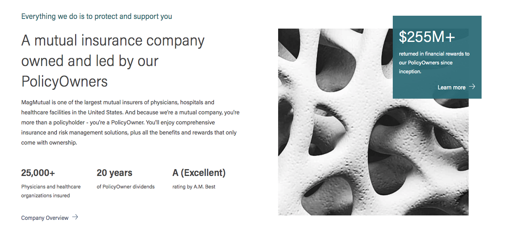

MagMutual, a leading professional healthcare liability insurer, needed to redesign and re-platform the company’s website to further its core mission: to serve and protect policyholders.

To achieve the company's vision for their new site, MagMutual collaborated with Mediacurrent, the Atlanta-based open source development and digital marketing agency. The new magmutual.com united Drupal and Gatsby to form a fully open source, enterprise-grade system that empowers MagMutual’s web team to closely yet easily manage content and customer experience.

### The Challenge
Realizing their Drupal 7 platform wasn’t going to evolve with them for the long-term, MagMutual began searching for a solution to accommodate multi-faceted search dynamics and complex user authentication requirements pulling data from multiple services and APIs. They needed a ‘single source of truth’ for all data. With Drupal 9 on the near horizon, preparing for a smooth upgrade path was critical.

For MagMutual, the best path forward was an enterprise-grade CMS built on an open source Drupal 8 foundation. Performance and speed were driving priorities. Internally, the marketing team needed more customization control to build new pages.

### The Solution
A fully decoupled Drupal 8 system powered by the Gatsbyjs platform lifted the burden from MagMutual’s technology team and put content authors in the driver’s seat. The Drupal 8 backend provides a powerful capacity for content modeling. Gatsby, the presentation layer, adds a robust dimension of UI flexibility and performance.

### Results

##### _Speed & Performance:_
* 82% - Improvement on homepage load time (18.47 seconds to 3.3 seconds)
* 90% - Reduction in page weight on the homepage
* 25% - Faster load time for The Learning Center over previous site

##### _Security:_

Member data is kept secure in its source location but aggregated by Apollo GraphQL in real-time, simplifying business logic on the website.

##### _Flexibility:_
A decoupled design approach offers limitless possibilities to evolve the site with any choice of front end tools.

### [Video] Built to Scale With Drupal & Gatsby

In this video, hear from project leaders Bob Kepford, Director of Development at Mediacurrent and Ben Robertson, Senior Software Engineer at Gatsby about their development approach and results of the new site.

<iframe src="https://players.brightcove.net/1027729815001/befDVqJZ_default/index.html?videoId=6133184295001" allowfullscreen="" allow="encrypted-media" style="position: absolute; top: 0px; right: 0px; bottom: 0px; left: 0px; width: 100%; height: 100%;"></iframe>

### MagMutual on the JAMstack
Drupal 8, Gatsby, and a Serverless framework with GraphQL helped MagMutual achieve its immediate vision for the new site while they reap the innovation potential of these robust open source software communities.

“We chose Gatsby and Drupal to leverage the power of the open source community. The continuous improvements of these technologies work for MagMutual’s benefit,” Bob Kepford, Mediacurrent's Director of Development, said.

From a security perspective, he continued, Drupal gave MagMutual a highly secure platform to protect customer information. Meanwhile, Gatsby removes server-side rendering from the equation and reduces touchpoints for attacks.

##### Why Drupal 8?
* __Flexible integrations:__ Bringing user data together into a centralized platform reduces website support costs and ensures a full, accurate view of customer interactions.
* __Content creation features:__ Drupal 8 empowers the marketing team to take ownership of content updates and page creation sitewide.
* __Drupal JSON API:__ Increases performance flexibility.

##### Why Gatsby?
* __Speed:__ Gatsby’s performance optimization toolset delivers a fast, high-performing site.
* __Powerful UI Creation:__ A component library creates a unified design system.
* __Increased Developer Efficiency:__ Full control over the markup made for a more productive build process (versus keeping Drupal monolithic). Gatsby uses GraphQL at build time to access content, so when we built the APIs we needed for the account portion of the site GraphQL was a natural choice. This made it easier to bring on new developers to the team - we could tell them to use the same syntax.

##### Why Apollo GraphQL Server?
Central data source: Creates a single data source for your website, aggregating data from multiple data sources.
Data integrity: Apollo removes the need to sync data from different sources so it can be displayed on the website. Data is queried and retrieved in real-time using a simple API.
Developer velocity: Self-documented API for developers increases efficiency.

##### Why Netlify?
* __Gatsby host:__ Netlify provides hosting of the Gatsby site.
* __Workflow:__ Continuous integration and capabilities to set up production and test environments in the same place.
* __Mediacurrent’s top pick:__ Netlify is our top choice for Gatsby/Drupal sites. (Check out our cases studies for Mediacurrent.com and the city of Sandy Spring’s digital signage network.)

### Achieving Accessibility in React
Mediacurrent’s development approach is built on high standards for web accessibility. This project inspired us to find the best accessibility tooling in the React ecosystem.

Adding built-in accessibility testing to the living style guide created visibility for all project stakeholders to hold the team accountable for accessibility issues. To share what we learned with the wider Gatsby community, we open sourced a Gatsby starter with built-in accessibility tools.

### Final Thoughts

MagMutual serves the intersection of two rapidly evolving industries: insurance and healthcare. With a resilient, yet nimble framework in place for MagMutual.com, the company can face the future with confidence.

### Resources
See the complete case study for MagMutual.com.
Learn more about some of the development tools used for this project in our webinar, Rain + GatsbyJS: Fast-Tracking to Drupal 8.
Planning for a decoupled Drupal/Gatsby project and not sure where to start? Mediacurrent can help.
