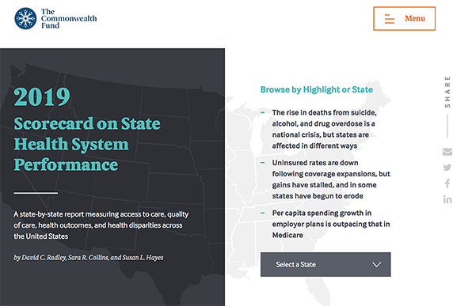

When it comes to healthcare, information is paramount. For decades, the non-profit [Commonwealth Fund](https://www.commonwealthfund.org/) has rated health systems in all 50 states and the District of Columbia on their coverage and performance. The information is delivered as an annual [Scorecard on State Health System Performance](https://scorecard.commonwealthfund.org/). For years, this scorecard has provided valuable insight and analysis into 47 different measures like access to and quality of care, service use and costs, health outcomes, and income-based health care disparities.

Unfortunately, reading the report itself was heavy going. The format was a monolithic and extremely lengthy report, presenting extensive data interspersed with a few dense data visualizations. The information was all there, but the scorecard itself failed to provide a meaningful overall picture or tell a compelling story.

Not long ago, the Commonwealth Fund reached out to the Aten Design Group to reimagine the nonprofit’s scorecard concept and realize it in code—a prescient move, considering our current global crisis. On the technical side, the Commonwealth Fund also wanted the redesigned next-generation scorecard to exist separately from the rest of the site so that it could be maintained independently and reside at its own dedicated URL.

Ken Woodworth, the VP of Design at Aten, and his team—John Ferris, Chris Coughlan and Roxy Koranda—had several goals for the Commonwealth Fund scorecard project. It needed to be easily approachable for people who aren’t familiar with reading data, while at the same time, providing in-depth data capable of informing government policy: not an easy balancing act, but a necessary one. Previous scorecards included long technical paragraphs and downloadable CSV files with the raw data points. These were hard to understand and just had to go. Overall, Ken’s team was not concerned with hitting particular metrics, such as an uptick in views; their prime directive was to present the data in a better way.

## A fresh take with a fresh tool

Ken and his team didn’t jump straight to Gatsby. Though they were aware of it, they had not yet tried it with any projects. The team had experience with Jekyll and Metalsmith, but Ken himself was less experienced with these tools and looking for one that he could “just use without quickly hitting a wall.” They considered a wide array of option, like [Vue.js](https://vuejs.org/), and even briefly considered building the site with a straight up static HTML approach. The overhead on static HTML sites, with no build tool and serious maintenance headaches as a result, quickly changed their minds. The team agreed that a platform was the way to go and eventually settled on React, since everyone had at least some experience with it. Recognizing that React-based Gatsby was “potentially a very good fit,” the team decided to use Gatsby for the project, running it as a test case.

Design-wise, the project’s main challenge was data visualization. With 50 states plus the District of Columbia—and many, many data points for each—managing and presenting the data clearly had to be the top goal. Using [D3](https://d3js.org/) and [GraphQL](https://graphql.org/) along with React, the team created multiple unique data visualizations and built templates for the pages. Gatsby’s templating then made it easy to pull all information necessary to quickly build a page for each state/district.

Page data was stored in JSON-formatted text files, and the build process dynamically looped through those JSON files to build each element in each individual page. “It was really, really awesome to be able to pull all of that data without having to build 51 unique pages,” Ken said. He particularly loved the powerful combination of Gatsby, JSON, and GraphQL: “The first time I started pulling in GraphQL, I was like, wow, this is _insane_.”

## Going forward with Gatsby

The team sums up their overall experience using Gatsby with one word: exceptional. Gatsby’s abundant documentation and “incredibly helpful” tutorials for getting started were key to their success, Ken said, making it easy to conquer the initial learning curve. “Going forward with future projects, Gatsby is an easy choice because it’s ready to use.”

> “Gatsby's tutorials were on point and incredibly helpful.”

Gatsby also made the scorecard site project “really easy to just package up and deploy,” Ken reported. “The site is fast, very fast, because we’re not reloading half of it whenever you’re just browsing around.”

Commonwealth Fund loved the resulting website.

The client appreciated that, unlike the original site’s long, data-dense, single-page presentations, Aten’s solution created an accessible yet in-depth presentation for the data visualizations. The new [Commonwealth Fund Scorecard](https://scorecard.commonwealthfund.org/) is deeply informative without being the least bit dense orl dull, and it’s beautifully designed. The scorecard site, in fact, won in three categories in the 14th annual [W3 Awards](https://www.w3award.com/); one gold for data visualizations, and two silver awards (one for visual appeal and one in the nonprofit category).

Ken and his team are already building the 2020 scorecard, targeted for release in June—”Using Gatsby, of course.” Additionally, their success with the scorecard project has led to further contracts for Aten from the Commonwealth Fund.

## From test case to best case

Though they initially tried out Gatsby on a test case basis, using the Commonwealth Fund scorecard as proving ground, Ken and his Aten team have embraced it as their new favorite building tool. The agency is now using Gatsby for other client projects, including several medical projects. But they don’t see Gatsby as being limited to healthcare industry websites.

“We’ve now also used Gatsby to prototype a complex application for an aptitude testing company,” Ken said. “The prototype lets us test the user interface, how we would track clients and scheduling, and lets us build complex interactions without needing to build the entire application first.”

> “Gatsby is a giant leap forward in the static site generator space.”
